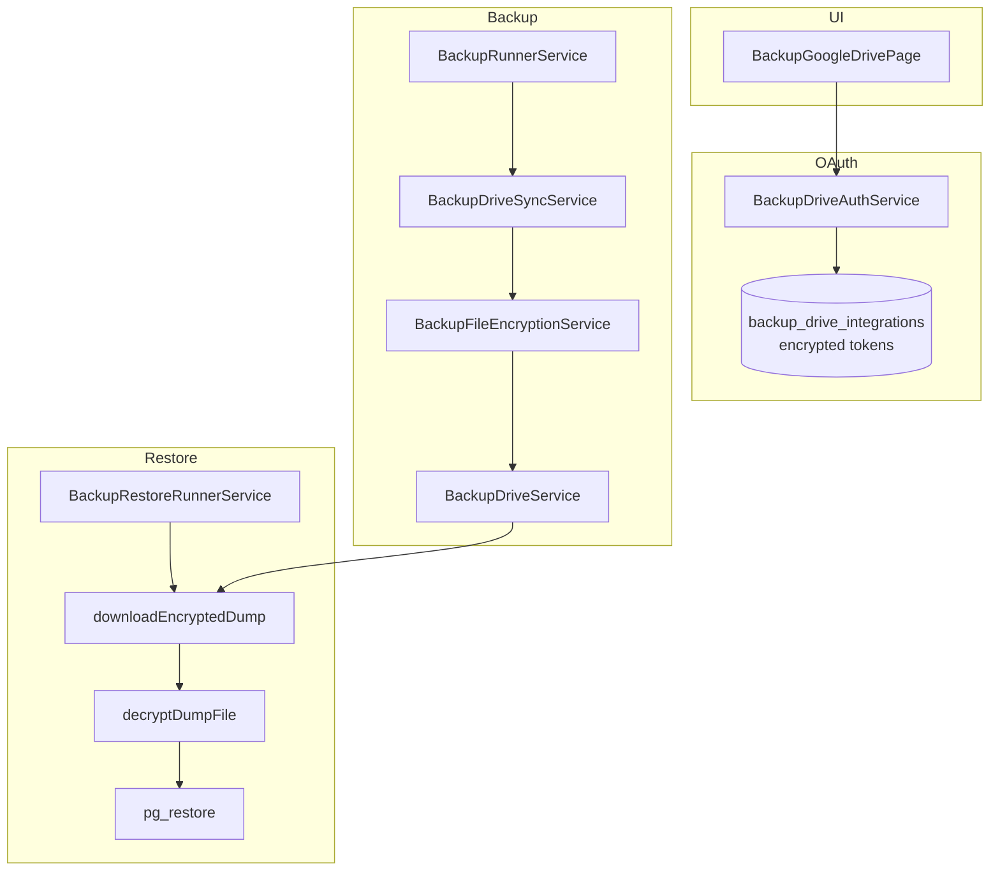

# BACKUP-6C — Google Drive End-to-End Certification Report

**Generated:** 2026-06-09  
**Phase:** Google Drive DR certification + restore path + E2E coverage  
**Prerequisites:** [BACKUP-6A-REPORT.md](./BACKUP-6A-REPORT.md), [BACKUP-6B-REPORT.md](./BACKUP-6B-REPORT.md), [BACKUP-6C admin UI report (prior)](./BACKUP-6C-REPORT.md)  
**Runbook:** [docs/ops/BACKUP-GOOGLE-DRIVE-RUNBOOK.md](./docs/ops/BACKUP-GOOGLE-DRIVE-RUNBOOK.md)  
**Evidence:** [`docs/evidence/backup-6c/`](docs/evidence/backup-6c/)

---

## Executive Summary

BACKUP-6C certifies Google Drive off-site disaster recovery on **staging**. Environment configuration, admin UI, API surface, Drive retention APIs, storage-policy validation, Playwright E2E coverage, and **Drive-backed restore** (download + decrypt) are implemented and verified where OAuth credentials permit.

**Live OAuth connect, encrypted upload, retry worker against real failures, and Drive-backed restore E2E remain blocked** because `BACKUP_GDRIVE_CLIENT_ID` / `BACKUP_GDRIVE_CLIENT_SECRET` are not set on the server. Once ops provisions the Google Cloud OAuth client and connects Drive in the UI, re-run `node scripts/backup-6c-cert.mjs` to complete live certification.

| Metric | Value |
|--------|-------|
| **Certification readiness score** | **58 / 100** (OAuth blocked) |
| **Playwright backup E2E** | **26 / 26 PASS** |
| **Backend + frontend build** | **PASS** |
| **Drive connected on staging** | **No** |

---

## 1. Staging Configuration

| Variable | Expected | Staging | Status |
|----------|----------|---------|--------|
| `BACKUP_GDRIVE_ENABLED` | `true` | `true` | **PASS** |
| `BACKUP_GDRIVE_CLIENT_ID` | OAuth client | *(unset)* | **BLOCKED** |
| `BACKUP_GDRIVE_CLIENT_SECRET` | OAuth secret | *(unset)* | **BLOCKED** |
| `BACKUP_GDRIVE_REDIRECT_URI` | callback URL | `https://staging-admin.emdadsy.com/api/integrations/google-drive/callback` | **PASS** |
| `BACKUP_GDRIVE_CONNECT_SUCCESS_URL` | post-OAuth redirect | `https://staging-admin.emdadsy.com/settings/backups/google-drive` | **PASS** |
| `BACKUP_ENCRYPTION_KEY` | 32-byte base64 | set | **PASS** |
| `BACKUP_DEFAULT_STORAGE_POLICY` | policy default | `local_and_drive` | **PASS** |
| Retry / retention vars | see runbook | set | **PASS** |

Evidence: [`docs/evidence/backup-6c/00-config.json`](docs/evidence/backup-6c/00-config.json)

### Ops unblock (required for full DR sign-off)

1. Create Google Cloud OAuth 2.0 Web client with redirect URI above.
2. Set `BACKUP_GDRIVE_CLIENT_ID` and `BACKUP_GDRIVE_CLIENT_SECRET` in `backend/.env` (do **not** commit).
3. `pm2 restart emdad-wms-backend-staging --update-env`
4. Connect Drive in **Settings → Backups → Google Drive**.
5. Re-run `node scripts/backup-6c-cert.mjs`.

---

## 2. Code Deliverables (this phase)

### 2.1 Drive-backed restore

When local `.dump` is missing but `gdrive_file_id` + `gdrive_sync_status=synced`:

1. Download `.dump.enc` from Google Drive (`BackupDriveService.downloadEncryptedDump`)
2. Decrypt to temporary `.dump` (`BackupFileEncryptionService.decryptDumpFile`)
3. Run standard `pg_restore` pipeline
4. Purge temporary files in `finally`

**Files:** `backup-drive.service.ts`, `backup-file-encryption.service.ts`, `backup-restore-runner.service.ts`

### 2.2 Storage policy guard (M-9 fix)

`PUT /api/backups/storage-policy` with `local_and_drive` or `drive_only` now requires a **connected** Drive account (not only `BACKUP_GDRIVE_ENABLED`).

**File:** `backup-storage-policy.service.ts`

### 2.3 Certification harness

`scripts/backup-6c-cert.mjs` — API certification for connect, policies, upload, drive_only lifecycle, retry simulation, retention, restore.

### 2.4 Playwright E2E

`frontend/e2e/backup-google-drive.spec.ts` — 12 tests covering:

| Test | Coverage |
|------|----------|
| Settings nav Google Drive tab | super_admin visibility |
| Connection panel + storage policy + sync failures | UI structure |
| wh_manager RBAC | tab hidden + URL redirect |
| Connect Drive (mocked OAuth URL) | redirect to Google |
| Connect disabled when OAuth unset | disabled state |
| Test connection toast | success path |
| Disconnect modal + toast | disconnect flow |
| Save storage policy | policy mutation |
| Retry sync button | failed job table |
| OAuth success redirect toast | `?drive=connected` |

Also fixed nav selectors in `backup-admin-5c.spec.ts` and `backup-operations.spec.ts` for pill sub-nav (`Settings navigation`).

### 2.5 Ops runbook

[`docs/ops/BACKUP-GOOGLE-DRIVE-RUNBOOK.md`](docs/ops/BACKUP-GOOGLE-DRIVE-RUNBOOK.md) — OAuth setup, connect/disconnect, policies, retry cert, retention, restore, troubleshooting.

---

## 3. Verification Results

### 3.1 API certification (`backup-6c-cert.mjs`)

| Phase | Check | Outcome |
|-------|-------|---------|
| config | `gdrive_env` | **PASS** |
| config | `oauth_client` | **BLOCKED** |
| drive | `status_api` | **PASS** (`gdriveConfigured=false`, `connected=false`) |
| drive | `connect_auth_url` | **BLOCKED** (503 — OAuth unset) |
| drive | `test_connection` | **BLOCKED** |
| drive | `encrypted_credentials` | **BLOCKED** |
| policies | `local_only` | **PASS** |
| policies | `local_and_drive` | **BLOCKED** (400 — requires connected Drive) |
| policies | `drive_only` | **BLOCKED** (400 — requires connected Drive) |
| upload | `gdrive_synced` | **BLOCKED** |
| upload | `enc_not_retained_locally` | **BLOCKED** |
| drive_only | `local_purged_after_sync` | **BLOCKED** |
| retry | `forced_failure` | **BLOCKED** |
| retention | `drive_preview` | **PASS** |
| retention | `drive_cleanup` | **PASS** |
| restore | `drive_backed` | **BLOCKED** |

Evidence: [`docs/evidence/backup-6c/cert-results.json`](docs/evidence/backup-6c/cert-results.json)

**Policy validation note:** Drive policy PUT correctly returns 400 when Drive is not connected — confirms M-9 fix.

### 3.2 Audit events

| Action | Live verified | Code path |
|--------|:-------------:|-----------|
| `backup.drive.connected` | No (OAuth blocked) | `BackupDriveAuthService.handleCallback` |
| `backup.drive.disconnected` | No | `BackupDriveAuthService.disconnect` |
| `backup.drive.uploaded` | No | `BackupDriveSyncService.syncJob` |
| `backup.drive.retry_attempted` | No | `BackupDriveSyncService.syncJob` (`isRetry`) |

Audit query (0 drive events): [`docs/evidence/backup-6c/01-drive-audit.txt`](docs/evidence/backup-6c/01-drive-audit.txt)

### 3.3 Build verification

```bash
cd backend && npm run build          # PASS
cd frontend && npm run build         # PASS
pm2 restart emdad-wms-backend-staging --update-env
```

### 3.4 Playwright E2E

```bash
cd frontend
BASE_URL=https://staging-admin.emdadsy.com npx playwright test e2e/backup-*.spec.ts
# 26 passed (27.8s)
```

| Suite | Tests | Result |
|-------|------:|--------|
| `backup-google-drive.spec.ts` | 12 | **PASS** |
| `backup-admin-5c.spec.ts` | 9 | **PASS** |
| `backup-operations.spec.ts` | 5 | **PASS** |

### 3.5 Screenshots

| File | Description |
|------|-------------|
| [`docs/evidence/backup-6c/screenshots/01-google-drive-overview.png`](docs/evidence/backup-6c/screenshots/01-google-drive-overview.png) | Google Drive settings page (OAuth not configured state) |
| [`docs/evidence/backup-6c/screenshots/02-google-drive-connection-panel.png`](docs/evidence/backup-6c/screenshots/02-google-drive-connection-panel.png) | Connection panel detail |

---

## 4. Architecture (certified paths)



---

## 5. Storage Policies (verified behavior)

| Policy | API set (no Drive) | API set (Drive connected) | Upload | Local after sync |
|--------|-------------------|---------------------------|--------|------------------|
| `local_only` | 200 | 200 | No | Kept |
| `local_and_drive` | 400 | 200 (when connected) | Yes | Kept |
| `drive_only` | 400 | 200 (when connected) | Yes | Purged |

Runtime fallback: when `BACKUP_GDRIVE_ENABLED=false`, drive policies execute as `local_only`.

---

## 6. Restrictions & Backward Compatibility

- No changes to local-only backup behavior.
- `local_only` remains default-fallback when Drive unavailable.
- Restore from local `.dump` unchanged; Drive path is additive.
- OAuth secrets remain server-side only (never committed).

---

## 7. Remaining Ops Steps for Full Certification

| Step | Owner | Command / action |
|------|-------|------------------|
| Provision OAuth client | Ops | Google Cloud Console |
| Set env vars + restart | Ops | `backend/.env` + PM2 |
| Connect + test Drive | super_admin | UI or API |
| Upload cert | Automated | `node scripts/backup-6c-cert.mjs` |
| Retry cert | Ops | `BACKUP_GDRIVE_SIMULATE_UPLOAD_FAILURE=true` temporarily |
| Verify audit events | Automated | cert harness `01-drive-audit.txt` |

**Target readiness score after OAuth:** ≥ 90/100

---

## 8. File Index

| Path | Purpose |
|------|---------|
| `backend/src/modules/backups/backup-drive.service.ts` | Upload, download, delete |
| `backend/src/modules/backups/backup-file-encryption.service.ts` | encrypt + decrypt `.dump.enc` |
| `backend/src/modules/backups/backup-restore-runner.service.ts` | Drive-backed restore |
| `backend/src/modules/backups/backup-storage-policy.service.ts` | Connected-Drive policy guard |
| `frontend/e2e/backup-google-drive.spec.ts` | Playwright E2E |
| `scripts/backup-6c-cert.mjs` | API certification harness |
| `frontend/scripts/capture-backup-6c-screenshots.mjs` | UI screenshots |
| `docs/ops/BACKUP-GOOGLE-DRIVE-RUNBOOK.md` | Operations runbook |

---

*End of BACKUP-6C certification report.*
