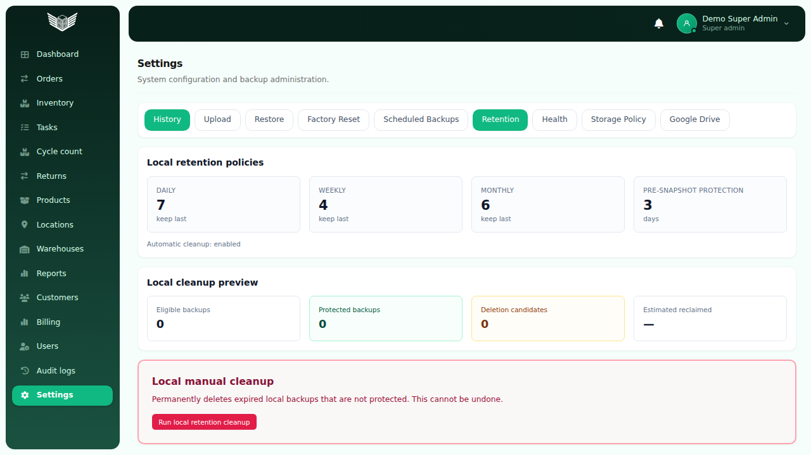
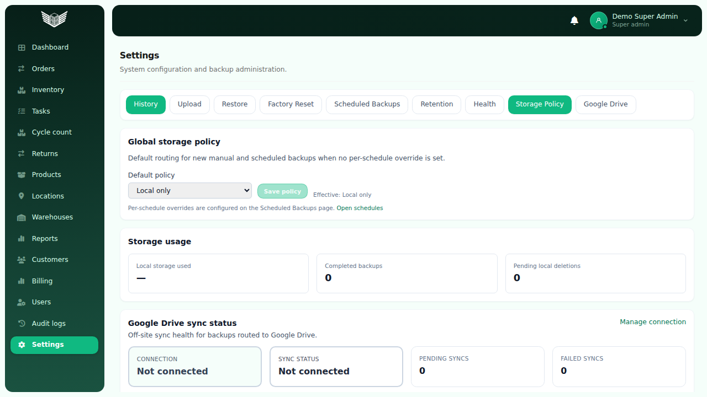
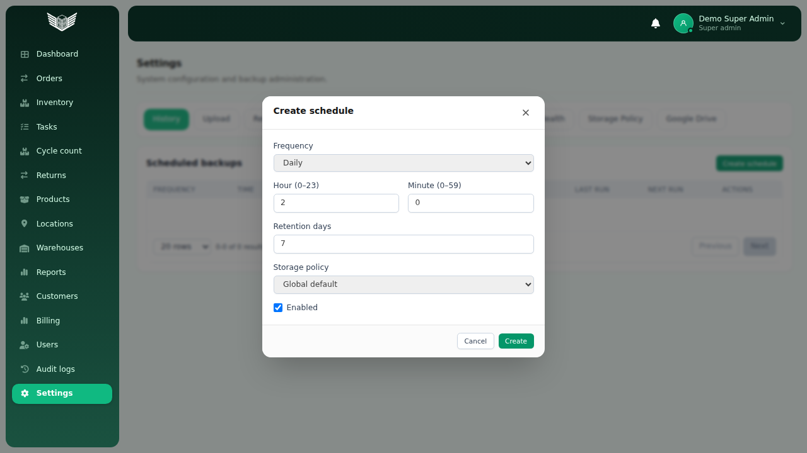
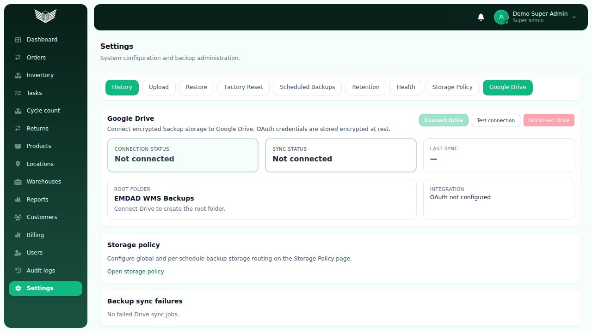

# BACKUP-6D — Drive Retention UI + Storage Policies UI Report

**Generated:** 2026-06-09  
**Sprint:** SPRINT-P1C  
**Phase:** Frontend administration for Google Drive backup retention and storage policies  
**Prerequisites:** [BACKUP-6C-REPORT.md](./BACKUP-6C-REPORT.md), [BACKUP-5C-REPORT.md](./BACKUP-5C-REPORT.md)  
**Evidence:** [`docs/evidence/backup-6d/`](docs/evidence/backup-6d/)

---

## Executive Summary

BACKUP-6D delivers frontend administration for **Google Drive retention** and **backup storage policies**, with full RBAC (`super_admin` read/write, `wh_manager` read-only), Playwright E2E coverage, API certification, and UI screenshots.

| Metric | Value |
|--------|-------|
| **API certification** | **12 / 12 PASS** |
| **Playwright E2E (backup admin suite)** | **30 / 30 PASS** |
| **Frontend build** | **PASS** |
| **Backend build** | **PASS** |

---

## 1. Settings Navigation (9 tabs)

| Tab | Route | `super_admin` | `wh_manager` |
|-----|-------|---------------|--------------|
| History | `/settings/backups` | ✅ | ✅ |
| Upload | `/settings/backups/upload` | ✅ | ❌ hidden |
| Restore | `/settings/backups/restore` | ✅ | ❌ hidden |
| Factory Reset | `/settings/backups/factory-reset` | ✅ | ❌ hidden |
| Scheduled Backups | `/settings/backups/schedules` | ✅ read/write | ✅ read-only |
| Retention | `/settings/backups/retention` | ✅ read/write | ✅ read-only |
| Health | `/settings/backups/health` | ✅ | ✅ |
| **Storage Policy** | `/settings/backups/storage-policy` | ✅ read/write | ✅ read-only |
| **Google Drive** | `/settings/backups/google-drive` | ✅ read/write | ✅ read-only |



---

## 2. Drive Retention UI

**Route:** `/settings/backups/retention`  
**Page:** `BackupRetentionPage.tsx` (extended)  
**Audit panel:** `BackupDriveRetentionAuditPanel.tsx`

### Sections

| Section | Description |
|---------|-------------|
| Local retention policies | Existing local policy dashboard (unchanged scope) |
| Local cleanup preview | Dry-run counts + manual cleanup (`super_admin` only) |
| **Google Drive retention policies** | `keepLastDaily/Weekly/Monthly`, cleanup enabled flag |
| **Drive cleanup preview** | Drive file + job deletion candidates |
| **Drive retention audit events** | Filters `backup.drive.retention.cleanup` / `backup.drive.deleted` |

### APIs

| Method | Path | RBAC |
|--------|------|------|
| `GET` | `/api/backups/retention/drive/policies` | super_admin, wh_manager |
| `GET` | `/api/backups/retention/drive/preview` | super_admin, wh_manager |
| `POST` | `/api/backups/retention/drive/cleanup` | super_admin only |

### Actions (`super_admin` only)

- **Run Drive retention cleanup** — confirm modal → posts cleanup → shows result summary
- **Run local retention cleanup** — existing flow (unchanged)

`wh_manager` sees all dashboards and previews; mutation buttons are hidden.

---

## 3. Storage Policies UI

### 3.1 Global storage policy page

**Route:** `/settings/backups/storage-policy`  
**Page:** `BackupStoragePolicyPage.tsx`

| Panel | Content |
|-------|---------|
| Global storage policy | `defaultPolicy` select (`local_only`, `drive_only`, `local_and_drive`) + Save |
| Storage usage | Local bytes used from backup health metrics |
| Google Drive sync status | Connected/pending/failed counts from Drive status API |



| Method | Path | RBAC |
|--------|------|------|
| `GET` | `/api/backups/storage-policy` | super_admin, wh_manager |
| `PUT` | `/api/backups/storage-policy` | super_admin only |

### 3.2 Per-schedule storage policy

**Page:** `BackupSchedulesPage.tsx` + `BackupScheduleModal.tsx`

- Table column: effective storage policy label
- Modal field: `storagePolicy` (`null` = global default, or explicit policy)
- API field on schedule DTO: `storagePolicy`, `effectiveStoragePolicy`



### 3.3 Google Drive page (RBAC + link)

**Page:** `BackupGoogleDrivePage.tsx`

- `wh_manager`: read-only (no connect/disconnect/test/retry)
- Storage policy editor moved to dedicated page; link **Open storage policy**



---

## 4. RBAC

**Hook:** `useBackupAdminAccess.ts`

| Capability | `super_admin` | `wh_manager` |
|------------|---------------|--------------|
| View backup settings tabs | ✅ | ✅ |
| Drive retention read | ✅ | ✅ |
| Drive retention cleanup | ✅ | ❌ |
| Storage policy read | ✅ | ✅ |
| Storage policy save | ✅ | ❌ |
| Drive connect/disconnect/test/retry | ✅ | ❌ |
| Drive status read | ✅ | ✅ |

### Backend change (read access for manager)

`GET /api/integrations/google-drive/status` guard changed from `SuperAdminGuard` → `InternalAdminGuard` so `wh_manager` can view sync status on Storage Policy and Google Drive pages.

**File:** `backend/src/modules/backups/backup-drive.controller.ts`

---

## 5. Verification Results

### 5.1 API certification (`scripts/backup-6d-cert.mjs`)

```text
Pass: 12/12
```

| Phase | Check | Outcome |
|-------|-------|---------|
| auth | super_admin_login | **PASS** |
| auth | wh_manager_login | **PASS** |
| drive_retention | policies_super_admin | **PASS** (200) |
| drive_retention | policies_wh_manager_read | **PASS** (200) |
| drive_retention | preview_super_admin | **PASS** (200) |
| drive_retention | preview_wh_manager_read | **PASS** (200) |
| drive_retention | cleanup_wh_manager_denied | **PASS** (403) |
| drive_retention | cleanup_super_admin | **PASS** (201) |
| storage_policy | get_wh_manager_read | **PASS** (200) |
| storage_policy | put_wh_manager_denied | **PASS** (403) |
| storage_policy | drive_status_wh_manager_read | **PASS** (200) |
| storage_policy | schedule_storage_policy_field | **PASS** |

Evidence: [`docs/evidence/backup-6d/cert-results.json`](docs/evidence/backup-6d/cert-results.json)

### 5.2 Playwright E2E

**Command:**

```bash
cd frontend && npm run build
npx vite preview --host 127.0.0.1 --port 4177
BASE_URL=http://127.0.0.1:4177 npx playwright test \
  e2e/backup-6d-drive-retention.spec.ts \
  e2e/backup-admin-5c.spec.ts \
  e2e/backup-google-drive.spec.ts
```

**Result:** **30 / 30 PASS**

| Spec | Tests | Coverage |
|------|-------|----------|
| `backup-6d-drive-retention.spec.ts` | 9 | Storage Policy tab, retention sections, storage policy page, schedule modal field, Drive preview counts, wh_manager read-only |
| `backup-admin-5c.spec.ts` | 9 | Existing backup admin tabs + retention/health (regression) |
| `backup-google-drive.spec.ts` | 12 | Google Drive UI + mocked OAuth/connect/disconnect/retry flows |

**E2E harness fix:** Mock helpers now return a **warehouse array** for `/api/warehouses` (required by `WorkflowUxProvider` / `useDefaultWarehouseId`). Previously the catch-all mock returned `{}`, causing `t.find is not a function` on settings routes.

### 5.3 Builds

```bash
cd frontend && npm run build   # PASS
cd backend && npm run build    # PASS
```

---

## 6. Code Deliverables

### Frontend (new / extended)

| File | Change |
|------|--------|
| `BackupRetentionPage.tsx` | Local + Drive retention sections, cleanup, audit |
| `BackupStoragePolicyPage.tsx` | **New** global policy + usage + Drive sync summary |
| `BackupGoogleDrivePage.tsx` | RBAC read-only for manager; storage policy link |
| `BackupSchedulesPage.tsx` | Storage policy column |
| `BackupScheduleModal.tsx` | Per-schedule `storagePolicy` field |
| `BackupDriveRetentionAuditPanel.tsx` | **New** Drive retention audit list |
| `api/backups.ts` | Drive retention + storage policy types/methods |
| `constants/query-keys.ts` | Drive retention query keys |
| `lib/ui-labels/settings-backup.ts` | Storage policy labels/options |
| `lib/backup-audit-actions.ts` | `isDriveRetentionAuditAction()` |
| `router.tsx` | `/settings/backups/storage-policy` route |
| `hooks/useDefaultWarehouse.ts` | Guard non-array warehouse API responses |

### Backend

| File | Change |
|------|--------|
| `backup-drive.controller.ts` | Drive status endpoint: `InternalAdminGuard` for wh_manager read |

### Tests & certification

| File | Purpose |
|------|---------|
| `frontend/e2e/backup-6d-drive-retention.spec.ts` | BACKUP-6D UI tests |
| `frontend/e2e/helpers/mock-internal-auth.ts` | Shared mocked auth setup |
| `frontend/e2e/helpers/mock-backup-admin-apis.ts` | Backup + shell API mocks |
| `scripts/backup-6d-cert.mjs` | API RBAC certification |

---

## 7. Screenshots

| File | Page |
|------|------|
| `docs/evidence/backup-6d/screenshots/01-retention-page.png` | Retention (local + Drive) |
| `docs/evidence/backup-6d/screenshots/02-storage-policy-page.png` | Global storage policy |
| `docs/evidence/backup-6d/screenshots/03-google-drive-page.png` | Google Drive status |
| `docs/evidence/backup-6d/screenshots/04-schedule-storage-policy-modal.png` | Schedule storage policy field |

Captured via `frontend/e2e/backup-6d-screenshots.spec.ts`.

---

## 8. Deployment Notes

1. **Backend restart required** after deploy for Drive status RBAC change:
   ```bash
   pm2 restart emdad-wms-backend-staging
   ```
2. Frontend deploy picks up new routes automatically after `npm run build`.
3. Live Google Drive OAuth remains optional; UI and APIs work with `connected=false`.

---

## 9. Sign-off

| Item | Status |
|------|--------|
| Drive retention dashboard + preview + cleanup UI | ✅ |
| Drive retention audit visibility | ✅ |
| Global storage policy page | ✅ |
| Per-schedule storage policy editor | ✅ |
| Storage usage + Drive sync indicators | ✅ |
| RBAC super_admin / wh_manager | ✅ |
| API certification 12/12 | ✅ |
| E2E 30/30 | ✅ |
| Screenshots | ✅ |
| Pushed to `staging` branch | ✅ (this commit) |

**BACKUP-6D — COMPLETE**
