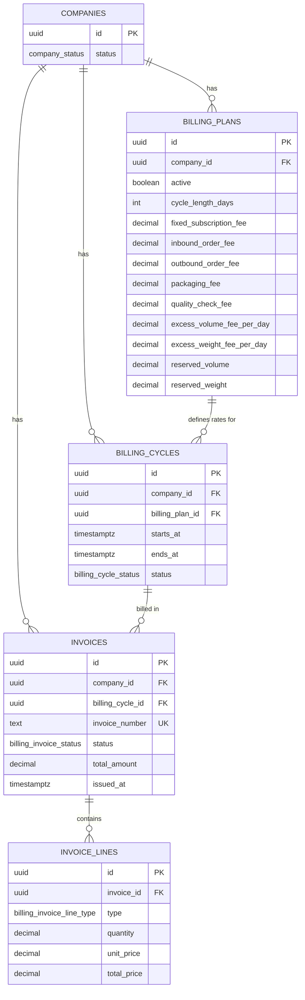
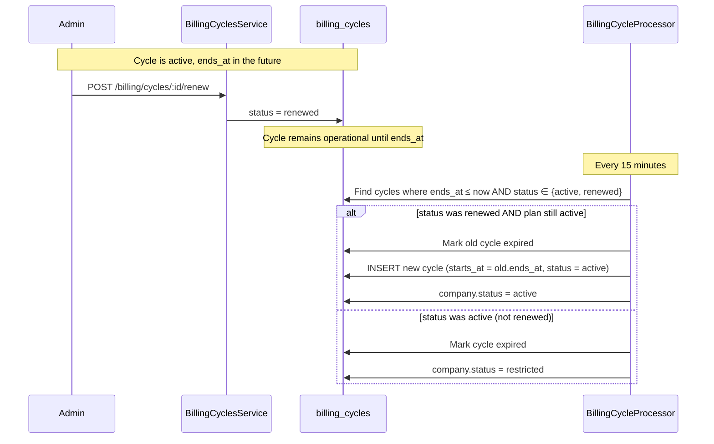
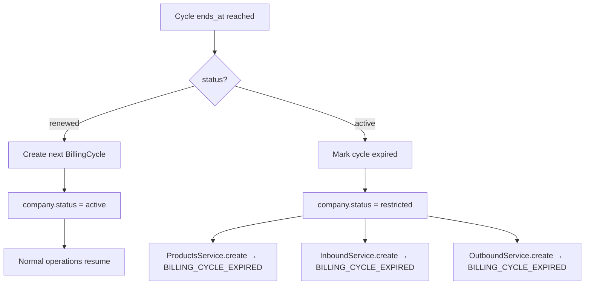

# BILLING-1A — Billing Domain Foundation Report

**Generated:** 2026-06-10  
**Environment:** Staging codebase (`emdad-sy-3pl-wms`)  
**Scope:** Database schema, NestJS billing module, operational gating, renewal & account-lock flows  
**Deliverable:** This file only

---

## Executive Summary

BILLING-1A introduces the billing domain foundation for the EMDAD 3PL WMS. Four core entities (`BillingPlan`, `BillingCycle`, `Invoice`, `InvoiceLine`) replace the unused legacy billing OLTP tables. A new `billing` NestJS module exposes plan/cycle/invoice APIs, enforces the **90% volume allocation cap**, gates product and order creation behind active billing, and runs a scheduled processor for cycle expiry, deferred renewal, and automatic account restriction.

| Capability | Status |
|------------|--------|
| Entity schema + migration | **Done** — `20260610120000_billing_domain_foundation` |
| Prisma models | **Done** — `backend/prisma/schema.prisma` |
| Billing REST API | **Done** — `/api/billing/*` |
| Product / inbound / outbound gating | **Done** — `BillingAccessService.assertOperationalBilling` |
| 90% volume reservation validation | **Done** — plan create/update |
| Deferred renewal + auto cycle creation | **Done** — `POST …/renew` + cron processor |
| Account restriction on expiry | **Done** — `company.status → restricted` |
| Invoice line management | **Done** — draft invoices only (BILLING-2 will auto-generate) |

> **Naming note:** The spec uses `clientId`; the WMS canonical tenant key is `companyId` (table `companies`). All API DTOs and DB columns use `company_id`.

---

## 1. Entity Relationship Diagram



---

## 2. Database Schema

Migration: `backend/prisma/migrations/20260610120000_billing_domain_foundation/migration.sql`

### 2.1 Enums

| Enum | Values |
|------|--------|
| `company_status` | … existing … **`restricted`** (added) |
| `billing_cycle_status` | `active`, `expired`, `renewed` |
| `billing_invoice_status` | `draft`, `open`, `paid`, `cancelled` |
| `billing_invoice_line_type` | `subscription`, `inbound`, `outbound`, `packaging`, `quality_check`, `excess_volume`, `excess_weight` |

### 2.2 Tables

#### `billing_plans`

| Column | Type | Notes |
|--------|------|-------|
| `id` | UUID PK | |
| `company_id` | UUID FK → `companies` | client tenant |
| `active` | BOOLEAN | one active plan per company (partial unique index) |
| `cycle_length_days` | INTEGER | > 0 |
| `fixed_subscription_fee` | DECIMAL(12,2) | |
| `inbound_order_fee` | DECIMAL(10,4) | per order |
| `outbound_order_fee` | DECIMAL(10,4) | per order |
| `packaging_fee` | DECIMAL(10,4) | |
| `quality_check_fee` | DECIMAL(10,4) | |
| `excess_volume_fee_per_day` | DECIMAL(10,4) | |
| `excess_weight_fee_per_day` | DECIMAL(10,4) | |
| `reserved_volume` | DECIMAL(14,4) | CBM reservation |
| `reserved_weight` | DECIMAL(14,4) | kg reservation |
| `created_at` / `updated_at` | TIMESTAMPTZ | auto-maintained |

**Indexes:** `uq_one_active_billing_plan_per_company` (partial, `active = true`)

#### `billing_cycles`

| Column | Type | Notes |
|--------|------|-------|
| `id` | UUID PK | |
| `company_id` | UUID FK | |
| `billing_plan_id` | UUID FK | |
| `starts_at` / `ends_at` | TIMESTAMPTZ | `ends_at > starts_at` |
| `status` | `billing_cycle_status` | default `active` |

**Indexes:** `uq_one_current_billing_cycle_per_company` (partial, `status IN ('active','renewed')`); expiry index on `ends_at`

#### `invoices`

| Column | Type | Notes |
|--------|------|-------|
| `id` | UUID PK | |
| `company_id` | UUID FK | |
| `billing_cycle_id` | UUID FK | |
| `invoice_number` | TEXT UNIQUE | auto `INV-…` via trigger |
| `status` | `billing_invoice_status` | default `draft` |
| `total_amount` | DECIMAL(14,2) | sum of lines |
| `issued_at` | TIMESTAMPTZ | nullable until issued |

#### `invoice_lines`

| Column | Type | Notes |
|--------|------|-------|
| `id` | UUID PK | |
| `invoice_id` | UUID FK | CASCADE delete |
| `type` | `billing_invoice_line_type` | |
| `quantity` | DECIMAL(15,4) | |
| `unit_price` | DECIMAL(10,4) | |
| `total_price` | DECIMAL(14,2) | CHECK ≈ `quantity × unit_price` |

### 2.3 Legacy replacement

The migration drops unused Phase-0 billing OLTP objects (`billing_transactions`, `client_billing_plans`, legacy `invoices`, etc.) and no-ops `analytics.etl_load_fact_billing_transactions` until BILLING-2 reintroduces charge capture.

---

## 3. Service Architecture

```
┌─────────────────────────────────────────────────────────────────┐
│                        HTTP  /api/billing/*                      │
│                     BillingController                            │
└────────────┬──────────────────────┬─────────────────────────────┘
             │                      │
    BillingPlansService    BillingCyclesService    BillingInvoicesService
             │                      │                      │
             └──────────┬───────────┴──────────────────────┘
                        │
              BillingVolumeCapacityService
              BillingAccessService  ◄── exported; used by Products / Inbound / Outbound
                        │
                   PrismaService
                        │
                   PostgreSQL

   BillingCycleProcessorService  (@Cron */15 * * * *)
        └── expiry → restrict account OR create next cycle (if renewed)
```

### Module layout

| File | Responsibility |
|------|----------------|
| `billing.module.ts` | NestJS module registration |
| `billing.controller.ts` | REST endpoints |
| `billing-plans.service.ts` | Plan CRUD, first-cycle bootstrap, capacity summary |
| `billing-cycles.service.ts` | Cycle listing, **renew** (mark only) |
| `billing-invoices.service.ts` | Invoice listing, draft line append |
| `billing-access.service.ts` | Operational gate + 90% volume validation |
| `billing-cycle-processor.service.ts` | Scheduled expiry / renewal / restriction |
| `common/errors/billing-exceptions.ts` | Stable error codes for UI |

### REST API (selected)

| Method | Path | Guard | Purpose |
|--------|------|-------|---------|
| `GET` | `/billing/capacity` | Internal admin | Warehouse allocation summary |
| `POST` | `/billing/plans` | Internal admin | Create plan + first cycle |
| `PATCH` | `/billing/plans/:id` | Internal admin | Update rates / reservation |
| `POST` | `/billing/cycles/:id/renew` | Internal admin | Mark cycle for deferred renewal |
| `GET` | `/billing/plans\|cycles\|invoices` | Authenticated | Tenant-scoped lists |

### Business-rule enforcement

`BillingAccessService.assertOperationalBilling(companyId)` is invoked at the start of:

- `ProductsService.create`
- `InboundService.create`
- `OutboundService.create`

Checks (in order):

1. Company exists and `status ≠ restricted`
2. Active `billing_plans` row (`active = true`)
3. Current cycle: `status ∈ {active, renewed}` AND `starts_at ≤ now < ends_at`

Failure codes: `BILLING_PLAN_REQUIRED`, `BILLING_CYCLE_EXPIRED`.

### Volume reservation (90% rule)

```
totalWarehouseVolume = Σ location.max_cbm  (active internal/fridge/quarantine locations)
allocatableCapacity  = totalWarehouseVolume × 0.9
currentlyAllocated   = Σ billing_plans.reserved_volume  (active plans)

On plan create/update:
  currentlyAllocated + requestedVolume ≤ allocatableCapacity
```

Violations raise `VOLUME_ALLOCATION_EXCEEDED` with structured `details`.

---

## 4. Renewal Flow

Renewal is **deferred** — the renew action does not immediately open a new cycle.



**State machine**

| From | Event | To |
|------|-------|-----|
| `active` | Admin renew | `renewed` |
| `active` | `ends_at` reached (no renew) | `expired` → account **restricted** |
| `renewed` | `ends_at` reached | `expired` + **new** `active` cycle created |

---

## 5. Account Locking Flow

Account restriction is automatic when a billing cycle expires **without** renewal.



`restricted` is a dedicated `company_status` enum value (distinct from manual `paused` / `closed`). Restoring access after a non-renewed expiry requires finance to create a new billing plan/cycle or manually reactivate the company (future BILLING-2 admin tooling).

---

## 6. Files Changed

| Area | Paths |
|------|-------|
| Migration | `backend/prisma/migrations/20260610120000_billing_domain_foundation/` |
| Prisma | `backend/prisma/schema.prisma` |
| Billing module | `backend/src/modules/billing/**` |
| Exceptions | `backend/src/common/errors/billing-exceptions.ts` |
| Gating | `products.service.ts`, `inbound.service.ts`, `outbound.service.ts` + module imports |
| App bootstrap | `backend/src/app.module.ts` |

---

## 7. Deployment Notes

1. Run `npm run db:migrate` on staging/production before deploying the backend build.
2. Existing clients **without** a billing plan will be blocked from creating products/orders until a plan is assigned via `POST /api/billing/plans`.
3. Seed / demo companies may need a billing plan added for QA continuity.
4. Analytics ETL for legacy `billing_transactions` is intentionally no-op until charge-capture work lands in BILLING-2.

---

## 8. Out of Scope (BILLING-2+)

- Automatic invoice generation from warehouse events
- Payment recording
- Client-portal billing UI
- Weight-based capacity enforcement (schema field present; volume-only gate in 1A)
- Re-enabling analytics fact billing ETL
