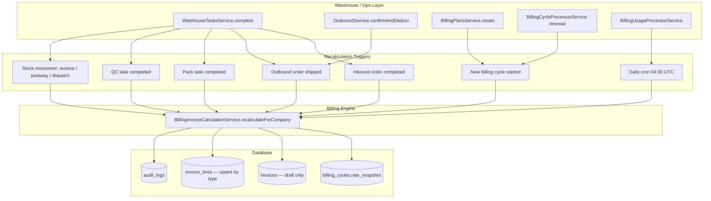

# BILLING-1B — Invoice Calculation Engine Report

**Generated:** 2026-06-10  
**Environment:** Staging codebase (`emdad-sy-3pl-wms`)  
**Depends on:** BILLING-1A (domain foundation)  
**Deliverable:** This file only

---

## Executive Summary

BILLING-1B implements an automatic invoice calculation engine that keeps the **current-cycle draft invoice** in sync with warehouse activity. Seven line types are recalculated from source data on each trigger event. Historical invoices are finalized to `open` status when a billing cycle expires and are never modified afterward. Plan rate changes are isolated to future cycles via per-cycle `rate_snapshot`.

| Capability | Status |
|------------|--------|
| Event-driven invoice recalculation | **Done** |
| Full line-type coverage (7 types) | **Done** |
| Rate snapshot per billing cycle | **Done** |
| Historical invoice immutability | **Done** |
| Plan update → future cycles only | **Done** |
| Audit logging on recalculation | **Done** |
| Daily usage refresh cron | **Done** |

---

## 1. Event Flow



### Trigger → source mapping

| Trigger | When fired | Source function |
|---------|------------|-----------------|
| `inbound_completed` | Inbound workflow closes (all tasks terminal) | `WarehouseTasksService.complete` → `maybeCloseInboundWorkflow` |
| `outbound_completed` | Outbound shipped via dispatch task or direct confirm | `WarehouseTasksService.complete` (dispatch) / `OutboundService.confirmAndDeduct` |
| `packaging_completed` | Pack task marked completed | `WarehouseTasksService.complete` (pack) |
| `quality_check_completed` | QC task marked completed | `WarehouseTasksService.complete` (qc) |
| `usage_changed` | Receiving, putaway, or dispatch mutates stock | `WarehouseTasksService.complete` |
| `cycle_started` | First cycle on plan create, or renewal spawns next cycle | `BillingPlansService.create` / `BillingCycleProcessorService` |
| `scheduled_usage` | Daily excess volume/weight refresh | `BillingUsageProcessorService` @ 04:00 UTC |

Recalculation runs **post-commit** (fire-and-forget) so billing failures never roll back warehouse operations.

---

## 2. Recalculation Strategy

### 2.1 Full recompute (idempotent)

Each trigger recomputes **all seven line types** from authoritative source tables — not incremental deltas. This makes repeated triggers safe and eliminates duplicate-charge risk.

```
draft invoice for active cycle
  ├── subscription      ← 1 × snapshotted fixedSubscriptionFee
  ├── inbound           ← count(completed inbound orders in cycle window)
  ├── outbound          ← count(shipped outbound orders in cycle window)
  ├── packaging         ← count(completed pack warehouse_tasks in cycle window)
  ├── quality_check     ← count(completed qc warehouse_tasks in cycle window)
  ├── excess_volume     ← max(0, usage_cbm − reserved) × days_elapsed × rate/day
  └── excess_weight     ← max(0, usage_kg − reserved) × days_elapsed × rate/day
```

**Cycle window:** `[billing_cycle.starts_at, min(now, billing_cycle.ends_at)]`

### 2.2 Rate isolation (plan changes)

| Concern | Mechanism |
|---------|-----------|
| Plan updated mid-cycle | `billing_cycles.rate_snapshot` JSONB frozen at cycle creation |
| New cycle after renewal | Snapshot taken from **current** plan row (updated rates apply here) |
| Current cycle invoice | Always uses snapshot, never live `billing_plans` row |

Migration: `20260610140000_billing_invoice_calculation` adds `rate_snapshot` and backfills existing cycles.

### 2.3 Invoice line upsert

One row per `(invoice_id, type)` — enforced by unique index `uq_invoice_line_type_per_invoice`. Lines are updated in place; `total_amount` on the invoice is the sum of line `total_price` values.

Only invoices with `status = draft` are recalculated.

### 2.4 Historical immutability

When a billing cycle expires, `BillingCycleProcessorService` calls `finalizeCycleInvoice`:

- Draft invoice → `status = open`, `issued_at = now`
- Subsequent recalculation skips non-draft invoices
- Paid/cancelled invoices (future BILLING-2 flows) remain untouched

### 2.5 Usage computation

```sql
volume_cbm = Σ (current_stock.quantity_on_hand × products.volume_cbm)
weight_kg  = Σ (current_stock.quantity_on_hand × products.weight_kg)
```

Excess lines:

```
days_elapsed = ceil((as_of − cycle.starts_at) / 1 day), minimum 1
excess_volume_qty = max(0, volume_cbm − snapshotted.reservedVolume) × days_elapsed
excess_weight_qty = max(0, weight_kg − snapshotted.reservedWeight) × days_elapsed
line_total        = quantity × unit_price  (rounded to 2 dp)
```

---

## 3. Audit Logging

Every successful recalculation emits a best-effort audit row:

| Field | Value |
|-------|-------|
| `action` | `BILLING_INVOICE_RECALCULATED` |
| `resource_type` | `invoice` |
| `resource_id` | Draft invoice UUID |
| `actor_email` | `billing-engine@system.local` |
| `actor_role` | `system` |
| `previous_state` | `{ totalAmount }` before recalc |
| `new_state` | `{ trigger, billingCycleId, totalAmount, lines[] }` |

Implementation: `AuditLogService.logBestEffort` in `BillingInvoiceCalculationService` — billing audit failures are logged but do not fail the caller.

---

## 4. Service Architecture

```
BillingInvoiceCalculationService   ← core engine (recalculate, finalize)
BillingUsageService                ← stock × product dimension aggregation
BillingUsageProcessorService       ← daily cron for usage lines
billing-rate-snapshot.util.ts      ← snapshot build/parse
billing-recalculation-triggers.util.ts ← warehouse task → trigger mapping
```

### Module exports

`BillingModule` exports `BillingInvoiceCalculationService` for warehouse and outbound modules.

### REST API (unchanged from 1A)

Invoice listing/detail via `GET /api/billing/invoices`. The draft invoice for the active cycle updates automatically; no separate “generate” endpoint is required.

---

## 5. Files Changed

| Area | Paths |
|------|-------|
| Migration | `backend/prisma/migrations/20260610140000_billing_invoice_calculation/` |
| Prisma | `billing_cycles.rateSnapshot` |
| Engine | `billing-invoice-calculation.service.ts`, `billing-usage.service.ts`, `billing-usage-processor.service.ts` |
| Snapshot | `billing-rate-snapshot.util.ts`, updates to `billing-plans.service.ts`, `billing-cycles.service.ts` |
| Finalization | `billing-cycle-processor.service.ts` |
| Hooks | `warehouse-tasks.service.ts`, `outbound.service.ts` |
| Module wiring | `billing.module.ts`, `warehouse-workflow.module.ts` |

---

## 6. Deployment Notes

1. Run `npm run db:migrate` before deploying the backend build.
2. Existing active cycles are backfilled with `rate_snapshot` from their linked plan.
3. Draft invoices are created lazily on the first recalculation trigger (or plan create).
4. Manual `POST /billing/invoices/:id/lines` remains available but lines of the same `type` will be overwritten on the next automatic recalc.

---

## 7. Out of Scope (BILLING-2+)

- Auto-transition draft → open before cycle end (manual finance workflow)
- Payment recording and partial/overdue states
- Per-event charge ledger (`billing_transactions` reintroduction)
- Client-portal invoice display
- Adjustment-driven usage hooks (covered by daily cron)
