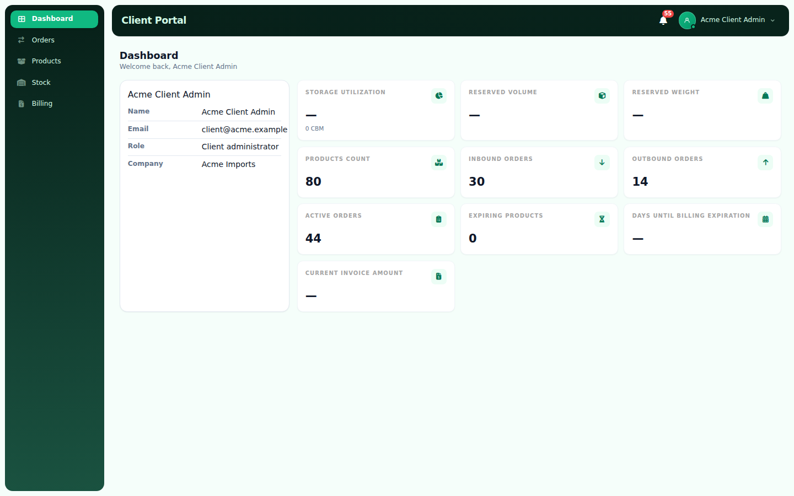
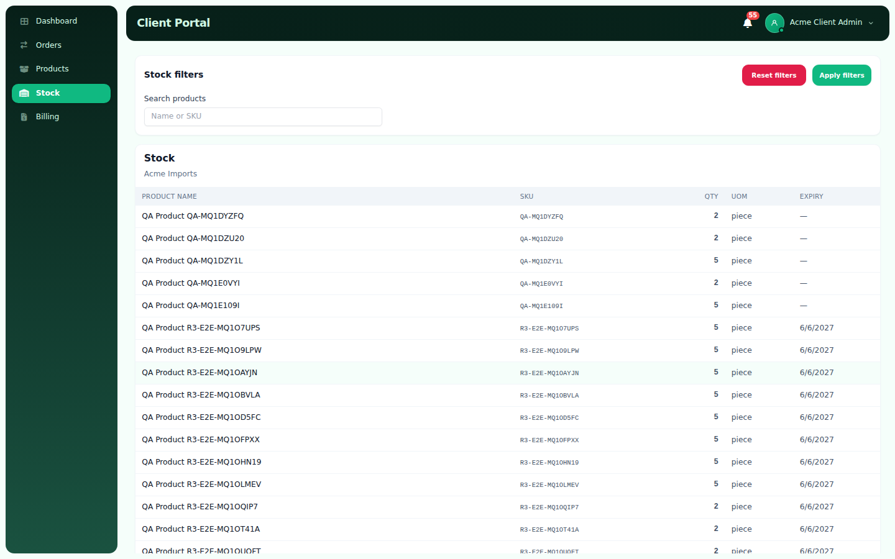
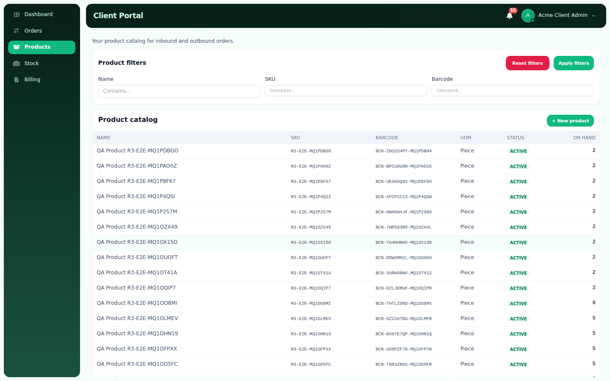
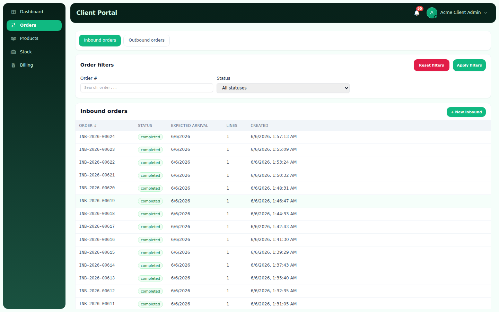
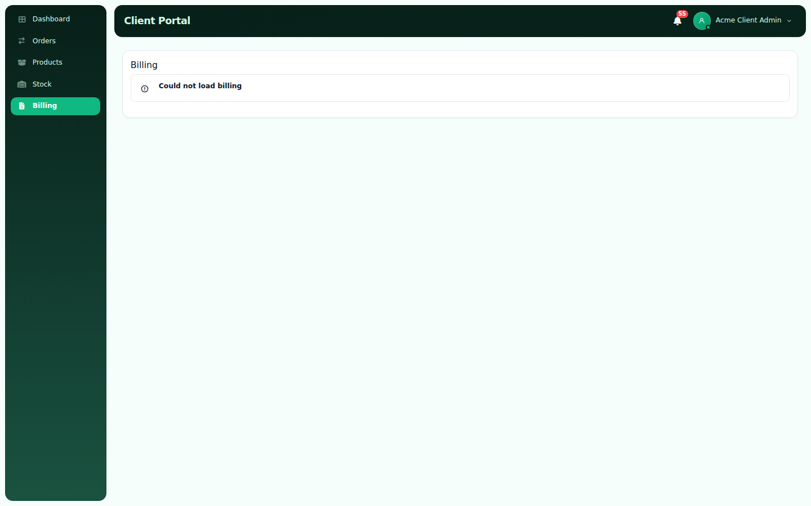

# CLIENT-UX-1 — Client Portal UX Improvements Report

**Generated:** 2026-06-08  
**Environment:** Staging (`https://staging-client.emdadsy.com`, `wms_db_staging`)  
**Branch:** `staging`  
**Evidence:** [`docs/evidence/client-ux-1/`](docs/evidence/client-ux-1/)

---

## Executive Summary

CLIENT-UX-1 delivers the requested client portal UX improvements:

| Requirement | Status |
|-------------|--------|
| Rename **Home → Dashboard** at `/dashboard` | **Done** |
| Dashboard widget grid (10 KPIs) | **Done** |
| Admin-style server pagination on list pages | **Done** |
| Reduced whitespace / higher density | **Done** |
| Report with before/after evidence | **Done** |

---

## 1. Navigation & Routing

### Before
- Sidebar label: **Home** (`iconKey: Home`)
- Route: `/` (index) → `WelcomePage`
- Default post-login redirect: `/`

### After
- Sidebar label: **Dashboard** (`iconKey: Dashboard`)
- Route: `/dashboard` → `DashboardPage`
- `/` redirects to `/dashboard`
- Default post-login redirect: `/dashboard`

**Files:** `client-frontend/src/lib/rbac.ts`, `client-frontend/src/App.tsx`, `client-frontend/src/pages/LoginPage.tsx`

---

## 2. Dashboard Redesign

### Before
Full-width profile card only (`WelcomePage.tsx`) — no operational KPIs. Sidebar showed **Home** at `/`.

Reference implementation (commit `03a70b68`): `client-frontend/src/pages/WelcomePage.tsx`

### After
Compact profile card (`max-width ~22rem`) plus widget grid:

| Widget | Source |
|--------|--------|
| Storage Utilization | `BillingUsageService` + plan reserved volume |
| Reserved Volume | Billing plan |
| Reserved Weight | Billing plan |
| Products Count | Active products |
| Inbound Orders | Open inbound statuses |
| Outbound Orders | Open outbound statuses |
| Active Orders | Inbound + outbound open |
| Expiring Products | Lots expiring within 90 days |
| Days Until Billing Expiration | Billing summary (`client_admin`) |
| Current Invoice Amount | Current cycle invoice (`client_admin`) |



**Backend API:** `GET /api/client/dashboard/overview`  
**Files:**  
- `backend/src/modules/client-portal/dashboard/client-dashboard.service.ts`  
- `backend/src/modules/client-portal/dashboard/client-dashboard.controller.ts`  
- `client-frontend/src/pages/DashboardPage.tsx`  
- `client-frontend/src/services/clientDashboardService.ts`

**Sample API response (staging, `client@acme.example`):**

```json
{
  "productsCount": 80,
  "openInboundOrders": 30,
  "openOutboundOrders": 14,
  "activeOrders": 44,
  "expiringProductsCount": 0,
  "storage": {
    "usedVolumeCbm": "0",
    "usedWeightKg": "60",
    "reservedVolumeCbm": null,
    "reservedWeightKg": null,
    "utilizationPercent": null
  },
  "billing": null
}
```

> Billing widgets return `null` on staging when the billing DB schema is out of sync (`invoices.billing_cycle_id` missing). Widgets render `—` gracefully; billing summary endpoint has the same pre-existing constraint.

---

## 3. Pagination — Admin Pattern

### Before
Client list pages fetched up to 200 rows and relied on **client-side** `DataTable` pagination (default 20 rows/page). Previous/Next buttons used `flex-1`, producing oversized controls on wide viewports.

### After
All required list pages use **`useChunkedServerPagination`** (chunk 200, UI page 50) with `serverPagination` wired to the shared admin `DataTable`:

| Page | Route |
|------|-------|
| Products | `/products` |
| Stock | `/stock` |
| Inbound orders | `/inbound-orders` |
| Outbound orders | `/outbound-orders` |
| Invoice history | `/billing` |









**Invoice pagination API:** `GET /api/client/billing/invoices?limit=&offset=` returns `{ items, total, limit, offset }`.

**Fix applied:** `@tanstack/react-query` deduped in `client-frontend/vite.config.ts` so hooks imported from `@wms/hooks` share the portal `QueryClientProvider`.

---

## 4. Information Density

- Removed extra `.main` wrapper padding on billing page
- Tighter filter grid gaps (`gap-3` vs `gap-5`)
- Reduced alert/sub-nav margins (`mb-3`)
- Portal-scoped CSS in `client-frontend/src/index.css` (`#client-portal-root`)

---

## 5. Verification

| Check | Result |
|-------|--------|
| Backend build | Pass |
| Client frontend build | Pass |
| Dashboard API | Pass (`200`, scoped counts) |
| Playwright UI capture (after) | Pass — 5 screenshots |
| Staging backend restart | `pm2 restart emdad-wms-backend-staging` |

**Screenshot script:** `client-frontend/scripts/capture-client-ux-1-screenshots.mjs`

```bash
CLIENT_BASE_URL=https://staging-client.emdadsy.com \
  node client-frontend/scripts/capture-client-ux-1-screenshots.mjs after
```

---

## 6. Files Changed (summary)

### Backend
- `backend/src/modules/client-portal/dashboard/*` (new)
- `backend/src/modules/client-portal/client-portal.module.ts`
- `backend/src/modules/client-portal/billing/client-billing.controller.ts`
- `backend/src/modules/client-portal/billing/client-billing.service.ts`

### Client frontend
- `client-frontend/src/pages/DashboardPage.tsx` (new)
- `client-frontend/src/services/clientDashboardService.ts` (new)
- `client-frontend/src/App.tsx`, `lib/rbac.ts`, `pages/*`, `index.css`, `vite.config.ts`
- `client-frontend/scripts/capture-client-ux-1-screenshots.mjs` (new)

### Shared
- `frontend/src/api/client.ts` — type-only `AxiosInstance` import (fixes client build when importing admin hooks)

---

## 7. Test Plan (manual)

- [ ] Log in as `client@acme.example` / `demo123` → lands on `/dashboard`
- [ ] Sidebar shows **Dashboard**, not Home
- [ ] Dashboard widgets load; links navigate to Products / Orders / Stock / Billing
- [ ] Products, Stock, Inbound, Outbound, Billing invoice tables show **50 rows** selector and compact prev/next
- [ ] `/` redirects to `/dashboard`
- [ ] `client_staff` user sees dashboard without billing widgets

---

## Deliverable

This file: **`CLIENT-UX-1-REPORT.md`**

Before/after screenshots: **`docs/evidence/client-ux-1/screenshots/`**
