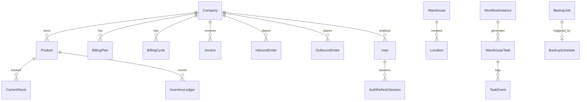

# Database QA Audit

**Phase:** Phase 2 — Database Audit  
**Audit date:** 2026-06-12  
**Auditor:** Independent QA (FINAL-QA-CERTIFICATION)  
**Scope:** Production system at `/var/www/emdad-sy-3pl-wms` — evidence-based, no prior cert trust  
**Production domains:** https://admin.emdadsy.com · https://client.emdadsy.com  
**Method:** Source code review + live production API verification

---

## Executive Summary

| Metric | Value |
|--------|------:|
| **Phase score** | **83/100** |
| Prisma models | 44 |
| Prisma enums | 37 |
| Migration folders | 28 |
| Models with @@index | 25 |
| Models with companyId | 19 |
| Soft delete columns | 0 (status-based lifecycle) |

## ERD Overview

## Model Inventory by Domain

| Domain | Models | Key tables |
|--------|-------:|------------|
| Auth | 3 | users, auth_refresh_sessions, auth_refresh_rotations |
| Tenant | 2 | companies, user_company_access |
| Catalog | 4 | products, warehouses, locations, lots |
| Inventory | 5 | current_stock, inventory_ledger, stock_adjustments, packages, ledger_idempotency |
| Orders | 8 | inbound/outbound/return orders + lines |
| Workflow | 7 | workflow_instances, warehouse_tasks, workers, task_events |
| Cycle count | 5 | cycle_counts, lines, variances, schedules, product_history |
| Billing | 4 | billing_plans, billing_cycles, invoices, invoice_lines |
| Backup | 4 | backup_jobs, backup_schedules, backup_storage_settings, backup_drive_integrations |
| Notifications | 1 | notifications |

## Indexes

**Well indexed:** billing, workflow tasks, cycle count, backup jobs, notifications, locations hierarchy.

**Gaps (Prisma schema):** `InboundOrder.companyId`, `OutboundOrder.companyId`, `StockAdjustment` FKs, `BillingCycle.billingPlanId`, `WarehouseTask.workflowNodeId` — may exist in SQL baseline but absent from Prisma (drift risk).

## Constraints & Cascades

| Risk | Detail | Severity |
|------|--------|----------|
| TaskEvent CASCADE | Deleting warehouse task destroys audit trail | Medium |
| CycleCountVariance CASCADE | Count delete removes variance history | Medium |
| UserCompanyAccess dual CASCADE | User/company hard-delete removes grants silently | Medium |
| InvoiceLine CASCADE | Hard invoice delete loses line history | Low |

## Audit Architecture

| Layer | Mechanism |
|-------|-----------|
| Application audit | `audit_logs` table (quarterly partitioned, raw SQL only — not in Prisma) |
| Inventory audit | `inventory_ledger` (monthly partitioned) |
| Task audit | `task_events` (Prisma model, CASCADE on task delete) |
| Auth audit | `auth_refresh_rotations` replay detection |
| Billing audit | `rateSnapshot` JSONB frozen at cycle start |

## Multi-Tenant Isolation

- **Primary key:** `companyId` on 19 operational models
- **Warehouse scope:** `warehouseId` on 11 models
- **Internal access:** `user_company_access` + `X-Company-Id` header
- **Client access:** JWT `companyId` claim, no header override
- **RLS:** PostgreSQL policies in `0_init` baseline (application-level scoping also enforced)

## Migration Consistency

| Check | Result |
|-------|--------|
| Prisma migrate folders | 28 tracked migrations |
| Billing domain | Fully migrated (20260610120000 foundation) |
| Cycle count / returns | Migrated (202607-202608 series) |
| **Backup tables** | **In Prisma schema but NO migration folder** — critical gap |
| Legacy tables in 0_init | 50+ tables not in current Prisma (tasks, qc_*, billing_transactions) |

## Findings

| ID | Severity | Finding |
|----|----------|---------|
| D-01 | **High** | Backup Prisma models lack corresponding migration — fresh migrate deploy may fail |
| D-02 | Medium | `audit_logs` not modeled in Prisma — type safety gap |
| D-03 | Medium | CASCADE chains destroy TaskEvent/CycleCountVariance on parent delete |
| D-04 | Low | No universal soft-delete; relies on status enums |
| D-05 | Low | Prisma header comment outdated ("Phase 1 subset") |

## Phase Score: 83/100

Comprehensive 44-model schema with partitioning, billing, workflow, and backup domains. Deductions for backup migration gap, audit_logs Prisma absence, and cascade retention risks.
