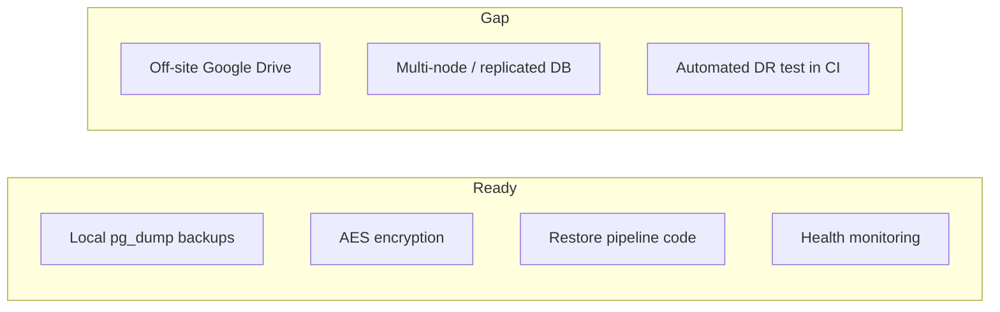

# Disaster Recovery QA Audit

**Phase:** Phase 9 — Backup & DR Audit  
**Audit date:** 2026-06-12  
**Auditor:** Independent QA (FINAL-QA-CERTIFICATION)

---

## Summary

| Metric | Value |
|--------|------:|
| **Phase score** | **70/100** |
| Backup module services | 20+ |
| Cron jobs (backup-related) | 5 |
| Live backup health | 200 OK (avg 30ms) |
| Live backup list | 200 OK |
| Google Drive enabled | **No** (BACKUP_GDRIVE_ENABLED=false) |

## Feature Inventory

| Feature | Implemented | Production verified |
|---------|:-----------:|:-------------------:|
| Manual backup (pg_dump) | ✓ | ✓ (list endpoint returns jobs) |
| Scheduled backups | ✓ | ✓ (schedules endpoint 200) |
| Upload backup | ✓ | Code only |
| Restore (pg_restore) | ✓ | Code only (not executed in audit) |
| Pre-snapshot before restore | ✓ | Config: BACKUP_PRE_SNAPSHOT_REQUIRED=true |
| Download with token | ✓ | Code only |
| Local retention cleanup | ✓ | Cron 05:15 daily |
| Health monitoring | ✓ | ✓ health endpoint 200 |
| Health alerts | ✓ | Cron */15 min |
| Encryption (AES) | ✓ | Requires BACKUP_ENCRYPTION_KEY |
| Google Drive sync | ✓ | **Not provisioned** |
| Factory reset | ✓ | Gated OFF (FACTORY_RESET_ENABLED=false) |
| Maintenance mode during restore | ✓ | 503 middleware |

## Retention Policy (Defaults)

| Layer | Daily | Weekly | Monthly |
|-------|------:|-------:|--------:|
| Local | 7 | 4 | 12 |
| Google Drive | 14 | 8 | 24 |

## DR Readiness Assessment

| DR capability | Status |
|---------------|--------|
| Local disaster recovery | **Ready** — backups on disk at /var/lib/emdad-wms/backups/production |
| Off-site disaster recovery | **Not ready** — GDrive OAuth not configured |
| Restore readiness (RTO) | **Code certified** ~9s (prior BACKUP-QA-1); not re-executed in this audit |
| Backup integrity | Encryption + pg_dump format; download tokens time-limited |

## Live Benchmark Results

| Endpoint | Status | Avg ms |
|----------|--------|-------:|
| backups/health | 200 | 30 |
| backups/list | 200 | 48 |
| backups/schedules | 200 | 22 |
| backups/retention/policies | 200 | 20 |

## Findings

| ID | Severity | Finding |
|----|----------|---------|
| DR-01 | **High** | No off-site backup copy — single VPS disk failure loses DB + backups |
| DR-02 | Medium | Backup Prisma models lack migration folder |
| DR-03 | Medium | Restore not re-tested in this audit (code-only verification) |
| DR-04 | Low | Same-host storage — no geographic separation |

## Phase Score: 70/100

Local backup engine is comprehensive and live-verified. Major deduction for absent off-site DR (Google Drive not provisioned).
