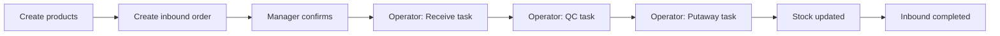
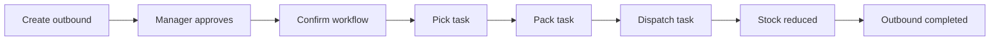
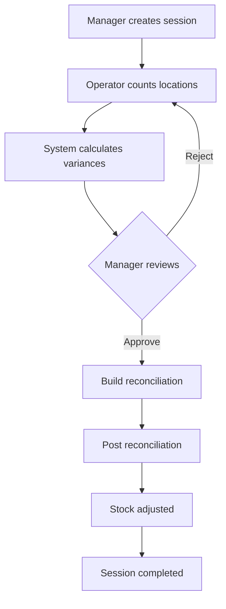

# Emdad SY 3PL Warehouse Management System
## Final User Manual

**Document version:** 1.0  
**Publication date:** June 2026  
**Audience:** Warehouse Managers · Warehouse Operators · Finance Users · Client Users  
**Systems covered:** Admin WMS (`admin.emdadsy.com`) · Client Portal (`client.emdadsy.com`)

---

> This manual is written for **business users**, not IT staff. It explains what each screen is for, how to use it day to day, and how to avoid common errors. Technical setup and server configuration are out of scope.

---

## Table of Contents

1. [Introduction](#1-introduction)
2. [Getting Started](#2-getting-started)
3. [Understanding Your Role](#3-understanding-your-role)
4. [Admin WMS — Page Guide](#4-admin-wms--page-guide)
   - [4.1 Dashboard](#41-dashboard)
   - [4.2 Products](#42-products)
   - [4.3 Locations](#43-locations)
   - [4.4 Inventory](#44-inventory)
   - [4.5 Inbound Orders](#45-inbound-orders)
   - [4.6 Outbound Orders](#46-outbound-orders)
   - [4.7 Returns](#47-returns)
   - [4.8 Cycle Count](#48-cycle-count)
   - [4.9 Tasks](#49-tasks)
   - [4.10 Reports](#410-reports)
   - [4.11 Billing](#411-billing)
   - [4.12 Backup](#412-backup)
   - [4.13 Audit Logs](#413-audit-logs)
   - [4.14 Notifications](#414-notifications)
   - [4.15 Settings](#415-settings)
5. [Client Portal — Page Guide](#5-client-portal--page-guide)
6. [End-to-End Workflow Guide](#6-end-to-end-workflow-guide)
7. [Screenshot Reference](#7-screenshot-reference)
8. [Glossary of Business Terms](#8-glossary-of-business-terms)
9. [Quick Reference](#9-quick-reference)

---

## 1. Introduction

The Emdad SY 3PL WMS helps third-party logistics (3PL) warehouses manage inventory for multiple clients. There are two applications:

| Application | Who uses it | Web address |
|-------------|-------------|-------------|
| **Admin WMS** | Warehouse managers, operators, finance staff, system administrators | https://admin.emdadsy.com |
| **Client Portal** | Your clients’ staff (customer companies) | https://client.emdadsy.com |

Each application has its own login. Your administrator assigns your role, which controls which menu items you see.

---

## 2. Getting Started

### 2.1 Logging in

**Admin WMS**

1. Open https://admin.emdadsy.com
2. Enter your **email** and **password**
3. Click **Sign in**
4. You are taken to your home page:
   - **Warehouse operator** → **Tasks**
   - **All other roles** → **Dashboard**

**Client Portal**

1. Open https://client.emdadsy.com
2. Enter your email and password
3. Click **Sign in**
4. You land on **Dashboard**

### 2.2 Navigation basics

- **Left sidebar** — main sections (only items your role can access)
- **Top bar** — language (English / Arabic), notifications bell, user menu (logout)
- **Tabs** — some sections use tabs at the top (e.g. Inventory → Stock / Ledger / Adjustments; Orders → Inbound / Outbound)

### 2.3 Language

Both applications support **English** and **Arabic**. Use the language control in the top bar.

---

## 3. Understanding Your Role

### Admin WMS roles

| Role | Typical user | Home page | Primary work |
|------|--------------|-----------|--------------|
| **Super admin** | IT / owner | Dashboard | Full access, backups, system settings |
| **Warehouse manager** | Supervisor | Dashboard | Products, orders, tasks, locations, settings |
| **Warehouse operator** | Floor staff | Tasks | Receive, putaway, pick, pack, ship, count |
| **Finance** | Accounts / billing | Dashboard | Reports, billing, invoices, audit review |

### Client portal roles

| Role | Typical user | Can access |
|------|--------------|------------|
| **Client admin** | Customer main contact | Dashboard, orders, products, stock, billing, notifications |
| **Client staff** | Customer day-to-day user | Dashboard, orders, stock, notifications — **not** products or billing |

---

## 4. Admin WMS — Page Guide

Each section below follows the same structure: **Purpose**, **When to use**, **Actions**, **Controls**, **Filters**, **Tables**, **Workflow example**, **Common mistakes**, **Best practices**.

---

### 4.1 Dashboard

| | |
|---|---|
| **Route** | `/dashboard/overview` |
| **Menu** | Sidebar → **Dashboard** |
| **Who can access** | Super admin, warehouse manager, finance |

#### 1. Purpose

Provides a single-screen summary of warehouse health: open orders, stock highlights, task backlog, and key performance indicators (KPIs).

#### 2. When it is used

- **Morning stand-up** — managers review what needs attention today
- **Finance review** — quick check of operational volume before billing
- **End-of-day** — confirm open inbound/outbound counts are trending down

#### 3. Available actions

- View summary cards and charts
- Click card links to jump to related lists (orders, inventory, tasks)
- Refresh by reloading the page

#### 4. Buttons and controls

| Control | What it does |
|---------|--------------|
| Summary cards | Click to open the related module |
| Charts | Hover for values; use as trend indicators |
| Language toggle | Switch English / Arabic |

#### 5. Filters

Dashboard is a summary view — no list filters. Use linked pages for detailed filtering.

#### 6. Tables

Dashboard may show small embedded tables (recent orders, alerts). Full data lives in the respective modules.

#### 7. Workflow example

**Morning warehouse check**

1. Manager signs in → lands on Dashboard
2. Notes 3 open inbound orders and 2 pending outbound
3. Clicks inbound card → opens Inbound Orders list
4. Assigns receiving tasks to operators

#### 8. Common mistakes

- Expecting **operators** to see Dashboard — they land on **Tasks**
- Treating numbers as real-time to the second — data refreshes on page load
- Ignoring rising open-order counts without drilling into Orders

#### 9. Best practices

- Review Dashboard at the start of each shift
- Use it as a **navigation hub**, not the only source of detail
- Pair dashboard review with the **Tasks** queue for floor execution

---

### 4.2 Products

| | |
|---|---|
| **Routes** | `/products` (list), `/products/:sku` (detail) |
| **Menu** | Sidebar → **Products** |
| **Who can access** | Super admin, warehouse manager |

#### 1. Purpose

Maintain the **product catalog**: SKU, name, barcode, dimensions, client assignment, and lot tracking settings.

#### 2. When it is used

- Onboarding a new client — create their SKUs before receiving stock
- Adding a new item line for an existing client
- Updating product details (weight, dimensions, barcode)
- Suspending or reactivating a product

#### 3. Available actions

| Action | Where | Who |
|--------|-------|-----|
| Create product | List page → **New product** | Manager |
| Edit product | Detail page | Manager |
| Search / filter catalog | List page | Manager |
| Suspend / unsuspend | Detail page | Manager |
| View stock summary | Detail page | Manager |

#### 4. Buttons and controls

| Button / control | Description |
|------------------|-------------|
| **New product** | Opens create form |
| **Search** | Find by name, SKU, or barcode |
| **Save** | Saves changes on detail page |
| **Suspend** | Blocks new orders for this SKU |
| Pagination | Browse large catalogs |

#### 5. Filters

| Filter | Use when |
|--------|----------|
| Client (company) | Viewing one customer’s catalog |
| Status | Active vs suspended products |
| Search text | Finding a specific SKU or barcode |

#### 6. Tables

**Product list columns** (typical): SKU, name, client, barcode, status, actions.

Click a row to open the **detail page** with full attributes and stock summary.

#### 7. Workflow example

**New SKU before first receipt**

1. Manager → **Products** → **New product**
2. Enter SKU, name, client, barcode, dimensions
3. Save → verify product appears in list
4. Create **Inbound order** with this SKU
5. Operator receives against inbound

#### 8. Common mistakes

- Duplicate SKU for the same client
- Wrong **client** assigned to product
- Editing product mid-receive — causes operator confusion
- Creating inbound lines for SKUs that do not exist

#### 9. Best practices

- Create all SKUs **before** confirming inbound orders
- Use consistent SKU naming conventions per client
- Suspend (don’t delete) discontinued products with history

---

### 4.3 Locations

| | |
|---|---|
| **Route** | `/locations` |
| **Menu** | Sidebar → **Locations** |
| **Who can access** | Super admin, warehouse manager |

#### 1. Purpose

Define **storage locations** inside warehouses: aisles, bins, zones, quarantine, scrap, and fridge areas.

#### 2. When it is used

- Setting up a new warehouse layout
- Adding bins after physical expansion
- Marking locations inactive during layout changes
- Printing location barcodes for scanning

#### 3. Available actions

- Create location
- Edit location name, type, barcode, parent zone
- Filter and search locations
- Activate / deactivate locations

#### 4. Buttons and controls

| Control | Description |
|---------|-------------|
| **New location** | Add a bin or zone |
| **Warehouse selector** | Choose which warehouse to view |
| **Type selector** | Storage, quarantine, scrap, fridge, etc. |
| **Save** | Apply changes |

#### 5. Filters

| Filter | Purpose |
|--------|---------|
| Warehouse | Required — locations belong to one warehouse |
| Location type | Show only quarantine, storage, etc. |
| Search | Find by name or barcode |
| Active / inactive | Hide deactivated bins |

#### 6. Tables

Columns typically include: location name, barcode, type, warehouse, parent zone, status.

#### 7. Workflow example

**Add bins in a new aisle**

1. Manager → **Locations** → select warehouse
2. **New location** for each physical bin
3. Print barcode labels
4. Operators scan bins during putaway

#### 8. Common mistakes

- Duplicate barcodes on different bins
- Using quarantine locations for normal storage
- Deactivating bins that still hold stock
- Forgetting to select the correct warehouse

#### 9. Best practices

- Mirror physical layout in the system before go-live
- Use clear naming (aisle-rack-level)
- Keep quarantine and scrap locations separate from pick faces

---

### 4.4 Inventory

| | |
|---|---|
| **Routes** | `/inventory/stock`, `/inventory/ledger`, `/inventory/adjustments` |
| **Menu** | Sidebar → **Inventory** (tabs: Stock · Ledger · Adjustments) |
| **Who can access** | Super admin, warehouse manager, finance |

#### 1. Purpose

**Inventory** is the stock control center:

| Tab | Purpose |
|-----|---------|
| **Stock** | What you have **right now** (quantity on hand by product and location) |
| **Ledger** | **History** of every stock movement |
| **Adjustments** | Formal corrections (damage, loss, found stock) with approval |

#### 2. When it is used

- **Stock** — checking availability before shipping; investigating “where is this SKU?”
- **Ledger** — tracing a quantity change; finance audit; dispute resolution
- **Adjustments** — posting approved corrections after cycle count or damage

#### 3. Available actions

| Tab | Actions |
|-----|---------|
| Stock | View, filter, drill into product detail |
| Ledger | Filter, view movement detail, follow reference links |
| Adjustments | Create draft, add lines, approve, post, cancel |

#### 4. Buttons and controls

| Control | Tab | Description |
|---------|-----|-------------|
| **New adjustment** | Adjustments | Start a correction document |
| **Approve / Post** | Adjustments | Manager approves and applies to stock |
| Product row click | Stock | Opens location-level breakdown |
| Reference link | Ledger | Jumps to related order or adjustment |

#### 5. Filters

**Stock:** warehouse, client, product, status, search text.

**Ledger:** date range, client, product, movement type, warehouse, reference.

**Adjustments:** status (draft, posted), date, client.

#### 6. Tables

**Stock table:** product, client, warehouse, on-hand quantity, locations (summary).

**Ledger table:** date, movement type, product, quantity change, reference, user.

**Adjustments table:** adjustment number, status, client, created date, total lines.

#### 7. Workflow example

**Investigate missing units**

1. Manager → **Inventory → Stock** → search SKU
2. Note quantity at each location
3. **Ledger** tab → filter by product and date range
4. Trace pick/ship movements to find when quantity dropped
5. If physical count differs → create **Adjustment** or **Cycle count**

#### 8. Common mistakes

- Confusing **on-hand** with **available to ship** (check outbound reservations)
- Wrong warehouse filter hiding stock
- Posting adjustments without manager review
- Expecting ledger to show future picks — only **completed** movements appear

#### 9. Best practices

- Use **Stock** for current state; **Ledger** for history
- Always set warehouse filter when investigating a specific site
- Route routine corrections through **Cycle count**; use **Adjustments** for exceptions

---

### 4.5 Inbound Orders

| | |
|---|---|
| **Routes** | `/orders/inbound`, `/orders/inbound/:id` |
| **Menu** | Sidebar → **Orders** → tab **Inbound orders** |
| **Who can access** | Super admin, warehouse manager, finance |

#### 1. Purpose

Plan and track **incoming shipments** from clients into the warehouse.

#### 2. When it is used

- Client sends goods to the warehouse
- Manager creates or confirms an inbound plan
- Operators receive, QC, and put away stock
- Finance monitors receiving progress for billing

#### 3. Available actions

| Action | Who | When |
|--------|-----|------|
| Create inbound | Manager | New shipment expected |
| Add / edit lines | Manager | Before confirmation |
| Approve / Confirm | Manager | Goods expected — starts workflow |
| Receive (direct) | Manager | Non-task receiving mode |
| Cancel | Manager | While still draft/open |
| Execute receive tasks | Operator | After confirmation |

#### 4. Buttons and controls

| Button | Description |
|--------|-------------|
| **New inbound** | Create order |
| **Confirm** | Lock plan and create receiving tasks |
| **Receive** | Direct receive on a line (manager mode) |
| **Cancel** | Cancel open order |
| **Execute** (on Tasks) | Operator enters received quantities |

#### 5. Filters

Status, client, warehouse, expected arrival date, search by order number.

#### 6. Tables

**List:** order number, client, status, warehouse, expected date, line count.

**Detail:** lines with product, expected qty, received qty, status per line.

#### 7. Workflow example

See [Receiving goods — step by step](#61-receiving-goods--step-by-step).

#### 8. Common mistakes

- Confirming without correct **warehouse**
- Receiving more than expected without noting overage
- Skipping putaway — stock stuck in receiving area
- Finance users trying to execute receives

#### 9. Best practices

- Confirm inbound only when products exist in catalog
- Use task workflow for operator accountability
- Verify status **completed** and check **Ledger** after receiving

---

### 4.6 Outbound Orders

| | |
|---|---|
| **Routes** | `/orders/outbound`, `/orders/outbound/:id` |
| **Menu** | Sidebar → **Orders** → tab **Outbound orders** |
| **Who can access** | Super admin, warehouse manager, finance |

#### 1. Purpose

Plan and track **outgoing shipments** from warehouse stock to end customers.

#### 2. When it is used

- Client requests shipment to their customer
- Manager approves and releases pick workflow
- Operators pick, pack, and dispatch
- Finance tracks fulfillment for billing

#### 3. Available actions

| Action | Who |
|--------|-----|
| Create outbound | Manager / client portal |
| Approve | Manager |
| Confirm & start workflow | Manager |
| Confirm & deduct stock (direct) | Manager |
| Execute pick / pack / dispatch tasks | Operator |
| Cancel | Manager (when status allows) |

#### 4. Buttons and controls

**Approve**, **Confirm & start workflow**, **Confirm & deduct stock**, **Cancel**, line-level quantity fields on detail page.

#### 5. Filters

Status, client, warehouse, ship date, order number search.

#### 6. Tables

**List:** order number, client, status, requested ship date, line count.

**Detail:** product lines, requested vs picked vs shipped quantities, ship-to address.

#### 7. Workflow example

See [Shipping goods — step by step](#62-shipping-goods--step-by-step).

#### 8. Common mistakes

- Confirming when stock is insufficient (order goes **pending stock**)
- Skipping pack step when required
- Short pick without supervisor decision

#### 9. Best practices

- Check **Inventory → Stock** before confirming
- Use workflow mode for traceability
- Confirm completion on detail page after dispatch

---

### 4.7 Returns

| | |
|---|---|
| **Routes** | `/returns`, `/returns/:id`, `/returns/:id/process` |
| **Menu** | Sidebar → **Returns** |
| **Who can access** | Super admin, warehouse manager, warehouse operator |

#### 1. Purpose

Handle **customer returns** — goods coming back into the warehouse for inspection, restock, quarantine, or scrap.

#### 2. When it is used

- End customer returns product to client; client sends goods back to 3PL
- Operator inspects returned goods
- Manager posts inventory and completes return

#### 3. Available actions

| Action | Who |
|--------|-----|
| Create return | Manager |
| Confirm | Manager |
| Start receiving | Operator |
| Process (inspect lines) | Operator |
| Post inventory | Manager |
| Complete | Manager |

#### 4. Buttons and controls

**New return**, **Confirm**, **Start receiving**, **Process**, **Post inventory**, **Complete**.

#### 5. Filters

Status, client, date range, return number search.

#### 6. Tables

Return number, client, status, created date, line count. Detail shows expected vs received vs accepted quantities per line.

#### 7. Workflow example

See [Processing a return](#64-processing-a-return).

#### 8. Common mistakes

- Completing before physical inspection
- Posting inventory before quantities verified
- Mixing return stock with normal pick face without inspection

#### 9. Best practices

- Inspect before posting to stock
- Use quarantine location for damaged returns
- Complete return only when ledger entries are verified

---

### 4.8 Cycle Count

| | |
|---|---|
| **Routes** | `/cycle-count`, `/cycle-count/my-tasks`, `/cycle-count/:id`, `/cycle-count/:id/execute` |
| **Menu** | Sidebar → **Cycle count** |
| **Who can access** | Super admin, warehouse manager, warehouse operator |

#### 1. Purpose

**Physical inventory counts** to compare system stock with floor counts and resolve variances.

#### 2. When it is used

- Scheduled periodic counts (monthly, quarterly)
- Investigation after repeated pick shortages
- Pre-audit stock verification

#### 3. Available actions

| Action | Who |
|--------|-----|
| Create count session | Manager |
| Execute count (enter quantities) | Operator |
| Review variances | Manager |
| Approve / reject variance | Manager |
| Build & post reconciliation | Manager |
| Complete session | Manager |

#### 4. Buttons and controls

**New cycle count**, **Execute**, **Approve variance**, **Reject**, **Build reconciliation**, **Post reconciliation**, **Complete**.

Tabs: **Dashboard** (all sessions), **My tasks** (operator assignments).

#### 5. Filters

Status, warehouse, date, assigned worker.

#### 6. Tables

Session list: ID, warehouse, status, progress, variance count. Detail: lines with system qty, counted qty, variance.

#### 7. Workflow example

See [Performing a cycle count](#63-performing-a-cycle-count).

#### 8. Common mistakes

- Operator without **worker profile** cannot see My tasks
- Counting during active picking on same locations
- Posting reconciliation with open unreviewed variances

#### 9. Best practices

- Schedule counts during low-activity windows
- Freeze or avoid picks from locations being counted
- Document rejection reasons for audit trail

---

### 4.9 Tasks

| | |
|---|---|
| **Routes** | `/tasks`, `/tasks/:id`, `/tasks/:id/execute` |
| **Menu** | Sidebar → **Tasks** |
| **Who can access** | Super admin, warehouse manager, warehouse operator |

#### 1. Purpose

The **work queue** for floor staff: receiving, QC, putaway, pick, pack, and dispatch.

#### 2. When it is used

- Operators sign in and work from Tasks all day
- Managers monitor backlog and assign workers
- Every inbound/outbound workflow step appears as a task

#### 3. Available actions

| Action | Who |
|--------|-----|
| View / filter tasks | All |
| Open task detail | All |
| Assign worker | Manager |
| **Execute** task | Operator |
| Complete with quantities / scans | Operator |

#### 4. Buttons and controls

| Control | Description |
|---------|-------------|
| Task type tabs | All · Receive · Putaway · Pick · Pack · Delivery |
| **Execute** | Opens execution screen |
| Barcode scan fields | Scan product or location |
| Quantity inputs | Enter actual quantities |
| **Submit / Complete** | Finish task step |

#### 5. Filters

Task type, status (pending, in progress, completed), warehouse, assigned worker, date.

#### 6. Tables

Task ID, type, status, related order, warehouse, assigned worker, due priority.

#### 7. Workflow example

**Operator shift**

1. Operator logs in → **Tasks**
2. Filters **Receive** → opens first task
3. **Execute** → enters received quantities
4. Completes QC and Putaway tasks in sequence
5. Manager verifies inbound order status updated

#### 8. Common mistakes

- Starting execute before worker assignment (when required)
- Wrong location scan during putaway or pick
- Short quantity without telling supervisor

#### 9. Best practices

- Work tasks in priority order
- Scan barcodes — don’t type locations from memory
- Report blocked tasks immediately to manager

**Task types explained**

| Type | Operator action |
|------|-----------------|
| Receiving | Enter received qty per inbound line |
| QC | Pass/fail quantities after receive |
| Putaway | Move stock to storage locations |
| Pick | Pick from locations for outbound |
| Pack | Confirm packed quantities |
| Dispatch | Confirm shipment |

---

### 4.10 Reports

| | |
|---|---|
| **Routes** | `/reports/*` (14 reports) |
| **Menu** | Sidebar → **Reports** |
| **Who can access** | Super admin, warehouse manager, finance |

#### 1. Purpose

Analyze warehouse performance, inventory health, and financial metrics with exportable data.

#### 2. When it is used

- Weekly operations review (productivity, fill rate, SLA)
- Finance month-end (revenue by client, receivables aging)
- Inventory planning (stock aging, lot expiry, capacity)

#### 3. Available reports

| Report | Business question |
|--------|---------------------|
| Warehouse Analysis | Overall warehouse activity |
| Worker Productivity | Who completed how many tasks? |
| Order Cycle Time | How long orders take end-to-end? |
| Inbound Accuracy | Receiving accuracy vs expected |
| Outbound Fill Rate | Did we ship complete orders? |
| SLA Compliance | Did we meet service targets? |
| Inventory | Stock snapshot report |
| Product Moves | Movement volume by product |
| Stock Aging | How long has stock sat idle? |
| Lot Expiry | What is approaching expiry? |
| Capacity Utilization | How full are locations? |
| Return Rate | Return volume trends |
| Revenue by Client | Billing revenue breakdown |
| Receivables Aging | Outstanding invoice ages |

#### 4. Buttons and controls

**Generate** (load preview), **Export CSV**, **Export Excel**, **Group by** (for charts), pagination controls.

#### 5. Filters

Warehouse, client, date range, SKU, status — vary by report.

#### 6. Tables

Preview shows up to 50 rows. **Export** downloads the full filtered dataset (within system limits).

#### 7. Workflow example

**Monthly client review**

1. Finance → **Reports → Revenue by Client**
2. Set date range to last month
3. **Generate** → review preview
4. **Export Excel** → share with management

#### 8. Common mistakes

- Assuming preview shows all rows — always export for full data
- Wrong date range excluding needed period
- Wrong warehouse filter on multi-site operations

#### 9. Best practices

- Save export files with date in filename
- Use consistent date ranges month-to-month
- Pair operational reports with **Audit logs** for investigations

---

### 4.11 Billing

| | |
|---|---|
| **Routes** | `/billing/dashboard`, `/billing/plans`, `/billing/invoices` |
| **Menu** | Sidebar → **Billing** |
| **Who can access** | Super admin, warehouse manager, finance |

#### 1. Purpose

Manage client **billing plans**, **billing cycles**, and **invoices** for 3PL services.

#### 2. When it is used

- Setting up a new client’s pricing plan
- Renewing expiring cycles
- Issuing and tracking invoices
- Monitoring overdue accounts (affects client portal access)

#### 3. Available actions

| Tab | Actions |
|-----|---------|
| Dashboard | View KPIs — expiring cycles, overdue clients |
| Plans | Create/edit client plans, volume allocation |
| Invoices | Search, open detail, update status |

#### 4. Buttons and controls

**New plan**, **Edit**, **Generate invoice**, status dropdown (draft → open → paid), volume allocation fields.

#### 5. Filters

Plans: client, expiry status, active/inactive. Invoices: status, client, date range.

#### 6. Tables

**Plans:** client name, cycle dates, rates, status.

**Invoices:** invoice number, client, amount, status, due date.

#### 7. Workflow example

See [Managing billing](#65-managing-billing).

#### 8. Common mistakes

- Letting billing cycle expire → client portal becomes **restricted**
- Changing invoice status without finance approval
- Wrong volume allocation on plan

#### 9. Best practices

- Monitor **Billing → Dashboard** weekly for expiring cycles
- Renew plans **before** expiry date
- Match invoice status to actual payment received

---

### 4.12 Backup

| | |
|---|---|
| **Routes** | `/settings/backups/*` |
| **Menu** | Sidebar → **Settings** |
| **Who can access** | Super admin (full); warehouse manager (view schedules, health) |

#### 1. Purpose

Protect business data through **backups**, **scheduled copies**, and **restore** capability. This is a system administration function — most warehouse staff do not use it daily.

#### 2. When it is used

- Before major system changes (super admin)
- Scheduled automatic backups (daily/weekly)
- Disaster recovery after data loss (super admin only)
- Health monitoring by IT / manager

#### 3. Available actions

| Action | Who |
|--------|-----|
| View backup history | Manager, super admin |
| Create manual backup | Super admin |
| Download backup file | Super admin |
| Upload backup | Super admin |
| Restore from backup | Super admin |
| Configure schedules | Manager, super admin |
| View health status | Manager, super admin |

#### 4. Buttons and controls

**Create backup**, **Download**, **Restore**, **Upload**, schedule enable/disable, retention policy view.

#### 5. Filters

Backup type (manual, scheduled, upload), status (running, completed, failed), date.

#### 6. Tables

Backup job ID, type, status, size, created date, triggered by, duration.

#### 7. Workflow example

**Monthly backup verification (super admin)**

1. **Settings → History** — confirm recent backups completed
2. **Download** latest backup for off-site storage
3. **Settings → Health** — verify no alerts

#### 8. Common mistakes

- Running restore during business hours without notice
- Managers expecting Upload/Restore tabs (super admin only)
- Deleting backups outside retention policy without approval

#### 9. Best practices

- Schedule automatic daily backups
- Test restore on a non-production copy quarterly
- Store downloaded backups off-site
- Never run **Factory reset** unless explicitly instructed by IT

---

### 4.13 Audit Logs

| | |
|---|---|
| **Route** | `/audit-logs` |
| **Menu** | Sidebar → **Audit logs** |
| **Who can access** | Super admin, warehouse manager, finance |

#### 1. Purpose

Read-only record of **who did what and when** — for compliance, investigations, and troubleshooting.

#### 2. When it is used

- Investigating unexpected stock changes
- Compliance audits
- Tracing who approved an adjustment or changed billing

#### 3. Available actions

- Search and filter logs
- View event detail
- Export (if enabled for your role)
- Paginate through large result sets

#### 4. Buttons and controls

Date pickers, user filter, action type filter, **Export** (when available), pagination.

#### 5. Filters

Date range, user, action type, client, resource type.

#### 6. Tables

Timestamp, user, action, resource, summary message, client (if applicable).

#### 7. Workflow example

**Trace who posted an adjustment**

1. Finance → **Audit logs**
2. Filter: action type = adjustment, date = yesterday
3. Find event → note user and timestamp
4. Cross-reference with **Inventory → Ledger**

#### 8. Common mistakes

- Expecting to edit or delete log entries — they are permanent
- Date filter too narrow — missing the event
- Not exporting before retention period expires

#### 9. Best practices

- Use audit logs after disputes, not during active picking
- Export relevant ranges for formal investigations
- Pair with **Ledger** for complete stock story

---

### 4.14 Notifications

| | |
|---|---|
| **Route** | `/notifications` |
| **Menu** | Sidebar → **Notifications**; also top-bar **bell** |
| **Who can access** | All admin roles |

#### 1. Purpose

In-app alerts for order updates, billing reminders, task assignments, and system events.

#### 2. When it is used

- Throughout the workday — check bell for new items
- When waiting for order status change
- Billing expiry warnings (finance / managers)

#### 3. Available actions

- View notification list
- Mark as read
- Click through to related record (when link provided)

#### 4. Buttons and controls

**Bell icon** (quick panel), **Mark all read**, individual notification click, link to source record.

#### 5. Filters

Read / unread, date, type (if available).

#### 6. Tables

Message, type, date, read status, link.

#### 7. Workflow example

Manager sees bell badge → opens panel → clicks inbound completion notice → opens inbound detail.

#### 8. Common mistakes

- Ignoring billing expiry notifications until client is restricted
- Assuming email alerts — this is **in-app** only unless separately configured

#### 9. Best practices

- Clear notifications at shift start
- Act on billing warnings before expiry
- Use links to jump directly to records

---

### 4.15 Settings

| | |
|---|---|
| **Route** | `/settings/backups` (default) |
| **Menu** | Sidebar → **Settings** |
| **Who can access** | Super admin, warehouse manager (limited) |

#### 1. Purpose

**Settings** currently hosts **backup and disaster recovery** configuration. There is no separate “general settings” page.

#### 2. When it is used

Same as [Backup](#412-backup) — system administration and DR planning.

#### 3. Settings tabs

| Tab | Purpose | Super admin | Manager |
|-----|---------|:-----------:|:-------:|
| History | Backup job list | ✓ | ✓ |
| Upload | Import backup file | ✓ | — |
| Restore | Restore database | ✓ | — |
| Factory Reset | Wipe system (destructive) | ✓ | — |
| Scheduled Backups | Automatic schedule | ✓ | ✓ |
| Retention | How long backups kept | ✓ | ✓ |
| Health | Backup system status | ✓ | ✓ |
| Storage Policy | Where backups stored | ✓ | ✓ |
| Google Drive | Off-site copy (if enabled) | ✓ | ✓ |

#### 4–9. Controls, filters, tables, workflows

Refer to [Section 4.12 Backup](#412-backup) for detailed usage. **Best practice:** only super admin performs restore, upload, or factory reset.

---

## 5. Client Portal — Page Guide

---

### 5.1 Dashboard

| | |
|---|---|
| **Route** | `/dashboard` |
| **Menu** | Sidebar → **Dashboard** |
| **Who can access** | Client admin, client staff |

#### 1. Purpose

Summary of **your company’s** inventory and orders at the 3PL warehouse.

#### 2. When it is used

- Daily check of stock and open orders
- Client admin reviews billing status
- Deciding whether to create new inbound/outbound

#### 3. Available actions

- View KPI cards (products, orders, utilization)
- Quick links to create inbound (when account active)
- Client admin: view billing expiry banner

#### 4. Buttons and controls

KPI cards, quick action buttons, billing status banner (admin only).

#### 5. Filters

None on dashboard — use module pages for detail.

#### 6. Tables

May show recent orders or invoices (admin). Full lists on Orders and Billing pages.

#### 7. Workflow example

Client admin opens Dashboard → sees billing expiring in 5 days → goes to **Billing** to contact 3PL finance.

#### 8. Common mistakes

- **Restricted account** — cannot create orders until billing renewed
- Staff expecting billing widgets — admin only

#### 9. Best practices

- Check dashboard before creating large inbound shipments
- Renew billing before expiry to avoid restrictions

---

### 5.2 Products

| | |
|---|---|
| **Route** | `/products` |
| **Menu** | Sidebar → **Products** |
| **Who can access** | **Client admin only** |

#### 1. Purpose

View your **product catalog** as held by the 3PL (read-only list).

#### 2. When it is used

- Confirm SKUs exist before creating inbound
- Verify product names and barcodes
- Share SKU list with your purchasing team

#### 3–4. Actions and controls

Search by name or SKU, pagination, row view (read-only).

#### 5. Filters

Search text, pagination.

#### 6. Tables

SKU, name, barcode, status.

#### 7. Workflow example

Before inbound → **Products** → confirm SKU-12345 exists → create inbound with that SKU.

#### 8. Common mistakes

- Staff role cannot access — use client admin account
- Assuming you can edit products here — changes go through 3PL manager

#### 9. Best practices

- Request new SKUs through your 3PL contact before shipping goods

---

### 5.3 Inventory (Stock)

| | |
|---|---|
| **Route** | `/stock` |
| **Menu** | Sidebar → **Stock** |
| **Who can access** | Client admin, client staff |

#### 1. Purpose

View **your stock levels** held at the warehouse.

#### 2. When it is used

- Checking if enough stock exists before requesting outbound
- Reconciling with your own records
- Sharing stock report with your sales team

#### 3–4. Actions and controls

Search, filter, pagination. Read-only view.

#### 5. Filters

Product search, status.

#### 6. Tables

Product, SKU, quantity on hand, warehouse (if shown).

#### 7. Workflow example

Sales team needs 100 units → client staff checks **Stock** → sees 150 on hand → creates outbound for 100.

#### 8. Common mistakes

- Menu says **Stock**, not “Inventory”
- Quantity may not reflect in-flight outbound until shipped

#### 9. Best practices

- Refresh before large outbound requests
- Contact 3PL if numbers don’t match expectations

---

### 5.4 Inbound

| | |
|---|---|
| **Routes** | `/inbound-orders`, `/inbound-orders/:id` |
| **Menu** | Sidebar → **Orders** → **Inbound orders** |
| **Who can access** | Client admin, client staff |

#### 1. Purpose

Create and track **inbound shipments** you send to the warehouse.

#### 2. When it is used

- Shipping goods to the 3PL
- Tracking receiving progress
- Planning inventory arrivals

#### 3. Available actions

**New inbound**, add lines, submit, view status on detail page, cancel (when allowed).

#### 4. Buttons and controls

**New inbound**, line add/remove, expected arrival date, **Submit**.

#### 5. Filters

Status, date, search by order number.

#### 6. Tables

Order number, status, expected arrival, line count, created date.

#### 7. Workflow example

See [Receiving goods](#61-receiving-goods--step-by-step) — client creates inbound; warehouse executes receive.

#### 8. Common mistakes

- Creating inbound when account **restricted**
- Wrong expected quantities

#### 9. Best practices

- Create inbound before goods arrive
- Match line quantities to packing list

---

### 5.5 Outbound

| | |
|---|---|
| **Routes** | `/outbound-orders`, `/outbound-orders/:id` |
| **Menu** | Sidebar → **Orders** → **Outbound orders** |
| **Who can access** | Client admin, client staff |

#### 1. Purpose

Request **outbound shipments** from warehouse stock to your customers.

#### 2. When it is used

- Fulfilling customer orders
- Transferring stock out of warehouse
- Tracking pick/ship progress

#### 3–6. Actions, controls, filters, tables

**New outbound**, line entry, ship-to details, status tracking. List shows order number, status, ship date. Detail shows lines and fulfillment progress.

#### 7. Workflow example

See [Shipping goods](#62-shipping-goods--step-by-step).

#### 8. Common mistakes

- Requesting more than available stock
- Missing ship-to address details

#### 9. Best practices

- Verify **Stock** first
- Include complete delivery instructions

---

### 5.6 Billing

| | |
|---|---|
| **Routes** | `/billing`, `/billing/invoices/:id` |
| **Menu** | Sidebar → **Billing** |
| **Who can access** | **Client admin only** |

#### 1. Purpose

View your **billing plan**, **account status**, and **invoices** from the 3PL.

#### 2. When it is used

- Checking if account is active
- Reviewing charges before payment
- Downloading invoice details for your finance team

#### 3. Available actions

View plan summary, read status banner, open invoice detail, filter invoice list.

#### 4. Buttons and controls

Status banner (active / expiring / restricted), invoice row click for detail.

#### 5. Filters

Invoice status, date range.

#### 6. Tables

Invoice number, amount, status, due date.

#### 7. Workflow example

Finance team requests invoice copy → client admin → **Billing** → click invoice → share details.

#### 8. Common mistakes

- Ignoring **restricted** banner — new orders blocked
- Staff trying to access billing — admin only

#### 9. Best practices

- Renew billing before expiry date shown on dashboard
- Reconcile invoices promptly with your accounts payable

---

### 5.7 Notifications

| | |
|---|---|
| **Route** | `/notifications` |
| **Menu** | Sidebar → **Notifications** |
| **Who can access** | Client admin, client staff |

#### 1. Purpose

Alerts about your orders, billing, and account status.

#### 2. When it is used

- Order completed / shipped notifications
- Billing expiry warnings (admin)
- Account restriction notices

#### 3–9. Usage

Same pattern as admin notifications: bell icon for quick view, full page for history, mark read, click links to orders or billing.

**Best practice:** Client admin should act on billing notifications immediately.

---

## 6. End-to-End Workflow Guide

### 6.1 Receiving goods — step by step

| Step | Role | Action |
|------|------|--------|
| 1 | Manager | Ensure SKUs exist in **Products** |
| 2 | Client or manager | Create **Inbound order** with lines |
| 3 | Manager | **Confirm** inbound → select warehouse |
| 4 | Operator | **Tasks → Receive** → enter quantities |
| 5 | Operator | Complete **QC** task (if enabled) |
| 6 | Operator | **Putaway** → scan destination locations |
| 7 | Manager | Verify inbound **completed** |
| 8 | Anyone | Check **Inventory → Stock** and **Ledger** |

---

### 6.2 Shipping goods — step by step

| Step | Role | Action |
|------|------|--------|
| 1 | Client or manager | Create **Outbound order** |
| 2 | Manager | **Approve** if required |
| 3 | Manager | **Confirm & start workflow** |
| 4 | Operator | **Pick** from locations |
| 5 | Operator | **Pack** (if required) |
| 6 | Operator | **Dispatch** — confirm ship qty |
| 7 | Manager | Confirm **completed** |
| 8 | Client | See status in portal |

---

### 6.3 Performing a cycle count

---

### 6.4 Processing a return

1. Manager → **Returns** → create with client and lines  
2. Manager → **Confirm**  
3. Operator → **Start receiving** when goods arrive  
4. Operator → **Process** — inspect condition and quantities  
5. Manager → **Post inventory**  
6. Manager → **Complete**

---

### 6.5 Managing billing

1. Finance → **Billing → Plans** → create or renew client plan  
2. Monitor **Billing → Dashboard** for expiring cycles  
3. System generates **Invoices** at cycle end  
4. Update invoice to **paid** when payment received  
5. Client admin sees updated status in portal

---

## 7. Screenshot Reference

Production UI screenshots from acceptance testing (June 2026):

| Screen | File |
|--------|------|
| Admin login | `docs/evidence/production-smoke-test/screenshots/admin-login.png` |
| Admin dashboard | `admin-dashboard.png` |
| Admin products | `admin-products.png` |
| Admin locations | `admin-locations.png` |
| Admin inventory | `admin-inventory.png` |
| Admin inbound | `admin-inbound.png` |
| Admin outbound | `admin-outbound.png` |
| Admin returns | `admin-returns.png` |
| Admin cycle count | `admin-cycle-count.png` |
| Admin tasks | `admin-tasks.png` |
| Admin reports | `admin-reports.png` |
| Admin billing | `admin-billing.png` |
| Admin backup | `admin-backup.png` |
| Admin audit logs | `admin-audit-logs.png` |
| Operator navigation | `admin-operator-tasks-nav.png` |
| Client login | `client-login.png` |
| Client dashboard | `client-dashboard.png` |
| Client products | `client-products.png` |
| Client stock | `client-inventory.png` |
| Client inbound | `client-inbound.png` |
| Client outbound | `client-outbound.png` |
| Client billing | `client-billing.png` |
| Client notifications | `client-notifications.png` |

*All paths relative to repository root under `docs/evidence/production-smoke-test/screenshots/`.*

---

## 8. Glossary of Business Terms

| Term | Definition |
|------|------------|
| **3PL** | Third-party logistics — a warehouse that stores and ships goods for other companies |
| **SKU** | Stock Keeping Unit — unique product identifier |
| **Inbound** | Shipment coming **into** the warehouse |
| **Outbound** | Shipment going **out** of the warehouse to an end customer |
| **Putaway** | Moving received goods from receiving area to storage locations |
| **Pick** | Collecting items from storage for an outbound order |
| **Dispatch** | Confirming goods have left the warehouse (shipped) |
| **Cycle count** | Physical count of stock to verify system accuracy |
| **Variance** | Difference between system quantity and counted quantity |
| **Adjustment** | Formal stock correction document |
| **Ledger** | Complete history of stock movements |
| **Lot** | Batch of product with same production/expiry attributes |
| **Quarantine** | Isolated storage for goods pending inspection |
| **Billing cycle** | Time period covered by a client’s service plan |
| **Restricted** | Client account state when billing expired — limits new orders |
| **Task** | Unit of work assigned to an operator (receive, pick, etc.) |
| **Client admin** | Customer company user with full portal access including billing |
| **Client staff** | Customer company user with limited portal access |
| **Super admin** | System owner with full access including backup/restore |

---

## 9. Quick Reference

### Admin access by role

| Area | Super admin | Manager | Operator | Finance |
|------|:-----------:|:-------:|:--------:|:-------:|
| Dashboard | ✓ | ✓ | — | ✓ |
| Orders | ✓ | ✓ | — | ✓ |
| Inventory | ✓ | ✓ | — | ✓ |
| Tasks | ✓ | ✓ | ✓ | — |
| Cycle count / Returns | ✓ | ✓ | ✓ | — |
| Products / Locations | ✓ | ✓ | — | — |
| Reports | ✓ | ✓ | — | ✓ |
| Billing | ✓ | ✓ | — | ✓ |
| Audit logs | ✓ | ✓ | — | ✓ |
| Settings / Backup | ✓ | limited | — | — |
| Notifications | ✓ | ✓ | ✓ | ✓ |

### Client portal access by role

| Page | Client admin | Client staff |
|------|:------------:|:------------:|
| Dashboard | ✓ | ✓ |
| Orders (in/out) | ✓ | ✓ |
| Products | ✓ | — |
| Stock | ✓ | ✓ |
| Billing | ✓ | — |
| Notifications | ✓ | ✓ |

### Who to contact

| Issue | Contact |
|-------|---------|
| Cannot log in | Your administrator |
| Wrong stock count | Warehouse manager |
| Billing / invoice | Finance team |
| New product or SKU | Warehouse manager |
| Client cannot create orders | Check billing renewal |
| System emergency | Super admin / IT |

---

## Document Control

| Field | Value |
|-------|-------|
| Document | FINAL-USER-MANUAL.md |
| Version | 1.0 |
| Date | June 2026 |
| Systems | admin.emdadsy.com · client.emdadsy.com |
| Intended use | Customer delivery — PDF export ready |
| Source | Live UI routes, RBAC catalogs, production acceptance screenshots |

---

*End of manual.*
