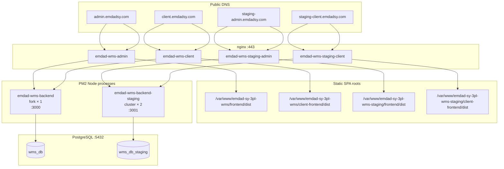

# PRODUCTION-CUTOVER-AUDIT

**Generated:** 2026-06-12  
**Server:** `srv1657355` (single VPS hosting staging + production)  
**Auditor scope:** Repository, live PM2, nginx, PostgreSQL, filesystem, environment files  
**Type:** Audit only — no code changes, no deployment

---

## Executive Summary

| Question | Answer |
|----------|--------|
| **Environment separation** | **PASS** — domains, ports, databases, build roots, logs, and backup paths are correctly isolated |
| **Duplicate deployment risk** | **LOW** — one production API (port 3000) and one staging API cluster (port 3001); no shared database |
| **Cron duplication risk** | **CONTROLLED** — staging cluster uses `CronLeaderService` (instance 0 when Redis off); production runs single fork |
| **Production code freshness** | **FAIL** — production tree is **61 commits behind** staging (`29a578ae` vs `50410b18`) |
| **Production configuration** | **FAIL** — production `backend/.env` is incomplete (missing JWT, backup, Redis, cron-leader settings) |
| **GO / NO-GO for cutover today** | **NO-GO** |
| **Production Ready** | **NO** |

### Verdict

**Infrastructure is correctly designed for a staging/production split on one host**, but **production must not receive live traffic from the current staging branch until a formal cutover runbook is executed**. The live production deployment is running **outdated binaries** (backend built 2026-05-23) and lacks the configuration required by the current codebase (JWT secrets, backup engine, billing crons, health probes).

**Recommendation:** Execute a controlled cutover (build → migrate → env → PM2 reload → nginx verify) using the pre-cutover checklist in Section 10. Do not simply repoint nginx without updating production builds and `.env`.

---

## 1. Infrastructure Map

### 1.1 Directory layout

| Layer | Production | Staging |
|-------|------------|---------|
| Repo root | `/var/www/emdad-sy-3pl-wms` | `/var/www/emdad-sy-3pl-wms-staging` |
| Git branch | `main` @ `29a578ae` | `staging` @ `50410b18` |
| Admin SPA build | `…/frontend/dist` | `…/frontend/dist` |
| Client SPA build | `…/client-frontend/dist` | `…/client-frontend/dist` |
| Backend build | `…/backend/dist/src/main.js` | `…/backend/dist/src/main.js` |
| PM2 config | `ecosystem.config.js` (fork) | `ecosystem.staging.config.js` (cluster) |
| API port | `3000` | `3001` |
| Backend logs | `/var/log/emdad-wms/` | `/var/log/emdad-wms-staging/` |
| nginx access logs | `emdad-admin`, `emdad-client` | `emdad-staging-admin`, `emdad-staging-client` |
| Backup storage | **Not configured** in prod `.env` | `/var/lib/emdad-wms/backups/staging` |
| SSL certs | `/etc/nginx/ssl/emdad-wms/` | `/etc/nginx/ssl/emdad-wms-staging/` |

---

## 2. PM2 Inventory

**Captured:** `pm2 list` on audit host (2026-06-12)

| PM2 name | Mode | Instances | Port | CWD | Script | Status | Uptime |
|----------|------|-----------|------|-----|--------|--------|--------|
| `emdad-wms-backend` | fork | 1 | 3000 | `/var/www/emdad-sy-3pl-wms/backend` | `dist/src/main.js` | online | ~20 days |
| `emdad-wms-backend-staging` | cluster | 2 | 3001 | `/var/www/emdad-sy-3pl-wms-staging/backend` | `dist/src/main.js` | online | ~12 hours |

### 2.1 Duplicate API server analysis

| Check | Result |
|-------|--------|
| Multiple processes on port 3000 | **No** — single PID `669694` |
| Multiple processes on port 3001 | **No** — PM2 cluster load-balances 2 workers on one port |
| Production + staging share port | **No** |
| Orphan `node` WMS processes outside PM2 | **Not detected** on 3000/3001 |

### 2.2 Duplicate scheduler analysis

| Environment | API processes | Cron execution model | Duplicate risk |
|-------------|---------------|----------------------|----------------|
| **Production** | 1 (fork) | All `@Cron` jobs in single process | **None** — only 1 legacy cron exists in prod code (SLA escalation) |
| **Staging** | 2 (cluster) | `CronLeaderService.runExclusive()` per job | **Controlled** — Redis disabled → **PM2 instance 0 only** runs crons |

**Staging note:** `REDIS_ENABLED=false` with `CRON_LEADER_ENABLED=true` uses the documented fallback (`NODE_APP_INSTANCE === '0'`). This is safe for cron deduplication but **not** safe for Socket.IO horizontal scale. Enable Redis before scaling staging cluster further.

### 2.3 PM2 gaps for production cutover

| Gap | Severity |
|-----|----------|
| Production still on **fork × 1**; staging validated on **cluster × 2** | Medium — decide target topology before cutover |
| Production `ecosystem.config.js` has no `env_file: '.env'` (staging cluster config does) | Medium |
| Production PM2 `NODE_ENV=production` set; staging cluster shows `NODE_ENV` unset in PM2 metadata | Low |

---

## 3. Nginx Inventory

### 3.1 Enabled site configs

| Symlink | server_name | SPA root | API upstream |
|---------|-------------|----------|--------------|
| `emdad-wms-admin` | `admin.emdadsy.com` | `/var/www/emdad-sy-3pl-wms/frontend/dist` | `emdad_wms_backend` → `127.0.0.1:3000` |
| `emdad-wms-client` | `client.emdadsy.com` | `/var/www/emdad-sy-3pl-wms/client-frontend/dist` | `emdad_wms_backend` → `127.0.0.1:3000` |
| `emdad-wms-staging-admin` | `staging-admin.emdadsy.com` | `/var/www/emdad-sy-3pl-wms-staging/frontend/dist` | `emdad_wms_backend_staging` → `127.0.0.1:3001` |
| `emdad-wms-staging-client` | `staging-client.emdadsy.com` | `/var/www/emdad-sy-3pl-wms-staging/client-frontend/dist` | `emdad_wms_backend_staging` → `127.0.0.1:3001` |

### 3.2 Routing verification

| Domain | HTTP → HTTPS | `/api/` proxy | `/realtime/` WS | `/socket.io/` WS | SPA fallback | Staging `noindex` |
|--------|:------------:|:-------------:|:---------------:|:----------------:|:------------:|:-----------------:|
| admin.emdadsy.com | ✅ | ✅ prod :3000 | ✅ | ✅ | ✅ | — |
| client.emdadsy.com | ✅ | ✅ prod :3000 | ✅ | ✅ | ✅ | — |
| staging-admin.emdadsy.com | ✅ | ✅ staging :3001 | ✅ | ✅ | ✅ | ✅ |
| staging-client.emdadsy.com | ✅ | ✅ staging :3001 | ✅ | ✅ | ✅ | ✅ |

**Snippet files:** `/etc/nginx/snippets/emdad-wms-backend-locations.conf` (prod) and `emdad-wms-staging-backend-locations.conf` (staging).  
**Upstream defs:** `/etc/nginx/conf.d/00-emdad-wms-upstream.conf`, `01-emdad-wms-staging-upstream.conf`.

### 3.3 Live probe results

| URL | HTTP | Notes |
|-----|------|-------|
| `https://admin.emdadsy.com/` | 200 | Serves production admin SPA |
| `https://staging-admin.emdadsy.com/` | 200 | Serves staging admin SPA |
| `https://staging-admin.emdadsy.com/api/ops/health/live` | 200 `{"status":"ok"}` | Staging code current |
| `https://admin.emdadsy.com/api/ops/health/live` | 404 | **Production binary predates ops health module** |

**Routing assessment:** **PASS** — no cross-wiring detected.

---

## 4. Environment Inventory

### 4.1 Database

| Setting | Production | Staging | Shared? |
|---------|------------|---------|:-------:|
| `DATABASE_URL` DB name | `wms_db` | `wms_db_staging` | **No** |
| PostgreSQL host | `localhost:5432` | `localhost:5432` | Same server, different DB |
| PM2 `PORT` | `3000` | `3001` | **No** |

**PostgreSQL databases confirmed:** `wms_db`, `wms_db_staging`.

### 4.2 Key environment variables (redacted)

| Variable | Production `.env` | Staging `.env` | Assessment |
|----------|-------------------|----------------|------------|
| `DATABASE_URL` | `…/wms_db` | `…/wms_db_staging` | ✅ Separated |
| `PORT` | `3000` | `3001` | ✅ Separated |
| `CORS_ORIGINS` | admin + client prod domains | staging domains only | ✅ Correct |
| `JWT_SECRET` | **Missing** | Present | ❌ Prod incomplete |
| `JWT_REFRESH_SECRET` | **Missing** | Present | ❌ Prod incomplete |
| `CLIENT_JWT_SECRET` | **Missing** | Not set (falls back) | ⚠️ Set distinct secret at cutover |
| `BACKUP_ENABLED` | **Missing** | `true` | ❌ Prod backup engine not configured |
| `BACKUP_STORAGE_PATH` | **Missing** | `/var/lib/emdad-wms/backups/staging` | ❌ No prod backup path |
| `BACKUP_ENV_ID` | **Missing** | `staging` | ❌ |
| `CRON_LEADER_ENABLED` | **Missing** | `true` | ⚠️ Required if prod moves to cluster |
| `REDIS_ENABLED` | **Missing** | `false` | ⚠️ Enable for prod cluster + WS scale |
| `NODE_ENV` | Not in file (PM2 sets `production`) | `production` | OK |

### 4.3 Frontend environment

| App | Production | Staging |
|-----|------------|---------|
| Admin `frontend/.env` | `VITE_MOCK_COMPANY_ID` only | `VITE_MOCK_COMPANY_ID` only |
| Client `client-frontend/.env` | Default / minimal | Comment stub |

Both builds use **same-origin `/api`** via nginx (no hardcoded API URL) — ✅ correct for production.

### 4.4 CORS / domain separation

| Environment | Allowed origins |
|-------------|-----------------|
| Production API | `https://admin.emdadsy.com`, `https://client.emdadsy.com` (+ localhost dev entries) |
| Staging API | `https://staging-admin.emdadsy.com`, `https://staging-client.emdadsy.com` |

**Assessment:** ✅ Staging cannot call production API from browser CORS perspective and vice versa.

---

## 5. Cron Inventory

All scheduled work is **in-process** (`@nestjs/schedule`). **No system crontab entries** reference WMS (root crontab empty; `/etc/cron.d/` has only certbot/docker/sysstat).

### 5.1 Jobs in staging codebase (current)

| Service | Schedule | Leader key | Purpose |
|---------|----------|------------|---------|
| `BackupSchedulerService` | `* * * * *` | `backup-scheduler` | Run due backup schedules |
| `BackupDriveRetryService` | `*/2 * * * *` | `backup-drive-retry` | Retry failed Drive uploads |
| `BackupHealthAlertService` | `*/15 * * * *` | `backup-health-alert` | Backup health monitor |
| `BillingCycleProcessorService` | `*/15 * * * *` | `billing-cycle-processor` | Billing cycle transitions |
| `SlaEscalationService` | `*/5 * * * *` | `sla-escalation` | SLA breach escalation |
| `BillingInvoiceOverdueProcessorService` | `0 6 * * *` | `billing-invoice-overdue-processor` | Overdue invoices |
| `BillingExpiryReminderService` | `0 8 * * *` | `billing-expiry-reminder` | Expiry reminders / notifications |
| `BillingUsageProcessorService` | `0 4 * * *` | `billing-usage-processor` | Daily usage metering |
| `BackupRetentionCleanupService` | `15 5 * * *` | `backup-retention-cleanup` | Local retention cleanup |
| `BackupDriveRetentionCleanupService` | `30 5 * * *` | `backup-drive-retention-cleanup` | Drive retention cleanup |
| `CycleCountSchedulerService` | `0 3 * * *` | `cycle-count-scheduler` | Auto cycle-count sessions |

### 5.2 Jobs in production codebase (deployed, outdated)

| Service | Schedule | Notes |
|---------|----------|-------|
| `SlaEscalationService` | `*/5 * * * *` | **Only cron in production tree** — no `CronLeaderService` wrapper |

### 5.3 Notifications & reporting

| Area | Scheduled job? | Mechanism |
|------|:--------------:|-----------|
| Notifications | **No** | Created synchronously by domain events + billing processors |
| Reporting | **No** | On-demand via `/api/reports/*` (60s cache) |

### 5.4 Duplicate cron assessment

| Scenario | Instances running job | Verdict |
|----------|----------------------|---------|
| Staging backup scheduler (2 workers) | 1 (instance 0) | ✅ Deduped |
| Production SLA cron (1 worker) | 1 | ✅ |
| Staging + Production simultaneously | Separate processes, separate DBs | ✅ No cross-env duplication |
| System crontab + Nest cron | No system WMS crontab | ✅ |

---

## 6. Build Output Analysis

### 6.1 Active deployment artifacts

| Artifact | Production modified | Staging modified | Delta |
|----------|--------------------:|-----------------:|-------|
| `backend/dist/src/main.js` | 2026-05-23 | 2026-06-12 | **~20 days stale** |
| `frontend/dist/index.html` | 2026-05-31 | 2026-06-12 | ~12 days stale |
| `client-frontend/dist/index.html` | 2026-05-31 | 2026-06-12 | ~12 days stale |

### 6.2 Orphan / duplicate build directories

| Path | Size | Risk | Action at cutover |
|------|------|------|-------------------|
| `/var/www/emdad-sy-3pl-wms/emdad-sy-3pl-wms/` | **~967 MB** | **High clutter** — nested duplicate repo with own `frontend/dist`, `backend/dist` | Remove after cutover validation |
| `node_modules/**/dist` | Large | None — not served | Ignore |
| `packages/wms-task-execution/dist` | Small | Dev artifact | Rebuilt during `npm run build` |

### 6.3 nginx-served paths vs PM2 CWD

| Check | Result |
|-------|--------|
| nginx prod admin root matches prod frontend dist | ✅ |
| nginx prod client root matches prod client-frontend dist | ✅ |
| PM2 prod CWD matches prod backend | ✅ |
| Staging equivalents | ✅ |
| nginx pointing at staging dist for prod domain | **Not detected** | ✅ |

---

## 7. Duplicate Deployment Analysis

| Risk | Finding | Severity |
|------|---------|----------|
| Two APIs on same DB | **Not found** — `wms_db` vs `wms_db_staging` | — |
| Two PM2 apps serving production domains | **Not found** — only `emdad-wms-backend` on :3000 | — |
| Staging API reachable via prod domains | **Not found** — nginx upstreams isolated | — |
| Duplicate frontend build actively served | **Not found** | — |
| Nested orphan repo could confuse operators | **Found** — `/var/www/emdad-sy-3pl-wms/emdad-sy-3pl-wms/` | Medium |
| Same backup directory for both envs | **Not found** — only `…/backups/staging` exists | — |
| Production backup jobs writing to staging path | **N/A** — prod backup not configured | High gap |

---

## 8. Risks

### 8.1 Blockers (must fix before cutover)

| ID | Risk | Evidence |
|----|------|----------|
| **B-01** | Production code **61 commits behind** staging | `git rev-list --count 29a578ae..staging` = 61 |
| **B-02** | Production backend binary from **2026-05-23** | Missing billing crons, backup engine, reports module, RBAC fixes, perf fixes, health probes |
| **B-03** | Production `backend/.env` **incomplete** | No `JWT_SECRET`, no `BACKUP_*`, no `CRON_LEADER_ENABLED` |
| **B-04** | No production backup storage path | `/var/lib/emdad-wms/backups/` contains only `staging/` |

### 8.2 High risks (address in cutover plan)

| ID | Risk | Mitigation |
|----|------|------------|
| **H-01** | Cutover without DB migration | Run Prisma migrations against `wms_db` in maintenance window |
| **H-02** | JWT secret rotation invalidates sessions | Plan forced re-login; set `JWT_SECRET`, `JWT_REFRESH_SECRET`, `CLIENT_JWT_SECRET` before restart |
| **H-03** | Single production PM2 instance — no API redundancy | Accept for launch or adopt staging cluster config + Redis |
| **H-04** | In-process crons compete with API traffic | Monitor after cutover; consider worker tier later |

### 8.3 Medium risks

| ID | Risk | Notes |
|----|------|-------|
| **M-01** | Staging cluster without Redis | Cron dedup works via instance 0; WS cluster would not |
| **M-02** | Production access logs ~202 MB | `/var/log/emdad-wms/backend-out.log` — rotate before cutover |
| **M-03** | Prod `.env` contains dev `localhost` CORS entries | Clean before cutover |
| **M-04** | Google Drive UI hidden on staging (`BACKUP_GDRIVE_UI_ENABLED=false`) | Confirm prod flag intent |

### 8.4 Low risks

| ID | Risk |
|----|------|
| **L-01** | SSL cert shared naming (`emdad-wms` vs `emdad-wms-staging`) — works, but document renewal |
| **L-02** | `MOCK_COMPANY_ID` in frontend `.env` — dev convenience; harmless in prod build |

---

## 9. Code Delta Summary (staging not yet in production)

Representative commits on `staging` absent from production `main`:

- RELEASE-CERTIFICATION-R2 (93/100 GO)
- Performance certification + ledger SQL optimizations
- RBAC nav consistency, unit test stabilization
- Reporting framework (14 reports)
- Billing lifecycle processors + client portal billing UX
- Backup subsystem (scheduler, retention, health)
- PM2 cluster + `CronLeaderService`
- Notifications center
- Google Drive UI feature flag
- User manual + architecture docs

**Functional gap:** Production users are **not** running the certified release candidate.

---

## 10. Pre-Cutover Checklist (required for GO)

Execute in order during a maintenance window:

1. **Backup production database** (`wms_db`) to offline storage.
2. **Merge or deploy** `staging` → production directory (`/var/www/emdad-sy-3pl-wms`) — tag release commit.
3. **Create production `.env`** from `.env.example` with:
   - `DATABASE_URL` → `wms_db`
   - `PORT=3000`
   - `CORS_ORIGINS=https://admin.emdadsy.com,https://client.emdadsy.com`
   - Strong `JWT_SECRET`, `JWT_REFRESH_SECRET`, `CLIENT_JWT_SECRET`
   - `BACKUP_ENABLED=true`, `BACKUP_STORAGE_PATH=/var/lib/emdad-wms/backups/production`, `BACKUP_ENV_ID=production`
   - `CRON_LEADER_ENABLED=true`; `REDIS_ENABLED=true` if using cluster mode
4. **Run migrations** on `wms_db`.
5. **Build** backend + both frontends in production tree.
6. **Choose PM2 topology:** fork ×1 (simple) or cluster ×2 (matches staging) — update `ecosystem.config.js`.
7. **`pm2 reload`** production app; verify `GET /api/ops/health/live` returns 200.
8. **Smoke test** all four domains (admin/client prod).
9. **Verify crons** — check logs for single leader execution per job key.
10. **Remove** orphan `/var/www/emdad-sy-3pl-wms/emdad-sy-3pl-wms/` after validation.
11. **Keep staging** running unchanged until production soak period ends.

---

## 11. GO / NO-GO Recommendation

| Criterion | Status |
|-----------|--------|
| Environment isolation | ✅ GO |
| nginx routing | ✅ GO |
| Database separation | ✅ GO |
| PM2 inventory clean | ✅ GO |
| Cron deduplication design | ✅ GO (on staging codebase) |
| Production build current | ❌ NO-GO |
| Production env complete | ❌ NO-GO |
| Certified code live on prod | ❌ NO-GO |

### Final recommendation: **NO-GO** (cutover not ready today)

**Production Ready: NO**

Infrastructure separation passes audit. **Deploying staging to production is feasible** after completing Section 10 — but the **current production deployment must not be considered production-ready** for the certified WMS release.

---

## 12. Evidence Index

| Source | Location |
|--------|----------|
| PM2 list / env | Live server `pm2 list`, `pm2 show` |
| nginx vhosts | `/etc/nginx/sites-available/emdad-wms-*` |
| nginx upstreams | `/etc/nginx/conf.d/00-emdad-wms-upstream.conf`, `01-emdad-wms-staging-upstream.conf` |
| PM2 configs | `ecosystem.config.js`, `ecosystem.staging.config.js`, `pm2-backend-cluster.js` |
| Cluster verification | `docs/ops/pm2-cluster-verification.json` |
| Cron leader | `backend/src/common/cron/cron-leader.service.ts` |
| Architecture reference | `SYSTEM-ARCHITECTURE.md` |
| Release certification | `RELEASE-CERTIFICATION-R2.md` |

---

*Audit performed without code changes or deployment actions. Commit contains this report only.*
