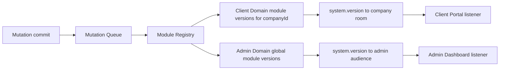

# Realtime Reference Architecture

| Field | Value |
|-------|-------|
| **Architecture Version** | `2.2` |
| **Last Updated** | `2026-08-04` |
| **Supersedes** | `2.1` (adds permanent **Client tenant-scoped** vs **Admin global** synchronization domains; does not redesign the single-event / module-based model) and earlier `2.0` / `1.0` |
| **Approved By** | Locked by product/engineering direction — module-based state synchronization + dual sync domains |
| **Implementation status** | **Documentation only.** Code cutover follows [`REALTIME_IMPLEMENTATION_PLAN.md`](./REALTIME_IMPLEMENTATION_PLAN.md). |

**Rule:** Feature PRs do **not** invent alternate realtime pipelines. Only a deliberate architectural revision may bump **Architecture Version**.

---

## 1. Purpose & documentation chain

| Document | Role |
|----------|------|
| [`REALTIME_PRODUCT_MATRIX.md`](./REALTIME_PRODUCT_MATRIX.md) | *What* must feel live (UX outcomes) |
| [`REALTIME_TECHNICAL_AUDIT.md`](./REALTIME_TECHNICAL_AUDIT.md) | Historical gaps under Architecture **1.0** |
| [`REALTIME_VERIFICATION_REPORT.md`](./REALTIME_VERIFICATION_REPORT.md) | Waves 0–4 proof under **1.0** (historical) |
| **This document (v2.2)** | *How* realtime must work forever |
| [`REALTIME_IMPLEMENTATION_PLAN.md`](./REALTIME_IMPLEMENTATION_PLAN.md) | Migration 1.0 → 2.x (roadmap phases unchanged; domains are permanent architectural rules) |

**Thinking shift (locked):**

| From (1.0) | To (2.x) |
|------------|----------|
| Event-driven per feature | **State synchronization by module** |
| One mixed audience | **Two independent sync domains: Client (tenant) vs Admin (global)** |

---

## 2. Verdict

**Keep:** Socket.IO `/realtime`, Redis adapter, auth rooms, one connection per app.  
**Delete:** Per-feature / per-API / per-entity socket events, duplicated listeners, payload-driven cache patches.  
**Only supported pipeline:**

```text
Successful mutation
  → publish internal mutation
  → Mutation Queue (order + merge)
  → Module Registry (data map + sync domain resolution)
  → bump Module Versions in the correct domain(s)
  → Debounce emit traffic
  → ONE websocket event { version, modules } to the correct audience
  → ONE frontend listener per app
  → Request coalescing
  → Refresh active module only (REST / React Query)
     + always-active: session, notifications
```

---

## 3. Why 1.0 failed

Per-feature emitters + listeners + patches → duplication, inconsistent coverage, easy to forget, catalog drift. Closing Matrix gaps grew ~52 wire events. Synchronization was modeled as “broadcast this business event,” not “this module’s cache is stale.”

---

## 4. Two independent frontend applications

The product consists of **two completely independent React applications**. Treat their realtime responsibilities **independently**.

| Application | Role | Sync domain |
|-------------|------|-------------|
| **Admin Dashboard** | Warehouse / platform operations across all tenants | **Admin Domain** — global |
| **Client Portal** | One company’s self-service portal | **Client Domain** — tenant-scoped |

They must **never** share or mix module-version stores or notification audiences.

---

## 5. Two independent synchronization domains (permanent rules)

### 5.1 Client Domain (tenant-scoped) — mandatory isolation

The Client Portal is **tenant-scoped**.

A client must **NEVER** receive realtime updates that belong to another company.

**Module Versions for the Client Portal MUST be tenant-scoped.**

Example:

```text
Company A
  inventory = 41
  orders    = 18
  products  = 7

Company B
  inventory = 83
  orders    = 55
  products  = 12
```

When Company A performs a mutation:

- Only **Company A’s** module versions are updated (in the Client Domain).  
- Only **Company A** sockets receive the websocket notification for that client emit.  
- **Company B receives nothing.**

This behavior is **mandatory**.

Delivery aligns with existing company rooms (e.g. `tenant:company:{id}`) — transport detail, not a second event type.

### 5.2 Admin Domain (global)

The Admin Dashboard is **system-wide**. Operators must immediately observe operational change **anywhere** in the warehouse platform.

The Admin Dashboard does **NOT** use tenant-scoped module versions.

It maintains **global** module versions, for example:

```text
Admin Domain (global)
  inventory = …
  oms       = …
  inbound   = …
  outbound  = …
  billing   = …
  dashboard = …
  …
```

Whenever **any** company performs a mutation affecting those modules:

- The corresponding **Admin** module version is incremented.  
- **All** connected Admin Dashboards receive the version notification.

This is **intentional**. Admins are expected to see changes from every company.

Delivery aligns with internal/admin rooms (e.g. `room:internal:master-data`) — audience routing for the **same** single event name.

### 5.3 Domains must never be mixed

| Rule | |
|------|--|
| Separate version stores | Client Domain counters ≠ Admin Domain counters |
| Separate audiences | Client emit → that company only; Admin emit → all admins |
| Separate FE apps | Each app has its own single listener and own active-module rules |
| No cross-leak | Client never observes another tenant’s sync; Admin never uses per-tenant counters as its truth |



---

## 6. Single websocket synchronization event (unchanged)

This enhancement **does not** change the single-event architecture.

- Exactly **one** synchronization event name: `system.version`  
- **No** additional websocket events  
- Socket never carries business data  
- Payload remains conceptually:

```json
{
  "version": 2481,
  "modules": ["inventory", "inbound"]
}
```

| Field | Meaning |
|-------|---------|
| `version` | **Queue sequence** for that emit (may be tracked per domain; still not module freshness truth) |
| `modules` | Modules whose **module version** increased **in that domain’s store** for this batch |

**Difference is audience + which Module Version store was bumped — not a second event type.**

Transport architecture remains identical (Socket.IO, rooms, Redis adapter).

REST = sole business data. React Query = sole UI data after refetch.

---

## 7. Module Versions (source of truth) vs queue sequence

### 7.1 Problem with one global “truth” version (within a domain)

Even inside one domain, login / notification / billing / inventory must not force unrelated module refetches. Module membership gates refresh; wire `version` is sequence only.

### 7.2 Locked model (per domain)

| Counter | Role |
|---------|------|
| **Module Versions** | **Source of truth** for freshness — **scoped by sync domain** (and by `companyId` in Client Domain) |
| **Queue sequence (`version` on the wire)** | Emit/batch id for ordering/dedupe/logs — **not** module freshness |

**Client Domain store (per company):**

```text
company:{companyId}:inventory = 41
company:{companyId}:inbound   = …
…
```

**Admin Domain store (global):**

```text
admin:inventory = 183
admin:inbound   = 91
admin:oms       = 55
…
```

When a batch affects modules in both domains, increment **each domain’s** counters independently, then emit **to each audience** (same event name `system.version`; possibly two room emissions — not two event types).

Frontend must not refetch from sequence alone — only from `modules` membership (+ always-active rules) within its domain.

Optional later: `moduleVersions` map on payload; **minimum wire remains `{ version, modules }`**.

---

## 8. Mutation processing (extended)

When a backend mutation succeeds:

1. Database transaction commits.  
2. Mutation enters the queue.  
3. Queue merge occurs (same domain + same audience key — see §9).  
4. **Module Registry** resolves **affected modules**.  
5. **Module Registry** also resolves **synchronization domain(s)** (Client / Admin / both).  
6. Appropriate Module Versions are incremented **independently** per domain.  
7. The single websocket event is emitted to the **correct audience(s)**.

### 8.1 Example — Inbound Receive, Company = ACME

**Registry result (data):**

| Domain | Audience | Modules |
|--------|----------|---------|
| **Client** | Company ACME only | `inventory`, `inbound` |
| **Admin** | All admins | `inventory`, `inbound`, `dashboard` |

Then:

- Bump ACME’s Client Domain `inventory` + `inbound`.  
- Bump Admin Domain global `inventory` + `inbound` + `dashboard`.  
- Emit `system.version` to ACME company room with client modules.  
- Emit `system.version` to admin audience with admin modules.  

Company B’s Client Domain is untouched; Company B receives nothing.

### 8.2 Registry resolves domain (data, not service if-logic)

Registry rows declare not only modules but **which sync domain(s)** apply (e.g. client modules list + admin modules list). Domain services still only `publish(mutationId, companyId, …)`.

---

## 9. Mutation Queue

Every successful shared-state mutation **publishes** an internal mutation (not a socket event).

### 9.1 Guarantees

| Guarantee | Meaning |
|-----------|---------|
| Ordering | Process in publish order |
| No races | Version bumps + emit preparation are sequential in the consumer |
| Sequential processing | One consumer pipeline |
| Merge (see §9.2) | Collapse burst updates |

### 9.2 Merge rule (locked)

**Before emitting, merge consecutive queued mutations that affect overlapping/same modules into a single module-notification batch** — merge keys must also respect **domain + audience** (e.g. do not merge Company A client batch with Company B; admin global batches merge among themselves).

Union modules per domain, increment each distinct module **once per domain per batch**, then debounce (§10) and emit to correct audiences.

---

## 10. Emit Debounce (traffic)

**Queue = ordering + merge.**  
**Debounce = traffic shaping on the wire.**

Default window **~100ms**. Debounce separately per **domain + audience** pending set. Not a substitute for queue merge.

---

## 11. Module Registry — data, not logic

### 11.1 Forbidden

```ts
// FORBIDDEN
if (event === "InboundCreated") {
  return ["inventory", "inbound", "dashboard"];
}
```

### 11.2 Required shape (data)

| Mutation | Client modules (tenant) | Admin modules (global) |
|----------|-------------------------|-------------------------|
| `InboundCreated` | `inventory`, `inbound`, `dashboard` | `inventory`, `inbound`, `dashboard` |
| `OmsApprove` | `oms`, `outbound`, `dashboard` | `oms`, `outbound`, `dashboard` |
| `UserLogin` | — or portal-relevant | `users`, `presence` |
| `NotificationCreated` | `notifications` | `notifications` (if admin bell) |
| `SessionRevoked` | `session` | `session` |

Adding a feature = **registry data only** (+ `publish`).

---

## 12. Application modules

Unchanged module ids (`inbound`, `outbound`, `oms`, `inventory`, `tasks`, `products`, `returns`, … `session`, `notifications`, …).  
Each id may exist in **Client Domain** and/or **Admin Domain** version stores independently.

---

## 13. Active module (precise definition)

Per app (Admin and Client independently):

**Active Module** = module derived from the **first route segment** (via that app’s route→module **data** map).

Examples: `/dashboard` → `dashboard`, `/inventory` → `inventory`, `/inbound` → `inbound`, `/oms` → `oms`, `/users` → `users`.

Sync gate for route modules: refetch only if `activeModule ∈ event.modules`.

---

## 14. Always-active modules

Per app, not bound to route:

| Module | Why |
|--------|-----|
| `session` | Force-logout / revoke without a second event type |
| `notifications` | Bell updates on any route |

Always-active still obeys **domain isolation** (client notifications for that company only; admin notifications for admin audience).

---

## 15. Module cache lifecycle (strict)

| Event | Rule |
|-------|------|
| **Leaving module** | **MUST dispose** that module’s cache |
| **Entering module** | **MUST** fresh fetch |
| **Alive caches** | Only active module + always-active |

Inactive route modules **never** background-refetch. Each app manages its own caches.

---

## 16. Refetch rules & Request Coalescing

Refetch only active queries for the targeted module; no whole-app refetch; pagination = already-loaded only.

**Request coalescing:** if already refetching module M, ignore further bumps (optional single trailing pass) — never N parallel refetches.

---

## 17. Frontend: one listener per application

- Admin Dashboard: exactly one sync listener (Admin Domain events).  
- Client Portal: exactly one sync listener (Client Domain events for its company).  

No page/feature listeners. No second sync event name.

---

## 18. Comparison

| Dimension | 1.0 | 2.2 |
|-----------|-----|-----|
| Sync events | ~52 | **1** (`system.version`) |
| FE listeners | dozens | **1 per app** |
| Freshness truth | soft `at` / patches | **Module Versions** (per domain) |
| Tenant isolation | room discipline ad-hoc | **Client Domain mandatory** |
| Admin visibility | mixed | **Admin Domain global — intentional** |
| Wire `version` | n/a | **Queue sequence only** |
| Burst control | ad-hoc | merge + debounce + coalesce |

---

## 19. Expected benefits

Same as 2.1, plus: hard tenant isolation for clients; intentional global admin awareness; clear permanent dual-domain rules without multiplying websocket event types.

---

## 20. Architecture Definition of Done (complete only if all true)

- exactly one websocket synchronization event exists  
- exactly one frontend synchronization listener exists **per application**  
- zero feature-specific listeners remain  
- zero feature-specific sync emitters remain  
- every shared-state mutation goes through the Mutation Queue  
- every mutation resolves through the Module Registry (data) including **sync domain(s)**  
- Module Versions are freshness truth **per domain** (Client tenant-scoped; Admin global); wire `version` is queue sequence only  
- Client Domain never notifies another company  
- Admin Domain receives operational module bumps from **all** tenants  
- Client and Admin version stores / audiences are **never mixed**  
- queue merge rule implemented (respecting domain + audience)  
- emit debounce implemented  
- FE request coalescing implemented  
- only the active module (first-route-segment map) refetches for route modules  
- inactive route modules never refetch  
- leave disposes module cache; enter fresh-fetches  
- session always synchronized  
- notifications always synchronized  
- no manual browser refresh required for active-module correctness  

---

## 21. Non-goals

- Replacing Socket.IO  
- Business payloads on the socket  
- Per-page socket subscriptions  
- A second sync event type for “admin vs client”  
- Permanent dual architecture with legacy feature events (dual-emit remains migration-only)  

---

## 22. Compliance for future PRs

**Non-compliant:** new feature socket events; mixing tenant versions into Admin truth; sending Client Domain emits to other companies; hard-coded module/domain lists in domain services; bypassing queue/registry.

**Compliant:** `publish(mutationId, companyId, …)`; registry data for modules **and** domains; room audience matching domain rules.
