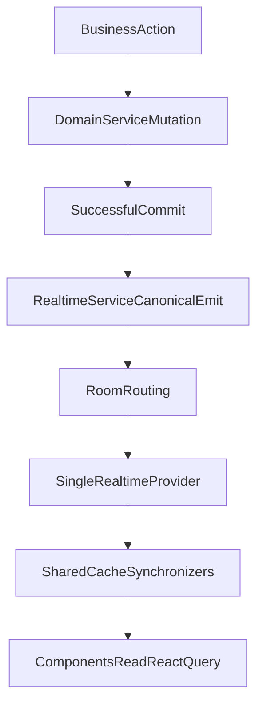

# Realtime Reference Architecture

| Field | Value |
|-------|-------|
| **Architecture Version** | `1.0` |
| **Last Updated** | `2026-08-04` |
| **Supersedes** | None (initial Reference Architecture) |
| **Approved By** | Pending stakeholder approval |

**Rule:** Feature PRs do **not** change this header. Only a deliberate architectural revision may bump **Architecture Version**, set **Last Updated**, set **Supersedes** to the prior version, and record **Approved By**.

---

## 1. Purpose & documentation chain

| Document | Role |
|----------|------|
| [`REALTIME_PRODUCT_MATRIX.md`](./REALTIME_PRODUCT_MATRIX.md) | *What* must be live (product expectation) |
| [`REALTIME_TECHNICAL_AUDIT.md`](./REALTIME_TECHNICAL_AUDIT.md) | *What is broken* (investigation / Gap IDs) |
| [`REALTIME_IMPLEMENTATION_PLAN.md`](./REALTIME_IMPLEMENTATION_PLAN.md) | Gap backlog ordered by priority |
| **This document** | *How* realtime must work forever |
| [`REALTIME_VERIFICATION_REPORT.md`](./REALTIME_VERIFICATION_REPORT.md) | Post-implementation proof (staging Waves 0–4) |

This Architecture = **how the system must work forever**.

This document becomes the **canonical engineering reference** for every future realtime feature.

Any future module, workflow, page, or business event must conform to this architecture.

If a future implementation conflicts with this document, **this document wins**.

The architecture should evolve only through deliberate architectural revisions—not through feature implementations.

Feature PRs may close Gap IDs from the Technical Audit. They may **not** invent alternate pipelines, rooms, listener patterns, or polling-primary paths that diverge from this blueprint.

---

## 2. Verdict: extend the current spine

**Decision:** Extend the existing realtime stack. Do **not** rewrite the transport or introduce a second realtime system.

**Keep:**

- NestJS Socket.IO gateway on namespace `/realtime`
- [`RealtimeService`](backend/src/modules/realtime/realtime.service.ts) as the emit API
- Redis Socket.IO adapter for PM2 cross-worker fan-out
- Rooms: company, user, internal master-data
- One app-wide `RealtimeProvider` per frontend (admin + client)
- React Query + shared `*-cache.ts` / synchronizer helpers

**Why inconsistency exists today (not a transport failure):**

- Some domain mutations never emit
- Some listeners never update the full Consistency Group (e.g. client dashboard query island)
- Session events emit but are not consumed into auth state
- Polling substitutes for push on OMS dashboard and backups

The cure is **mandatory pipeline discipline + complete registry coverage**, not a new bus.

---

## 3. Canonical pipeline (one lifecycle)

Every shared-state business mutation must follow **exactly** this lifecycle:

```text
Business Action
  → Domain Service Mutation
  → Successful Commit
  → RealtimeService Canonical Emit
  → Room Routing
  → Single RealtimeProvider Listener
  → Cache Synchronizer (full Consistency Group)
  → UI Refresh (React Query subscribers)
```



**Rules:**

- Exactly **one** canonical emit path per shared-state change (via `RealtimeService`).
- Secondary effects (e.g. debounced admin dashboard patches) are **scheduled inside / by `RealtimeService`**, never from controllers or ad-hoc page code.
- No page-specific websocket logic. No duplicate listener stacks. No UI written directly from socket payloads.

---

## 4. Layer ownership

| Layer | Owns | Must not |
|-------|------|----------|
| Controllers | HTTP request/response only | Emit sockets; open clients |
| Domain services | Business mutation + call `RealtimeService` **after successful commit** | Touch React Query; open sockets; emit raw `io` |
| `RealtimeService` | Wire event names, room routing, payload shaping, dashboard schedule hooks | Encode business authorization rules |
| Gateway / socket auth | Connect, authenticate, join rooms | Domain emits |
| `RealtimeProvider` (admin + client) | Single connection; register **all** listeners | Per-page sockets; business mutations |
| Cache Synchronizers (`*-cache.ts` / shared helpers) | All React Query patches/invalidations for an event’s Consistency Group | Component-level socket handlers |
| UI components | Read queries; mutate via HTTP APIs | Direct websocket UI writes; local socket clients |

---

## 5. One room strategy

Matrix scopes map to the **three existing rooms**. This is the required path.

| Matrix scope | Room | Notes |
|--------------|------|-------|
| `SameCompany`, `ClientPortal`, `AllWarehouseOperators`, `SamePage` (via company broadcast) | `tenant:company:{uuid}` | Primary ops + portal fan-out |
| `SameUser`, `SameBrowser` | `room:user:{userId}` | Notifications, session revoke |
| `AdminDashboard`, `SystemWide` (admin) | `room:internal:master-data` | Admin-only dashboards, warehouses/locations/users, audit tail |
| Tenant-scoped admin widgets that also need company data | company room **and/or** master-data as registry specifies | Do not invent a fourth room without Architecture revision |

**Standing answer for `SameWarehouse`:** company-room broadcast is sufficient while all operators for a tenant join that company socket. **Warehouse-scoped rooms are Future Evolution**—deliberately postponed, not forgotten (see §13).

---

## 6. Canonical Realtime Registry

The **Canonical Realtime Registry** is the **sole** reference for how a business event is wired. No event ships without a registry row.

### 6.1 Required columns

| Business Event | Producer | Rooms | Consumers | Cache Synchronizer | Consistency Group |
|----------------|----------|-------|-----------|--------------------|-------------------|

| Column | Meaning |
|--------|---------|
| **Business Event** | Matrix name + wire name (e.g. `InboundConfirmed` / `order.inbound.updated`) |
| **Producer** | Owning domain service method path; emit **after** successful commit |
| **Rooms** | From §5 |
| **Consumers** | Admin surfaces + Client portal surfaces that must move |
| **Cache Synchronizer** | Named helper (one per event family) invoked only from `RealtimeProvider` |
| **Consistency Group** | Matrix §3 fan-out set / sibling query-key groups that must update together |

Code of record for wire names lives beside [`backend/src/modules/realtime/realtime.events.ts`](backend/src/modules/realtime/realtime.events.ts). This Architecture defines the **schema and completeness contract**; implementation fills rows until every Matrix §2 event is covered.

### 6.2 Completeness contract

- Matrix Business Event → Registry row → `RealtimeService` emit → Provider listener → Cache Synchronizer → Consistency Group updated.
- Missing families from Technical Audit (company, billing, COD, OMS returns, documents, forms, backups, guaranteed reservations, return/cycle-count stock) are **required registry extensions**, still emitted only via `RealtimeService`.
- A synchronizer that updates “the open page only” and leaves list/dashboard/portal siblings stale **violates** this Architecture.

### 6.3 Consistency Groups (reference)

Do not reprint Matrix §3. Registry Consistency Group values must align with:

- §3.1 Company / Billing Restrict  
- §3.2 Inbound Confirm → Complete / Cancel  
- §3.3 Outbound Release → Shipped / Delivered  
- §3.4 OMS → Delivered / Cancel / COD  
- §3.5 Stock Changed (all posting paths)  
- §3.6 Task Assign / Start / Complete  
- §3.7 Notification Created / Read  
- §3.8 Return → Inventory Posted  
- §3.9 Invoice / Plan Suspend  
- §3.10 Adjustment Approve  

---

## 7. Frontend listener & cache strategy

### 7.1 One listener strategy

- **One** `RealtimeProvider` per application (admin frontend, client portal).
- All `socket.on(...)` registrations live **only** there.
- Each wire event calls **exactly one** Cache Synchronizer named in the Canonical Realtime Registry.

### 7.2 One cache synchronization strategy

- Synchronizer updates **the entire Consistency Group** (lists, detail, dashboards, badges, related portals keys).
- Prefer `setQueryData` / targeted patch when payload is sufficient.
- Use `invalidateQueries` when payload cannot safely patch—still must cover the full Consistency Group key set (this is how “client dashboard islands” are forbidden by design).
- **Never** set React component local state from the socket for shared domain data.
- **UI reads React Query (or auth context for session).** Websocket updates cache (or auth). UI follows.

### 7.3 Session / auth

- `auth.session.changed` must clear session / force login on admin **and** client.
- Dead CustomEvent-only paths without an auth consumer are non-conformant.
- Session handling belongs in the provider/sync layer, not in random pages.

---

## 8. New-module integration contract

Before merging any new module that changes shared state:

1. Add / update Product Matrix expectation (if product-visible).
2. Add **Canonical Realtime Registry** row (all six columns).
3. Domain service emits via `RealtimeService` **after successful commit**.
4. Wire event exists in `realtime.events.ts` (admin + client constants stay in sync where consumed).
5. `RealtimeProvider` registers listener → named Cache Synchronizer.
6. Synchronizer covers full Consistency Group (admin + client as Consumers require).
7. No `refetchInterval` for Matrix-live shared state (see §11 / Out of Scope exceptions only).
8. Complete **Realtime Certification Checklist (§16)** — every item YES.
9. PR checklist / cert tests updated if enforcement tooling exists.
10. Remember ADR-RT-010: database is source of truth; push only synchronizes cache.

---

## 9. Enforcement (prevent “forgot realtime”)

Architecture mandates for implementation (not built in this document task):

| Guardrail | Intent |
|-----------|--------|
| Sole emit API | Forbid `io.emit` / gateway emits outside `RealtimeService` |
| Registry completeness | Matrix event ↔ emit ↔ synchronizer ↔ Consistency Group |
| Review checklist | Block PRs that mutate shared state without registry row **and** completed §16 Certification Checklist |
| Certification tests | Assert no Matrix-live `refetchInterval` without documented exception; reuse §16 criteria |
| Architecture wins | Conflicting feature code is a defect against Version `1.0` |
| Database SoT | Socket payloads never become authoritative (ADR-RT-010) |

---

## 10. Realtime Design Rules

Permanent engineering rules. Violations are Architecture defects.

1. **Never emit from controllers.**
2. **Emit only after successful commit.**
3. **`RealtimeService` is the sole emitter.**
4. **Never update UI directly from a websocket payload.**
5. **Websocket updates cache (or auth). UI reads cache (or auth).**
6. **Never create feature-specific or page-specific socket connections.**
7. **Never duplicate listeners** outside the single `RealtimeProvider`.
8. **Prefer shared Cache Synchronizers**; one synchronizer per registry event family.
9. **Every business event must have** Producer, Rooms, Consumers, Cache Synchronizer, Consistency Group in the Canonical Realtime Registry.
10. **One business action must update every screen in its Consistency Group** (Matrix §3).
11. **No page may depend on manual refresh for shared state** classified live in the Product Matrix.
12. **Polling is not the product model.** Polling may exist only where realtime is impossible and the exception is documented (Out of Scope or Failure Handling degraded mode).
13. **Presence product indicators remain Out of Scope** unless the Product Matrix is revised.
14. **This Reference Architecture wins** over conflicting feature implementations.
15. **Architecture evolves only via versioned revision** of this document—not via opportunistic feature PRs.
16. **Database remains the source of truth.** Realtime is only a synchronization mechanism. Never treat a websocket payload as durable authoritative domain state; sync converges cache to the database (ADR-RT-010).
17. **Pass the Realtime Certification Checklist (§16)** before merging any shared-state feature as realtime-complete.

---

## 11. Failure Handling

Architectural definition only. No implementation is required by this document alone. Implementations must respect these guarantees.

### 11.1 Scenario contract

| Failure scenario | Expected architectural behavior |
|------------------|--------------------------------|
| **DB committed but emit failed** | HTTP/business success stands (DB is source of truth). Emit path must log/alert. Backend owns **best-effort retry** of emit where safe; if retry exhausted, clients recover via reconnect/stale recovery (§11.2)—not by lying that the mutation failed. |
| **Client disconnected** | Server does **not** guarantee infinite event buffering. Client must recover on reconnect. |
| **User / socket reconnects** | Single `RealtimeProvider` rejoins rooms. Then run **stale cache recovery** for active Consistency Groups (invalidate or refetch active queries). |
| **Event arrives twice** | Cache Synchronizers must be **idempotent**: re-applying the same event must not corrupt state (upsert by id; safe merge). |
| **Event arrives out of order** | **Stale-drop**: if cache already holds newer data (`at`, `updatedAt`, version, or monotonic field), ignore or forward-merge only—never regress. |
| **Cache already contains newer data** | Synchronizer no-ops or merges forward-only. |
| **Browser tab sleeps then wakes** | Provider reconnects; then stale recovery for subscribed queries—no manual refresh required for Matrix-live data. |
| **Network interruption mid-session** | Same as reconnect; **no** feature-specific reconnect hacks. |

### 11.2 Cross-cutting guarantees

| Topic | Definition |
|-------|------------|
| **Retry responsibilities** | Backend: best-effort re-emit after commit failure of emit. Client: on reconnect, refetch/invalidate Consistency Groups—not invent a second push channel. |
| **Idempotency** | Synchronizers treat duplicate deliveries as safe. |
| **Reconnect behavior** | Owned solely by `RealtimeProvider`. |
| **Stale cache recovery** | On resume/reconnect: invalidate or refetch the Consistency Groups for active views so UI converges to DB. |
| **Eventual consistency** | UI may lag briefly after commit; it **must** converge without manual refresh. Durable truth is always the database. |

### 11.3 Polling as degraded mode

Polling is allowed only when:

1. Realtime delivery is temporarily impossible, **and**
2. The exception is documented (Matrix Out of Scope, or an explicit degraded-mode note tied to Failure Handling), **and**
3. It is not used as the steady-state design for Matrix-live features (closes gaps such as G-OMS-02, G-BAK-01 as primary paths).

---

## 12. Implementation Order

Foundation first. Features second. Cosmetics last. Gap IDs refer to [`REALTIME_TECHNICAL_AUDIT.md`](./REALTIME_TECHNICAL_AUDIT.md); narratives are not repeated here. Aligns with [`REALTIME_IMPLEMENTATION_PLAN.md`](./REALTIME_IMPLEMENTATION_PLAN.md) reorganized for architectural leverage.

### Wave 0 — Foundation

| Work | Gap IDs / intent |
|------|------------------|
| Establish Canonical Realtime Registry schema in code alongside events | Completeness contract |
| Enforce emit-after-commit + sole `RealtimeService` emitter | Design Rules |
| Standardize Cache Synchronizer pattern (full Consistency Group) | Prevents dashboard islands |
| Session consumption on admin + client | G-AUTH-01, G-AUTH-02 |
| Apply Failure Handling constraints to emit/reconnect/sync design | §11 |

### Wave 1 — Integrity

| Work | Gap IDs |
|------|---------|
| Stock emit on return post + cycle count post | G-STOCK-02, G-STOCK-03, G-RET-01 |
| Guaranteed reservation / available qty emits | G-STOCK-01 |
| Company lifecycle + billing restriction push | G-CO-01, G-BILL-01 |
| Client dashboard Consistency Group wiring | G-CL-DASH-01 |

### Wave 2 — Ops surface

| Work | Gap IDs |
|------|---------|
| Inbound/outbound Consistency siblings | G-IN-01, G-OUT-01, G-DASH-01 |
| OMS pipeline + remove OMS dashboard poll | G-OMS-01, G-OMS-02 |
| Task ↔ order stage coupling | G-TASK-01 |
| Cycle count entity completeness (with Wave 1 stock) | G-CC-01 |

### Wave 3 — Commercial

| Work | Gap IDs |
|------|---------|
| COD domain emit + consumers | G-COD-01 |
| Client returns listen + OMS returns emit | G-RET-02, G-RET-03 |
| Documents / contracts | G-DOC-01, G-DOC-02 |
| Invoices / plans UI | G-BILL-02 |

### Wave 4 — Platform & cleanup

| Work | Gap IDs |
|------|---------|
| Backup job push (replace polling-primary) | G-BAK-01 |
| Forms inbox | G-FORM-01 |
| Client `notification.deleted` / `product.deleted` | G-NOTIF-01, G-PROD-01 |
| transfer.created handler cleanup | G-TR-01 |

### Explicitly not in required path

- Future Evolution items (§13)
- Product Matrix Out of Scope (Presence product requirement, reports mid-session, theme/language, etc.)

---

## 13. Future Evolution (intentionally postponed)

These are **not** missing requirements of Version `1.0`. Developers must not treat them as forgotten work.

| Postponed item | Why postponed | Required now? |
|----------------|---------------|---------------|
| Warehouse-scoped rooms | Company room satisfies `AllWarehouseOperators` / SamePage via tenant broadcast | No — deliberate |
| Domain Event Bus / CQRS for realtime | Direct post-commit `RealtimeService` is the chosen spine | No — deliberate |
| Cross-service / multi-repo messaging | Single deployable backend today | No — deliberate |
| Distributed realtime beyond Redis Socket.IO adapter | Adapter already covers PM2 workers | No — deliberate |
| Offline-first / offline synchronization | Matrix model is online push + reconnect recovery | No — deliberate |

Adoption requires a **deliberate architectural revision** of this document (new Architecture Version), not a feature PR.

---

## 14. Definition of Done

The realtime remediation program is complete only when **all** of the following are true:

1. Every Product Matrix feature classified as realtime updates automatically without manual refresh.
2. Every Gap Report item in the Technical Audit is **Closed**.
3. No stale shared UI remains for Matrix-live surfaces.
4. No duplicated realtime implementations (no second socket stack, no page-local listeners).
5. Every business event follows the canonical pipeline.
6. Every business event has a Canonical Realtime Registry row (all six columns).
7. Failure Handling expectations are respected by the implementation approach.
8. Future Evolution items remain out of required scope unless this Architecture is revised.
9. Polling exists only where documented as impossible / Out of Scope—not as the steady-state for Matrix-live features.
10. Every merged realtime feature has a completed **Realtime Certification Checklist (§16)** with all items YES.

**After implementation:** produce `REALTIME_VERIFICATION_REPORT.md` (documentation chain step 5). That report is out of scope for this Architecture authoring task and may reuse §16 as evidence.

> **Status (2026-08-04):** Staging remediation complete — see [`REALTIME_VERIFICATION_REPORT.md`](./REALTIME_VERIFICATION_REPORT.md).

---

## 15. Architectural Decisions

Long-term “why was it done this way?” record.

| ID | Decision | Choice | Rationale | Alternatives rejected | Status |
|----|----------|--------|-----------|----------------------|--------|
| ADR-RT-001 | Transport / bus | Socket.IO on `/realtime` + Redis adapter | Already deployed; matches pipeline; sufficient for single-backend multi-worker fan-out | Domain Event Bus / CQRS dedicated to realtime; SSE-only; raw WS per feature | Accepted |
| ADR-RT-002 | Tenancy / rooms | Company + user + internal master-data rooms | Maps Matrix scopes; company room covers ops + client portal co-tenancy | Warehouse rooms now; per-page rooms; broadcast-all-sockets | Accepted (warehouse rooms → Future Evolution) |
| ADR-RT-003 | UI data path | UI reads React Query (and auth for session) only | One cache sync strategy; prevents divergent local state; enables Consistency Groups | UI-from-socket; Zustand/Redux parallel live stores; per-component socket state | Accepted |
| ADR-RT-004 | Emit ownership | `RealtimeService` sole emitter; domain post-commit | Prevents controller leaks and inconsistent room routing | Emit from controllers; direct `io.emit` in services; multiple emit helpers outside Realtime module | Accepted |
| ADR-RT-005 | Listener ownership | Single `RealtimeProvider` per app | No copy-paste listeners; one reconnect owner | Page-specific sockets; hooks that open connections; duplicate providers | Accepted |
| ADR-RT-006 | Consistency model | One Cache Synchronizer updates full Consistency Group | Eliminates “one page live, sibling stale” class of bugs | Patch open page only; rely on user refresh; partial invalidation | Accepted |
| ADR-RT-007 | Extend vs rewrite | Extend current spine | Gaps are coverage/discipline, not wrong transport; rewrite cost unjustified | Full Event Bus rewrite; replace Socket.IO; dual stacks during migration | Accepted |
| ADR-RT-008 | Polling policy | Push-primary; poll only if realtime impossible and documented | Product Matrix No Polling; polling as primary caused OMS/backup gaps | Polling as default refresh; hybrid undocumented intervals | Accepted |
| ADR-RT-009 | Authority | This Reference Architecture wins; versioned revisions only | Stops architecture drift via feature PRs | Informal “just this once” exceptions without doc revision | Accepted |
| ADR-RT-010 | Source of truth | **Database remains the source of truth. Realtime is only a synchronization mechanism.** Socket payloads must never become authoritative domain state | Prevents long-term drift where UIs trust push payloads over durable data; Failure Handling (§11) already treats DB commit as success and sync as best-effort converge | Treating socket payload as SoT; writing domain truth only in cache; skipping refetch/recovery because “we already got the event” | Accepted |

---

## 16. Realtime Certification Checklist

Mandatory merge gate for every feature that changes shared state and claims realtime completeness.

**Before a feature is considered realtime-complete, every item below must be YES.**

| # | Criterion | YES? |
|---|-----------|------|
| 1 | Product Matrix row exists | |
| 2 | Canonical Registry entry exists (all six columns) | |
| 3 | Backend emits after successful commit | |
| 4 | Correct room routing implemented | |
| 5 | Admin `RealtimeProvider` listens | |
| 6 | Client `RealtimeProvider` listens (if applicable) | |
| 7 | Cache Synchronizer updates **all** Consistency Group queries | |
| 8 | No component-level socket code | |
| 9 | No polling introduced (unless documented exception) | |
| 10 | Works across browser tabs | |
| 11 | Works across two different users | |
| 12 | Works after reconnect | |
| 13 | Idempotency verified | |
| 14 | Manual refresh never required | |
| 15 | Gap ID closed (when closing an audit gap) | |

PRs that change shared state without a completed Certification Checklist are **non-conformant** to this Architecture.

The future `REALTIME_VERIFICATION_REPORT.md` may reuse this checklist as evidence that implementation matches the architecture.

---

## Document control

| Field | Value |
|-------|-------|
| Filename | `REALTIME_ARCHITECTURE.md` |
| Location | Staging repository root |
| Architecture Version | `1.0` (ADR-RT-010 + §16 Certification Checklist included in this revision of the authored blueprint; header remains `1.0` until formal stakeholder approval bumps version) |
| Inputs | Product Matrix, Technical Audit, Implementation Plan |
| Code changes | None (blueprint only) |
| Next doc after implementation | `REALTIME_VERIFICATION_REPORT.md` |
