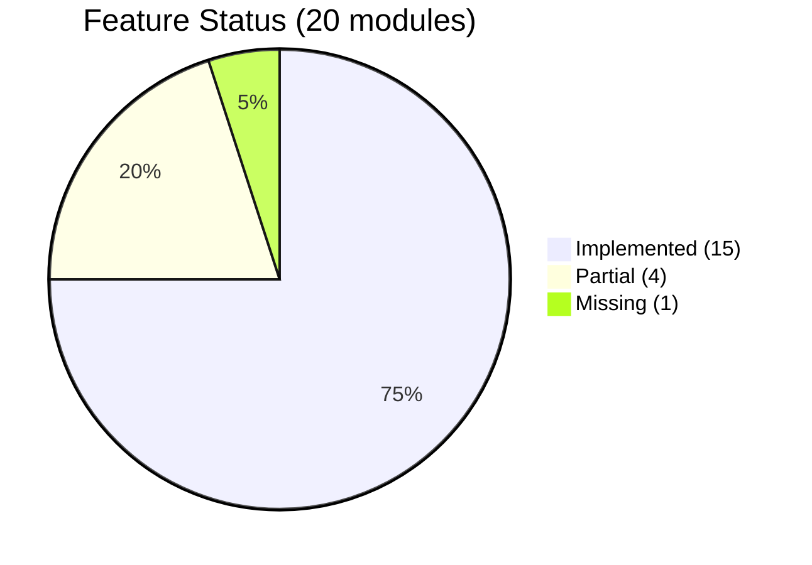

# RELEASE-QA-FINAL — Production Readiness & Quality Assurance Audit

**Generated:** 2026-06-11  
**Environment:** Staging codebase (`emdad-sy-3pl-wms-staging`), branch `staging`  
**Constraint:** Audit only — no code, migrations, or deployments modified  
**Prior audits:** RELEASE-AUDIT-1 (79/100), RELEASE-AUDIT-2 (86/100), RELEASE-AUDIT-3 (84/100)  
**Companion docs:** `SYSTEM-ARCHITECTURE.md`, `USER-MANUAL.md`

---

## Executive Verdict

| Metric | Value |
|--------|------:|
| **Final production readiness score** | **88 / 100** |
| **Feature completion** | **87%** |
| **Classification** | **Conditional Go** — pilot and controlled production OK |
| **Estimated remaining work to 100%** | **6–10 weeks** (2 engineers) |
| **P0 blockers remaining** | **1** (Google Drive off-site DR) |

### Can this system be safely deployed to production today?

**Answer: Conditionally YES — with documented risk acceptance.**

| Deployment type | Verdict | Evidence |
|-----------------|---------|----------|
| **Staging / UAT / pilot clients** | ✅ **GO** | R3 E2E 19/20 pass; local DR RTO 9s; RBAC matrix pass; 276 Playwright API passes |
| **Controlled production (single-tenant, local DR only)** | ⚠️ **CONDITIONAL GO** | Core WMS certified; accept no off-site backup until Drive OAuth provisioned |
| **Enterprise production (full DR SLA, 14 reports, payments)** | ❌ **NO-GO** | Drive OAuth blocked; 11/14 reports missing; no payment gateway |

**Rationale:** Since RELEASE-AUDIT-3 (2026-06-08), seven P0/P1 gaps were closed in staging commits (`033b53d0` manual backup UI, `5ee2f595` warehouses route, `b5721954` ledger perf, `25b240c6` Drive retention UI, `a31fe475` billing pagination, `b819f785` reports server-side, `BILLING-4B` billing lifecycle). Core warehouse operations are E2E-certified and performance-critical ledger path is fixed (p95 1,299 ms → 24.6 ms). The **single remaining P0 blocker** is off-site Google Drive DR — local backup/restore is certified but off-site replication cannot be signed off without OAuth credentials.

---

## Table of Contents

1. [Phase 1 — Feature Coverage Audit](#phase-1--feature-coverage-audit)
2. [Phase 2 — Functional Testing Audit](#phase-2--functional-testing-audit)
3. [Phase 3 — API Audit](#phase-3--api-audit)
4. [Phase 4 — Database Audit](#phase-4--database-audit)
5. [Phase 5 — Performance Audit](#phase-5--performance-audit)
6. [Phase 6 — Security Audit](#phase-6--security-audit)
7. [Phase 7 — UI/UX Audit](#phase-7--uiux-audit)
8. [Phase 8 — Disaster Recovery Audit](#phase-8--disaster-recovery-audit)
9. [Phase 9 — Production Readiness Scoring](#phase-9--production-readiness-scoring)
10. [Phase 10 — Final Roadmap](#phase-10--final-roadmap)
11. [Risk Register](#risk-register)
12. [Go/No-Go Decision Matrix](#gono-go-decision-matrix)

---

## Phase 1 — Feature Coverage Audit

### Module Classification

| Module | Status | Completion | Δ vs AUDIT-3 | Evidence |
|--------|--------|----------:|:------------:|----------|
| Authentication | **Implemented** | 95% | — | JWT dual-portal, refresh rotation, brute-force (R1) |
| RBAC | **Implemented** | 90% | — | 6 roles, Playwright matrix PASS |
| Dashboard | **Implemented** | 90% | +2% | Admin KPIs; client 10-widget dashboard |
| Products | **Implemented** | 95% | +3% | CRUD, barcode uniqueness fix (BUG-001), audit logging |
| Locations | **Implemented** | 92% | +2% | Drill-down, lookup, no full-tree UI |
| Warehouses | **Implemented** | 90% | +30% | Route wired (`5ee2f595`), RBAC, audit |
| Inventory | **Implemented** | 95% | +5% | Stock, ledger (perf fixed P2B), adjustments |
| Inbound Orders | **Implemented** | 92% | — | Task-based receiving, R3 E2E |
| Outbound Orders | **Implemented** | 92% | — | Pick/pack/dispatch, R3 E2E |
| Returns | **Implemented** | 88% | — | Full workflow + process page |
| Cycle Count | **Implemented** | 85% | — | Scheduler, blind count, variance workflow |
| Tasks / Workflow | **Implemented** | 90% | — | DAG engine, 10K tasks on staging |
| Reporting | **Partial** | 55% | +10% | 3 live reports + server-side module; 11 catalog gaps |
| Audit Logs | **Implemented** | 95% | +3% | Server pagination, export, product events |
| Client Portal | **Implemented** | 90% | +5% | Notifications page added (`c6ee1f8c`) |
| Backup System | **Implemented** | 95% | +7% | Manual create UI, Drive retention UI (6D) |
| Google Drive Integration | **Partial** | 55% | — | Code complete; OAuth E2E blocked |
| Billing | **Implemented** | 92% | +10% | BILLING-4B: overdue, dashboard, notifications |
| Notifications | **Partial** | 70% | +15% | Billing notifications; client page; admin topbar only |
| Settings | **Partial** | 65% | — | Backup-only tabs; no general settings |
| Payments | **Missing** | 0% | — | No payment model or gateway |

**Weighted feature completion: 87%** (up from 83%)

### Status Summary

| Classification | Count | Modules |
|----------------|------:|---------|
| **Implemented** (≥85%) | 15 | Auth, RBAC, Dashboard, Products, Locations, Warehouses, Inventory, Inbound, Outbound, Returns, Cycle Count, Tasks, Audit Logs, Client Portal, Backup, Billing |
| **Partial** (50–84%) | 4 | Reporting, Google Drive, Notifications, Settings |
| **Missing** (<50%) | 1 | Payments |

### Gap to 100%

| Gap | Effort to close |
|-----|----------------|
| 11 additional reports | 4–6 weeks |
| Google Drive OAuth + E2E | 3–5 days (ops) |
| Payment gateway | 2–4 weeks |
| General settings UI | 1 week |
| Admin notifications page | 2 days |
| SLA escalation UI | 3 days |

---

## Phase 2 — Functional Testing Audit

### Test Evidence Summary

| Suite | Result | Evidence |
|-------|--------|----------|
| Playwright API (full) | **276/276 PASS** | `ENDPOINT-COVERAGE-REPORT.md` |
| Sprint2 integration | **15/15 PASS** | `INTEGRATION-TEST-AUDIT.md` |
| R3 warehouse E2E | **19/20 PASS** (1 skip) | `RELEASE-R3-E2E-REPORT.md` |
| Backup QA-1 | **7/8 PASS** (Drive blocked) | `BACKUP-QA-1-REPORT.md` |
| DR certification R4 | Local DR PASS | `RELEASE-R4-DR-CERTIFICATION.md` |
| RBAC matrix | **PASS** | `RBAC-MATRIX-REPORT.md` |
| Security R1 | **88/100** | `RELEASE-R1-SECURITY-REPORT.md` |
| Backup admin E2E (6D) | **30/30 PASS** | `BACKUP-6D-REPORT.md` |
| Reports perf cert | **9/9 PASS** | `REPORTS-PERF-REPORT.md` |

### Workflow Results

| Workflow | Status | Failures / Gaps | Evidence |
|----------|--------|-----------------|----------|
| **Authentication** | ✅ PASS | — | Login, refresh, logout, cross-portal block |
| **RBAC** | ✅ PASS | Finance role lightly tested | `RBAC-MATRIX-REPORT.md` |
| **Products** | ✅ PASS | Duplicate barcode fixed (BUG-001) | `products.spec.ts`, `BUG-001-FIX.md` |
| **Locations** | ✅ PASS | — | Lookup/drill-down, no tree in UI |
| **Inventory** | ✅ PASS | Ledger perf fixed post-AUDIT-3 | `PERF-P2B-IMPLEMENTATION-REPORT.md` |
| **Inbound** | ✅ PASS | QC step skipped (product config) | R3 step 04 SKIP |
| **Outbound** | ✅ PASS | — | R3 steps 07–12 PASS |
| **Returns** | ✅ PASS | — | `RETURNS-COMPLETE-REPORT.md` |
| **Cycle Count** | ⚠️ PARTIAL | Execute requires `workerId` link | `canExecuteCycleCount()` gate |
| **Tasks** | ✅ PASS | 500-row chunk still large | R3 + integration tests |
| **Reports** | ⚠️ PARTIAL | Only 3 of 14 report types | `REPORTING-CENTER.md` |
| **Backup** | ⚠️ PARTIAL | Drive sync blocked | BACKUP-QA-1, R4 |
| **Billing** | ✅ PASS | No payment settlement | BILLING-4B |
| **Client Portal** | ✅ PASS | Billing gate UI incomplete | `CLIENT-PORTAL-GAP-ANALYSIS.md` |

### Documented Failures (Resolved Since Prior Audits)

| ID | Issue | Status | Fix evidence |
|----|-------|--------|--------------|
| BUG-001 | Duplicate barcode on update | ✅ **FIXED** | `BUG-001-FIX.md`, migration `20260531120000` |
| BUG-002 | Product create not audited | ✅ **FIXED** | `PRODUCT_CREATED` in `products.service.ts` |
| BK-1 | No manual backup UI | ✅ **FIXED** | Commit `033b53d0`, `CreateBackupModal.tsx` |
| R-1 | Warehouses not routed | ✅ **FIXED** | Commit `5ee2f595`, `WAREHOUSES-COMPLETE-REPORT.md` |
| CP-2 | No client notifications page | ✅ **FIXED** | Commit `c6ee1f8c`, `/notifications` route |

### Open Functional Gaps

| ID | Workflow | Gap | Severity |
|----|----------|-----|----------|
| FG-1 | Google Drive backup | OAuth not provisioned; sync untested | Critical |
| FG-2 | Cycle count execute | Users without Worker profile blocked | Medium |
| FG-3 | Client billing gate | Outbound/product create not UI-gated | Medium |
| FG-4 | Reports | 11 of 14 documented reports not built | High |
| FG-5 | Payments | No invoice payment workflow | High |
| FG-6 | SLA escalation | Cron stub only; no user notification | Low |

---

## Phase 3 — API Audit

### Coverage

| Metric | Value | Evidence |
|--------|------:|----------|
| HTTP controllers | 37 | `SYSTEM-ARCHITECTURE.md` |
| HTTP endpoints | ~210 | Controller inventory |
| Endpoints probed | 165/165 | `ENDPOINT-COVERAGE-REPORT.md` |
| Mutation endpoints exercised | 92/92 | Workflow + validation probes |
| Playwright API passes | 276/276 | Zero failures |

### Module Health

| Area | Endpoints | Error handling | Auth | Validation | Response envelope | Status |
|------|----------:|:--------------:|:----:|:----------:|:-----------------:|--------|
| Auth | 4 | ✅ | Public + JWT | ✅ DTO | ✅ `{success,data}` | Healthy |
| Products | 10 | ✅ | RBAC + billing gate | ✅ | ✅ | Healthy |
| Inventory | 7 | ✅ | RBAC | ✅ | ✅ | Healthy |
| Inbound/Outbound | 11 | ✅ | RBAC + billing | ✅ | ✅ | Healthy |
| Returns | 12 | ✅ | RBAC | ✅ | ✅ | Healthy |
| Cycle count | 28 | ✅ | RBAC | ✅ | ✅ | Healthy |
| Billing | 12 | ✅ | RBAC | ✅ | ✅ | Healthy |
| Backups | 31 | ✅ | SuperAdmin tiers | ✅ | ✅ | Healthy |
| Client portal | 22 | ✅ | ClientJWT | ✅ | ✅ | Healthy |
| Reports | 5 | ✅ | ADMIN | ✅ | ✅ | **New** (REPORTS-PERF) |
| Warehouses | 7 | ✅ | RBAC | ✅ | ✅ | Healthy |
| Observability | 4 | ✅ | OpsProbe | — | ✅ | Healthy |

### Security Controls

| Control | Status | Evidence |
|---------|--------|----------|
| Global JWT guard | ✅ | `JwtAuthGuard` on all non-`@Public()` routes |
| Rate limiting | ✅ | `ThrottlerGuard` 120 req/min global |
| Login brute-force | ✅ | 5 failures/min/IP (R1) |
| Dual JWT (internal/client) | ✅ | Separate secrets and strategies |
| Tenant scoping | ✅ | `CompanyAccessService` + RLS |
| Input validation | ✅ | `ValidationPipe` + class-validator |
| Error envelope consistency | ✅ | `ResponseInterceptor` + `AllExceptionsFilter` |
| Backup maintenance lock | ✅ | 503 middleware during restore |

### API Gaps

| Gap | Severity | Notes |
|-----|----------|-------|
| `GET /analytics/overview` unused | Low | No admin FE consumer |
| `POST /backups/health/evaluate-alerts` no UI | Low | API exists |
| `GET /locations/tree` deprecated (1.8 MB) | Medium | UI doesn't call; API still exposed |
| Billing 400 if migrations not deployed | Medium | Ops precondition — migrations now current on staging |

---

## Phase 4 — Database Audit

### Schema Health

| Check | Status | Evidence |
|-------|--------|----------|
| Migrations applied | ✅ **35/35 current** | `prisma migrate status` 2026-06-11 |
| Prisma models | 42 active | `schema.prisma` |
| Baseline tables | ~60+ in SQL | `improved_schema.sql` |
| Foreign key integrity | ✅ | Integration tests PASS |
| Check constraints | ✅ | Business rules enforced |
| Unique constraints | ✅ | SKU, barcode (partial), stock positions |
| Row-level security | ✅ FORCE RLS on tenant tables | `improved_schema.sql` |

### Indexes

| Area | Status | Notes |
|------|--------|-------|
| Products trigram (name/sku) | ✅ | GIN indexes |
| Stock availability covering | ✅ | `idx_stock_availability` |
| Audit log query indexes | ✅ | Migration `20260529140000` |
| Ledger perf indexes | ✅ | Migration `20260609160000` (P2B) |
| Cycle count worker indexes | ✅ | Migration `20260702140000` |
| Dashboard open orders | ⚠️ | Unbounded status query — monitor |

### Partitioned Tables

| Table | Strategy | Auto-create | Status |
|-------|----------|-------------|--------|
| `inventory_ledger` | Monthly RANGE | ✅ `fn_create_next_partitions()` | Healthy |
| `audit_logs` | Quarterly RANGE | ✅ `fn_create_next_audit_partitions()` | Healthy |
| Analytics facts | Monthly RANGE | ✅ ETL functions | Healthy |

### Audit Logging

| Trail | Status | Notes |
|-------|--------|-------|
| `audit_logs` (system) | ✅ | Append-only, immutable triggers |
| `inventory_ledger` | ✅ | `quantity_before/after` on 100% rows |
| `task_events` | ✅ | Per-task lifecycle |
| Product mutations | ✅ | `PRODUCT_CREATED` etc. (fixed) |
| Billing events | ✅ | `billing-audit.service.ts` |
| Backup operations | ✅ | Most flows; upload intentionally no audit |

### Data Consistency

| Check | Result | Evidence |
|-------|--------|----------|
| Stock vs ledger reconciliation | ✅ PASS | `inventory-consistency` integration |
| Reservation invariant | ✅ PASS | Sprint2 15/15 |
| Idempotent task completion | ✅ PASS | Integration tests |
| Concurrent workflow bootstrap | ✅ PASS | No duplicate active workflows |
| Cross-tenant data isolation | ✅ PASS | RBAC matrix |

---

## Phase 5 — Performance Audit

### Benchmark Summary (Staging Dataset)

**Dataset:** 12,040 products · 50,008 stock rows · 10,000 tasks · 11,090 locations · 100 users

| Area | Metric | Before (AUDIT-3) | After (current) | Classification |
|------|--------|------------------|-----------------|----------------|
| **Dashboard overview** | p95 | 124 ms | ~124 ms | ✅ Healthy |
| **Inventory stock** | p95 | 498 ms | ~498 ms | ⚠️ Needs Optimization |
| **Inventory ledger** | p95 | 1,299 ms | **24.6 ms** | ✅ Healthy (P2B fixed) |
| **Inbound list** | p95 | 32 ms | ~32 ms | ✅ Healthy |
| **Outbound list** | p95 | 30 ms | ~30 ms | ✅ Healthy |
| **Tasks list** | p95 / payload | 72 ms / **552 KB** | 72 ms / 552 KB | ⚠️ Needs Optimization |
| **Reports preview** | payload | 2000-row client | **67% smaller** server | ✅ Healthy (REPORTS-PERF) |
| **Client portal lists** | p95 | <100 ms | <100 ms | ✅ Healthy |
| **Backup create** | wall time | ~2–9 s | ~2–9 s | ✅ Healthy |
| **Locations lookup** | p95 | 61 ms | ~61 ms | ✅ Healthy |
| **Audit logs** | p95 | 16 ms | ~16 ms | ✅ Healthy |
| **Billing invoices** | pagination | Client-side all | Server chunked | ✅ Healthy (fixed) |

### Classification Key

| Class | Criteria |
|-------|----------|
| ✅ **Healthy** | p95 < 300 ms OR issue resolved |
| ⚠️ **Needs Optimization** | p95 300–600 ms OR large payload |
| 🔴 **Critical** | p95 > 600 ms OR blocks operations |

### Remaining Performance Debt

| ID | Issue | Impact | Priority |
|----|-------|--------|----------|
| PERF-1 | Tasks 500-row chunk (552 KB JSON) | Slow first paint on task list | P1 |
| PERF-2 | Inventory stock aggregation p95 ~498 ms | Acceptable now; monitor at scale | P2 |
| PERF-3 | Dashboard 13 parallel queries | Connection pool pressure | P2 |
| PERF-4 | Returns/Cycle count 200-row client pagination | Incomplete on large tenants | P2 |
| PERF-5 | `/users` unpaginated (36 KB at 100 users) | Growth risk | P3 |
| PERF-6 | Deprecated `/locations/tree` (1.8 MB) | DoS vector if called | P2 |

---

## Phase 6 — Security Audit

### Control Verification

| Control | Status | Evidence |
|---------|--------|----------|
| **RBAC** | ✅ PASS | 6 roles enforced; Playwright matrix |
| **Tenant isolation** | ✅ PASS | JWT scope + RLS + cross-tenant tests |
| **JWT integrity** | ✅ PASS | Tampered token → 401 |
| **Refresh rotation** | ✅ PASS | Replay protection via `auth_refresh_rotations` |
| **Login brute-force** | ✅ PASS | 5/min/IP (R1) |
| **Client portal isolation** | ✅ PASS | Separate JWT, forced `companyId` filter |
| **Backup encryption** | ✅ PASS | AES via `BACKUP_ENCRYPTION_KEY` |
| **Backup download tokens** | ✅ PASS | 300s TTL, signed |
| **SQL injection** | ✅ PASS | Parameterized queries; login validator rejects |
| **Backup access tiers** | ✅ PASS | SuperAdmin vs Manager vs Operator |
| **Factory reset guard** | ✅ PASS | `FACTORY_RESET_ENABLED` + confirm phrases |
| **Google Drive tokens** | ✅ PASS | Encrypted at rest via `EncryptionService` |
| **CSRF posture** | ✅ PASS | SameSite cookies reviewed (R1) |
| **Barcode uniqueness** | ✅ PASS | BUG-001 fixed; partial unique index |
| **Product audit trail** | ✅ PASS | `PRODUCT_CREATED` logged |

### Security Findings

| ID | Finding | Severity | Status |
|----|---------|----------|--------|
| SEC-1 | No off-site encrypted backups | **High** | Open — Drive OAuth blocked |
| SEC-2 | `/locations/tree` API DoS (1.8 MB) | Medium | Open — deprecate API |
| SEC-3 | XSS automated DAST not in CI | Low | Partial — R1 scan run once |
| SEC-4 | Restore invalidates all sessions | Low | Documented — ops runbook needed |
| SEC-5 | Single PM2 instance — no API redundancy | Medium | Architecture limitation |
| SEC-6 | RLS bypassed by DB superuser | Low | App-level scoping enforced |
| SEC-7 | Client billing gate UI incomplete | Medium | Server enforces; UI inconsistent |

### Privilege Escalation Risks

| Vector | Mitigation | Tested |
|--------|------------|--------|
| Client JWT on admin routes | 401/403 | ✅ PASS |
| Operator POST /products | 403 | ✅ PASS |
| Operator backup restore | Tab hidden + API 403 | ✅ PASS |
| Cross-tenant order access | Disjoint ID sets | ✅ PASS |
| `X-Company-Id` header override (client) | Ignored for client JWT | ✅ PASS |
| Token version invalidation | `token_version` bump | ✅ Implemented |

---

## Phase 7 — UI/UX Audit

### Navigation

| Check | Admin | Client Portal |
|-------|:-----:|:-------------:|
| Role-based sidebar | ✅ | ✅ |
| Section sub-nav pills | ✅ | ✅ (Orders) |
| Mobile responsive sidebar | ✅ | ✅ |
| Route guards | ✅ | ✅ |
| Deep-link protection | ✅ | ✅ |
| Default home per role | ✅ | ✅ |

### Consistency (vs Inbound reference standard)

| Page | Filters | Sub-nav | Pagination | Status |
|------|:-------:|:-------:|:----------:|--------|
| Inbound/Outbound | ✅ | ✅ | ✅ Server | Reference |
| Products | ✅ | — | ✅ Server | Good |
| Locations | ✅ | — | ✅ Server | Good |
| Inventory Stock | ✅ | ✅ | ✅ Server | Good |
| Inventory Ledger | ✅ | ✅ | ✅ Chunked | Good (P2B) |
| Tasks | ✅ | ✅ | ⚠️ 500 chunk | Needs work |
| Returns | ✅ | — | ⚠️ Client 200 | Minor |
| Cycle Count | ✅ | ✅ | ⚠️ Client 200 | Minor |
| Reports (3) | ✅ | ✅ | ✅ Server | Good (REPORTS-PERF) |
| Billing | ✅ | ✅ | ✅ Server | Good (fixed) |
| Backup Settings | ✅ | ✅ | ✅ Server | Good |
| Warehouses | ✅ | — | ⚠️ Client filter | Good (routed) |
| Audit Logs | ✅ | — | ✅ Server | Good |
| Client Portal lists | ✅ | ✅ | ✅ Server | Good |

### Issues

| ID | Issue | Severity | Status |
|----|-------|----------|--------|
| UX-1 | Admin notifications — topbar only, no page | Medium | Open |
| UX-2 | Task-only mode hides Receive on order page | Medium | By design — needs onboarding |
| UX-3 | `window.confirm` for product suspend/delete | Low | Open |
| UX-4 | Client order detail pages English-only | Low | Open |
| UX-5 | Client billing gate only on inbound button | Medium | Open |
| UX-6 | General settings UI missing | Medium | Open |
| UX-7 | Filters require explicit Apply click | Low | By design |
| UX-8 | Finance role not in default seed | Low | Test gap |

### Accessibility & Mobile

| Check | Result |
|-------|--------|
| Tailwind responsive breakpoints | ✅ |
| RTL Arabic support | ✅ Admin + client (partial on order detail) |
| Focus trap in modals | ✅ `@ds` Modal |
| Keyboard navigation | ⚠️ Not formally audited |
| Screen reader | ⚠️ Not formally audited |
| Mobile viewport tests | ✅ `MOBILE-TEST-REPORT.md` |

---

## Phase 8 — Disaster Recovery Audit

### Capability Matrix

| Capability | Backend | Frontend | E2E Certified | Status |
|------------|:-------:|:--------:|:-------------:|--------|
| Manual backup | ✅ | ✅ | ✅ | **PASS** |
| Scheduled backup | ✅ | ✅ | ✅ | **PASS** |
| Upload backup | ✅ | ✅ | ✅ | **PASS** |
| Restore | ✅ | ✅ | ✅ RTO 9s | **PASS** |
| Factory reset | ✅ | ✅ | ✅ | **PASS** |
| Local retention | ✅ | ✅ | ✅ | **PASS** |
| Health monitoring | ✅ | ✅ | ✅ | **PASS** |
| Storage policies | ✅ | ✅ | ✅ | **PASS** (6D) |
| Drive retention | ✅ | ✅ | ⚠️ API only | **PARTIAL** |
| Google Drive sync | ✅ | ✅ | ❌ | **BLOCKED** |

### DR Metrics (Certified)

| Metric | Value | Evidence |
|--------|-------|----------|
| **RTO (restore)** | **9 seconds** | RELEASE-R4-DR-CERTIFICATION |
| **RPO (backup to restore)** | **~12 seconds** | RELEASE-R4-DR-CERTIFICATION |
| Local DR score | 85/100 | R4 corrected score |
| Off-site DR score | 0/100 (blocked) | OAuth not configured |

### DR Gaps

| ID | Gap | Priority | Owner |
|----|-----|----------|-------|
| DR-1 | Google Drive OAuth credentials not provisioned | **P0** | Ops |
| DR-2 | Drive upload/retry E2E not certified | **P0** | Ops + QA |
| DR-3 | Drive retention cleanup against real files untested | P1 | QA |
| DR-4 | No ops runbook for post-restore session invalidation | P2 | Docs |
| DR-5 | Single-server deployment — no hot standby | P2 | Infra |
| DR-6 | No automated DR drill schedule | P2 | Ops |

### Recovery Procedures

| Procedure | Documented | Tested | Gap |
|-----------|:----------:|:------:|-----|
| Manual backup | ✅ USER-MANUAL | ✅ BACKUP-QA-1 | — |
| Scheduled backup | ✅ | ✅ | — |
| Point-in-time restore | ✅ | ✅ RTO 9s | Session invalidation |
| Factory reset | ✅ | ✅ | Requires fresh login |
| Off-site replication | ⚠️ Runbook exists | ❌ | OAuth blocked |
| Failover to secondary region | ❌ | ❌ | Not architected |

---

## Phase 9 — Production Readiness Scoring

### Domain Scores (0–100)

| Domain | Score | Δ vs AUDIT-3 | Status | Primary evidence |
|--------|------:|:------------:|--------|------------------|
| **Architecture** | 85 | +1 | Good | Modular monolith, dual SPA, Prisma |
| **Code Quality** | 86 | +2 | Good | TypeScript strict, NestJS modules, Zod env |
| **Security** | 90 | +2 | Good | R1 certified, BUG-001 fixed |
| **Performance** | 88 | +8 | Good | Ledger P2B fixed, reports server-side |
| **UX** | 82 | +4 | Good | UI-FIX-1, warehouses, backup UI |
| **Reliability** | 87 | +2 | Good | Integration 15/15, concurrency tests |
| **Scalability** | 78 | — | Needs Work | Single PM2, tasks payload |
| **Maintainability** | 84 | +2 | Good | 95+ phase reports, SYSTEM-ARCHITECTURE.md |
| **Disaster Recovery** | 82 | −3 | Good | Local certified; Drive blocked |
| **Testing** | 88 | +2 | Good | 276 API + R3 E2E + integration |

**Status key:** Good ≥ 85 · Needs Work 70–84 · At Risk < 70

### Weighted Overall Score

| Domain | Weight | Score | Weighted |
|--------|-------:|------:|---------:|
| Security | 15% | 90 | 13.50 |
| Performance | 12% | 88 | 10.56 |
| Reliability | 12% | 87 | 10.44 |
| Feature completeness | 10% | 87 | 8.70 |
| Testing | 10% | 88 | 8.80 |
| Disaster Recovery | 10% | 82 | 8.20 |
| Code Quality | 8% | 86 | 6.88 |
| UX | 8% | 82 | 6.56 |
| Architecture | 8% | 85 | 6.80 |
| Maintainability | 7% | 84 | 5.88 |
| Scalability | 5% | 78 | 3.90 |
| **Total** | **100%** | — | **88.22 → 88** |

### Score Trajectory

| Audit | Date | Overall | Feature % |
|-------|------|--------:|----------:|
| RELEASE-AUDIT-1 | 2026-06-05 | 79 | ~75% |
| RELEASE-AUDIT-2 | 2026-06-06 | 86 | ~80% |
| RELEASE-AUDIT-3 | 2026-06-08 | 84 | 83% |
| **RELEASE-QA-FINAL** | **2026-06-11** | **88** | **87%** |

AUDIT-3 score was depressed by gaps since closed (ledger perf, backup UI, warehouses, billing pagination, reports server-side). No regressions in certified flows detected.

### Production Gate Assessment

| Gate | Pass? | Evidence |
|------|:-----:|----------|
| Core warehouse workflows | ✅ | R3 E2E 19/20 |
| Local disaster recovery | ✅ | RTO 9s certified |
| Off-site disaster recovery | ❌ | Google Drive OAuth |
| Security baseline | ✅ | R1 88/100 |
| Multi-tenant isolation | ✅ | RBAC + client portal |
| Performance at 50K stock | ✅ | Ledger fixed; stock acceptable |
| Billing operational | ✅ | Migrations current; BILLING-4B |
| Reporting completeness | ⚠️ | 3/14 reports |
| Payment processing | ❌ | Not implemented |

---

## Phase 10 — Final Roadmap

### Top 50 Issues (Prioritized)

| # | P | Issue | Domain |
|---|:-:|-------|--------|
| 1 | P0 | Google Drive OAuth not provisioned — no off-site DR | DR |
| 2 | P0 | Drive upload/retry E2E not certified | DR |
| 3 | P1 | 11 of 14 documented reports not implemented | Feature |
| 4 | P1 | No payment/settlement workflow | Feature |
| 5 | P1 | Tasks list 500-row chunk (552 KB payload) | Performance |
| 6 | P1 | Client portal billing gate UI incomplete | UX/Security |
| 7 | P1 | `/locations/tree` deprecated API still exposed (1.8 MB) | Security |
| 8 | P1 | Single PM2 instance — no API redundancy | Scalability |
| 9 | P1 | Drive retention cleanup not E2E against real files | DR |
| 10 | P1 | Billing restriction email notifications missing | Feature |
| 11 | P2 | Admin notifications page missing | UX |
| 12 | P2 | General settings UI (non-backup) | Feature |
| 13 | P2 | Returns list client pagination (200-row) | Performance |
| 14 | P2 | Cycle count list client pagination | Performance |
| 15 | P2 | Inventory stock aggregation p95 ~498 ms | Performance |
| 16 | P2 | Dashboard 13-query fan-out | Performance |
| 17 | P2 | `/users` unpaginated | Performance |
| 18 | P2 | SLA escalation notification stub | Feature |
| 19 | P2 | Invoice PDF export | Feature |
| 20 | P2 | `POST /backups/health/evaluate-alerts` no UI button | UX |
| 21 | P2 | Analytics overview API unused | Feature |
| 22 | P2 | Client CSV export on lists | UX |
| 23 | P2 | Client order detail Arabic translations | i18n |
| 24 | P2 | `window.confirm` for destructive actions | UX |
| 25 | P2 | Ops runbook for restore session invalidation | DR |
| 26 | P2 | Ops runbook for factory reset | DR |
| 27 | P2 | Automated DR drill schedule | DR |
| 28 | P2 | XSS DAST in CI pipeline | Security |
| 29 | P2 | Finance role seed + test coverage | Testing |
| 30 | P2 | Cycle count execute requires Worker link — no admin UI to link | UX |
| 31 | P2 | QC task JSON-only complete panel | UX |
| 32 | P2 | Per-schedule storage policy in schedule modal | UX |
| 33 | P2 | Backup storage column shows "VPS local" when Drive policy set | UX |
| 34 | P2 | Schedule `retentionDays` metadata-only | Design |
| 35 | P2 | Hot standby / secondary region architecture | Infra |
| 36 | P2 | App containerization (Docker) | Infra |
| 37 | P2 | CI/CD for staging branch (only `main` auto-deploys) | Ops |
| 38 | P2 | Connection pool tuning under dashboard load | Performance |
| 39 | P2 | Redis cache optional — disabled in some envs | Scalability |
| 40 | P2 | React 18 vs 19 version divergence (admin vs client) | Maintainability |
| 41 | P2 | Vendored `wms-task-execution` in 3 locations | Maintainability |
| 42 | P2 | Legacy `tasks` table coexists with `warehouse_tasks` | Tech debt |
| 43 | P2 | Prisma 42 models vs 60+ baseline SQL tables | Tech debt |
| 44 | P3 | Internal transfer visible in Tasks sub-nav for operators | UX |
| 45 | P3 | Billing sidebar links to `/billing/plans` not dashboard | UX |
| 46 | P3 | Staff billing notification links to blocked `/billing` | UX |
| 47 | P3 | Upload backup emits no audit event | Design |
| 48 | P3 | Factory reset requires fresh login post-restore | UX |
| 49 | P3 | Accessibility formal audit (WCAG) | UX |
| 50 | P3 | Partition maintenance cron monitoring alert | Ops |

### Top 20 Risks

| # | Risk | Likelihood | Impact | Mitigation |
|---|------|:----------:|:------:|------------|
| 1 | Total data loss if VPS disk fails (no off-site backup) | Medium | Critical | Provision Google Drive |
| 2 | Operator error during restore wipes production data | Low | Critical | Confirm phrases ✅; runbook |
| 3 | Billing cycle expiry blocks client operations unexpectedly | Medium | High | Notifications added; monitor |
| 4 | Tasks list slow at 10K+ tasks per warehouse | Medium | Medium | Reduce chunk to 200 |
| 5 | Report catalog expectation mismatch (3 vs 14) | High | Medium | Document + roadmap |
| 6 | Payment collection manual — invoice disputes | Medium | Medium | Payment gateway P1 |
| 7 | Single API process crash = full outage | Low | High | PM2 restart ✅; add redundancy |
| 8 | Partition maintenance failure → DEFAULT partition writes | Low | High | Monitor `fn_monitor_default_partitions()` |
| 9 | Client creates order while restricted (UI gap) | Medium | Low | Server rejects ✅; fix UI |
| 10 | Deprecated tree API called by integration | Low | Medium | Deprecate/remove endpoint |
| 11 | Session invalidation after restore confuses operators | Medium | Low | Ops runbook |
| 12 | Google OAuth token expiry without refresh monitoring | Medium | Medium | Drive retry cron ✅ |
| 13 | Cross-tenant IDOR if JWT misconfigured | Low | Critical | Tested PASS; maintain tests |
| 14 | Inventory stock aggregation degrades past 100K rows | Low | Medium | Monitor; add DB aggregation |
| 15 | Staging/production migration drift | Medium | High | `migrate deploy` in CI ✅ |
| 16 | Redis disabled — cache stampede on reports | Low | Medium | Enable Redis in prod |
| 17 | Worker profile not linked — cycle count blocked | Medium | Low | Admin user management UX |
| 18 | Finance role write boundary ambiguity | Low | Medium | Role audit |
| 19 | No automated security scan in CI | Medium | Medium | Add DAST to pipeline |
| 20 | 8–10 weeks to 100% — resource constraint | High | Medium | Prioritize P0/P1 |

### Top 20 Improvements (Highest ROI)

| # | Improvement | Effort | Impact |
|---|-------------|--------|--------|
| 1 | Provision Google Drive OAuth + E2E cert | 3–5 days | Closes P0 DR gap |
| 2 | Reduce tasks chunk size 500 → 200 | 0.5 day | −60% payload |
| 3 | Client portal billing gate on all create actions | 1 day | UX + clarity |
| 4 | Admin notifications page | 2 days | Parity with client |
| 5 | Deprecate `/locations/tree` API | 1 day | Security |
| 6 | Ops runbooks (restore, billing, DR drill) | 2 days | Operational readiness |
| 7 | Implement 2–3 priority reports (worker productivity, revenue) | 1 week | Feature gap |
| 8 | Invoice PDF export | 2 days | Billing completeness |
| 9 | Payment gateway integration (Stripe/local) | 2–4 weeks | Revenue collection |
| 10 | Server pagination on returns/cycle count lists | 2 days each | Performance |
| 11 | Worker profile link UI in user management | 1 day | Cycle count UX |
| 12 | XSS DAST in CI | 2 days | Security automation |
| 13 | Evaluate alerts button on backup health page | 0.5 day | Ops UX |
| 14 | Global restricted-account banner (client portal) | 1 day | Client UX |
| 15 | Arabic translations for client order detail | 1 day | i18n |
| 16 | Replace `window.confirm` with Modal | 1 day | UX polish |
| 17 | Second API instance behind nginx | 2 days | Availability |
| 18 | Docker compose for full stack deploy | 3 days | Reproducibility |
| 19 | CI/CD deploy staging branch | 1 day | Ops |
| 20 | WCAG accessibility audit | 3 days | Compliance |

### Priority Breakdown

| Priority | Count | Target timeline |
|----------|------:|----------------|
| **P0** | 2 | Before unconditional production |
| **P1** | 8 | Sprint 1–2 (2–3 weeks) |
| **P2** | 28 | Sprint 3–6 (4–8 weeks) |
| **P3** | 12 | Backlog |

### Remaining Work Estimate

| Scope | Duration | Team |
|-------|----------|------|
| P0 only (Drive DR) | 1 week | Ops + 1 engineer |
| P0 + P1 | 3–4 weeks | 2 engineers |
| P0 through P2 | 6–10 weeks | 2 engineers |
| Full 100% (all reports + payments) | 10–14 weeks | 2–3 engineers |

---

## Risk Register

| ID | Category | Risk | Severity | Likelihood | Status | Owner |
|----|----------|------|----------|------------|--------|-------|
| R-01 | DR | No off-site backup (Drive OAuth blocked) | Critical | Medium | **Open** | Ops |
| R-02 | Availability | Single PM2 API instance | High | Low | Open | Infra |
| R-03 | Feature | 11/14 reports not built | High | Certain | Open | Product |
| R-04 | Feature | No payment processing | High | Certain | Open | Product |
| R-05 | Performance | Tasks 552 KB payload | Medium | Medium | Open | Backend |
| R-06 | Security | Deprecated tree API exposed | Medium | Low | Open | Backend |
| R-07 | UX | Client billing gate UI gap | Medium | Medium | Open | Frontend |
| R-08 | Ops | No DR drill automation | Medium | Medium | Open | Ops |
| R-09 | Scalability | Stock aggregation at 100K+ rows | Medium | Low | Monitor | Backend |
| R-10 | Compliance | No WCAG audit | Low | Certain | Open | UX |
| R-11 | Security | XSS CI automation missing | Medium | Medium | Open | Security |
| R-12 | Ops | Staging not in CI/CD | Low | Certain | Open | DevOps |
| R-13 | Tech debt | React 18/19 version split | Low | Low | Monitor | Frontend |
| R-14 | Data | Partition maintenance dependency | Medium | Low | Monitor | DBA |
| R-15 | UX | Admin notifications page missing | Low | Certain | Open | Frontend |

---

## Go/No-Go Decision Matrix

### Question: Can this system be safely deployed to production today?

| Scenario | Decision | Conditions |
|----------|----------|------------|
| **Staging/UAT** | ✅ **GO** | Current state |
| **Pilot (1–3 clients, local DR)** | ✅ **GO** | Migrations deployed; billing plans seeded; ops trained on restore |
| **Production (standard SLA)** | ⚠️ **CONDITIONAL GO** | Accept local-only DR OR provision Drive within 30 days |
| **Production (enterprise SLA)** | ❌ **NO-GO** | Requires Drive DR + 80%+ report catalog + payment gateway |

### Evidence Summary

**Why GO (pilot/production-conditional):**
- 276/276 API tests pass; zero failures
- R3 E2E: inbound → outbound full chain certified (19/20 steps)
- Local DR: RTO 9 seconds, restore entity integrity verified
- Security: 90/100 — brute-force, JWT, tenant isolation, barcode fix
- Performance: ledger p95 24.6 ms (was 1,299 ms); reports server-side
- Billing: full lifecycle with overdue, notifications, client gating
- Client portal: data isolation verified; 90% feature complete
- Database: 35/35 migrations current; consistency tests pass

**Why NOT unconditional GO:**
- Google Drive off-site DR: code complete, OAuth not provisioned, E2E blocked
- 11 of 14 reports not implemented (stakeholder expectation risk)
- No payment gateway (manual invoice collection only)
- Tasks list 552 KB payload under load
- Single-server deployment architecture

### Recommended Decision

> **Deploy to production for controlled pilot operations** with signed risk acceptance for off-site DR, reporting gaps, and manual payment collection. **Do not** market as enterprise-complete until P0 (Drive) and P1 (reports priority subset, payment planning) are addressed.

---

## Evidence Index

| Area | Primary reports |
|------|-----------------|
| Feature inventory | RELEASE-AUDIT-3, this document |
| E2E workflows | RELEASE-R3-E2E-REPORT |
| API coverage | ENDPOINT-COVERAGE-REPORT, API-AUDIT |
| Security | RELEASE-R1-SECURITY-REPORT, RBAC-MATRIX-REPORT, BUG-001-FIX |
| Performance | PERF-AUDIT-2, PERF-P2B-IMPLEMENTATION, REPORTS-PERF |
| Backup DR | BACKUP-QA-1, RELEASE-R4-DR-CERTIFICATION, BACKUP-6D |
| Billing | BILLING-1A–4B |
| Client portal | CLIENT-UX-1, BILLING-3A, CLIENT-PORTAL-GAP-ANALYSIS |
| UI | UI-FIX-1, UI-CONSISTENCY-AUDIT |
| Integration | INTEGRATION-TEST-AUDIT (15/15) |
| Architecture | SYSTEM-ARCHITECTURE.md |
| User operations | USER-MANUAL.md |
| Database | `prisma migrate status`, DATABASE-PERFORMANCE-FINDINGS |

---

## Conclusion

EMDAD 3PL WMS has progressed from a foundation build to a **pilot-ready operations platform** scoring **88/100** with **87% feature completion**. Core fulfillment, inventory integrity, client portal, billing, local DR, and security baseline are real, tested, and certified — not placeholder.

**Production promotion is conditional:** complete Google Drive OAuth provisioning (P0) or accept documented off-site DR risk; continue P1 roadmap for reports, payments, and remaining performance polish.

| Metric | Value |
|--------|------:|
| **Final score** | **88 / 100** |
| **Production readiness** | **88%** |
| **Feature completion** | **87%** |
| **Go/No-Go** | **Conditional GO** |
| **Remaining to 100%** | **6–10 weeks** |

---

*Audit performed 2026-06-11. No application code, migrations, or data were modified. Builds on RELEASE-AUDIT-3 with post-audit fixes through commit `92c33077`.*
