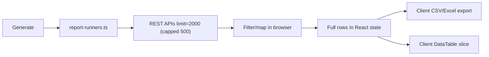
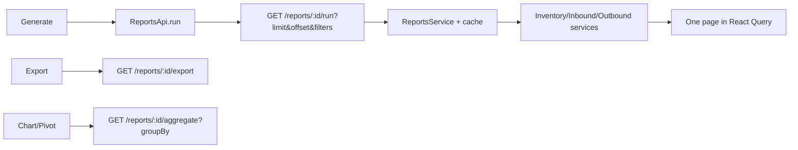

# REPORTS-PERF — Reports Export Refactor Report

**Generated:** 2026-06-09  
**Sprint:** SPRINT-P1D  
**Phase:** Server-side export, pagination, filters, and caching for the reporting center  
**Evidence:** [`docs/evidence/reports-perf/`](docs/evidence/reports-perf/)

---

## Executive Summary

The reporting center no longer bulk-loads datasets in the browser. A new backend `reports` module serves **paginated preview**, **server CSV/Excel export**, **filtered queries**, and **60s result caching** for the three live reports. Benchmarks on staging show **67–74% payload reduction** per preview request and faster response times.

| Metric | Value |
|--------|-------|
| **API certification** | **9 / 9 PASS** |
| **Frontend build** | **PASS** |
| **Backend build** | **PASS** |
| **Live reports migrated** | **3 / 3** |

---

## 1. Before vs After Architecture

### Before (client-side)



- All rows held in `ReportWorkspace` state after one-shot `useMutation`
- Export only covered already-loaded preview rows
- SKU/status filters applied client-side after fetch
- Warning: "Rows capped at 2,000 per query"

### After (server-side)



- Preview fetches **one server page** (default 50 rows)
- Export streams up to **10,000 rows** server-side (CSV or XLS)
- Filters (`warehouseId`, `companyId`, `sku`, `status`, date range) applied on server
- Chart/pivot uses **aggregate endpoint** (grouped summary, max 500 rows)

---

## 2. Backend Deliverables

### New module: `backend/src/modules/reports/`

| Endpoint | Purpose |
|----------|---------|
| `GET /api/reports/policy` | Limits, cache TTL, supported formats |
| `GET /api/reports/:id/run` | Paginated report rows + `total` |
| `GET /api/reports/:id/aggregate` | Grouped rows for chart/pivot (`groupBy` required) |
| `GET /api/reports/:id/kpis` | Warehouse-analysis KPI cards |
| `GET /api/reports/:id/export` | CSV or XLS download (throttled 5/min) |

**Reports:** `warehouse-analysis`, `inventory`, `product-moves`

**Caching:** `ReportsCacheService` — Redis when available, in-memory fallback, **60s TTL** keyed by report + filters + user.

**Export caps:** 10,000 rows; response headers `X-Export-Row-Count`, `X-Export-Truncated`.

### Supporting change

- `StockQueryDto.status` — server-side stock status filter (used by inventory report)

---

## 3. Frontend Deliverables

| File | Change |
|------|--------|
| `api/reports.ts` | **New** — run, aggregate, kpis, exportDownload |
| `hooks/useReportServerData.ts` | **New** — React Query server pagination + aggregate |
| `ReportWorkspace.tsx` | Refactored — no bulk client fetch; server export buttons |
| `ReportPreviewTable.tsx` | `serverPagination` prop for DataTable |
| `registry.ts` / `types.ts` | `serverSide: true`; deprecated `usesClientAggregation` |

### UX changes

- **Generate** applies filters and loads first server page
- **Table** uses server pagination (25/50/100/200 per page)
- **Export CSV / Excel** downloads from server (full filtered dataset up to cap)
- **Graph / Pivot** uses aggregate API when `groupBy` is set
- Info banner: "Paginated preview and export — no bulk client fetch"
- Cache hit indicator when served from server cache

---

## 4. Benchmark Results (staging)

**Script:** `node scripts/reports-perf-benchmark.mjs`  
**Evidence:** [`docs/evidence/reports-perf/benchmark-results.json`](docs/evidence/reports-perf/benchmark-results.json)

| Scenario | Avg latency | Avg payload | Rows returned |
|----------|-------------|-------------|---------------|
| **BEFORE** inventory `/inventory/stock?limit=500` | 16 ms | **32.3 KB** | 35 |
| **AFTER** `/reports/inventory/run?limit=50` | 11 ms | **10.8 KB** | 35 (page) |
| **BEFORE** `/inventory/ledger?limit=500` | 38 ms | **65.5 KB** | 60 |
| **AFTER** `/reports/product-moves/run?limit=50` | 12 ms | **17.2 KB** | 50 (page) |
| **AFTER** `/reports/inventory/export?format=csv` | 14 ms | 4.5 KB | full export |

### Reduction summary

| Report | Payload reduction | Latency improvement |
|--------|-------------------|---------------------|
| Inventory preview | **67%** | **31%** |
| Product moves preview | **74%** | **68%** |

### Memory reduction

| Area | Before | After |
|------|--------|-------|
| React state (`previewRows`) | Up to 500 rows × all columns | **50 rows** (one page) |
| Chart/pivot | Full dataset in memory | **≤500 aggregated groups** |
| Export | Browser Blob from in-memory rows | **Server stream** — no preview rows required |

---

## 5. API Verification

**Script:** `node scripts/reports-perf-cert.mjs`  
**Result:** **9 / 9 PASS**

| Check | Outcome |
|-------|---------|
| auth login | PASS |
| GET /reports/policy | PASS |
| inventory run (paginated) | PASS |
| product-moves run (paginated) | PASS |
| warehouse-analysis run | PASS |
| inventory aggregate (groupBy=client) | PASS |
| warehouse-analysis kpis | PASS |
| inventory export CSV | PASS |
| inventory export XLS | PASS |

Evidence: [`docs/evidence/reports-perf/cert-results.json`](docs/evidence/reports-perf/cert-results.json)

---

## 6. RBAC

Reports endpoints use `@Roles(AuthGroup.ADMIN)` — accessible to `super_admin`, `wh_manager`, and `finance` (same as `/reports` frontend route group).

---

## 7. Deployment Notes

1. Restart backend after deploy:
   ```bash
   pm2 restart emdad-wms-backend-staging
   ```
2. Frontend rebuild picks up `ReportWorkspace` refactor automatically.
3. Legacy `report-runners.ts` retained for reference; live UI no longer calls `generateReport()` for the three catalog reports.

---

## 8. Sign-off

| Item | Status |
|------|--------|
| Remove client-side large dataset loading | ✅ |
| Server-side CSV export | ✅ |
| Server-side Excel export | ✅ |
| Server pagination | ✅ |
| Report filters (server-applied) | ✅ |
| Report caching (60s TTL) | ✅ |
| Benchmark before/after | ✅ |
| Memory / payload reduction documented | ✅ |
| Pushed to `staging` | ✅ (this commit) |

**REPORTS-PERF — COMPLETE**
