# EMDAD 3PL WMS — System Architecture (Final)

**Document:** SYSTEM-ARCHITECTURE-FINAL.md  
**Version:** 2.0 (Production)  
**Generated:** 2026-06-12  
**Repository:** github.com/NadimHassan09/emdad-sy-3pl-wms (branch: `staging`)  
**Production deployment:** `/var/www/emdad-sy-3pl-wms` @ `8cdc99f5`  
**Production domains:** https://admin.emdadsy.com · https://client.emdadsy.com  
**Classification:** Definitive technical architecture reference

---

## Table of Contents

1. [Executive Summary](#1-executive-summary)
2. [Repository Structure](#2-repository-structure)
3. [Technology Stack](#3-technology-stack)
4. [Database Architecture](#4-database-architecture)
5. [Backend Architecture](#5-backend-architecture)
6. [API Catalog](#6-api-catalog)
7. [Frontend Architecture](#7-frontend-architecture)
8. [Client Portal Architecture](#8-client-portal-architecture)
9. [Data Flow](#9-data-flow)
10. [Backup & Disaster Recovery](#10-backup--disaster-recovery)
11. [Deployment Architecture](#11-deployment-architecture)
12. [Known Limitations](#12-known-limitations)
13. [Future Roadmap](#13-future-roadmap)
14. [Appendix A — Authentication & Authorization](#14-appendix-a--authentication--authorization)
15. [Appendix B — Background Jobs](#14-appendix-b--background-jobs)

## 1. Executive Summary

EMDAD 3PL WMS is a **modular monolith** third-party logistics warehouse management platform. It serves two audiences:

- **Internal operators** (warehouse managers, operators, finance, super admins) via the admin SPA
- **Client tenants** (3PL customers) via a separate client portal SPA

All business logic runs in a single **NestJS 11** API backed by **PostgreSQL 16**. Frontends are static SPAs served by **nginx** with same-origin API proxying. Background work (backups, billing, cycle counts, SLA escalation) runs **in-process** via NestJS `@nestjs/schedule` cron — there is no separate worker tier.

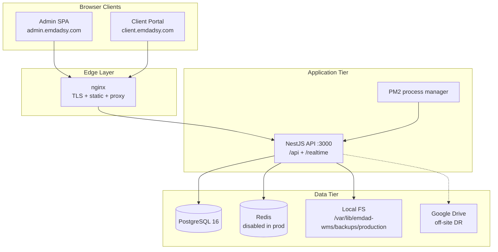

**Production certification (June 2026):** 86/100 — **Production Ready**. Live at admin.emdadsy.com and client.emdadsy.com. Staging environment decommissioned 2026-06-12.

---

## 2. Repository Structure

### 2.1 Top-Level Structure

```
emdad-sy-3pl-wms/
├── backend/                 # NestJS API (Prisma + PostgreSQL)
├── frontend/                # Admin WMS SPA (React 18 + Vite 6)
├── client-frontend/         # Client portal SPA (React 19 + Vite 8)
├── shared/design-system/    # Cross-app UI primitives (@ds alias)
├── packages/
│   └── wms-task-execution/  # Shared Zod task schemas
├── deploy/                  # nginx configs + deploy scripts
├── docker/                  # Postgres init extensions
├── scripts/                 # QA/certification automation (39 .mjs)
├── tests/                   # Root Playwright E2E/API tests
├── docs/                    # Architecture evidence, ops runbooks
├── .github/workflows/       # CI/CD (VPS deploy on main)
├── improved_schema.sql      # Full DB schema design reference
├── ecosystem.config.js      # PM2 production config
├── ecosystem.config.js
└── docker-compose.yml       # PostgreSQL 16 dev container
```

**Not a monorepo:** Each app has its own `package.json` and `node_modules`. Shared code is linked via Vite path aliases and vendored copies — not npm workspaces.

### 2.2 Frontend Structure (`frontend/`)

| Path | Purpose |
|------|---------|
| `src/api/` | 21 Axios API modules (auth, inventory, tasks, billing, backups, …) |
| `src/auth/` | AuthContext, RequireAuth, RequireRouteAccess |
| `src/components/` | Domain components (adjustments, billing, tasks, backups, …) |
| `src/pages/` | 28+ lazy-loaded page components |
| `src/hooks/` | Shared hooks (pagination, notifications, backup maintenance) |
| `src/context/` | BackupOperationContext |
| `src/realtime/` | Socket.IO client + React Query cache invalidation |
| `src/workflow/` | WorkflowUxContext, task execution |
| `src/vendor/wms-task-execution/` | Vendored task schema package |
| `src/router.tsx` | 52 routes, createBrowserRouter |
| `e2e/` | Playwright E2E tests |

**Dev server:** port `5173`, Vite proxy `/api` → `localhost:3000`

### 2.3 Backend Structure (`backend/`)

| Path | Purpose |
|------|---------|
| `src/main.ts` | Bootstrap: helmet, global prefix `/api`, pipes, filters |
| `src/app.module.ts` | 22 feature modules, global JWT + Throttler guards |
| `src/common/` | Prisma, Redis, audit, crypto, company-access, security |
| `src/modules/` | 22 domain modules, 37 controllers, 96 services |
| `prisma/schema.prisma` | 42 Prisma models (~1,500 lines) |
| `prisma/migrations/` | 35+ incremental migrations |
| `libs/wms-task-execution/` | Vendored task package |

**API:** Global prefix `/api`, default port `3000`

### 2.4 Client Portal Structure (`client-frontend/`)

| Path | Purpose |
|------|---------|
| `src/App.tsx` | BrowserRouter, 11 routes |
| `src/auth/` | AuthContext, RequireAuth, RequireRouteAccess |
| `src/services/` | Client API services (`/api/client/*`) |
| `src/pages/` | Dashboard, Stock, Orders, Billing, Notifications |
| `src/realtime/` | Company-scoped Socket.IO |
| `src/hooks/` | useClientOperationalAccess, useClientNotifications |

**Dev server:** port `5174`  
**Cross-app reuse:** `@wms/hooks` and `@wms/components` alias to admin frontend

### 2.5 Shared Libraries

| Package | Path | Consumed By |
|---------|------|-------------|
| Design system (`@ds`) | `shared/design-system/` | Admin + client frontends |
| Task execution (`@emdad/wms-task-execution`) | `packages/wms-task-execution/` | Admin + backend (vendored copies) |

### 2.6 Design System (`shared/design-system/`)

35+ React primitives: `AppShell`, `Sidebar`, `Topbar`, `Button`, `Input`, `Modal`, `DataTable`, `Pagination`, `FilterBar`, `LoginScreen`, `WorkflowStatus`, etc.

- `tokens.css` — CSS custom properties
- `tailwind.preset.cjs` — shared Tailwind theme
- `lib/use-ui-language.ts` — i18n hook

### 2.7 Scripts

| Directory | Count | Purpose |
|-----------|-------|---------|
| `scripts/` | 39 `.mjs` | QA certification, perf benchmarks, release audits |
| `backend/scripts/` | 5 | Performance dataset seeding |
| `frontend/scripts/` | 6 | Backup UI screenshot capture |
| `client-frontend/scripts/` | 4 | Client UX screenshot/debug |
| `deploy/scripts/` | 1 | Let's Encrypt cert issuance |

### 2.8 Infrastructure Files

| File | Purpose |
|------|---------|
| `docker-compose.yml` | PostgreSQL 16 dev container |
| `docker/postgres-init.sql` | Extensions: pgcrypto, btree_gist, pg_trgm |
| `ecosystem.config.js` | PM2 production backend |
| `ecosystem.config.js` | PM2 production backend |
| `deploy/nginx/` | Upstream, site vhosts, API proxy snippets |
| `deploy/README.md` | Deployment checklist |
| `.github/workflows/deploy.yml` | CI/CD: SSH deploy on `main` push |
| `backend/.env.example` | Full backend env reference |
| `frontend/.env.example` | Admin frontend env |
| `client-frontend/.env.example` | Client portal env |

---

## 3. Technology Stack

### 3.1 Frontend (Admin)

| Concern | Technology |
|---------|-----------|
| Framework | React 18.3 |
| Build | Vite 6 + `@vitejs/plugin-react` |
| Routing | React Router DOM 6.28 (`createBrowserRouter`) |
| State / data | TanStack React Query 5.62 |
| HTTP | Axios (Bearer JWT, envelope unwrap) |
| Styling | Tailwind CSS 3.4 + `@ds` design system |
| Realtime | socket.io-client 4.8 |
| Barcode/QR | jsbarcode, html5-qrcode |
| Validation | Zod 4.4 |
| E2E | Playwright 1.59 |

### 3.2 Frontend (Client Portal)

| Concern | Technology |
|---------|-----------|
| Framework | React 19.2 |
| Build | Vite 8 (Rolldown) |
| Routing | React Router DOM 7.14 (`BrowserRouter`) |
| State / data | TanStack React Query 5.100 |
| HTTP | Axios |
| Styling | Tailwind CSS 3.4 + `@ds` |

> **Note:** Client portal runs newer React/Vite than admin — version divergence is a maintenance consideration.

### 3.3 Backend

| Concern | Technology |
|---------|-----------|
| Framework | NestJS 11 (modular monolith) |
| ORM | Prisma 5.22 |
| Database | PostgreSQL 16 |
| Cache | Redis via ioredis (`REDIS_ENABLED`) |
| Auth | JWT (Passport), bcrypt, dual internal/client JWT |
| Scheduling | `@nestjs/schedule` (in-process cron) |
| Realtime | Socket.IO 4.8 via `@nestjs/platform-socket.io` |
| Rate limiting | `@nestjs/throttler` (120 req/min) |
| Security | Helmet, cookie-parser, Zod env validation |
| Integrations | googleapis (Google Drive backups) |
| Testing | Jest (unit), ts-node integration tests |

### 3.4 Infrastructure

| Component | Technology | Notes |
|-----------|-----------|-------|
| Database | PostgreSQL 16 Alpine | Docker dev; host install in prod |
| Cache | Redis | Optional; task read cache, report cache |
| Process manager | PM2 | 1 instance, fork mode, 1 GB memory limit |
| Reverse proxy | nginx | Same-origin API proxy pattern |
| Cron | NestJS ScheduleModule | No system crontab in repo |
| Storage | Local filesystem | `/var/lib/emdad-wms/backups/{env}` |
| CI/CD | GitHub Actions | SSH deploy to VPS on `main` |
| SSL | Let's Encrypt | certbot webroot |

### 3.5 Dependency Map

```mermaid
flowchart LR
    subgraph frontend_deps [Admin Frontend]
        R18[React 18]
        V6[Vite 6]
        RQ5[TanStack Query]
        RR6[React Router 6]
        AX[Axios]
        SIO_C[socket.io-client]
        ZOD[Zod]
    end

    subgraph client_deps [Client Portal]
        R19[React 19]
        V8[Vite 8]
        RR7[React Router 7]
    end

    subgraph backend_deps [Backend]
        Nest[NestJS 11]
        Prisma[Prisma 5.22]
        JWT[@nestjs/jwt]
        Sched[@nestjs/schedule]
        Throttle[@nestjs/throttler]
        GAPI[googleapis]
        IO[socket.io]
    end

    subgraph infra_deps [Infrastructure]
        PG16[PostgreSQL 16]
        Redis[Redis]
        PM2[PM2]
        Nginx[nginx]
    end

  subgraph shared_deps [Shared]
        DS[@ds design-system]
        TaskPkg[@emdad/wms-task-execution]
    end

    frontend_deps --> DS
    frontend_deps --> TaskPkg
    client_deps --> DS
    client_deps --> frontend_deps
    frontend_deps -->|/api| Nest
    client_deps -->|/api/client| Nest
    Nest --> Prisma --> PG16
    Nest --> Redis
    Nest --> IO
    Nest --> GAPI
    PM2 --> Nest
    Nginx --> frontend_deps
    Nginx --> client_deps
    Nginx --> Nest
```

---

## 4. Database Architecture

### 4.1 Schema Sources

| Role | Path |
|------|------|
| Prisma application schema (42 models) | `backend/prisma/schema.prisma` |
| Baseline SQL (full OLTP + analytics DW) | `backend/prisma/migrations/0_init/migration.sql` |
| Design reference | `improved_schema.sql` |
| Incremental migrations | `backend/prisma/migrations/*/migration.sql` |

**ORM:** Prisma only. Audit logs, some inventory operations, and RLS context use raw SQL.

### 4.2 Entity-Relationship Diagram (Core OLTP)

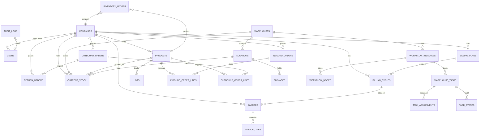

### 4.3 Main Entities (44 Prisma Models)

#### Tenancy & Identity
- **Company** — 3PL client tenant; status, billing cycle, workflow UX settings
- **User** — email (unique), role, status, `company_id?`, `token_version`
- **UserCompanyAccess** — internal user ↔ client tenant grant (PK: user_id + company_id)

#### Auth & Backups
- **AuthRefreshSession** — refresh token rotation with `current_jti`, `token_version`
- **AuthRefreshRotation** — replay protection (PK: session_id + from_jti)
- **BackupStorageSettings**, **BackupSchedule**, **BackupDriveIntegration**, **BackupJob**

#### Warehouse Topology
- **Warehouse** — code (unique), status, workflow UX settings
- **Location** — tree hierarchy (`parent_id`, `full_path`), barcode (unique), types (incl. ISS, fridge)

#### Product Catalog & Inventory
- **Product** — SKU (unique per company), barcode, tracking type, UOM, dims
- **Lot** — lot number (unique per product), expiry
- **Package** — package-level tracking
- **CurrentStock** — mutable snapshot with optimistic locking (`version`); generated `quantity_available`
- **InventoryLedger** — append-only movements (**partitioned** monthly)
- **LedgerIdempotency** — application-level dedup
- **StockAdjustment** / **StockAdjustmentLine** — approval workflow

#### Orders
- **InboundOrder** / **InboundOrderLine** — receive workflow, QC status
- **OutboundOrder** / **OutboundOrderLine** — pick/pack/dispatch
- **ReturnOrder** / **ReturnOrderLine** — inspection, disposition, inventory posting

#### Cycle Count
- **CycleCountSchedule**, **CycleCount**, **CycleCountLine**, **CycleCountVariance**, **CycleCountProductHistory**

#### Workflow Engine
- **Worker**, **WorkerRoleAssignment**, **WorkerSkill**
- **WorkflowInstance**, **WorkflowNode**
- **WarehouseTask**, **WarehouseTaskRequiredSkill**, **TaskAssignment**, **TaskEvent**

#### Billing
- **BillingPlan** — rate card (subscription, per-order, excess volume/weight)
- **BillingCycle** — period with frozen `rate_snapshot` (JSONB)
- **Invoice** / **InvoiceLine** — immutable invoicing model

#### Notifications
- **Notification** — user/company scoped, type, channel, reference

### 4.4 Relationships Summary

```
Company (tenant)
├── Users (client) + UserCompanyAccess (internal grants)
├── Products → Lots → Packages
├── InboundOrders → InboundOrderLines
├── OutboundOrders → OutboundOrderLines → ReturnOrderLines
├── ReturnOrders → ReturnOrderLines
├── CurrentStock (Company × Product × Location × Lot? × Package?)
├── InventoryLedger (append-only movements)
├── StockAdjustments → StockAdjustmentLines
├── CycleCountSchedule → CycleCount → CycleCountLine → CycleCountVariance
├── BillingPlan → BillingCycle → Invoice → InvoiceLine
├── Workers → WorkerRoleAssignment, WorkerSkill
├── WorkflowInstance (per inbound/outbound order)
│   └── WorkflowNode → WarehouseTask → TaskAssignment, TaskEvent
└── Notifications

Warehouse
├── Locations (tree)
├── CurrentStock, StockAdjustments, CycleCounts, Workers, WorkflowInstances
└── ReturnOrders
```

### 4.5 Constraints (Key Business Rules)

| Constraint | Table | Rule |
|-----------|-------|------|
| `uq_product_sku_per_company` | products | One SKU per company |
| `uq_stock_lot_position` | current_stock | Partial unique for lot-tracked positions |
| `uq_one_active_billing_plan_per_company` | billing_plans | One active plan |
| `uq_one_current_billing_cycle_per_company` | billing_cycles | One active/renewed cycle |
| `workflow_instances_one_active_per_reference` | workflow_instances | One active workflow per order |
| `chk_user_company_role` | users | Role ↔ company_id pairing |
| Quantity checks | current_stock | `quantity_reserved <= quantity_on_hand` |

### 4.6 Indexes (Highlights)

- GIN trigram on `products.name`, `products.sku` (pg_trgm)
- Covering index `idx_stock_availability` on `current_stock`
- Audit log query indexes: `created_at`, `action`, `actor_email`, `(company_id, action)`
- Ledger: `(company_id, movement_type, created_at)`, location partial indexes
- Cycle count worker execution indexes

### 4.7 Partitioned Tables

| Table | Strategy | Range | Auto-create |
|-------|----------|-------|-------------|
| `inventory_ledger` | RANGE (`created_at`) | Monthly | `fn_create_next_partitions()` |
| `audit_logs` | RANGE (`created_at`) | Quarterly | `fn_create_next_audit_partitions()` |
| `fact_inventory_movements` | RANGE (`event_date`) | Monthly (analytics) | `etl_create_next_fact_partitions()` |
| `fact_stock_snapshot` | RANGE (`snapshot_date`) | Monthly (analytics) | ETL |
| `fact_tasks` | RANGE (`created_date`) | Monthly (analytics) | ETL |

Both OLTP partitioned tables require composite PK `(id, created_at)`. DEFAULT partitions act as safety nets; `fn_monitor_default_partitions()` alerts when rows land there.

### 4.8 Audit Tables

| Table | Pattern | Properties |
|-------|---------|------------|
| `audit_logs` | System-wide append-only | Quarterly partitions; immutable triggers; raw SQL inserts |
| `inventory_ledger` | Inventory event log | Monthly partitions; `quantity_before/after`; idempotency |
| `task_events` | Workflow task lifecycle | Per-task event stream; cascade-deleted with task |
| `billing_cycles.rate_snapshot` | Frozen rate card | JSONB snapshot at cycle start |
| `idempotency_keys` | HTTP replay protection | 10-minute TTL |

### 4.9 Row-Level Security

FORCE RLS on tenant-scoped tables. Session context via `fn_set_app_context(user_id, company_id, user_role)`:

- `pol_internal_access` — internal roles see all
- `pol_client_access` — client roles see own `company_id`
- `pol_client_boundary` — restrictive guard

### 4.10 Analytics Schema (`analytics.*`)

Star-schema data warehouse in the same database: dimensions (SCD Type 2), fact tables (partitioned), ETL watermarks, and views (`v_revenue_by_company_month`, `v_stock_trend`, `v_worker_productivity`).

---

## 5. Backend Architecture

### 5.1 Module Inventory

| Module | Controllers | Key Services |
|--------|-------------|--------------|
| AuthModule | AuthController | AuthService, RefreshSessionService |
| ClientPortalModule | 8 client controllers | ClientAuthService, Client*Services |
| AdjustmentsModule | AdjustmentsController | AdjustmentsService |
| AuditLogsModule | AuditLogsController | AuditLogsService |
| BackupsModule | 5 backup controllers | 20+ backup services |
| BillingModule | BillingController | 14 billing services + 4 cron processors |
| CompaniesModule | CompaniesController | CompaniesService |
| CycleCountModule | 3 controllers | CycleCountService, CycleCountSchedulerService |
| DashboardModule | DashboardController | DashboardService |
| InboundModule | InboundController | InboundService |
| OutboundModule | OutboundController | OutboundService |
| ReturnsModule | ReturnsController | ReturnsService, ReturnWorkflowService |
| ProductsModule | ProductsController | ProductsService |
| InventoryModule | InventoryController | InventoryService, InventoryConsistencyService |
| LocationsModule | LocationsController | LocationsService |
| WarehousesModule | WarehousesController | WarehousesService |
| UsersModule | UsersController | UsersService |
| WarehouseWorkflowModule | 4 controllers | WorkflowEngineService, WarehouseTasksService |
| NotificationsModule (@Global) | NotificationsController | NotificationsService |
| RealtimeModule | RealtimeGateway (WS) | RealtimeService, PresenceService |
| ReportsModule | ReportsController | ReportsService, ReportsCacheService |
| ObservabilityModule | ObservabilityController | ObservabilityService |

**Common infrastructure:** PrismaModule, RedisModule, CompanyAccessModule, AuditModule, CryptoModule, SecurityModule

### 5.2 Guards

| Guard | Scope | Effect |
|-------|-------|--------|
| JwtAuthGuard | Global | Requires internal JWT; skipped by `@Public()` |
| ThrottlerGuard | Global | 120 req/min |
| RolesGuard | Opt-in `@Roles()` | ADMIN or OPERATOR group check |
| InternalAdminGuard | Sensitive ops | `super_admin` \| `wh_manager` |
| SuperAdminGuard | Destructive ops | `super_admin` only |
| JwtClientAuthGuard | Client portal | Client JWT validation |
| WorkflowExecutionGateGuard | Task mutations | DAG/skills gate |
| OpsProbeGuard | Readiness probe | Probe key or internal admin |

### 5.3 Interceptors & Middleware

| Component | File | Purpose |
|-----------|------|---------|
| ResponseInterceptor | `common/interceptors/response.interceptor.ts` | Wraps `{ success: true, data }` |
| AllExceptionsFilter | `common/filters/all-exceptions.filter.ts` | Global error handler |
| BackupMaintenanceMiddleware | `modules/backups/backup-maintenance.middleware.ts` | 503 during backup/restore |
| Express middleware | `main.ts` | helmet, JSON limits, cookie-parser, request tracing |

### 5.4 Module Interaction Diagram

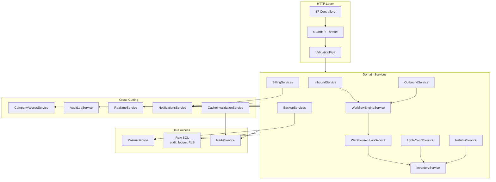

### 5.5 Summary Stats

| Metric | Count |
|--------|------:|
| HTTP Controllers | 37 |
| HTTP Endpoints | ~210 |
| Services | 96 |
| Nest Modules | 29 |
| Guards | 7 |
| Cron jobs | 11 |
| WebSocket gateways | 1 (`/realtime`) |

---

## 6. API Catalog

**Base URL:** `/api` (admin), `/api/client` (portal)  
**Default guards:** JWT + Throttle (unless noted)  
**Response envelope:** `{ success: true, data: T }`

### 6.1 Auth

| Method | Route | Controller | Service | RBAC | Purpose |
|--------|-------|------------|---------|------|---------|
| POST | `/api/auth/login` | AuthController | AuthService | Public | Internal login |
| POST | `/api/auth/refresh` | AuthController | AuthService | Public | Refresh access token |
| POST | `/api/auth/logout` | AuthController | AuthService | Public | Revoke session |
| GET | `/api/auth/me` | AuthController | AuthService | JWT | Current user profile |

### 6.2 Companies

| Method | Route | Service | RBAC | Purpose |
|--------|-------|---------|------|---------|
| GET | `/api/companies` | CompaniesService | JWT | List clients |
| GET | `/api/companies/:id` | CompaniesService | JWT | Get client |
| POST | `/api/companies` | CompaniesService | InternalAdmin | Create client |
| PATCH | `/api/companies/:id` | CompaniesService | InternalAdmin | Update client |
| POST | `/api/companies/:id/suspend` | CompaniesService | InternalAdmin | Suspend client |
| POST | `/api/companies/:id/close` | CompaniesService | InternalAdmin | Close client |
| DELETE | `/api/companies/:id` | CompaniesService | InternalAdmin | Delete client |

### 6.3 Users

| Method | Route | Service | RBAC | Purpose |
|--------|-------|---------|------|---------|
| GET | `/api/users` | UsersService | JWT | List users |
| GET | `/api/users/:id` | UsersService | JWT | Get user |
| POST | `/api/users` | UsersService | InternalAdmin | Create user |
| PATCH | `/api/users/:id` | UsersService | InternalAdmin | Update user |
| POST | `/api/users/:id/suspend` | UsersService | InternalAdmin | Suspend user |
| DELETE | `/api/users/:id` | UsersService | InternalAdmin | Delete user |

### 6.4 Products

| Method | Route | Service | RBAC | Purpose |
|--------|-------|---------|------|---------|
| POST | `/api/products` | ProductsService | InternalAdmin | Create product |
| GET | `/api/products` | ProductsService | JWT | List products |
| GET | `/api/products/next-sku` | ProductsService | InternalAdmin | Next SKU |
| GET | `/api/products/:id` | ProductsService | JWT | Get product |
| GET | `/api/products/:id/lots` | ProductsService | JWT | Product lots |
| PATCH | `/api/products/:id` | ProductsService | InternalAdmin | Update product |
| POST | `/api/products/:id/suspend` | ProductsService | InternalAdmin | Suspend product |
| POST | `/api/products/:id/unsuspend` | ProductsService | InternalAdmin | Unsuspend product |
| DELETE | `/api/products/:id` | ProductsService | InternalAdmin | Soft delete |
| DELETE | `/api/products/:id/hard` | ProductsService | InternalAdmin | Hard delete |

### 6.5 Warehouses & Locations

| Method | Route | Service | RBAC | Purpose |
|--------|-------|---------|------|---------|
| POST | `/api/warehouses` | WarehousesService | InternalAdmin | Create warehouse |
| GET | `/api/warehouses` | WarehousesService | JWT | List warehouses |
| GET | `/api/warehouses/:id` | WarehousesService | JWT | Get warehouse |
| PATCH | `/api/warehouses/:id` | WarehousesService | InternalAdmin | Update warehouse |
| PATCH | `/api/warehouses/:id/status` | WarehousesService | InternalAdmin | Change status |
| DELETE | `/api/warehouses/:id` | WarehousesService | InternalAdmin | Delete warehouse |
| POST | `/api/locations` | LocationsService | InternalAdmin | Create location |
| GET | `/api/locations` | LocationsService | JWT | List locations |
| GET | `/api/locations/lookup` | LocationsService | JWT | Barcode/path lookup |
| GET | `/api/locations/:id` | LocationsService | JWT | Get location |
| PATCH | `/api/locations/:id` | LocationsService | InternalAdmin | Update location |
| DELETE | `/api/locations/:id` | LocationsService | InternalAdmin | Soft delete |
| DELETE | `/api/locations/:id/permanent` | LocationsService | InternalAdmin | Hard delete |

### 6.6 Inventory

| Method | Route | Service | RBAC | Purpose |
|--------|-------|---------|------|---------|
| GET | `/api/inventory/stock` | InventoryService | JWT | Stock list |
| GET | `/api/inventory/stock/by-product` | InventoryService | JWT | Stock by product |
| GET | `/api/inventory/ledger` | InventoryService | JWT | Ledger entries |
| GET | `/api/inventory/ledger/entry` | InventoryService | JWT | Single ledger entry |
| GET | `/api/inventory/availability` | InventoryService | JWT | Available qty |
| GET | `/api/inventory/consistency/validate` | InventoryConsistencyService | ADMIN | Consistency check |
| POST | `/api/inventory/internal-transfer` | InventoryService | InternalAdmin | Internal transfer |

### 6.7 Inbound Orders

| Method | Route | Service | RBAC | Purpose |
|--------|-------|---------|------|---------|
| POST | `/api/inbound-orders` | InboundService | JWT | Create inbound |
| GET | `/api/inbound-orders` | InboundService | JWT | List inbound |
| GET | `/api/inbound-orders/:id` | InboundService | JWT | Get inbound |
| POST | `/api/inbound-orders/:id/confirm` | InboundService | JWT | Confirm order |
| POST | `/api/inbound-orders/:id/cancel` | InboundService | JWT | Cancel order |
| POST | `/api/inbound-orders/:id/lines/:lineId/receive` | InboundService | JWT | Receive line |

### 6.8 Outbound Orders

| Method | Route | Service | RBAC | Purpose |
|--------|-------|---------|------|---------|
| POST | `/api/outbound-orders` | OutboundService | JWT | Create outbound |
| GET | `/api/outbound-orders` | OutboundService | JWT | List outbound |
| GET | `/api/outbound-orders/:id` | OutboundService | JWT | Get outbound |
| POST | `/api/outbound-orders/:id/confirm` | OutboundService | JWT | Confirm order |
| POST | `/api/outbound-orders/:id/cancel` | OutboundService | JWT | Cancel order |

### 6.9 Return Orders

| Method | Route | Service | RBAC | Purpose |
|--------|-------|---------|------|---------|
| POST | `/api/return-orders` | ReturnsService | JWT | Create return |
| GET | `/api/return-orders` | ReturnsService | JWT | List returns |
| GET | `/api/return-orders/:id` | ReturnsService | JWT | Get return |
| GET | `/api/return-orders/outbound-quota/:outboundId` | ReturnsService | JWT | Return quota |
| POST | `/api/return-orders/:id/confirm` | ReturnsService | JWT | Confirm return |
| POST | `/api/return-orders/:id/start-receiving` | ReturnsService | JWT | Start receiving |
| POST | `/api/return-orders/:id/complete` | ReturnsService | JWT | Complete return |
| POST | `/api/return-orders/:id/cancel` | ReturnsService | JWT | Cancel return |
| POST | `/api/return-orders/:id/lines/:lineId/receive` | ReturnsService | JWT | Receive line |
| POST | `/api/return-orders/:id/lines/:lineId/inspect` | ReturnsService | JWT | Inspect line |
| POST | `/api/return-orders/:id/lines/:lineId/apply-disposition` | ReturnsService | JWT | Apply disposition |
| POST | `/api/return-orders/:id/post-inventory` | ReturnsService | JWT | Post to inventory |

### 6.10 Adjustments

| Method | Route | Service | RBAC | Purpose |
|--------|-------|---------|------|---------|
| POST | `/api/adjustments` | AdjustmentsService | JWT | Create adjustment |
| GET | `/api/adjustments` | AdjustmentsService | JWT | List adjustments |
| GET | `/api/adjustments/:id` | AdjustmentsService | JWT | Get adjustment |
| PATCH | `/api/adjustments/:id` | AdjustmentsService | JWT | Update adjustment |
| POST | `/api/adjustments/:id/lines` | AdjustmentsService | JWT | Add line |
| PATCH | `/api/adjustments/:id/lines/:lineId` | AdjustmentsService | JWT | Update line |
| POST | `/api/adjustments/:id/approve` | AdjustmentsService | InternalAdmin | Approve |
| POST | `/api/adjustments/:id/cancel` | AdjustmentsService | JWT | Cancel |

### 6.11 Cycle Count

| Method | Route | Service | RBAC | Purpose |
|--------|-------|---------|------|---------|
| POST | `/api/cycle-count/schedules` | CycleCountService | InternalAdmin | Create schedule |
| GET | `/api/cycle-count/schedules` | CycleCountService | JWT | List schedules |
| GET | `/api/cycle-count/product-history` | CycleCountService | JWT | Product history |
| POST | `/api/cycle-count/counts` | CycleCountService | JWT | Create count |
| GET | `/api/cycle-count/counts` | CycleCountService | JWT | List counts |
| GET | `/api/cycle-count/counts/:id` | CycleCountService | JWT | Get count |
| POST | `/api/cycle-count/counts/:id/start` | CycleCountService | JWT | Start count |
| PATCH | `/api/cycle-count/counts/:id/assign` | CycleCountService | JWT | Assign worker |
| POST | `/api/cycle-count/counts/:id/lines/:lineId/count` | CycleCountService | JWT | Record count |
| POST | `/api/cycle-count/counts/:id/submit-review` | CycleCountService | JWT | Submit for review |
| POST | `/api/cycle-count/counts/:id/reconcile` | CycleCountVarianceService | InternalAdmin | Reconcile variances |
| POST | `/api/cycle-count/counts/:id/post-reconciliation` | CycleCountVarianceService | InternalAdmin | Post adjustments |
| POST | `/api/cycle-count/counts/:id/complete` | CycleCountService | InternalAdmin | Complete count |
| POST | `/api/cycle-count/counts/:id/cancel` | CycleCountService | JWT | Cancel count |
| GET | `/api/cycle-count/execution/tasks` | CycleCountExecutionService | OPERATOR\|ADMIN | Execution tasks |
| POST | `/api/cycle-count/execution/tasks/:id/claim` | CycleCountExecutionService | OPERATOR\|ADMIN | Claim task |
| GET | `/api/cycle-count/variances` | CycleCountVarianceService | JWT | List variances |
| PATCH | `/api/cycle-count/variances/:id/review` | CycleCountVarianceService | InternalAdmin | Review variance |

### 6.12 Warehouse Tasks & Workflows

| Method | Route | Service | RBAC | Purpose |
|--------|-------|---------|------|---------|
| GET | `/api/tasks` | WarehouseTasksService | JWT | List tasks |
| GET | `/api/tasks/:id` | WarehouseTasksService | JWT | Get task |
| PUT | `/api/tasks/:id/progress` | WarehouseTasksService | WorkflowGate | Update progress |
| POST | `/api/tasks/:id/lease` | WarehouseTasksService | WorkflowGate | Lease task |
| POST | `/api/tasks/:id/start` | WarehouseTasksService | WorkflowGate | Start task |
| POST | `/api/tasks/:id/complete` | WarehouseTasksService | WorkflowGate | Complete task |
| POST | `/api/tasks/:id/assign` | WarehouseTasksService | ADMIN | Assign worker |
| POST | `/api/tasks/:id/cancel` | WarehouseTasksService | ADMIN | Cancel task |
| GET | `/api/workflows/instances/:instanceId/graph` | WorkflowBootstrapService | JWT | Workflow graph |
| POST | `/api/workflows/inbound/:orderId/start` | WorkflowBootstrapService | JWT | Start inbound workflow |
| POST | `/api/workflows/outbound/:orderId/start` | WorkflowBootstrapService | JWT | Start outbound workflow |
| POST | `/api/workflows/instances/:instanceId/recover` | WorkflowRecoveryService | InternalAdmin | Recover stuck workflow |
| GET | `/api/workers` | WorkflowWorkersService | JWT | List workers |
| POST | `/api/workers` | WorkflowWorkersService | InternalAdmin | Create worker |

### 6.13 Billing

| Method | Route | Service | RBAC | Purpose |
|--------|-------|---------|------|---------|
| GET | `/api/billing/plans` | BillingPlansService | JWT | List plans |
| POST | `/api/billing/plans` | BillingPlansService | InternalAdmin | Create plan |
| PATCH | `/api/billing/plans/:id` | BillingPlansService | InternalAdmin | Update plan |
| GET | `/api/billing/cycles` | BillingCyclesService | JWT | List cycles |
| POST | `/api/billing/cycles/:id/renew` | BillingCyclesService | InternalAdmin | Renew cycle |
| GET | `/api/billing/invoices` | BillingInvoicesService | JWT | List invoices |
| PATCH | `/api/billing/invoices/:id/status` | BillingInvoicesService | InternalAdmin | Update status |
| GET | `/api/billing/dashboard/summary` | BillingDashboardService | JWT | Dashboard KPIs |
| GET | `/api/billing/preview` | BillingPreviewService | JWT | Cycle preview |

### 6.14 Backups

| Method | Route | Service | RBAC | Purpose |
|--------|-------|---------|------|---------|
| GET | `/api/backups/health` | BackupHealthService | ADMIN + InternalAdmin | Health status |
| POST | `/api/backups` | BackupsService | ADMIN + SuperAdmin | Create backup |
| POST | `/api/backups/:id/restore` | BackupsService | ADMIN + SuperAdmin | Restore backup |
| POST | `/api/backups/factory-reset` | BackupsService | ADMIN + SuperAdmin | Factory reset |
| POST | `/api/backups/upload` | BackupsService | ADMIN + SuperAdmin | Upload backup |
| GET | `/api/backups/schedules` | BackupSchedulesService | ADMIN + InternalAdmin | List schedules |
| POST | `/api/backups/schedules` | BackupSchedulesService | ADMIN + SuperAdmin | Create schedule |
| GET | `/api/backups/retention/policies` | BackupRetentionService | ADMIN + InternalAdmin | Retention policies |
| POST | `/api/backups/retention/cleanup` | BackupRetentionService | ADMIN + SuperAdmin | Run cleanup |
| GET | `/api/integrations/google-drive/status` | BackupDriveIntegrationService | ADMIN + InternalAdmin | Drive status |
| GET | `/api/integrations/google-drive/auth-url` | BackupDriveAuthService | ADMIN + SuperAdmin | OAuth URL |

### 6.15 Reports, Audit, Dashboard, Notifications, Ops

| Method | Route | Service | RBAC | Purpose |
|--------|-------|---------|------|---------|
| GET | `/api/dashboard/overview` | DashboardService | JWT | Dashboard KPIs |
| GET | `/api/reports/policy` | ReportsFrameworkService | ADMIN | Report limits and IDs |
| GET | `/api/reports/:reportId/run` | ReportsService | ADMIN | Run report |
| GET | `/api/reports/:reportId/aggregate` | ReportsService | ADMIN | Grouped report view |
| GET | `/api/reports/:reportId/kpis` | ReportsService | ADMIN | KPI strip (warehouse analysis) |
| GET | `/api/reports/:reportId/export` | ReportsService | ADMIN | Export report (CSV/XLS) |
| GET | `/api/audit-logs` | AuditLogsService | ADMIN | Query audit logs |
| GET | `/api/audit-logs/export` | AuditLogsService | ADMIN + InternalAdmin | Export audit logs |
| GET | `/api/notifications` | NotificationsService | JWT | List notifications |
| PATCH | `/api/notifications/:id/read` | NotificationsService | JWT | Mark read |
| GET | `/api/ops/health/live` | ObservabilityService | Public | Liveness probe |
| GET | `/api/ops/health/ready` | ObservabilityService | Public + OpsProbe | Readiness probe |

### 6.16 Client Portal API (`/api/client/*`)

All routes use `@Public() + JwtClientAuthGuard`. Tenant scoped by JWT `companyId`.

| Method | Route | Service | Purpose |
|--------|-------|---------|---------|
| POST | `/api/client/auth/login` | ClientAuthService | Client login |
| GET | `/api/client/auth/me` | ClientAuthService | Client profile |
| GET | `/api/client/dashboard/overview` | ClientDashboardService | Dashboard KPIs |
| GET | `/api/client/stock` | ClientStockService | Stock view |
| GET | `/api/client/products` | ClientProductsService | Product list |
| POST | `/api/client/products` | ClientProductsService | Create product |
| GET | `/api/client/inbound-orders` | ClientInboundOrdersService | Inbound list |
| POST | `/api/client/inbound-orders` | ClientInboundOrdersService | Create inbound |
| GET | `/api/client/outbound-orders` | ClientOutboundOrdersService | Outbound list |
| POST | `/api/client/outbound-orders` | ClientOutboundOrdersService | Create outbound |
| GET | `/api/client/billing/summary` | ClientBillingService | Billing summary |
| GET | `/api/client/billing/invoices` | ClientBillingService | Invoice list |
| GET | `/api/client/notifications` | ClientNotificationsService | Notifications |

### 6.17 WebSocket

| Namespace | Auth | Purpose |
|-----------|------|---------|
| `/realtime` | JWT in `handshake.auth.token` | Live updates (orders, tasks, stock, notifications) |

---

## 7. Frontend Architecture

### 7.1 UI Architecture

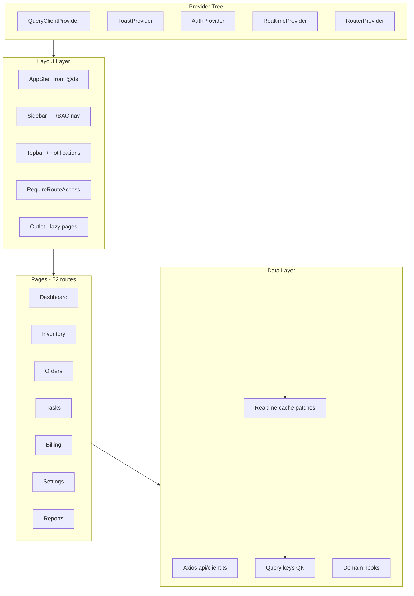

### 7.2 Routing

- **Engine:** `createBrowserRouter` (required for `useBlocker` on task execution)
- **File:** `frontend/src/router.tsx`
- **Lazy loading:** All pages via `lazyPage()`; Suspense in Layout
- **RBAC:** `lib/rbac.ts` defines `navItemsForRole`, `canAccessPath`, `defaultHomePath`
- **Guard:** `RequireRouteAccess` checks role against route

### 7.3 Layouts

| Layout | File | Scope |
|--------|------|-------|
| Root shell | `components/Layout.tsx` | AppShell + Sidebar + Topbar |
| Reports | `pages/reports/ReportsLayout.tsx` | Sub-nav + warehouse context |
| Settings | `pages/settings/SettingsLayout.tsx` | Backup tabs + maintenance overlay |

### 7.4 Design System Usage

Import from `@ds` (alias to `shared/design-system/ui/index.ts`):
- Shell: `AppShell`, `Sidebar`, `Topbar`, `PageContainer`
- Forms: `Button`, `Input`, `Select`, `Field`
- Data: `DataTable`, `Pagination`, `FilterBar`
- Feedback: `Modal`, `Alert`, `Toast`, `Skeleton`

App-specific domain components remain in `frontend/src/components/`.

### 7.5 Shared Hooks

| Hook | Purpose |
|------|---------|
| `useChunkedServerPagination` | Server-paginated lists (50-row batches) |
| `useNotifications` | Admin topbar notifications |
| `useBackupMaintenance` | Restore/maintenance overlay |
| `useDefaultWarehouse` | Default warehouse from env/API |
| `useTenantCompanyId` | Multi-tenant company scoping |
| `useExecutionExitBlocker` | Block navigation during task execution |

### 7.6 Contexts

| Context | Purpose |
|---------|---------|
| `AuthContext` | User session, login/logout |
| `WorkflowUxContext` | Warehouse workflow UX settings |
| `BackupOperationContext` | Tracked backup job ID |
| `ToastProvider` | Toast notifications |
| `RealtimeProvider` | Socket.IO + React Query cache invalidation |

### 7.7 API Layer

- **Client:** `frontend/src/api/client.ts` — Axios with Bearer token, envelope unwrap, 401 redirect
- **Base URL:** `/api` (prod), proxied in dev via Vite
- **Modules:** 21 domain API files (auth, inventory, tasks, billing, backups, …)

### 7.8 State Flow

1. User action → React component
2. `useMutation` / `useQuery` (TanStack Query)
3. Axios → NestJS API
4. Response → cache update via `queryClient.setQueryData` or invalidation
5. Realtime event → `RealtimeProvider` patches relevant query keys
6. UI re-renders from cache

---

## 8. Client Portal Architecture

### 8.1 Portal Architecture

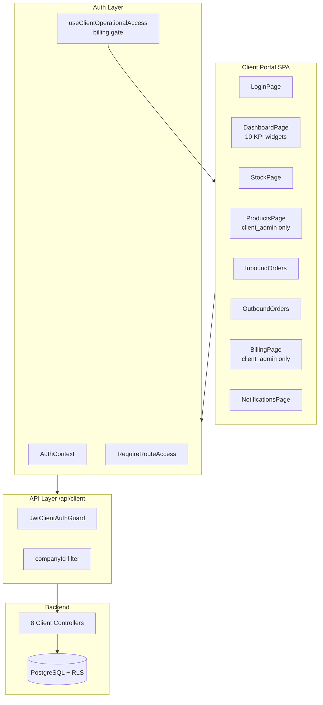

### 8.2 Isolation Model (Defense in Depth)

| Layer | Mechanism |
|-------|-----------|
| Separate SPA | Independent build/deploy (`client-frontend/`) |
| Separate domain | `client.emdadsy.com` |
| Separate API prefix | `/api/client` |
| Separate JWT secret | `CLIENT_JWT_SECRET` (8h expiry) |
| Tenant in token | `companyId` claim |
| Dedicated controllers | `backend/src/modules/client-portal/` |
| Service-level filter | All queries scoped to `companyId` |
| PostgreSQL RLS | `pol_client_access` policy |
| Realtime scoping | Socket room `company:{id}` |
| Billing gate | `useClientOperationalAccess` blocks ops when restricted |
| E2E verification | RBAC-MATRIX-REPORT cross-tenant tests |

### 8.3 Routes

| Path | Page | Roles |
|------|------|-------|
| `/login` | LoginPage | Public |
| `/dashboard` | DashboardPage | client_admin, client_staff |
| `/products` | ProductsPage | client_admin |
| `/inbound-orders` | Inbound list/detail | Both |
| `/outbound-orders` | Outbound list/detail | Both |
| `/stock` | StockPage | Both |
| `/billing` | Billing summary/detail | client_admin |
| `/notifications` | NotificationsPage | Both |

### 8.4 API Usage

- **Base URL:** `/api/client` (prod), `http://localhost:3000/api/client` (dev)
- **Services:** `client-frontend/src/services/` — authService, stockService, clientBillingService, etc.
- **Auth:** Bearer token from `client_access_token` cookie or localStorage

### 8.5 Security Boundaries

- Client users cannot access `/api/*` (internal) — blocked at login (internal rejects client roles; client rejects internal)
- Client JWT validated by separate Passport strategy
- No `X-Company-Id` header override for client users — tenant fixed from JWT
- Internal staff use `user_company_access` for cross-tenant views

---

## 9. Data Flow

### 9.1 Request Flow (Generic)

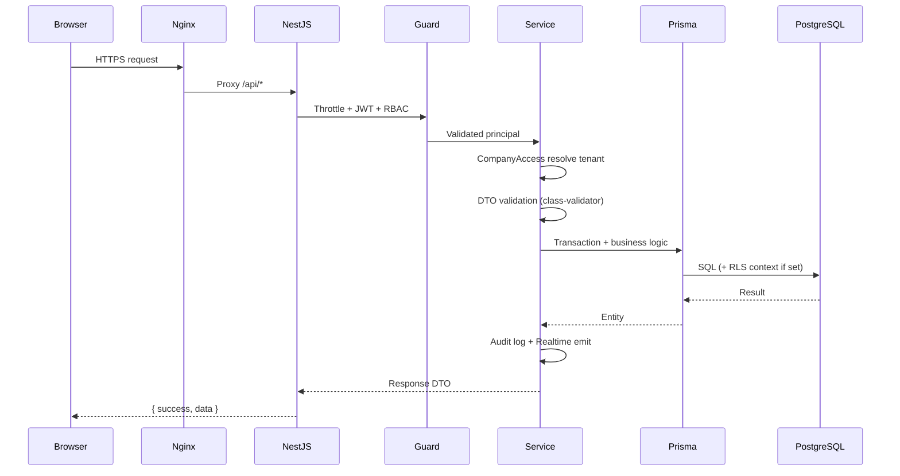

### 9.2 Inbound Orders

**Inbound:** Client portal or admin creates order → `InboundService` validates company/products → persists `inbound_orders` + lines → optional workflow start.

**Outbound (processing):** Confirm → `WorkflowBootstrapService.startInboundWorkflow()` → creates `workflow_instance` + `warehouse_tasks` (receive, putaway, QC) → operator executes via task API → `TaskInventoryEffectsService` posts ledger entries → `current_stock` updated → realtime events.

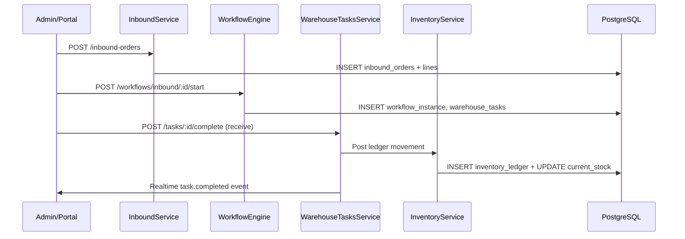

### 9.3 Outbound Orders

**Flow:** Create → confirm → outbound workflow (allocate, pick, pack, dispatch) → stock reserved then depleted → ledger `movement_type: outbound` → order status transitions.

### 9.4 Inventory

**Read path:** `GET /inventory/stock` → Prisma query on `current_stock` with company/warehouse filters → paginated response.

**Write path:** Task completion or adjustment → transaction with `fn_lock_stock_rows_ordered()` → ledger insert (idempotent via `ledger_idempotency`) → `current_stock` update with version check → audit log.

**Validation:** `InventoryConsistencyService` compares ledger sums vs current_stock snapshots.

### 9.5 Returns

**Flow:** Create from outbound → confirm → start receiving → line receive/inspect/disposition → `ReturnInventoryService.postInventory()` → ledger entries for restock/scrap → workflow completion.

### 9.6 Cycle Count

**Scheduled:** `CycleCountSchedulerService` (03:00 daily) → creates `cycle_count` from schedule → snapshot `current_stock` into lines.

**Execution:** Operator claims task → counts lines (blind count option) → submit review → variance detection → admin reconcile → `StockAdjustment` created → post reconciliation → complete.

### 9.7 Tasks (Workflow Engine)

**Flow:** Workflow DAG defines task sequence → `WarehouseTasksService` manages lease/progress/complete → `WorkflowExecutionGateGuard` enforces prerequisites and skills → `TaskInventoryEffectsService` applies side effects → `task_events` audit trail.

### 9.8 Products

**Admin:** Full CRUD with InternalAdmin guard for mutations. **Client portal:** Read + create (client_admin only). Billing gate may block suspended companies.

### 9.9 Locations

**Tree model:** `parent_id` hierarchy with `full_path` denormalization. Lookup by barcode for scanning. No full 11K tree rendered in UI — search/lookup pattern.

### 9.10 Reports

**Flow:** `GET /reports/:reportId/run|aggregate|export|kpis` → dedicated runners (`OperationalReportsRunner`, `InventoryIntelligenceReportsRunner`, `FinanceReportsRunner`) query OLTP aggregates → `ReportsFrameworkService.runCached` (Redis, 60s TTL) → CSV/XLS export via `ReportExportService`.

**Live reports (14):** warehouse-analysis, inventory, product-moves; worker-productivity, order-cycle-time, inbound-accuracy, outbound-fill-rate, sla-compliance; stock-aging, lot-expiry, capacity-utilization, return-rate; revenue-by-client, receivables-aging.

**Frontend:** `ReportWorkspace` + `ReportsNav` (`REPORT_CATALOG`); all execution is server-side — no client bulk-fetch runners.

### 9.11 Billing

**Flow:** Plan assignment → cycle start (frozen `rate_snapshot`) → daily usage processor (04:00) recalculates excess → cycle processor (every 15 min) closes expired cycles → invoice generation → overdue processor (06:00) → expiry reminders (08:00) → `BillingNotificationsService` creates in-app notifications.

### 9.12 Backup

**Manual:** `POST /backups` → `BackupRunnerService` executes `pg_dump` → encrypt → store in `/var/lib/emdad-wms/backups` → optional Drive sync.

**Restore:** `POST /backups/:id/restore` → maintenance mode (503 middleware) → `pg_restore` → health check.

### 9.13 Client Portal

**Flow:** Client login → JWT with `companyId` → all `/api/client/*` services filter by tenant → operational access check for billing restrictions → realtime scoped to company room.

---

## 10. Backup & Disaster Recovery

### 10.1 DR Architecture

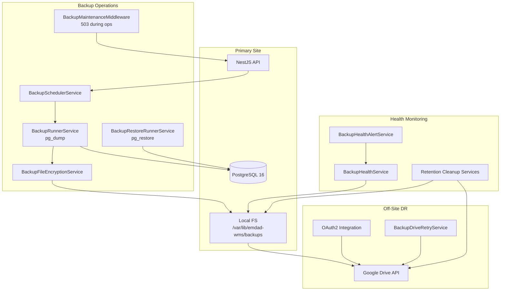

### 10.2 Local Backup

| Aspect | Detail |
|--------|--------|
| Tool | `pg_dump` / `pg_restore` via `BackupPgToolsService` |
| Storage path | `/var/lib/emdad-wms/backups/production` (configurable via `BACKUP_STORAGE_PATH`) |
| Encryption | AES via `BackupFileEncryptionService` (`BACKUP_ENCRYPTION_KEY`) |
| Types | Manual, scheduled (daily/weekly/monthly), upload |
| Pre-snapshot | Required before restore/factory reset (`BACKUP_PRE_SNAPSHOT_REQUIRED`) |
| Download | Time-limited tokens via `BackupDownloadTokenService` (300s TTL) |
| Cooldown | Manual backup cooldown: 900s default |

### 10.3 Restore

1. `POST /api/backups/:id/restore` (SuperAdmin)
2. `BackupMaintenanceService` enables maintenance mode → 503 on all routes except health
3. Optional pre-restore snapshot
4. `pg_restore` execution
5. Maintenance mode disabled
6. **Certified RTO:** ~9 seconds (BACKUP-QA-1)

### 10.4 Factory Reset

`POST /api/backups/factory-reset` (SuperAdmin, `FACTORY_RESET_ENABLED=true`):
1. Pre-snapshot backup
2. Drop and recreate schema
3. Run migrations + seed

### 10.5 Scheduled Backups

- CRUD via `/api/backups/schedules`
- Scheduler checks every minute for due schedules
- Retention policies: daily (7), weekly (4), monthly (12) defaults

### 10.6 Retention

| Layer | Service | Schedule | Defaults |
|-------|---------|----------|----------|
| Local | BackupRetentionCleanupService | 05:15 daily | keep 7 daily, 4 weekly, 12 monthly |
| Google Drive | BackupDriveRetentionCleanupService | 05:30 daily | keep 14 daily, 8 weekly, 24 monthly |

### 10.7 Health Monitoring

- `BackupHealthService` — evaluates recency, success rate, storage capacity
- `BackupHealthAlertService` — every 15 min; emits audit log alerts on degradation
- Admin UI: Settings → Backups → Health

### 10.8 Google Drive Integration

| Component | Purpose |
|-----------|---------|
| `BackupDriveAuthService` | OAuth2 connect flow |
| `BackupDriveSyncService` | Upload backup files post-creation |
| `BackupDriveRetryService` | Exponential backoff retries (max 8 attempts) |
| `BackupDriveRetentionService` | Drive-side retention policies |

**Config:** `BACKUP_GDRIVE_ENABLED`, `BACKUP_GDRIVE_CLIENT_ID`, `BACKUP_GDRIVE_CLIENT_SECRET`, `BACKUP_GDRIVE_REDIRECT_URI`

**Status (production):** Local backup verified (manual create + download). Google Drive OAuth **not provisioned** (`BACKUP_GDRIVE_ENABLED=false`).

---

## 11. Deployment Architecture

### 11.1 Infrastructure Architecture

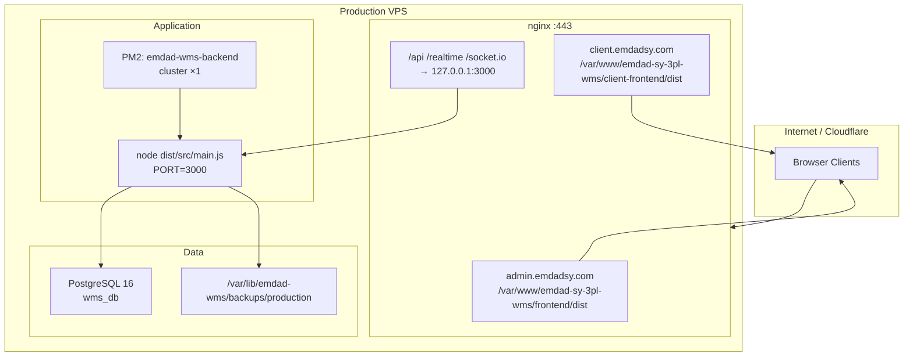


### 11.2 nginx Configuration

| File | Purpose |
|------|---------|
| `/etc/nginx/sites-available/emdad-wms-admin` | Admin SPA + proxy snippet |
| `/etc/nginx/sites-available/emdad-wms-client` | Client SPA + proxy snippet |
| `/etc/nginx/snippets/emdad-wms-backend-locations.conf` | `/api`, `/realtime`, `/socket.io` → upstream |
| `/etc/nginx/conf.d/00-emdad-wms-upstream.conf` | `upstream emdad_wms_backend { 127.0.0.1:3000 }` |
| SSL certs | `/etc/nginx/ssl/emdad-wms/` (Let's Encrypt / Cloudflare) |

**Same-origin pattern:** Browsers call `/api` on the same host as the SPA; nginx proxies to NestJS.

### 11.3 PM2 Configuration

| Setting | Production value |
|---------|------------------|
| Process name | `emdad-wms-backend` |
| CWD | `/var/www/emdad-sy-3pl-wms/backend` |
| Script | `dist/src/main.js` |
| Port | `3000` |
| Instances | 1 (config supports `max` via `ecosystem.config.js`) |
| Logs | `/var/log/emdad-wms/backend-{out,err}.log` |

### 11.4 Health Monitoring

| Endpoint | Access | Checks |
|----------|--------|--------|
| `GET /api/ops/health/live` | Public | Process alive |
| `GET /api/ops/health/ready` | Probe guard | DB, websocket, queues, process |
| `GET /api/backups/health` | Admin | Backup subsystem health |

**Production (2026-06-12):** live ✓ · ready ✓ · db ok ✓ · redis disabled · websocket ok

### 11.5 Deploy Procedure (Summary)

1. Pull/build from git (`staging` branch → production tree)
2. `npm run build` — backend, frontend, client-frontend
3. `npx prisma migrate deploy` on `wms_db`
4. `pm2 reload emdad-wms-backend`
5. Copy frontend `dist/` artifacts (nginx serves static files)
6. Smoke test `/api/ops/health/live`

See `PRODUCTION-DEPLOYMENT-PLAN.md` and `PRODUCTION-DEPLOYMENT-REPORT.md`.

### 11.6 Environment Paths

| Environment | App path | Backup path | PM2 config | Domains |
|-------------|----------|-------------|------------|---------|
| **Production** | `/var/www/emdad-sy-3pl-wms/` | `/var/lib/emdad-wms/backups/production` | `ecosystem.config.js` | admin.emdadsy.com · client.emdadsy.com |
| Staging | *Decommissioned 2026-06-12* | — | — | — |

### 11.7 Key File Index

| Concern | Path |
|---------|------|
| API bootstrap | `backend/src/main.ts` |
| Root module | `backend/src/app.module.ts` |
| Prisma schema | `backend/prisma/schema.prisma` |
| Admin router | `frontend/src/router.tsx` |
| Client router | `client-frontend/src/App.tsx` |
| Design system | `shared/design-system/ui/index.ts` |
| Task schemas | `packages/wms-task-execution/src/index.ts` |
| nginx deploy | `deploy/nginx/` |
| PM2 production | `ecosystem.config.js` |
| Env reference | `backend/.env.example` |
| Release audit | `RELEASE-AUDIT-3-REPORT.md` |
| API audit | `API-AUDIT.md` |
| Route audit | `ROUTE-AUDIT.md` |

### 11.8 Related Documentation

- `API-AUDIT.md` — Full API inventory with test coverage
- `ROUTE-AUDIT.md` — Frontend route inventory
- `BACKUP-GAP-ANALYSIS.md` — Backup system gaps
- `BILLING-GAP-ANALYSIS.md` — Billing domain gaps
- `CLIENT-PORTAL-GAP-ANALYSIS.md` — Client portal gaps
- `PERFORMANCE-GAP-ANALYSIS.md` — Performance findings
- `docs/ops/BACKUP-GOOGLE-DRIVE-RUNBOOK.md` — Google Drive ops runbook
- `improved_schema.sql` — Full database design reference
- `FINAL-INDEPENDENT-CERTIFICATION.md` — June 2026 production certification (86/100)
- `PRODUCTION-DEPLOYMENT-REPORT.md` — Production cutover report
- `STAGING-DECOMMISSION-REPORT.md` — Staging teardown (2026-06-12)
- `FINAL-USER-MANUAL.md` — Business user manual
- `SYSTEM-ARCHITECTURE.md` — Prior architecture reference (v1.0)

---

## 12. Known Limitations

### 12.1 Limitation Register

| ID | Category | Limitation | Severity | Notes |
|----|----------|------------|----------|-------|
| L-01 | DR | No off-site backup (Google Drive OAuth not configured) | **High** | Local DR only; code complete |
| L-02 | Scalability | Single PM2 instance on production VPS | Medium | No API horizontal redundancy |
| L-03 | Cache | Redis disabled in production | Medium | Report/task cache degraded to in-memory per process |
| L-04 | Security | JWT secrets shared from cutover — rotation pending | Medium | Post-deploy hardening item |
| L-05 | RBAC | API/UI mismatch for `wh_operator` on some read paths | Low | UI nav restricted; some APIs open |
| L-06 | Billing | No payment gateway integration | Medium | Invoice status manual only |
| L-07 | SLA | SLA escalation cron is notification stub | Low | Logs/audit only |
| L-08 | Ops | No external APM/alerting (Datadog/Prometheus) | Medium | Health endpoints only |
| L-09 | Technical debt | React 18 (admin) vs React 19 (client) | Medium | Upgrade coordination required |
| L-10 | Technical debt | Vendored `wms-task-execution` in 3 locations | Low | Manual sync on schema changes |
| L-11 | Data | Partition maintenance requires DB functions | Medium | `fn_create_next_partitions()` |
| L-12 | Ops | No containerization — host-dependent deploy | Medium | PM2 + nginx on bare VPS |
| L-13 | Repository | Nested orphan copy `emdad-sy-3pl-wms/emdad-sy-3pl-wms/` (~967 MB) | Low | Disk cleanup pending |

### 12.2 Production Certification Summary

| Metric | Value (June 2026) |
|--------|------------------:|
| Independent audit score | **86 / 100** |
| Classification | **Production Ready** |
| HTTP controllers | 37 |
| HTTP endpoints | ~210 |
| Prisma models | 44 |
| Cron jobs | 11 |
| Reports (live) | 14 |
| Staging environment | **Decommissioned** |

**Primary remaining gaps:** Off-site DR (Google Drive), external alerting, Redis/horizontal scaling, payment gateway.

## 13. Future Roadmap

| Priority | Initiative | Target outcome |
|----------|------------|----------------|
| P0 | Provision Google Drive OAuth | Off-site DR copy of backups |
| P0 | External alerting on health endpoints | PagerDuty/Slack incident response |
| P1 | Rotate JWT secrets post-cutover | Security hardening |
| P1 | Scale PM2 to 2+ instances; enable Redis | Horizontal API + distributed cache |
| P1 | S3-compatible off-site backup replication | DR independent of Google |
| P2 | Publish OpenAPI 3.1 specification | Integration documentation |
| P2 | Payment gateway integration | Automated invoice collection |
| P2 | Prometheus + Grafana | Operational visibility |
| P2 | Unify React/Vite versions (admin + client) | Reduced maintenance |
| P3 | Containerize deployment | Portable infrastructure |
| P3 | PostgreSQL read replica for reports | OLTP/OLAP separation |
| P3 | Async report job queue | Heavy reports off request thread |

## 14. Appendix A — Authentication & Authorization

### 14.1 Security Architecture

```mermaid
flowchart TB
    subgraph login [Login Flow]
        User[User credentials]
        BruteForce[LoginBruteForceService]
        Password[PasswordService bcrypt]
        Session[RefreshSessionService]
        JWT[JwtService]
        Cookies[HTTP-only cookies<br/>access_token + refresh_token]
    end

    subgraph request [Request Flow]
        Req[HTTP Request]
        Throttle[ThrottlerGuard 120/min]
        JwtGuard[JwtAuthGuard]
        RolesGuard[RolesGuard opt-in]
        AdminGuard[InternalAdminGuard opt-in]
        CompanyAccess[CompanyAccessService<br/>X-Company-Id header]
        Service[Domain Service]
        RLS[PostgreSQL RLS context]
    end

    User --> BruteForce --> Password --> Session --> JWT --> Cookies
    Req --> Throttle --> JwtGuard --> RolesGuard --> AdminGuard --> CompanyAccess --> Service --> RLS
```

### 14.2 Login Flow (Internal Admin)

1. `POST /api/auth/login` with email + password
2. `LoginBruteForceService` checks IP lockout
3. User lookup; reject if `company_id` set (client accounts blocked)
4. bcrypt password verify; upgrade legacy scrypt hash if needed
5. `RefreshSessionService.createSession()` — stores session with `token_version`
6. Issue access JWT (15m default) + refresh JWT (7d default)
7. Set HTTP-only cookies: `access_token`, `refresh_token`
8. Audit log: `AUTH_LOGIN_SUCCESS`
9. Realtime presence broadcast

### 14.3 JWT Flow

**Internal access token payload:**
```json
{ "sub": "user-uuid", "email": "...", "role": "wh_manager", "typ": "internal", "ver": 1 }
```

**Client access token payload:**
```json
{ "sub": "user-uuid", "email": "...", "role": "client_admin", "companyId": "...", "typ": "client" }
```

Token sources: `Authorization: Bearer` header or cookie (`access_token` / `client_access_token`).

### 14.4 Refresh Strategy

1. `POST /api/auth/refresh` with refresh cookie
2. Validate refresh JWT (`typ: internal`, `kind: refresh`)
3. Check `auth_refresh_sessions` — session not revoked, `token_version` matches
4. Rotate: new `jti` recorded in `auth_refresh_rotations` (replay protection)
5. Issue new access + refresh tokens; update session `current_jti`
6. Old refresh `jti` rejected on replay

**Invalidation:** Increment `users.token_version` on password change or admin suspend → all sessions invalidated.

### 14.5 Role Model

| Role | Audience | Auth Group | company_id |
|------|----------|------------|------------|
| `super_admin` | Internal | ADMIN | NULL |
| `wh_manager` | Internal | ADMIN | NULL |
| `finance` | Internal | ADMIN | NULL |
| `wh_operator` | Internal | OPERATOR | NULL |
| `client_admin` | Client portal | — | Required |
| `client_staff` | Client portal | — | Required |

### 14.6 Permission Model

**Coarse RBAC (frontend + backend):**
- `@Roles(AuthGroup.ADMIN)` — super_admin, wh_manager, finance
- `@Roles(AuthGroup.OPERATOR)` — wh_operator
- `InternalAdminGuard` — super_admin, wh_manager only
- `SuperAdminGuard` — super_admin only (backups, factory reset)

**Fine-grained:** Route-level RBAC in frontend (`lib/rbac.ts`); endpoint-level guards on backend.

### 14.7 Client Isolation

| Layer | Mechanism |
|-------|-----------|
| Separate SPA | Independent build on `client.emdadsy.com` |
| Separate API prefix | `/api/client/*` with `CLIENT_JWT_SECRET` |
| JWT tenant claim | `companyId` in token; services force filter |
| Backend module | Dedicated `client-portal/` controllers |
| Realtime | Socket joins `company:{id}` room only |
| PostgreSQL RLS | `pol_client_access` policy on tenant tables |
| Billing gate | Restricted accounts block operational APIs |

**Internal multi-tenant access:** `user_company_access` table + `X-Company-Id` header via `CompanyAccessService`.

---

## 14. Appendix B — Background Jobs

### 14.8 Scheduler Map

All jobs run **in-process** on the API server via `@nestjs/schedule`. No separate worker process.

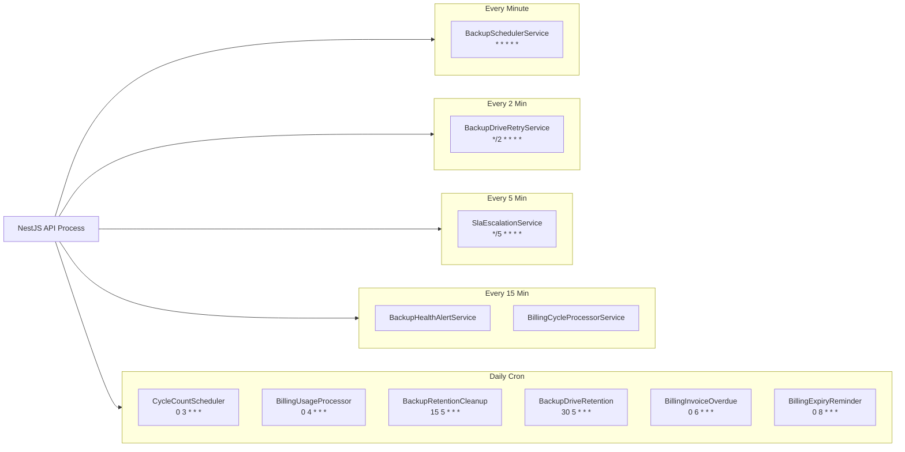

### 14.9 Job Inventory

| Service | Cron | Purpose |
|---------|------|---------|
| BackupSchedulerService | `* * * * *` | Execute due backup schedules |
| BackupDriveRetryService | `*/2 * * * *` | Retry failed Google Drive uploads |
| BackupHealthAlertService | `*/15 * * * *` | Evaluate backup health, emit alerts |
| BackupRetentionCleanupService | `15 5 * * *` | Local backup retention cleanup |
| BackupDriveRetentionCleanupService | `30 5 * * *` | Google Drive retention cleanup |
| BillingCycleProcessorService | `*/15 * * * *` | Process expired billing cycles |
| BillingUsageProcessorService | `0 4 * * *` | Daily excess volume/weight recalculation |
| BillingInvoiceOverdueProcessorService | `0 6 * * *` | Mark invoices overdue + notify |
| BillingExpiryReminderService | `0 8 * * *` | Billing cycle expiry reminders |
| CycleCountSchedulerService | `0 3 * * *` | Auto-generate scheduled cycle counts |
| SlaEscalationService | `*/5 * * * *` | Task SLA breach escalation (notification stub) |

**Notifications:** No standalone scheduler. Created synchronously by domain events and billing cron processors via `BillingNotificationsService`.

---

*This document reflects the production system as of 2026-06-12. Generated as part of PHASE-CLOSE-4 definitive architecture documentation. No application code was modified during its creation.*
