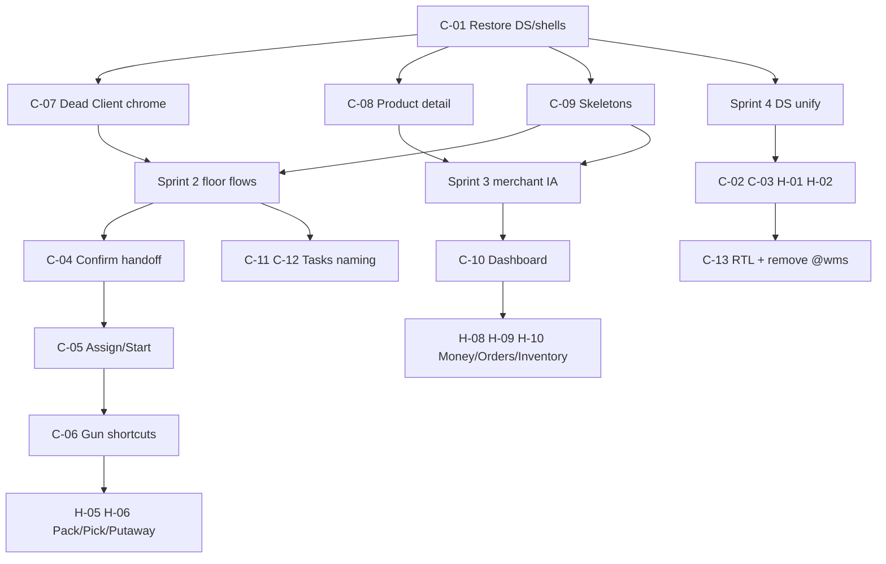

# UI Implementation Plan

**Source:** `MASTER_UI_AUDIT.md` (64 deduped issues)  
**Environment:** Staging only (`/var/www/emdad-sy-3pl-wms-staging`)  
**Assumption:** 2-week sprints · ~2 frontend engineers (or 1 senior FE equivalent capacity ~8–10 focused eng-days/week)  
**Effort unit:** eng-days (1 eng-day ≈ one engineer focused for one day)  
**Constraint:** No production mutations; smoke on staging Admin/Client domains only  

---

## Goals by sprint

| Sprint | Theme | Outcome |
|--------|--------|---------|
| **1** | Foundation & trust | Buildable SoT restored; broken Client chrome gone; product detail works; loading/skeletons; quick a11y |
| **2** | Warehouse floor speed | Confirm→task handoff; Assign/Start simplified; gun-first receive/putaway/pick MVP |
| **3** | Merchant morning + ops clarity | Client dashboard/money/orders IA; Tasks identity/search; naming glossary; pack/dispatch speed |
| **4** | Design system unification | One shell/@ds ownership; retire clones/`@wms`; RTL/i18n completeness; Medium debt |

---

## Recommended implementation order (global)

**Rule:** Never start Sprint 4 page migrations until Sprint 1 restore is verified green. Prefer **remove broken UI** before **wire complex behavior** when both fix trust (Sprint 1).

---

## Effort roll-up

| Sprint | Est. eng-days | Calendar (2 FE) | Risk |
|--------|---------------:|-----------------|------|
| Sprint 1 | 18–22 | ~2 weeks | Low–Med (mostly restore + surgical fixes) |
| Sprint 2 | 22–28 | ~2 weeks | High (workflow/task state changes) |
| Sprint 3 | 20–26 | ~2 weeks | Med (IA + copy + Client pages) |
| Sprint 4 | 28–36 | ~2.5–3 weeks* | High (cross-app migration) |
| **Total** | **~88–112** | **~8–10 weeks** | — |

\*Sprint 4 may spill into a short Sprint 4b if React major alignment is included.

**Out of sprint (backlog):** Most Low + Nice to Have (~12–18 eng-days) after Sprint 4.

---

# Sprint 1 — Foundation & trust

**Theme:** Make the tree buildable and stop shipping obviously broken UI.  
**Exit criteria:** Staging Admin + Client build from restored sources; inbound/outbound tables have no dead Filters/…/checkboxes; `/products/:id` opens detail; list loads keep shell + skeletons; Admin login labels visible.

### Work items

| ID | Issue | Work | Effort | Depends on |
|----|-------|------|--------:|------------|
| S1-1 | **C-01** | `git checkout HEAD --` restore `@ds` tokens/globals/ui barrel, Admin `Layout`, Client `PortalLayout`, `design-v2` cores; verify Admin + Client builds; smoke login | 2–3 | — **BLOCKER** |
| S1-2 | **C-07** | Remove or hide Client Filters button, checkbox columns, ellipsis until real; keep working status `<select>` + search | 1–2 | S1-1 |
| S1-3 | **C-08** | Implement Client product detail page/modal; remove `/products/:id` → list redirect; wire Dashboard inventory row | 3–4 | S1-1 |
| S1-4 | **C-09** | Replace full-page “Loading…” with shell-preserving `@ds` Skeleton for Admin list recipe + Client dashboard KPIs/tables | 3–4 | S1-1 |
| S1-5 | **H-14** (partial) | Aria-labels on remaining icon buttons; visible Admin login labels (not sr-only only); Client SkipNav stub | 2 | S1-1 |
| S1-6 | **H-17** | Inbound create: show why Next is disabled or inline required errors | 1 | S1-1 |
| S1-7 | **H-15** (partial) | Unify notification badge color (sidebar vs topbar) | 0.5 | S1-1 |
| S1-8 | **M-16** | Fix staging manager demo login / seed so RBAC smoke is possible | 1–2 | — (backend/seed) |
| S1-9 | QA gate | Playwright smoke: login, inbound list, products detail, dashboard load throttle | 2 | S1-2…S1-4 |

**Sprint 1 total:** **18–22 eng-days**

### Dependencies
- **S1-1 blocks everything** in this and later sprints.
- S1-8 may need backend/seed access (still staging-only).
- Do **not** start DS unification (C-02) beyond using existing `@ds` Skeleton/Button.

### Definition of Done
- [ ] `frontend` + `client-frontend` build clean on staging tree  
- [ ] No dead Filters/checkbox/ellipsis on Client inbound/outbound  
- [ ] Product detail reachable from list + dashboard  
- [ ] Slow network: skeletons visible, sidebar remains  
- [ ] Smoke script green on staging domains  

---

# Sprint 2 — Warehouse floor speed

**Theme:** Cut gate clicks and make scan paths usable for receiving → putaway → pick.  
**Exit criteria:** Confirm lands on next task; operators can Start in one click when assigned/self; receive/putaway/pick support wedge scan + Enter-advance MVP; Tasks list shows order number.

### Work items

| ID | Issue | Work | Effort | Depends on |
|----|-------|------|--------:|------------|
| S2-1 | **C-04** | After Confirm inbound/outbound: primary CTA + auto-nav to next runnable task (Start-ready when possible) | 3–4 | S1-1; task APIs |
| S2-2 | **C-05** | Collapse Assign→Start: “Start” for self/assigned; keep Assign for managers assigning others; preserve next-task card chaining | 4–5 | S2-1 |
| S2-3 | **C-11** (partial) | Tasks list: human order # column; friendly task type labels; fix search to order # + task id | 3 | S1-1 |
| S2-4 | **C-06** (MVP) | Shared wedge scan field component; Receiving: scan-to-line + Enter next + one-tap receive expected; filter Enter=Apply | 5–6 | S2-2 |
| S2-5 | **H-06** (putaway/pick) | Putaway suggested bin one-tap + dest scan commit; Pick: pick-required shortcut + Next-bin scan confirm; Packing checkbox help text | 4–5 | S2-4 |
| S2-6 | **M-13** | Pipeline copy after receive (QC→putaway); quarantine in Tasks sub-nav; blocked banner deep-link | 2 | S2-1 |
| S2-7 | **H-07** (Admin lists partial) | Applied filter chips + quiet Reset on FilterPanel; Enter applies; first-run vs filtered empty copy on Inbound/Tasks | 2–3 | S1-1 |
| S2-8 | QA | Floor path E2E on staging: create inbound → confirm → receive → complete → next task | 2 | S2-1…S2-5 |

**Sprint 2 total:** **22–28 eng-days**

### Dependencies
- **S2-1 before S2-2** (handoff without Start simplification still helps; together is best).  
- **S2-4 before S2-5** (shared scan primitive).  
- Task status/`runnable` API behavior must be understood; avoid backend contract changes unless required—prefer UI orchestration.  
- Pack/Dispatch gun path (**H-05**) deferred to Sprint 3 to keep Sprint 2 shippable.

### Definition of Done
- [ ] Confirm → visible next task ≤1 click (ideally auto)  
- [ ] Self-assigned Start is one control  
- [ ] Receive happy path works with keyboard wedge (no camera modal required)  
- [ ] Tasks searchable by order number  
- [ ] Staging warehouse smoke checklist signed off  

---

# Sprint 3 — Merchant morning + ops clarity

**Theme:** Client can answer orders / stock / money in one session; packing/dispatch faster; naming consistent.  
**Exit criteria:** Dashboard exception-first with click-through; COD labeled consistently; Online orders primary; inventory shows Available/Reserved; pack scan-commit + Delivery/Dispatch label fixed.

### Work items

| ID | Issue | Work | Effort | Depends on |
|----|-------|------|--------:|------------|
| S3-1 | **C-10** | Client Dashboard redesign above fold: stuck orders, sellable stock, COD ready/pending; clickable KPIs; fix Returned + “needing attention” semantics | 4–5 | S1-3, S1-4 |
| S3-2 | **H-08** | Money IA: COD primary (“Cash on delivery”); Billing/Invoices secondary; unify My profits / COD / View COD labels; deep-link COD cards | 3 | S3-1 |
| S3-3 | **H-09** | Demote Inbound/Outbound weight vs Online orders; remove OMS jargon on detail; merchant status labels; subtitle fix | 3 | S3-1 |
| S3-4 | **H-10** | Products/Inventory list: Available/Reserved columns; Status = stock health not only lifecycle; nav label Inventory or dual tabs | 3–4 | S1-3 |
| S3-5 | **H-05** | Pack: scan-to-add; finalize+complete shortcut for single package; Dispatch scan-commit; rename Delivery↔Dispatch consistently | 4–5 | S2-4 |
| S3-6 | **C-12** | Naming glossary applied: Customers/Clients, Returns vs OMS Returns, Receive/Receiving — nav + CTA + toast pass | 2–3 | S2-3 |
| S3-7 | **H-16** | Topbar search: label Quick jump **or** entity search MVP; platform-aware Ctrl/⌘ hint | 2 | S1-1 |
| S3-8 | **H-15** (rest) | Notification deep links for ecommerce/returns/COD; unread filter not page-only | 2 | S3-1 |
| S3-9 | **H-12** (MVP) | Internal transfer: scan source/dest shortcuts + consecutive create without full modal reset | 2–3 | S2-4 |
| S3-10 | QA | Merchant morning script + pack→dispatch staging script | 2 | S3-1…S3-5 |

**Sprint 3 total:** **20–26 eng-days**

### Dependencies
- Product detail (S1-3) and skeletons (S1-4) unlock honest dashboard inventory.  
- Scan primitive (S2-4) unlocks pack/dispatch/transfer speed.  
- Glossary (S3-6) should land after Tasks labels (S2-3) to avoid double rewrites.  
- Full design-system shell swap still **not** in this sprint (avoid thrash).

### Definition of Done
- [ ] Merchant 10-second test: can state stuck orders, sellable SKU, COD ready  
- [ ] No “My profits” vs “COD” naming split in nav/CTA/H1  
- [ ] Pack single-carton path ≤ prior click count by measurable margin  
- [ ] Delivery/Dispatch one user-facing term everywhere  

---

# Sprint 4 — Design system unification & i18n

**Theme:** One UI ownership model; remove `@wms`; complete AR; retire forest/legacy.  
**Exit criteria:** Client shell on `@ds` AppShell; shared list primitives in `@ds`; Admin local Button/DataTable/PageHeader deprecated path; no `@wms` imports; AR nav fully translated; forest hex purged from active UI.

### Work items

| ID | Issue | Work | Effort | Depends on |
|----|-------|------|--------:|------------|
| S4-1 | **C-02** + **H-02** | Promote `design-v2` Card/Badge/ListPageHeader/TableFooterPagination/IconButton into `@ds`; document SoT | 5–6 | S1-1 |
| S4-2 | **H-01** | Client `PortalLayout` → `@ds` AppShell/Sidebar/Topbar (portal slots); keep search/COD affordances | 5–6 | S4-1 |
| S4-3 | **C-03** | Move TextField/SelectField/Combobox/StatusBadge/pagination hooks to `@ds` or `@emdad/ds`; **remove `@wms` aliases**; align React major (spike if needed) | 6–8 | S4-1 |
| S4-4 | Admin migration | Point Admin lists to `@ds` DataTable/Button/AppPageHeader; delete or thin-wrap locals; FilterPanel → shared filter recipe | 5–7 | S4-1 |
| S4-5 | **H-03** | Purge forest `#1a7a44` from LoginScreen, ServerPaginationBar, globals legacy btn/sidebar/badge CSS | 2–3 | S4-2, S4-4 |
| S4-6 | **C-13** + **M-07** | Complete AR nav/status/date strings; unify `wms-ui-language` / `client-ui-language`; visible language toggle | 3–4 | S4-2 |
| S4-7 | **H-04** + **M-03** | List recipe: one title + one CTA; flatten card stacks on pilot pages (Inbound Admin + Online Client) then template | 3 | S4-4 |
| S4-8 | **M-01** (optional stretch) | Package `@emdad/ds` with version + build (if time; else keep alias but single SoT) | 3–4 | S4-1 |
| S4-9 | Medium sweep | M-05 sub-nav unify, M-08 returns triage, M-09 invoice headlines, M-10 focus rings, H-18 onboarding empties | 4–5 | S4-1+ |
| S4-10 | QA / visual | Cross-portal regression + RTL suite + build both apps | 2–3 | S4-2…S4-6 |

**Sprint 4 total:** **28–36 eng-days** (consider **Sprint 4b** if React 19 alignment for Admin slips)

### Dependencies
- Requires stable Sprint 1–3 product behavior (avoid redesigning pages twice).  
- **S4-1 before S4-2/S4-3/S4-4.**  
- React major alignment (part of C-03) may need a dedicated spike day; if blocked, remove `@wms` first while pinning React.  
- Forest purge after shell migration to avoid fighting legacy CSS.

### Definition of Done
- [ ] Zero `@wms/` imports in Client  
- [ ] Client and Admin share AppShell family  
- [ ] One Button + one Status + one list header API from `@ds`  
- [ ] AR sidebar fully Arabic (no Contracts/Billing/OMS English leftovers)  
- [ ] No forest primary greens in live chrome  

---

## Cross-sprint dependency matrix

| Item | Blocks | Blocked by |
|------|--------|------------|
| C-01 Restore | All UI work | — |
| C-07 / C-08 / C-09 | Merchant trust, dashboard honesty | C-01 |
| C-04 Confirm handoff | C-05 value, floor E2E | C-01 |
| C-05 Assign/Start | C-06 adoption (operators reach panels faster) | C-04 |
| C-06 Scan primitive | H-05, H-06, H-12, cycle later | C-05 (soft), C-01 |
| C-10 Dashboard | H-08, H-09 value | C-08, C-09 |
| C-02 / C-03 DS unify | Long-term velocity | C-01; prefer after Sprint 2–3 product fixes |
| C-13 RTL complete | AR launch quality | Shell unify (S4-2) helps |

---

## Backlog after Sprint 4 (not scheduled)

| Priority | IDs | Est. |
|----------|-----|------|
| Medium remainder | M-11, M-12, M-14, M-15 | 5–7d |
| Low | L-01…L-10 | 4–6d |
| Nice to Have | N-01…N-06 | 5–8d |

---

## Risk register

| Risk | Sprint | Mitigation |
|------|--------|------------|
| Task handoff needs API fields not exposed | 2 | Feature existing workflow timeline payload before coding; CTA-only fallback |
| Wedge scan conflicts with camera modal users | 2–3 | Keep camera as secondary; wedge is default focus |
| DS migration regresses Admin lists | 4 | Pilot 2 pages; feature flag or incremental replace |
| React 18/19 alignment blows Sprint 4 | 4 | Split 4b; remove `@wms` without upgrading Admin first |
| Scope creep into production | All | Staging-only rule; no prod PM2/rebuild |

---

## Team shape (recommended)

| Role | Focus |
|------|--------|
| FE A | Sprint 1 restore/skeletons/a11y → Sprint 2 task handoff/Assign → Sprint 4 Admin `@ds` migration |
| FE B | Sprint 1 Client dead chrome/product detail → Sprint 2 scan/receive → Sprint 3 Client dashboard/money → Sprint 4 Client shell |
| Shared | Glossary/copy owner (PM or FE lead) for C-12; QA smoke each sprint exit |

---

## Sprint exit checklist (every sprint)

1. Staging Admin + Client build  
2. Smoke against `staging-admin.emdadsy.com` / `staging-client.emdadsy.com`  
3. Update `MASTER_UI_AUDIT.md` issue status (or tracking board) for closed IDs  
4. No production deploys from this plan without explicit approval  

---

*Plan derived from `MASTER_UI_AUDIT.md`. Effort ranges assume familiarity with staging codebase; add ~20% buffer for first cycle.*
