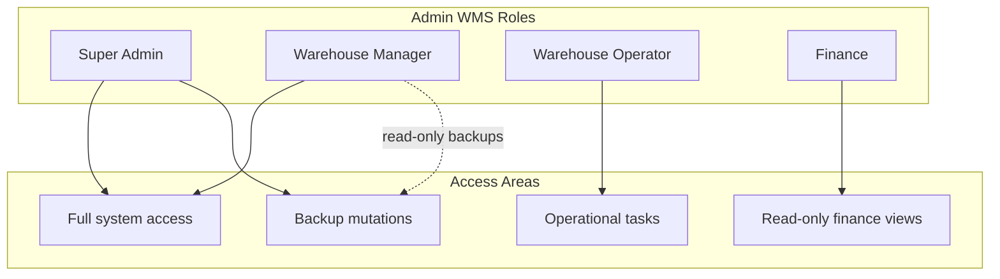
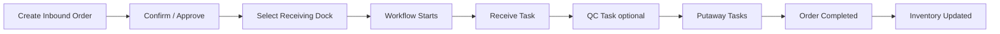
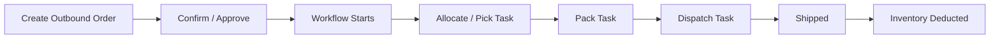
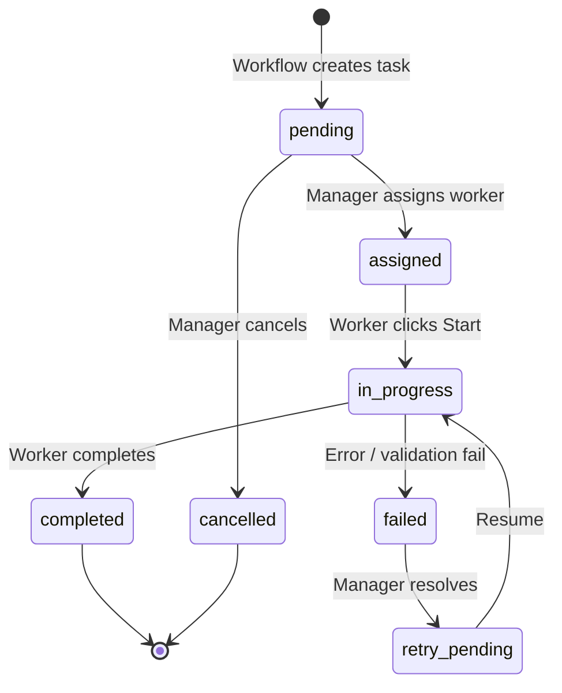
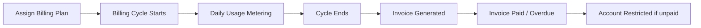

# EMDAD 3PL WMS — End-User Manual

**Document version:** 1.0  
**Generated:** 2026-06-11  
**Audience:** Warehouse staff, finance users, super administrators, and client portal users  
**Platforms:** Admin WMS (`admin.emdadsy.com`) and Client Portal (`client.emdadsy.com`)

---

## Table of Contents

1. [Introduction](#1-introduction)
2. [Phase 1 — User Roles](#2-phase-1--user-roles)
3. [Phase 2 — Login & Navigation](#3-phase-2--login--navigation)
4. [Phase 3 — Products Workflow](#4-phase-3--products-workflow)
5. [Phase 4 — Locations Workflow](#5-phase-4--locations-workflow)
6. [Phase 5 — Inbound Workflow](#6-phase-5--inbound-workflow)
7. [Phase 6 — Outbound Workflow](#7-phase-6--outbound-workflow)
8. [Phase 7 — Inventory Workflow](#8-phase-7--inventory-workflow)
9. [Phase 8 — Task Workflow](#9-phase-8--task-workflow)
10. [Phase 9 — Reporting Workflow](#10-phase-9--reporting-workflow)
11. [Phase 10 — Backup Workflow](#11-phase-10--backup-workflow)
12. [Phase 11 — Billing Workflow](#12-phase-11--billing-workflow)
13. [Phase 12 — Client Portal Workflow](#13-phase-12--client-portal-workflow)
14. [Phase 13 — Common Scenarios](#14-phase-13--common-scenarios)
15. [Phase 14 — UX Findings](#15-phase-14--ux-findings)

---

## 1. Introduction

EMDAD 3PL WMS is a warehouse management system for third-party logistics operations. The platform has two separate applications:

| Application | URL | Who uses it |
|-------------|-----|-------------|
| **Admin WMS** | `admin.emdadsy.com` | EMDAD warehouse staff and finance |
| **Client Portal** | `client.emdadsy.com` | 3PL customers (client companies) |

This manual describes **exactly what you see and click** in each application, based on the live UI as of June 2026. Workflows follow the system's default **task-only mode**: receiving, picking, packing, and dispatch happen through the **Tasks** module, not directly on order detail pages.

**Language support:** Both applications support English and Arabic. Switch language from the user menu in the top-right corner (stored in browser localStorage).

---

## 2. Phase 1 — User Roles

### 2.1 Admin WMS Roles

#### Super Admin

**Home page:** Dashboard (`/dashboard/overview`)

**Capabilities:**
- Full access to every sidebar section
- Create and manage clients, users, products, locations, warehouses
- Confirm, cancel, and oversee all orders
- Execute and manage warehouse tasks
- Create billing plans, renew cycles, mark invoices paid
- **Backup mutations:** create backup, upload, restore, factory reset
- View and export audit logs
- All Settings → Backups tabs including Upload, Restore, Factory Reset

**Typical users:** System owner, IT administrator

---

#### Warehouse Manager (Admin)

**Home page:** Dashboard (`/dashboard/overview`)

**Capabilities:**
- Same sidebar navigation as Super Admin
- Manage products, locations, warehouses, clients, users
- Confirm and approve orders; oversee task execution
- Review cycle count variances; approve adjustments
- Create and edit billing plans; renew billing cycles; mark invoices paid
- View backup history, schedules, health, and Google Drive status
- **Cannot:** upload backups, restore, factory reset, or create manual backups (read-only backup access)

**Typical users:** Warehouse supervisor, operations manager

---

#### Warehouse Operator (Worker)

**Home page:** Tasks (`/tasks`) — lands here automatically after login

**Capabilities:**
- **Tasks** — receive, putaway, pick, pack, dispatch (scoped to assigned worker)
- **Cycle count** — My tasks tab; execute blind counts (requires linked Worker profile)
- **Returns** — process returns on the Process page
- **Cannot access:** Dashboard, Orders, Inventory, Products, Locations, Reports, Billing, Users, Clients, Audit logs, Settings

**Restrictions:**
- Task list auto-filters to tasks assigned to your worker ID
- Cycle count execution requires a Worker profile linked to your user account (`workerId` on login)
- Internal transfer page is not accessible (managers only)

**Typical users:** Floor picker, receiver, packer

---

#### Finance

**Home page:** Dashboard (`/dashboard/overview`)

**Capabilities:**
- View dashboard KPIs and billing widgets
- View inbound and outbound orders (read-only)
- View inventory stock and ledger (read-only)
- View and export reports
- View billing plans, invoices, and dashboard (read-only — no create/edit/renew buttons)
- View and export audit logs
- **Cannot access:** Tasks, Products, Locations, Returns, Cycle count, Users, Clients, Settings

**Typical users:** Accounts receivable, billing analyst

---

### 2.2 Client Portal Roles

#### Client Admin

**Home page:** Dashboard (`/dashboard`)

**Capabilities:**
- Full portal access: Dashboard, Products, Orders, Stock, Billing, Notifications
- Create products, inbound orders, and outbound orders
- View billing plan, current invoice, and invoice history
- Receive billing and order notifications

---

#### Client Staff

**Home page:** Dashboard (`/dashboard`)

**Capabilities:**
- Dashboard (without billing widgets), Orders, Stock, Notifications
- Create inbound and outbound orders
- **Cannot access:** Products page, Billing page (redirected to Dashboard if attempted)

---

### 2.3 Role Comparison Table

| Feature | Super Admin | WH Manager | WH Operator | Finance | Client Admin | Client Staff |
|---------|:-----------:|:----------:|:-----------:|:-------:|:------------:|:------------:|
| Dashboard | ✅ | ✅ | ❌ | ✅ | ✅ | ✅ |
| Orders (view) | ✅ | ✅ | ❌ | ✅ | ✅ | ✅ |
| Orders (create) | ✅ | ✅ | ❌ | ❌ | ✅ | ✅ |
| Inventory | ✅ | ✅ | ❌ | ✅ | Stock only | Stock only |
| Tasks (execute) | ✅ | ✅ | ✅ | ❌ | ❌ | ❌ |
| Products (admin) | ✅ | ✅ | ❌ | ❌ | ✅ create | ❌ |
| Locations | ✅ | ✅ | ❌ | ❌ | ❌ | ❌ |
| Cycle count | ✅ | ✅ | ✅ | ❌ | ❌ | ❌ |
| Returns | ✅ | ✅ | ✅ | ❌ | ❌ | ❌ |
| Reports | ✅ | ✅ | ❌ | ✅ | ❌ | ❌ |
| Billing (admin) | ✅ mutate | ✅ mutate | ❌ | ✅ read | ✅ read | ❌ |
| Backup restore | ✅ | ❌ | ❌ | ❌ | ❌ | ❌ |
| Audit logs | ✅ | ✅ | ❌ | ✅ | ❌ | ❌ |
| Users / Clients | ✅ | ✅ | ❌ | ❌ | ❌ | ❌ |

---

## 3. Phase 2 — Login & Navigation

### 3.1 Logging In (Admin WMS)

1. Open your admin URL (e.g. `https://admin.emdadsy.com`).
2. You are redirected to **Log in to your account**.
3. Enter your **email** and **password**.
4. Click **Sign in**.
5. On success, you are taken to your role's home page:
   - Super Admin / Manager / Finance → **Dashboard**
   - Warehouse Operator → **Tasks**

**If login fails:** An error message appears below the form. After repeated failures, your IP may be temporarily locked (rate limiting).

**Client accounts cannot log in here.** Use the Client Portal instead.

> **Screenshot reference:** Login screen uses the shared `LoginScreen` component from the design system. Evidence captures: `docs/evidence/release-r3-e2e/`

---

### 3.2 Logging In (Client Portal)

1. Open `https://client.emdadsy.com`.
2. Enter **email** and **password**.
3. Click **Sign in**.
4. You land on the **Dashboard**.

**Session expiry:** If your session expires, you are redirected to login automatically.

---

### 3.3 Admin Shell Layout

After login, every page shares the same layout:

| Area | Location | Purpose |
|------|----------|---------|
| **Sidebar** | Left | Main navigation — items vary by role |
| **Topbar** | Top | Page context, notifications bell, user menu |
| **Content** | Center | Page content with optional sub-navigation pills |
| **Sub-nav pills** | Below topbar | Section tabs (e.g. Stock / Ledger / Adjustments) |

**User menu (top-right):**
- Your name and role
- **Language** — switch EN / AR
- **Sign out**

**Notifications bell:** Shows recent in-app notifications. Click an item to navigate to the related order or resource. There is no dedicated Notifications page in the admin app — notifications appear only in the topbar dropdown.

---

### 3.4 Navigation Patterns

#### Sidebar navigation

Click any sidebar item to navigate. Active item is highlighted. On mobile, tap the hamburger menu (☰) to open the sidebar overlay.

#### Section sub-navigation

Many sections use pill tabs below the page header:

| Section | Sub-nav tabs |
|---------|-------------|
| Orders | Inbound orders \| Outbound orders |
| Inventory | Stock \| Ledger \| Adjustments |
| Tasks | Tasks \| Receive \| Putaway \| Pick \| Pack \| Delivery \| Internal transfer |
| Cycle count | Dashboard \| My tasks |
| Users | Warehouse users \| Client users |
| Billing | Dashboard \| Plans \| Invoices |
| Reports | Warehouse analysis \| Inventory \| Product moves |
| Settings | History \| Upload \| Restore \| … (9 backup tabs) |

#### Search and filters

Most list pages use a **filter panel** with this pattern:

1. Enter search terms or select dropdown values in the filter fields.
2. Click **Apply filters** to run the search.
3. Click **Reset filters** (or **Reset**) to clear.

**Important:** Filters do not apply automatically as you type — you must click **Apply filters**.

**Barcode scanning:** Pages for Products, Locations, Inventory, and order line entry include a **Scan barcode** button that opens the camera scanner modal.

#### Pagination

List pages load data in batches and show **50 rows per page** by default. Use **Previous** / **Next** or page numbers at the bottom of tables.

---

### 3.5 Dashboard (Admin)

**Path:** Sidebar → **Dashboard** → `/dashboard/overview`

**What you see:**
- Metric cards: catalog items, registered clients, open inbound/outbound orders, open tasks
- **Open inbound orders** and **Open outbound orders** stage breakdown charts
- **Open tasks by type** chart
- **Warehouse capacity consumption** gauge
- **Soon expiry lots** (next 6 months)
- Recent open order lists with **Go to inbound/outbound orders** links
- Billing widgets: expiring clients, overdue clients, recent invoices, suspended accounts

**Actions:** Read-only overview. Click any widget or link to navigate to the relevant section.

---

## 4. Phase 3 — Products Workflow

**Who can do this:** Super Admin, Warehouse Manager (admin); Client Admin (client portal — create only)

**Paths:** Admin → Sidebar → **Products** (`/products`)

---

### 4.1 Search and Browse Products

1. Go to **Products**.
2. In the **Product filters** panel:
   - Enter a search term.
   - Choose **Search by**: Product name | SKU | Barcode.
   - Optionally filter by **Client** (All clients or a specific client).
   - Optionally tap **Scan barcode** to search by scanned code.
3. Click **Apply filters**.
4. Browse the table: Product Name, Client Name, SKU, Barcode, UOM, Status.
5. Click a **barcode** cell to view the barcode image.
6. Click a **row** to open the product detail page (`/products/{sku}`) — read-only card view.

---

### 4.2 Create a Product (Admin)

1. On the Products list, click **+ New product**.
2. In the **New product** modal, fill in:

   | Field | Required | Notes |
   |-------|----------|-------|
   | Client | Yes | Pick from combobox |
   | Name | Yes | |
   | SKU | No | Click **Generate SKU** for auto-number |
   | Barcode | No | Auto-generated if left blank |
   | Description | No | |
   | UOM | Yes | piece, kg, litre, carton, pallet, box, roll |
   | Product has an expiry date | Checkbox | Default checked |
   | Min stock threshold | No | |
   | Length / Width / Height (cm) | No | |
   | Weight (kg) | No | |

3. Click **Create**.
4. The modal closes and the new product appears in the list.

---

### 4.3 Edit a Product

1. On the Products list, click the **⋯** (actions menu) on the product row.
2. Click **Edit** (available for active or suspended products).
3. Modify fields in the edit modal (same fields as create, plus **Status**).
4. Click **Save**.

---

### 4.4 Suspend a Product

Suspending blocks the product from new inbound and outbound order lines.

1. Click **⋯** on the product row.
2. Click **Suspend**.
3. Confirm in the browser dialog.
4. Status changes to **suspended** (amber badge).

**To reactivate:** Click **⋯** → **Unsuspend**.

---

### 4.5 Delete (Archive) a Product

Deletion is only available when the product has **zero stock and no order references** (`deletable = true`).

1. Click **⋯** → **Delete**.
2. Confirm in the browser dialog.
3. Product status becomes **archived** — no further actions available.

---

### 4.6 Stock Visibility

From the Products list, the **On hand** column is not shown — use **Inventory → Stock** to see quantities.

**Product detail page** (`/products/{sku}`): Read-only card with product specifications. Click through to Inventory for stock positions.

---

## 5. Phase 4 — Locations Workflow

**Who can do this:** Super Admin, Warehouse Manager

**Path:** Sidebar → **Locations** (`/locations`)

The Locations page uses a **drill-down tree** — you navigate one level at a time rather than viewing the entire warehouse tree (which can contain 11,000+ locations).

---

### 5.1 Browse Locations

1. Go to **Locations**.
2. The breadcrumb trail shows your current position: **Locations** / `{parent}` / `{child}`.
3. Click a breadcrumb ancestor to navigate up.
4. The table shows **children of the current parent** (root = warehouse top level).
5. Click a **row name** to drill into that location's children.
6. Click a **barcode** to view the barcode image.
7. Click **stock count** on a row to open the **Location stock modal** (on-hand quantities at that location).

---

### 5.2 Search and Filter Locations

In the **Location filters** panel:

| Filter | Purpose |
|--------|---------|
| Location name | Contains search |
| Barcode | Exact or scan via **Scan barcode** |
| Location type | All types, or specific type (aisle, rack, bin, dock, ISS, fridge, etc.) |

Click **Apply filters** or **Reset**.

---

### 5.3 Create a Location

1. Navigate to the parent location where you want to add a child (use breadcrumbs).
2. Click **+ New location** (disabled if no default warehouse is configured).
3. In the create modal, fill in:

   | Field | Notes |
   |-------|-------|
   | Name | Location display name |
   | Barcode | Optional; can be auto-generated |
   | Location type | aisle, rack, bin, dock, staging, ISS, fridge, etc. |
   | Capacity fields | Shown for types that support capacity configuration |
   | Status | Active or suspended |

4. Click **Create**.

---

### 5.4 Parent Locations and Hierarchy

Locations form a tree:
- **Warehouse** (root) → **Aisle** → **Rack** → **Bin**
- Special types: **Dock** (receiving), **ISS** (intermediate staging), **Fridge** (temperature-controlled)

The breadcrumb trail reflects the full path. You always create a location **under** the currently displayed parent.

---

### 5.5 Configure Capacity

For location types that support capacity (configured per type in the create/edit modal):
- Set maximum volume, weight, or unit capacity as applicable.
- Capacity constraints are enforced during putaway task execution.

---

### 5.6 Edit, Suspend, or Delete a Location

From the row **⋯** menu:

| Action | When available |
|--------|---------------|
| **Edit** | Always (for managers) |
| **Suspend** | Active locations — prevents new stock assignments |
| **Reactivate** | Suspended locations |
| **Delete permanently** | Only if location has zero stock and no active adjustments |

---

### 5.7 Storage Locations

**Storage locations** are typically **bin** type locations at the lowest level of the hierarchy. Operators assign stock to these during **putaway tasks** after receiving.

**Receiving dock** locations are **dock** type — selected on the inbound order detail page before confirming the order (in task-only mode).

---

## 6. Phase 5 — Inbound Workflow

**Who creates orders:** Super Admin, Warehouse Manager, Finance (view only), Client Admin (via portal)  
**Who executes receiving:** Warehouse Operator or Manager via Tasks

---

### 6.1 Complete Inbound Process Overview

---

### 6.2 Step 1 — Create an Inbound Order (Admin)

1. Go to **Orders** → **Inbound orders** (`/orders/inbound`).
2. Click **+ New inbound**.
3. In the **New inbound order** modal:

   **Header:**
   - Select **Client**
   - Set **Expected arrival date** (cannot be before today)
   - Add **Notes** (optional)

   **Lines:**
   - Select **Product** from combobox
   - Enter **Quantity**
   - Click **+ Add line** for additional products
   - Or use **Add by barcode** / **Scan barcode** to add by scanning

4. Click **Create**.
5. You are navigated to the order detail page. Status: **Draft**.

---

### 6.3 Step 2 — Confirm the Order

On the order detail page (`/orders/inbound/:id`):

1. Review the **Order details** panel: Order #, Status, Client, Expected arrival.
2. In **task-only mode** (system default):
   - Select **Warehouse for workflow** (if multiple warehouses)
   - Select **Receiving dock** using the dock picker
   - **Confirm order** is disabled until a dock is selected
3. Click **Confirm order** (or **Approve order** if status is `pending_approval`).
4. Status changes to **Confirmed**. A **workflow timeline** appears showing upcoming tasks.

---

### 6.4 Step 3 — Receiving (via Tasks)

> In task-only mode, you do **not** receive directly on the order detail page. The **Receive** column is hidden. All receiving happens through Tasks.

1. Go to **Tasks** → filter by type **receiving** (or use the **Receive** sub-nav pill).
2. Find the task linked to your inbound order (search by order ID).
3. Click the task row to open `/tasks/:id`.
4. On the task detail page:
   - Review task status and linked inbound order link
   - **Assign worker** (managers) or task may already be assigned to you (operators)
   - Click **Start**
5. In the **Receiving execution panel**:
   - For each line, enter **received quantity** and **damaged quantity**
   - Validate product specifications if prompted
   - Use line filters to navigate large orders
6. Click **Complete receiving**.
7. Task status changes to **completed**. Next tasks (QC, putaway) are created automatically.

---

### 6.5 Step 4 — Putaway

1. Go to **Tasks** → **Putaway** sub-nav.
2. Open the putaway task for the inbound order.
3. Click **Start**.
4. In the putaway panel:
   - Scan or select **destination location** (storage bin)
   - Confirm quantity per line
5. Submit to complete each putaway line.
6. Click **Complete** when all lines are put away.

---

### 6.6 Step 5 — Completion and Inventory Updates

When all workflow tasks complete:
- Inbound order status → **Completed**
- **Inventory updates:**
  - `current_stock` increased at putaway locations
  - `inventory_ledger` entries created (movement type: `inbound`)
  - Lot and expiry records created for lot-tracked products
- Realtime updates appear on Dashboard and Inventory pages without manual refresh

---

### 6.7 Cancel an Inbound Order

Available when status is **Draft**, **Pending approval**, or **Confirmed**:

1. On order detail, click **Cancel order**.
2. Confirm. Status → **Cancelled**. Open tasks are cancelled.

---

### 6.8 Screenshot References

| Step | Evidence path |
|------|--------------|
| Inbound list and create | `docs/evidence/release-r3-e2e/` |
| Receiving task execution | `docs/evidence/release-r3-e2e/` |
| Workflow timeline | `RELEASE-R3-REPORT.md` |

---

## 7. Phase 6 — Outbound Workflow

---

### 7.1 Complete Outbound Process Overview

---

### 7.2 Step 1 — Create an Outbound Order

1. Go to **Orders** → **Outbound orders** (`/orders/outbound`).
2. Click **+ New outbound**.
3. Fill in the modal:

   | Field | Required |
   |-------|----------|
   | Client | Yes |
   | Required ship date | Yes (≥ today) |
   | Carrier | No |
   | Destination address | Yes |
   | Notes | No |

   **Lines:**
   - Select products (on-hand quantity shown as hint)
   - Enter requested quantity per line

4. Click **Create**. Navigate to order detail. Status: **Draft**.

---

### 7.3 Step 2 — Confirm and Start Workflow

On the order detail page:

1. Review order details and lines.
2. Click **Confirm & start workflow** (task-only mode) or **Confirm & deduct stock** (non-task-only).
3. Status → **Confirmed** / **Picking**. Workflow tasks are created.

---

### 7.4 Step 3 — Picking

1. Go to **Tasks** → **Pick** sub-nav.
2. Open the pick task for the outbound order.
3. Click **Start**.
4. In the pick panel:
   - For each line, scan **source location** and **lot** (if lot-tracked)
   - Enter **picked quantity**
   - System validates available stock
5. Complete the pick task.

---

### 7.5 Step 4 — Packing

1. Go to **Tasks** → **Pack** sub-nav.
2. Open the pack task.
3. Click **Start**.
4. In the pack panel:
   - Confirm items packed
   - Enter package details if required
5. Click **Complete**.

---

### 7.6 Step 5 — Dispatch

1. Go to **Tasks** → **Delivery** sub-nav.
2. Open the dispatch task.
3. Click **Start**.
4. Enter carrier/tracking details in the dispatch panel.
5. Click **Complete**.

---

### 7.7 Step 6 — Completion

- Outbound order status → **Shipped**
- **Shipped at** timestamp recorded
- **Inventory updates:**
  - `current_stock` decreased at picked locations
  - `inventory_ledger` entries (movement type: `outbound`)
  - Reserved quantities released

---

### 7.8 Outbound Status Progression

| Status | Meaning |
|--------|---------|
| Draft | Created, not confirmed |
| Pending approval | Awaiting manager approval |
| Pending stock | Confirmed, awaiting stock allocation |
| Picking | Pick tasks in progress |
| Packing | Pack task in progress |
| Ready to ship | Packed, awaiting dispatch |
| Shipped | Complete |
| Cancelled | Cancelled |

---

## 8. Phase 7 — Inventory Workflow

**Path:** Sidebar → **Inventory**

Sub-navigation: **Stock** | **Ledger** | **Adjustments**

---

### 8.1 Stock Lookup

1. Go to **Inventory** → **Stock** (`/inventory/stock`).
2. In filters:
   - **Search** + category: Product name | SKU | Barcode | Lot number | Inbound order number
   - **Client** filter
   - **Scan barcode** for quick lookup
3. Click **Apply filters**.
4. Table shows: Product, Client, SKU, Barcode, Total quantity, UOM.
5. Click a **row** → `/inventory/product/:productId` for position-level detail (by location and lot).

> If no default warehouse is configured, a warning alert appears and stock may be empty.

---

### 8.2 Inventory Ledger

**Path:** **Inventory** → **Ledger** (`/inventory/ledger`)

The ledger is the immutable audit trail of every stock movement.

1. Apply filters:
   - Search (product name, SKU, barcode)
   - **Movement type**: Inbound | Outbound | Adjustment
   - **Client**
   - **Created from / to** date range
2. Click **Apply filters**.
3. Browse entries showing signed quantity delta, movement label, timestamp, operator.
4. Click a row to navigate to the ledger entry detail or related reference (order, adjustment).

---

### 8.3 Inventory Adjustments

**Path:** **Inventory** → **Adjustments** (`/inventory/adjustments`)

**Who can create:** Super Admin, Warehouse Manager

#### Create an adjustment

1. Click **+ New adjustment**.
2. In the modal, select **Client** and **Reason**.
3. Click **Create** → navigate to adjustment detail.
4. On detail page, click **+ Add line** for each product/location:
   - Select product, location, lot (if applicable)
   - Enter **new quantity** (system records before/after)
5. When all lines added, click **Post adjustment** (or manager clicks **Approve** if approval required).
6. Status: **Draft** → **Posted**. Ledger entries created.

#### Manage drafts

- From list **⋯** menu: **Edit** (draft only), **Delete draft** (draft only)
- Click row to open detail

---

### 8.4 Internal Transfers

**Path:** **Tasks** sub-nav → **Internal transfer** (`/internal`)  
**Who can do this:** Super Admin, Warehouse Manager only

1. Search for a product by name, SKU, or barcode.
2. Select **source location** and **lot** (if applicable).
3. Select **destination location**.
4. Enter **quantity**.
5. Click **Submit transfer**.
6. Transfer appears in the history table. Ledger entries created (movement type: `internal_transfer`).

---

### 8.5 Cycle Count

**Path:** Sidebar → **Cycle count**

#### Manager workflow

1. **Dashboard tab** (`/cycle-count`):
   - View **Sessions** — filter by status, assigned worker, discrepancy flag, dates
   - Click a session row → detail page
   - **Schedule tab** — product history with last counted date, next due, overdue highlighting

2. **Create a count** (manager):
   - From Cycle count dashboard, create a new count session
   - Assign a worker
   - Click **Start** on the count detail page

3. **Review variances** (after operator submits):
   - On count detail, review flagged variances
   - For each variance: approve or reject with **reason code**
   - Click **Build reconciliation** → **Post reconciliation** (creates stock adjustments)
   - Click **Complete cycle count**

#### Operator workflow

1. Go to **Cycle count** → **My tasks** (`/cycle-count/my-tasks`).
2. Click your assigned count task.
3. Navigate to `/cycle-count/:id/execute`.

> **Requirement:** Your user account must have a linked Worker profile. Without `workerId`, you see a warning and cannot execute.

4. On the execute page:
   - Note: **"Blind count — expected quantities are hidden."**
   - **Scan barcode** to select product/location
   - Enter **Counted quantity** and optional **Notes**
   - Click **Save count** or **Skip** for each line
5. When all lines counted, click **Finish & submit**.
6. Confirm **"Submit count for review?"** → click **Submit**.
7. Redirected to detail page for manager review.

---

### 8.6 Returns

**Path:** Sidebar → **Returns** (`/returns`)

#### Create a return

1. Click **+ New return**.
2. In the modal, select the **original outbound order** and lines to return.
3. Click **Create**.

#### Process a return

1. From the returns list, click **Process** (available for confirmed/receiving/inspecting status).
   Or navigate to `/returns/:id/process`.

2. The page auto-starts receiving when status is `confirmed`.

3. For each line:
   - **Receive quantity** + **condition** (new / good / damaged / unusable)
   - **Inspect:** set **disposition** (restock / quarantine / damaged / discard / inspection_required)
   - Set **target location** for restock
   - Add **notes**
   - Click **Post** for the line

4. Click **Post all** or **Complete return** when all lines processed.

5. Inventory updated based on disposition (restock → stock increased at target location).

---

## 9. Phase 8 — Task Workflow

**Path:** Sidebar → **Tasks** (`/tasks`)

---

### 9.1 Task Lifecycle Overview

---

### 9.2 Browse and Filter Tasks

1. Go to **Tasks**.
2. Use sub-nav pills to filter by type: **Receive**, **Putaway**, **Pick**, **Pack**, **Delivery**.
3. In the filter panel:
   - **Task type** dropdown
   - **Status** dropdown (pending, assigned, in_progress, completed, failed, cancelled)
   - **Search** by order ID, task ID, or worker ID
4. Click **Apply filters**.

**Operators:** List is automatically scoped to your assigned `workerId`.

---

### 9.3 Open and Start a Task

1. Click a task row → `/tasks/:id`.
2. Review:
   - Task type and title
   - Status badge
   - Runnable / Not runnable indicator
   - Link to related inbound or outbound order
3. If task is blocked or `retry_pending`: manager uses **Resume after retry** or **Apply resolution**.
4. **Assign worker** (managers): select from combobox → click **Assign**.
5. Click **Start** → status becomes `in_progress`.
6. Type-specific execution panel appears.

---

### 9.4 Execute a Task

| Task type | Panel | Complete action |
|-----------|-------|----------------|
| receiving | Receiving panel | **Complete receiving** |
| putaway | Putaway panel | Form submit |
| pick | Pick panel | Form submit |
| pack | Pack panel | Form submit |
| dispatch | Dispatch panel | Form submit |
| qc / routing | JSON block | **Complete task (JSON)** |

**Exit protection:** If you try to navigate away during execution, a blocker dialog warns you (`useExecutionExitBlocker`).

---

### 9.5 Manager Task Actions

On the task detail page, managers can:

| Action | When |
|--------|------|
| **Assign** / **Unassign** | Reassign worker |
| **Cancel** | Cancel open task |
| **Skip** | Skip optional step |
| **Retry** | Retry failed task |
| **Resolve** | Resolve blocked task |
| **Fail** | Mark task failed |
| **Reopen** | Reopen completed task |

---

### 9.6 Task Completion

1. Complete all required fields in the execution panel.
2. Click the complete button.
3. Task status → **completed**.
4. Workflow engine creates the next task in the sequence (if any).
5. Inventory side effects applied automatically.
6. Realtime update sent to connected clients.

---

## 10. Phase 9 — Reporting Workflow

**Who can access:** Super Admin, Warehouse Manager, Finance

**Path:** Sidebar → **Reports**

---

### 10.1 Available Reports

Only **3 reports** are currently live (of 14 documented in the reporting center design):

| Report | Path | Description |
|--------|------|-------------|
| **Warehouse analysis** | `/reports/warehouse-analysis` | Weekly inbound/outbound volume trends |
| **Inventory** | `/reports/inventory` | Stock balance by product, location, lot |
| **Product moves** | `/reports/product-moves` | Inventory movement history |

> **Pending:** 11 additional report types are documented but not yet implemented. See `docs/frontend/REPORTING-CENTER.md`.

---

### 10.2 Run a Report

1. Go to **Reports** and select a report tab.
2. Expand the **Filters** panel:

   | Filter | Available on |
   |--------|-------------|
   | Warehouse | All reports (required) |
   | Client | All reports |
   | SKU | Inventory, Product moves |
   | Status | Inventory |
   | Date range | All reports |
   | Movement type | Product moves |
   | Group by | Warehouse analysis |

3. Select a **warehouse** (required — Generate button disabled without it).
4. Click **Generate**.
5. View results in one of three modes:
   - **List** — paginated table
   - **Graph** — bar, line, or pie chart
   - **Pivot** — pivot table view (warehouse analysis)

---

### 10.3 Export a Report

1. After generating, click **Export CSV** or **Export Excel**.
2. File downloads via server-side export (no row limit on export).
3. File name matches report ID (e.g. `warehouse-analysis.csv`).

---

### 10.4 Interpretation Guide

#### Warehouse analysis
- **Inbound count** / **Outbound count** per week — operational volume trend
- Use to identify seasonal peaks and staffing needs

#### Inventory report
- **On hand** per SKU, location, lot — current stock positions
- **Expiry** column — prioritize soon-expiring lots
- **Status** — available vs quarantined

#### Product moves
- Signed quantity delta per movement — trace product history
- Filter by movement type to isolate inbound, outbound, or adjustments

---

## 11. Phase 10 — Backup Workflow

**Who can access Settings:** Super Admin, Warehouse Manager  
**Who can mutate (create/restore/reset):** Super Admin only

**Path:** Sidebar → **Settings** → `/settings/backups`

---

### 11.1 Backup Tabs Overview

| Tab | Path | Super Admin | WH Manager |
|-----|------|:-----------:|:----------:|
| History | `/settings/backups` | Read + Create + Download | Read only |
| Upload | `/settings/backups/upload` | ✅ | Hidden |
| Restore | `/settings/backups/restore` | ✅ | Hidden |
| Factory Reset | `/settings/backups/factory-reset` | ✅ | Hidden |
| Scheduled Backups | `/settings/backups/schedules` | Read + Write | Read only |
| Retention | `/settings/backups/retention` | Read + Write | Read only |
| Health | `/settings/backups/health` | Read | Read |
| Storage Policy | `/settings/backups/storage-policy` | Read + Write | Read only |
| Google Drive | `/settings/backups/google-drive` | Read + Write | Read only |

> **Screenshot references:**
> - `docs/evidence/backup-qa-1/screenshots/01-backup-history.png` through `08-google-drive.png`
> - `docs/evidence/backup-6c/screenshots/` (Google Drive)
> - `docs/evidence/backup-6d/screenshots/` (Retention and storage policy)

---

### 11.2 Create a Backup (Super Admin)

1. Go to **Settings** → **History**.
2. Click **Create backup**.
3. In the modal, optionally enter a **label** for the backup.
4. Click **Create** (or confirm).
5. A progress indicator shows while `pg_dump` runs.
6. On success, the new backup appears in the history table with status **completed**.
7. On failure, an error toast appears with details.

**Cooldown:** Manual backups have a 15-minute cooldown between runs.

---

### 11.3 Download a Backup

1. On the History page, find the backup in the table.
2. Click the **Download** action (or open detail modal → Download).
3. A time-limited download URL is generated (valid 5 minutes).
4. The encrypted backup file downloads to your computer.

---

### 11.4 Upload a Backup

**Super Admin only** — tab visible only to super admins.

1. Go to **Settings** → **Upload**.
2. Drag and drop a `.dump` or `.sql` backup file onto the upload zone.
   Or click to browse files.
3. Upload progress shown.
4. On success, backup appears in History with type **upload**.

---

### 11.5 Restore a Backup

> **Warning:** Restore replaces the entire database. All users are locked out during restore (503 maintenance mode).

**Super Admin only.**

1. Go to **Settings** → **Restore**.
2. Select a backup from the list (or enter backup ID).
3. Read the warnings carefully.
4. Type the required confirmation text.
5. Click **Restore**.
6. A **System maintenance screen** overlay appears for all users.
7. Restore completes in ~9 seconds (certified RTO).
8. Maintenance mode lifts automatically. Users can log in again.

---

### 11.6 Factory Reset

> **Danger:** Factory reset wipes all data and re-seeds the database. Irreversible.

**Super Admin only.** Requires `FACTORY_RESET_ENABLED=true` in server config.

1. Go to **Settings** → **Factory Reset**.
2. Read all warnings in the danger zone panel.
3. A pre-reset snapshot backup is created automatically.
4. Type the required confirmation phrases.
5. Click **Factory Reset**.
6. System maintenance overlay shown during operation.
7. Database reset to factory state with seed data.

---

### 11.7 Scheduled Backups

1. Go to **Settings** → **Scheduled Backups**.
2. View existing schedules in the table.
3. **Super Admin:** Click **+ New schedule** (or edit existing):
   - **Frequency**: daily, weekly, or monthly
   - **Time**: hour and minute
   - **Retention days**
   - **Storage policy**: local, Google Drive, or both
   - **Label** (optional)
4. Click **Save**.
5. Scheduler runs every minute and executes due schedules automatically.

**Run now:** Click **Run now** on any schedule to trigger immediately.

---

### 11.8 Retention Policies

1. Go to **Settings** → **Retention**.
2. View **Local retention** policies:
   - Keep last N daily backups (default: 7)
   - Keep last N weekly backups (default: 4)
   - Keep last N monthly backups (default: 12)
3. View **Google Drive retention** policies (separate counts).
4. Click **Preview cleanup** to see which backups would be deleted.
5. **Super Admin:** Click **Run cleanup** to execute retention deletion.

Cleanup also runs automatically daily at 05:15 (local) and 05:30 (Drive).

---

### 11.9 Health Monitoring

1. Go to **Settings** → **Health**.
2. View health dashboard:
   - Last successful backup timestamp
   - Success rate over recent window
   - Storage capacity usage
   - Active alerts
3. Health alerts are evaluated every 15 minutes automatically.
4. **Super Admin:** Click **Evaluate alerts now** to trigger manual check.

---

### 11.10 Google Drive Integration

1. Go to **Settings** → **Google Drive**.
2. View connection status (Connected / Not connected).
3. **Super Admin — to connect:**
   - Click **Connect Google Drive**
   - Redirected to Google OAuth consent screen
   - Grant permissions
   - Redirected back to Settings → Google Drive with success message
4. After connection:
   - New backups sync to Google Drive automatically (per storage policy)
   - Failed uploads retry every 2 minutes (up to 8 attempts)
   - View sync status per backup in History table
5. **Test connection:** Click **Test connection**.
6. **Disconnect:** Click **Disconnect Google Drive** (Super Admin only).

> **Note:** Google Drive OAuth must be configured on the server (`BACKUP_GDRIVE_ENABLED=true` with client ID/secret). On staging without OAuth configured, the Connect button returns an error.

---

## 12. Phase 11 — Billing Workflow

**Status:** ✅ Implemented (no online payment processing — invoice status managed manually)

**Who can access:** Super Admin, Warehouse Manager (mutate); Finance (read-only)  
**Path:** Sidebar → **Billing**

---

### 12.1 Billing Overview

---

### 12.2 Billing Plans (Admin)

**Path:** **Billing** → **Plans** (`/billing/plans`)

#### View plans

1. Apply filters: Client, Cycle status, Days remaining, Billing status, Expiry date range, Sort.
2. Click **Apply filters**.
3. Table shows: Client, Plan status, Cycle dates, Days remaining, Billing status.

#### Create a plan (Super Admin / Manager)

1. Click **+ New plan**.
2. Fill in rate card:
   - Subscription fee
   - Per-inbound order fee
   - Per-outbound order fee
   - Excess volume rate (per m³)
   - Excess weight rate (per kg)
   - Reserved capacity (volume/weight)
3. Click **Create**.

#### Edit or renew

- Click row → plan detail (`/billing/plans/:clientId`)
- Click **Edit plan** to update rates (affects next cycle)
- Click **Renew** to start a new billing cycle with current rates

---

### 12.3 Invoices (Admin)

**Path:** **Billing** → **Invoices** (`/billing/invoices`)

1. Filter by client, status, date range.
2. Click row → invoice detail (`/billing/invoices/:id`).
3. On detail page:
   - View line items by charge type (subscription, inbound, outbound, excess volume, excess weight)
   - View frozen rate snapshot from billing cycle
   - **Manager:** Click **Mark paid** or **Cancel invoice**

**Invoice statuses:** Draft → Open → Paid / Overdue / Cancelled

---

### 12.4 Billing Dashboard (Admin)

**Path:** **Billing** → **Dashboard** (`/billing/dashboard`)

- KPI cards: total revenue, active plans, overdue amount
- Expiring clients widget (≤30 days) with **Renew** action
- Overdue clients list
- Recent invoices
- Suspended accounts

---

### 12.5 Account Suspensions

When a billing cycle expires without renewal or invoices go overdue:
- Company status may change to **restricted**
- Client portal operational actions blocked (inbound create disabled)
- Admin can manually renew cycle or mark invoice paid to restore access

---

### 12.6 Client Billing (Client Portal)

**Who:** Client Admin only

**Path:** Sidebar → **Billing** (`/billing`)

1. View **Account status** badge: Active / Expiring / Restricted.
2. Read warning banners if expiring (≤7 days) or restricted.
3. View stat widgets: Days until renewal, Current invoice amount, Total invoices.
4. View **Current billing plan** details (fees, reserved capacity).
5. View **Current cycle** dates and days remaining.
6. Click **View invoice** for current open invoice.
7. Browse **Invoice history** — filter by status, click row for detail.

**Invoice detail** (`/billing/invoices/:id`):
- Invoice lines by charge type
- Grand total
- Renewal status

**Read-only** — clients cannot pay online. Contact EMDAD to arrange payment.

---

### 12.7 Pending / Not Implemented

| Feature | Status |
|---------|--------|
| Online payment processing | ❌ Not implemented |
| Payment gateway integration | ❌ Not implemented |
| Client self-service plan renewal | ❌ Admin must renew |
| Automated payment reminders (email) | ⚠️ In-app notifications only |

---

## 13. Phase 12 — Client Portal Workflow

**URL:** `client.emdadsy.com`  
**Roles:** Client Admin, Client Staff

---

### 13.1 Portal Layout

- **Sidebar:** Role-filtered navigation
- **Topbar:** "Client Portal" title, notifications bell, user menu (language, sign out)
- **Orders sub-nav:** Inbound / Outbound tabs when on order pages

---

### 13.2 Dashboard

**Path:** `/dashboard`

**All roles see:**
- Welcome message and profile card (Name, Email, Role, Company)
- Stat widgets (clickable where noted):

| Widget | Links to |
|--------|----------|
| Storage Utilization | — |
| Stock Volume | `/stock` |
| Reserved Volume / Weight | — |
| Products Count | `/products` (admin) or `/stock` (staff) |
| Inbound / Outbound / Active Orders | Order lists |
| Expiring Products | `/stock` |

**Client Admin additionally sees:**
- Days Until Billing Expiration → `/billing`
- Current Invoice Amount → `/billing`
- Recent invoices card → invoice detail or "View all invoices"

**Empty state:** If no products or orders exist, a **New inbound order** CTA appears.

---

### 13.3 Products (Client Admin only)

**Path:** `/products`

#### Browse products

1. Apply filters: Name, SKU, Barcode → **Apply filters**.
2. Table: Name, SKU, Barcode, UoM, Status, On hand.
3. List is read-only — no row click detail page.

#### Create a product

1. Click **+ New product**.
2. Fill in: Name*, SKU (optional, **Generate SKU**), Barcode (optional), Description, UoM, expiry checkbox, Min stock threshold.
3. Click **Create**.
4. Success alert; list refreshes.

---

### 13.4 Inbound Orders (Client)

**Path:** `/inbound-orders`

#### Create

1. Click **+ New inbound** (disabled if account is billing-restricted).
2. **Step 1:** Expected arrival date*, Notes → **Next**.
3. **Step 2:** Add product lines (shows on-hand per product) → **Submit for approval**.
4. Redirected to order detail. Status: **Pending approval**.

#### View detail

- Order #, status badge, pending-approval banner
- Details: Expected arrival, Created, Confirmed, Completed, Notes
- Line items: Expected vs Received quantities
- **Read-only** — no edit, cancel, or approve actions

---

### 13.5 Outbound Orders (Client)

**Path:** `/outbound-orders`

#### Create

1. Click **+ New outbound**.
2. **Step 1:** Destination*, Required ship date*, Carrier, Notes → **Next**.
3. **Step 2:** Add lines — system shows **Available** vs **Requested** quantities.
   - Stock shortage shows red errors and disables **Submit for approval**.
4. Click **Submit for approval**.

#### View detail

- Destination, Required ship, Carrier, Tracking, Shipped date
- Line items: Requested, Picked, Line status
- **Read-only**

---

### 13.6 Stock (Client)

**Path:** `/stock`

1. Search by product name or SKU → **Apply filters**.
2. Table: Product name, SKU, Qty, UoM, Expiry.
3. **Read-only** — no exports or drill-down.

---

### 13.7 Notifications (Client)

**Topbar dropdown:**
- Shows recent notifications
- **Mark all read**
- **View all** → `/notifications`

**Notifications page:**
1. Filter tabs: All / Unread / Read.
2. Click notification → mark read → deep link to related order or billing page.
3. **Mark all read** button when unread exist.

**Notification types:** Inbound order updates, outbound order updates, billing cycle expiry, invoice overdue.

---

## 14. Phase 13 — Common Scenarios

### 14.1 Scenario: Receiving New Inventory (End-to-End)

**Actors:** Client Admin (creates order) → Warehouse Manager (confirms) → Warehouse Operator (receives)

| Step | Who | Action |
|------|-----|--------|
| 1 | Client Admin | Portal → Products → create product if new SKU |
| 2 | Client Admin | Portal → Inbound → **+ New inbound** → add lines → Submit for approval |
| 3 | WH Manager | Admin → Orders → Inbound → open order → select dock → **Confirm order** |
| 4 | WH Operator | Admin → Tasks → Receive → open task → **Start** → enter quantities → **Complete receiving** |
| 5 | WH Operator | Tasks → Putaway → **Start** → scan bin locations → complete |
| 6 | WH Manager | Admin → Inventory → Stock → verify quantities |
| 7 | Client Admin | Portal → Stock → verify on-hand quantities |

---

### 14.2 Scenario: Shipping Inventory (End-to-End)

| Step | Who | Action |
|------|-----|--------|
| 1 | Client Admin | Portal → Outbound → **+ New outbound** → destination + lines → Submit |
| 2 | WH Manager | Admin → Outbound detail → **Confirm & start workflow** |
| 3 | WH Operator | Tasks → Pick → scan locations → complete |
| 4 | WH Operator | Tasks → Pack → complete |
| 5 | WH Operator | Tasks → Delivery → enter tracking → complete |
| 6 | Client Admin | Portal → Outbound detail → verify **Shipped** status |
| 7 | Finance | Admin → Billing → verify outbound usage on invoice |

---

### 14.3 Scenario: Performing a Cycle Count

| Step | Who | Action |
|------|-----|--------|
| 1 | WH Manager | Cycle count → create count session → assign worker → **Start** |
| 2 | WH Operator | Cycle count → My tasks → open count → Execute |
| 3 | WH Operator | Scan each location → enter counted qty → **Save count** |
| 4 | WH Operator | **Finish & submit** → confirm |
| 5 | WH Manager | Count detail → review variances → approve/reject with reason |
| 6 | WH Manager | **Build reconciliation** → **Post reconciliation** |
| 7 | WH Manager | **Complete cycle count** |
| 8 | WH Manager | Inventory → Adjustments → verify auto-created adjustments |

---

### 14.4 Scenario: Processing a Return

| Step | Who | Action |
|------|-----|--------|
| 1 | WH Manager | Returns → **+ New return** → select outbound order |
| 2 | WH Manager | Confirm return |
| 3 | WH Operator | Returns → **Process** → receive each line with condition |
| 4 | WH Operator | Inspect → set disposition (restock/quarantine/discard) |
| 5 | WH Operator | **Post** line inventory |
| 6 | WH Operator | **Complete return** |
| 7 | WH Manager | Inventory → Stock → verify restocked quantities |

---

### 14.5 Scenario: Restoring a Backup

| Step | Who | Action |
|------|-----|--------|
| 1 | Super Admin | Settings → History → verify recent successful backup |
| 2 | Super Admin | Settings → Restore → select backup |
| 3 | Super Admin | Read warnings → type confirmation → **Restore** |
| 4 | All users | See maintenance screen during restore (~9 seconds) |
| 5 | Super Admin | Settings → Health → verify system healthy post-restore |
| 6 | WH Manager | Log in → spot-check inventory and open orders |

---

### 14.6 Scenario: Creating a New Client

| Step | Who | Action |
|------|-----|--------|
| 1 | Super Admin | Customers → **+ New company** → fill name, email, address → Create |
| 2 | Super Admin | Users → Client users → **+ New user** → assign to company, role Client admin |
| 3 | Super Admin | Billing → Plans → **+ New plan** → set rate card for client |
| 4 | Super Admin | Products → **+ New product** → assign to new client (or client creates via portal) |
| 5 | Client Admin | Portal → login → verify dashboard shows company name |

---

### 14.7 Scenario: Managing Users

#### Warehouse user

1. Users → Warehouse users → **+ New user**.
2. Fill: Email, Full name, Phone, Password, Role (Super admin / Admin / Worker / Finance).
3. Click **Create**.
4. To edit: click row → update fields → Save.
5. To suspend: Edit → set Status → Inactive.

#### Client user

1. Users → Client users → **+ New user**.
2. Fill: Email, Full name, Company, Role (Client admin / Client staff), Password.
3. Click **Create**.

> Client users log in at `client.emdadsy.com`, not the admin URL.

---

## 15. Phase 14 — UX Findings

### 15.1 Confusing Workflows

| ID | Issue | Impact | Affected users |
|----|-------|--------|---------------|
| UX-01 | **Task-only mode hides Receive button** on inbound detail — users expect to receive on the order page | Operators must know to go to Tasks | New operators |
| UX-02 | **Cycle count requires Worker profile** — no in-app guidance to link user to worker | Execute page shows warning with no fix path | Operators without `workerId` |
| UX-03 | **Internal transfer under Tasks sub-nav** but blocked for operators | Operators see nav item they cannot use | Operators |
| UX-04 | **Billing gate only disables inbound create** in client portal — outbound and product create appear enabled but fail server-side | Confusing error after form submission | Restricted clients |
| UX-05 | **Filters require Apply click** — not live/search-as-you-type | Users think search is broken | All users |

---

### 15.2 Too Many Clicks

| ID | Issue | Workaround |
|----|-------|-----------|
| UX-06 | Inbound receive: Order detail → Tasks → filter → open task → Start → complete (5+ clicks) | Use Tasks → Receive sub-nav pill |
| UX-07 | Product create in admin requires opening modal, scrolling through many fields | Use **Generate SKU** to reduce typing |
| UX-08 | Backup restore requires navigating to separate tab + multiple confirmations | By design (safety) |
| UX-09 | Client outbound create is 2-step modal | Cannot be skipped |

---

### 15.3 Missing Actions

| ID | Missing action | Where | Notes |
|----|---------------|-------|-------|
| UX-10 | **Admin notifications page** | Admin app | Notifications only in topbar dropdown |
| UX-11 | **Client order cancel/edit** | Client portal | Orders are submit-only |
| UX-12 | **Client product edit** | Client portal | Create only, no edit |
| UX-13 | **Online payment** | Client billing | Invoice view only |
| UX-14 | **General system settings** | Admin Settings | Backup-only tabs |
| UX-15 | **Export on client lists** | Client portal | No CSV export |
| UX-16 | **11 of 14 reports** | Admin Reports | Documented but not built |

---

### 15.4 Navigation Issues

| ID | Issue | Recommendation |
|----|-------|---------------|
| UX-17 | Sidebar Billing links to `/billing/plans` but `/billing` redirects to dashboard | Align sidebar link to dashboard |
| UX-18 | Staff redirected from `/billing` with no explanation | Show "access denied" message |
| UX-19 | Billing notifications for staff link to `/billing` (blocked) | Route staff notifications to dashboard |
| UX-20 | Warehouses page was previously unrouted (now fixed) | Verify in deployment |

---

### 15.5 Poor UX Patterns

| ID | Pattern | Location | Recommendation |
|----|---------|----------|---------------|
| UX-21 | `window.confirm` for destructive actions | Products suspend/delete | Use design-system Modal |
| UX-22 | Client portal order detail pages English-only | Inbound/Outbound detail | Add Arabic translations |
| UX-23 | Notification filter applies to current page only (20 items) | Client notifications | Server-side filter |
| UX-24 | Billing access defaults to "allowed" while loading | Client inbound button | Show loading state |
| UX-25 | Adjustments list capped at 100 rows | Admin adjustments | Add pagination |
| UX-26 | Tasks list loads 500 rows client-side | Admin tasks | Server-side pagination |
| UX-27 | Reports fetch up to 2000 rows client-side | Admin reports | Already server-side for export; paginate preview |

---

### 15.6 Missing Workflow Analysis

| Workflow | UI status | Backend status | Gap |
|----------|-----------|---------------|-----|
| Receive on order page | Hidden (task-only) | API exists | By design — document clearly |
| Putaway on order page | Not available | Task only | Expected |
| Direct stock deduction (non-task) | Available via env flag | API exists | Rarely used |
| Client returns | Not in portal | Admin only | Out of scope for portal |
| Client cycle count | Not in portal | Admin only | Out of scope |
| QC task execution | JSON complete only | API exists | Needs dedicated panel |
| Payment processing | Not in UI | Not in API | Future phase |
| Email notifications | Not in UI | Channel field exists | In-app only today |
| SLA escalation | No UI | Cron stub only | Not user-facing yet |
| General settings | Not in UI | N/A | Backup-only settings |

---

### 15.7 Recommendations Summary

**High priority (reduce user confusion):**
1. Add onboarding tooltip on inbound detail: "Receiving happens in Tasks → Receive"
2. Add global **account restricted** banner on client portal (not just disabled button)
3. Apply billing gate consistently to outbound and product create in client portal
4. Add admin Notifications page (parity with client portal)

**Medium priority (efficiency):**
5. Server-side pagination for Tasks and Billing invoices lists
6. Replace `window.confirm` with design-system confirmation modals
7. Arabic translations for client order detail pages

**Low priority (completeness):**
8. Implement remaining 11 report types
9. General system settings page
10. Client portal CSV export on lists

---

## Appendix A — Quick Reference Card

### Admin URLs

| Task | Path |
|------|------|
| Login | `/login` |
| Dashboard | `/dashboard/overview` |
| Products | `/products` |
| Locations | `/locations` |
| Inbound orders | `/orders/inbound` |
| Outbound orders | `/orders/outbound` |
| Stock | `/inventory/stock` |
| Ledger | `/inventory/ledger` |
| Adjustments | `/inventory/adjustments` |
| Tasks | `/tasks` |
| Cycle count | `/cycle-count` |
| Returns | `/returns` |
| Reports | `/reports/warehouse-analysis` |
| Billing | `/billing/dashboard` |
| Clients | `/clients` |
| Users | `/users/warehouse_users` |
| Audit logs | `/audit-logs` |
| Backups | `/settings/backups` |

### Client Portal URLs

| Task | Path |
|------|------|
| Login | `/login` |
| Dashboard | `/dashboard` |
| Products | `/products` |
| Inbound | `/inbound-orders` |
| Outbound | `/outbound-orders` |
| Stock | `/stock` |
| Billing | `/billing` |
| Notifications | `/notifications` |

### Support Contacts

For account restrictions, billing questions, or system issues, contact your EMDAD account manager or system administrator.

---

*This manual was generated from a UI code audit of the staging branch (June 2026). It reflects actual button labels, form fields, and workflows as implemented. For technical architecture details, see `SYSTEM-ARCHITECTURE.md`.*
