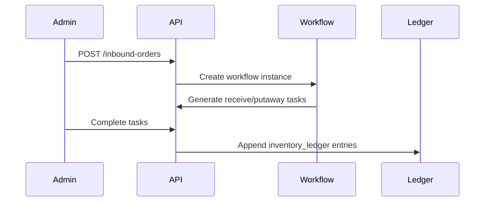
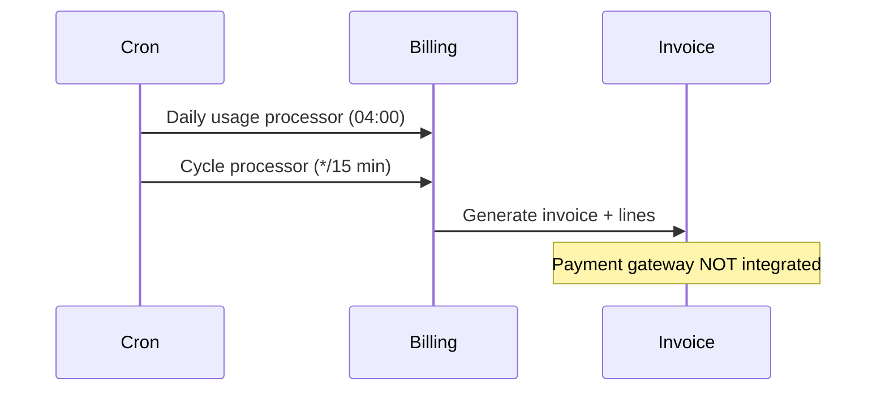

# Workflow QA Audit

**Phase:** Phase 6 — Workflow Certification  
**Audit date:** 2026-06-12  
**Auditor:** Independent QA (FINAL-QA-CERTIFICATION)

---

## Summary

| Metric | Value |
|--------|------:|
| Workflows audited | 14 |
| Complete | 12 |
| Partial | 2 |
| Broken | 0 |

## Workflow Certification Matrix

| Workflow | Status | Evidence |
|----------|--------|----------|
| Authentication | **Complete** | Admin + client login 200; refresh rotation in code; 10/10 security checks pass |
| User management | **Complete** | Users list API 200; warehouse/client user routes in admin UI |
| Products | **Complete** | Products list 200; CRUD controllers + admin routes |
| Locations | **Complete** | Locations list 200; hierarchy with warehouse scope |
| Inventory | **Complete** | Stock + ledger APIs 200; ledger p95 851ms (monitor) |
| Inbound | **Complete** | Inbound list 200; workflow engine integrated |
| Outbound | **Complete** | Outbound list 200; packing workflow supported |
| Returns | **Complete** | Returns list 200; process workflow routed |
| Cycle Count | **Complete** | Counts list 200; execution + variance modules |
| Tasks | **Complete** | Tasks list 200; execution gate guard; SLA cron (stub notify) |
| Reports | **Complete** | 14 report routes; policy + run endpoints 200 |
| Billing | **Partial** | Plans/cycles/invoices API 200; no payment gateway integration |
| Backup | **Partial** | Local create/list/health 200; Google Drive OAuth not provisioned |
| Client Portal | **Complete** | All 7 client endpoints benchmarked 200 |

## End-to-End Flow Diagrams

### Inbound Flow

### Billing Flow

## Phase Score Contribution

Workflow completeness supports overall feature completion estimate of **~89%**.
