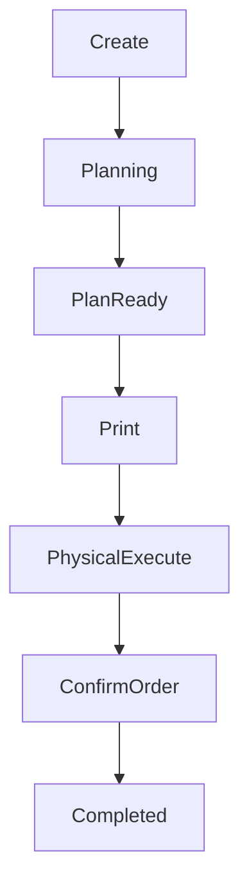
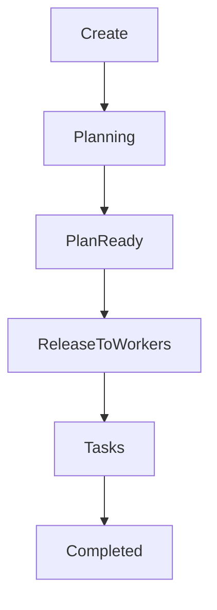
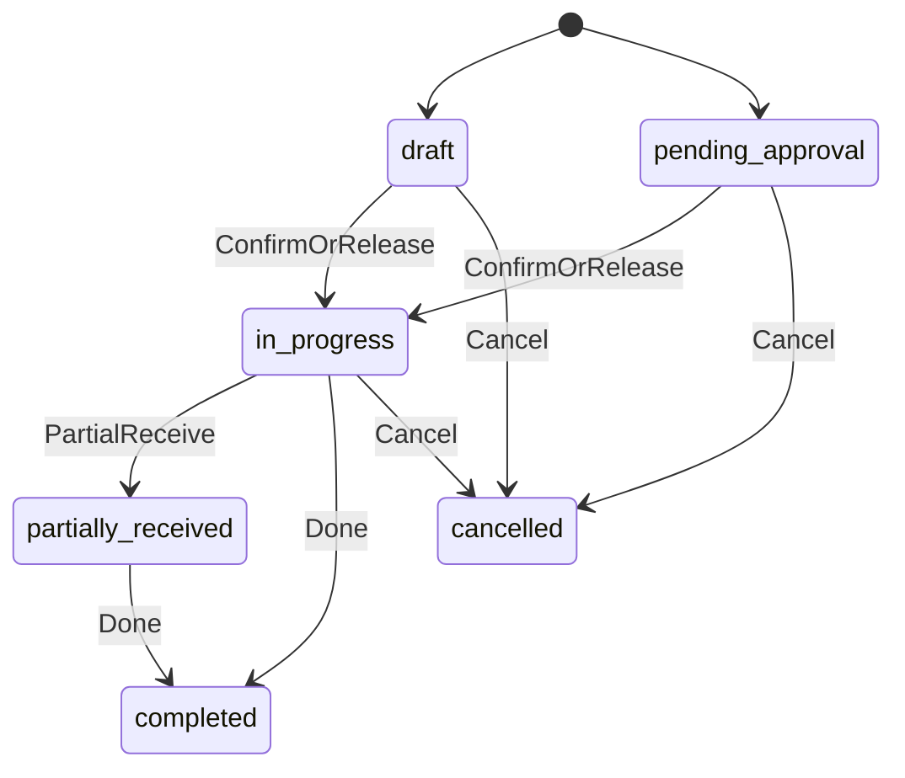
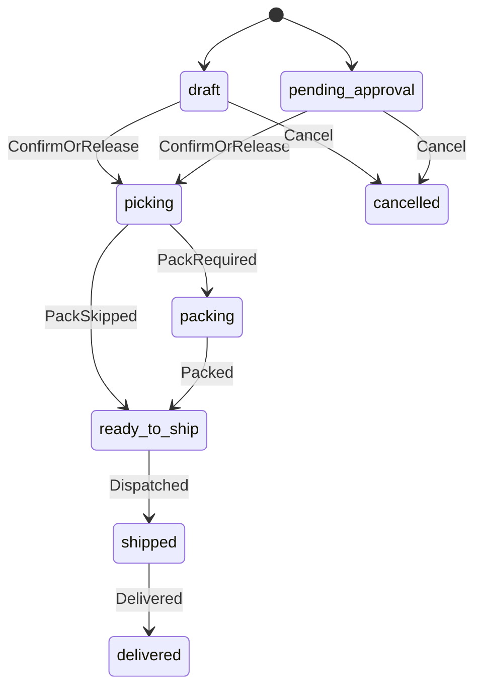
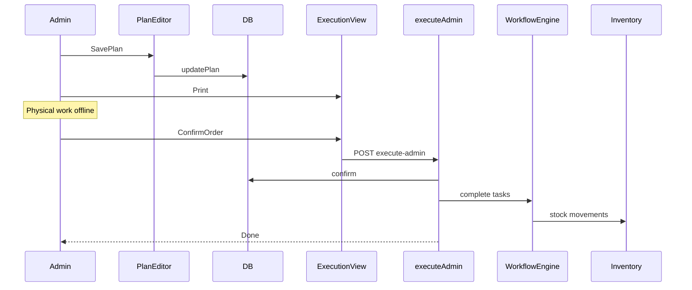
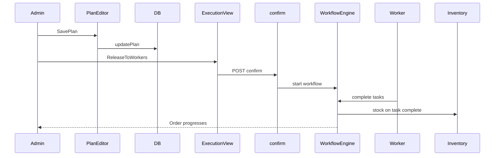

# Unified Order Execution — Official Architecture Specification

**Status:** Approved specification (pre-implementation)  
**Scope:** Staging Admin Dashboard + shared backend order execution  
**Tree:** `/var/www/emdad-sy-3pl-wms-staging`  
**Related plan:** Cursor plan `unified_order_execution_99fab3f9` (merged canonical)

---

# Part A — Architecture Review Findings

Review of the prior migration plan. Issues only. No compliments.

## A.1 Product vision failures

1. The document opens with technical branching (`executionMode`, broken helpers, component names). An engineer cannot explain *why* the product exists without reverse-engineering implementation pain.
2. There is no description of how Admin work *feels*: open order → finish plan → print → do physical work → one Confirm. That sentence belongs in the first screen of the spec.
3. “Two products inside the system” is asserted but never named as a business failure (training cost, mis-click into tasks, client/OMS orders appearing “broken”).
4. Success is defined as “never shows stage tabs,” which is a negative UI test, not a product outcome.

## A.2 Missing / incomplete user stories

1. No end-to-end story for Worker after Admin releases.
2. No story for OMS commercial page vs WMS outbound execution page (two Admin screens that must not be confused).
3. No story for API-created orders with arbitrary payloads.
4. No story for `pending_approval` client inbound: who “approves,” is approval distinct from Confirm, or is Confirm the only gate?
5. No story after Confirm in admin mode (order terminal state) vs after Release in workers mode (order in progress, tasks open).

## A.3 Ambiguous / conflicting product rules

1. Default `executionMode` for Client outbound / OMS is “recommend admin” — not locked. Different readers will ship different defaults.
2. Completeness rules differ for admin Confirm vs workers Release, but the UI is supposed to be identical. Unclear whether workers Release requires a full inbound putaway plan or only warehouse.
3. “Planning always happens before execution” conflicts with today’s `confirm` which can start a workflow with incomplete warehouse plans in some paths. Spec must say whether Release requires the same completeness as admin Confirm.
4. Client inbound already forces `admin` without plan; Client outbound does not. Spec must state one create contract.
5. Mode switch after tasks exist is undefined.
6. Whether Admin may still open `/tasks/:id` and press `admin-confirm` is undefined (“Admin never executes tasks individually” vs accidental deep links).
7. `VITE_ORDER_WORKSPACE_UI=false` legacy path is left alive — violates “do not keep both UX flows.”
8. Returns are out of scope but not named as explicitly excluded from this unification.

## A.4 UX consistency holes

1. “Optionally auto-open edit” creates two experiences for incomplete plans (summary vs forced edit).
2. Admin summary today returns `null` when `executionMode !== 'admin'` (`AdminOutboundOrderSummary`). Plan says extend it but does not specify empty states for shipped/cancelled/in-progress workers orders.
3. Inbound helper bug (`usesAdminOrderExecutionUi(string)`) is mentioned as diagnosis, not as a delete-the-branch requirement.
4. List create still forks modal vs page via flag — Admin can still create via legacy modal if flag off.
5. OMS detail remains a second “order” surface; without a clear handoff CTA, Admins will treat OMS as execution.

## A.5 Workflow gaps by source

1. Client portal: no client cancel/edit after create — not documented; engineers may add client edit and break planning ownership.
2. OMS cancel does not cancel linked outbound — not documented; orphan WMS drafts.
3. Admin UI cancel affordances are narrower than API (outbound detail vs service) — race between UI and API callers.
4. `allocated` outbound can still `updatePlan` — not in UI story.
5. What page opens after OMS approve (stay on OMS vs navigate to outbound) — unspecified.

## A.6 Frontend architecture flaws

1. UI still framed as “if workspace flag / if mode / if plan ready.” Should be: **Actor = Admin → Order Execution View**; **Actor = Worker → Task Execution View**.
2. Two nearly duplicate components (`AdminInboundOrderSummary` / `AdminOutboundOrderSummary`) with divergent mode checks will drift again.
3. `usesAdminOrderExecutionUi` / `isAdminExecutionMode` encode layout policy in helpers that mix status and mode — wrong abstraction.
4. No shared “plan readiness” module shared by create, edit, and Confirm button; readiness will fork FE vs BE again.
5. Print is client-side HTML snapshot; plan never defines regenerate/stale banner rules.

## A.7 Backend architecture flaws

1. `executeAdmin` lives in inbound/outbound services; unused duplicate `admin-order-execution.service.ts` — plan says “optional cleanup,” which leaves dual sources of truth.
2. `executeAdmin` is a facade over `confirm` + task `adminConfirm`. Product says Admin does not execute tasks; implementation still does. Spec must declare facade as internal, not a second Admin API surface for UI to call piecemeal.
3. `normalizeExecutionMode(undefined) → workers` fights the migration default of `admin`. Must change normalization or always write explicit mode on create + migrate nulls.
4. No optimistic concurrency on `executionPlan` (last-write-wins). Concurrent Admin edits and Release race are undefined.
5. Cancel does not reverse inventory — dangerous if Admin confirms then cancels mid-flight; not in edge cases.
6. TASK_ONLY_FLOWS assumed always on; if off, Confirm semantics change radically — rollout assumption missing.

## A.8 Migration / rollout risks

1. No feature-flag strategy for unified shell independent of `VITE_ORDER_WORKSPACE_UI`.
2. No rollback plan if `execute-admin` fails mid-facade (partial task completion).
3. Data migration “leave in-flight workers alone” but frontend removes workspace — Admins lose stage visibility with only “link to Tasks”; monitoring UX underspecified.
4. Production deployment risks (flag order, backend before frontend, dual PM2 apps) absent.
5. No schema migration for version/lock on plan; only soft data backfill.
6. Staging-only rule exists operationally but is not in the plan’s deployment section.

## A.9 Forgotten edge cases

- Partially completed admin facade (receiving done, putaway failed)
- Cancel after Release (open tasks)
- Cancel after execute-admin partial failure
- Edit plan after Release / after tasks assigned
- Mode flip admin↔workers after save, after Release, after tasks completed
- Stock / FEFO changes between print and Confirm
- Stale printed instructions after plan edit
- Orders with null `executionMode` and null plan
- Orders with `workers` + complete plan still showing old workspace until deploy
- OMS commercial edit after outbound linked (lines frozen, header editable)
- OMS cancel leaving outbound draft
- Concurrent `updatePlan` last-write-wins
- Concurrent Confirm / Release
- `pending_approval` vs `draft` labeling in Admin UI
- Outbound status `allocated` planning
- Returns (explicit exclusion)
- Worker opens order URL somehow
- Admin opens task URL and uses admin-confirm
- API creates with `executionMode=workers` and no warehouse
- Legacy `VITE_ORDER_WORKSPACE_UI=false`
- TASK_ONLY_FLOWS=false environments

## A.10 Implicit concepts never named

Planning Responsibility, Execution Responsibility, Confirmation, Release to Workers, Order Lifecycle, Task Lifecycle, Order Ownership, Plan Completeness, Instruction Snapshot, Internal Execution Facade.

## A.11 Simplicity / “repair the old workflow” smells

1. Keeping legacy flag path “for now.”
2. Keeping stage panel files “referenced conceptually.”
3. Treating workers Release as a bolted-on button instead of one Confirmation concept with two outcomes.
4. Data migration hedges (“or leave workers if…”) without deterministic rules table.
5. Phase order puts frontend shell before backend defaults — new Client/OMS orders created during FE-only deploy still wrong until Phase 3.

---

# Part B — Official Specification (Revised)

This part replaces the prior plan as the implementation blueprint.

---

## 1. Product vision

### 1.1 Why this migration exists

Emdad’s Admin Dashboard currently behaves as if warehouse execution were two products:

- **Product A — Planning & Confirmation:** used for carefully created Admin orders.
- **Product B — Stage Workspace:** Receiving → Putaway → Pick → Pack → Dispatch tabs, used when orders arrive from the Client Portal, OMS, or any create path that omitted an execution plan / defaulted to workers.

Operators learn one mental model (“finish the plan, print, work, confirm”) and then open a Client or OMS order and are dropped into a different mental model (“walk stages and confirm tasks”). That is a product failure, not a cosmetic UI inconsistency.

### 1.2 Business problem

- Training and support cost: two Admin workflows for one job (“run this order”).
- Error risk: Admins execute work through task chrome that was designed for Workers.
- Trust risk: Client/OMS orders look “second class” because they open the old workspace.
- Velocity risk: every new integration (API, future channels) must pick a UI side.

### 1.3 What the experience must become

**Admin opens an Order.** The order may be fully planned or only partially prepared (lines and commercial data from Client/OMS/API). The Admin always sees the same Order Execution surface:

1. Review what is already known.
2. Complete Planning until the plan is ready.
3. Print instructions (optional but first-class).
4. Perform or supervise physical work according to `executionMode`.
5. Press one Confirmation action.

**Workers open Tasks.** They never plan the order. They execute the next warehouse task until the workflow completes.

**Origin never changes the Admin surface.** Origin only changes how empty the plan is when the Admin arrives.

### 1.4 Unified Product Principle

> Every warehouse order, regardless of how it was created, must converge into the exact same Order Execution experience before any warehouse work begins.

### 1.5 One-sentence actor principle

> The Admin executes Orders; the Worker executes Tasks; the source of an order never chooses the Admin interface.

---

## 2. User stories (end-to-end)

### 2.1 Admin creates and self-executes an inbound order

1. Admin goes to Inbound → New.
2. Fills client, arrival, notes, products/qty, receiving dock, putaway splits.
3. Selects **Execute by Admin** (`executionMode=admin`).
4. Saves plan → lands on Order Execution view (summary).
5. Prints instructions, receives and puts away physically using the printout.
6. Presses **Confirm order** → system runs the internal admin execution facade → order reaches terminal completed state; inventory updated via the facade’s task completions.
7. Admin never visits the Tasks page for this order.

### 2.2 Admin creates an outbound order for warehouse workers

1. Admin goes to Outbound → New.
2. Fills client, ship date, lines, packing flag, warehouse as required by plan rules.
3. Selects **Execute by Workers** (`executionMode=workers`).
4. Saves plan → same Order Execution view (not stage tabs).
5. Presses **Release to workers** (Confirmation with workers outcome).
6. System confirms the order and starts the warehouse workflow; pick (then pack/dispatch) tasks appear.
7. Workers complete tasks on `/tasks/:id`.
8. Admin monitors from Order Execution view (status + task links), not by confirming stages.

### 2.3 Client Portal creates an inbound order

1. Client submits inbound (lines, arrival, notes). System stores `pending_approval`, `executionMode=admin`, `executionPlan=null`.
2. Admin opens the inbound from Admin Inbound list.
3. **Same Order Execution view** appears, marked as plan incomplete (missing dock/putaway/warehouse fields).
4. Admin opens Edit plan, completes warehouse fields, saves.
5. Admin prints, works, **Confirm order** (admin outcome).
6. Client cannot edit or cancel after create; only Admin owns planning and confirmation.

### 2.4 Client Portal creates an outbound order

1. Client submits outbound (lines, ship date, notes). System stores `pending_approval`, **`executionMode=admin`**, `executionPlan=null` or line skeleton only.
2. Admin opens outbound → **same Order Execution view**, plan incomplete.
3. Admin completes plan (warehouse / packing as required), then Confirm or switches mode to workers and Releases.
4. No stage workspace appears at any point.

### 2.5 OMS order becomes a warehouse outbound

1. Client or Admin creates OMS commercial order.
2. Admin approves OMS on the **OMS commercial page** (not WMS execution).
3. System creates linked **Outbound** draft with commercial prefill (recipient, COD, lines, channel/refs), `executionMode=admin`, plan incomplete.
4. Admin follows CTA **Open warehouse order** → Outbound Order Execution view.
5. Admin completes plan and Confirms or Releases.
6. OMS page remains commercial (status, delivery, COD). It is not an alternate execution UI.
7. Cancelling OMS does **not** auto-cancel the linked outbound; Admin must cancel the outbound explicitly if needed (see rules).

### 2.6 API / future integration creates an order

1. Integration POST creates inbound or outbound with whatever fields it knows.
2. Contract: may omit `executionPlan`; must either omit `executionMode` (server defaults to `admin`) or set it explicitly.
3. Admin opens the order → same Order Execution view; fills gaps; Confirms/Releases.

### 2.7 Worker day path

1. Worker opens Tasks list → task detail `/tasks/:id`.
2. Executes receiving/putaway/pick/pack/dispatch UI already in product.
3. Worker never uses Admin Order Execution Confirmation.
4. If a Worker navigates to an order URL, they see read-only order info or are redirected to tasks policy (see §5.12)—they do not get Admin Confirm.

---

## 3. Explicit glossary

| Term | Definition |
|------|------------|
| **Order** | Inbound or Outbound warehouse document. Unit of Admin execution. |
| **Task** | Warehouse workflow unit (receiving, putaway, pick, pack, dispatch). Unit of Worker execution. |
| **Order Origin** | How the order row was created: Admin UI, Client Portal, OMS approve sync, API. Never selects Admin chrome. |
| **Planning** | Capturing/editing `executionMode` + `executionPlan` (+ order header/lines where allowed) before Confirmation. |
| **Plan Completeness** | Deterministic predicate (shared FE/BE) that Confirmation is allowed. |
| **Order Execution View** | The single Admin detail experience: summary of plan, gaps, print, Confirmation. |
| **Plan Editor** | Create (`/new`) or edit (`/:id/edit`) form that writes the plan. Same fields, same validation. |
| **Confirmation** | Single Admin action with two outcomes based on `executionMode` (see §4). |
| **Confirm order** | Confirmation outcome when `executionMode=admin`: internal facade completes physical workflow + inventory. |
| **Release to workers** | Confirmation outcome when `executionMode=workers`: start workflow; Workers execute Tasks. |
| **Internal Execution Facade** | Backend `execute-admin` implementation that may call confirm + complete tasks. Not a Worker UI; not a stage UI. |
| **Instruction Snapshot** | Print output generated at click time from current plan; not stored; becomes stale if plan changes. |
| **Planning Responsibility** | Who may edit the plan: Admin only (Client has no plan/update APIs). |
| **Execution Responsibility** | Who performs physical work: Admin (self) or Workers, declared by `executionMode`. |
| **Order Ownership** | Company-scoped WMS order; OMS commercial order is a separate document linked 1:1 when approved. |
| **Order Lifecycle** | Status progression of inbound/outbound (draft → … → terminal). |
| **Task Lifecycle** | pending → assigned/in_progress → completed/cancelled for warehouse tasks. |
| **Creator** | Actor/system that creates the order row (Admin, Client, OMS approve, API). |
| **Planner / Planning Owner** | Who may edit `executionPlan` and `executionMode`: **Admin only**. |
| **Executor** | Who performs physical work after Confirmation: Admin (`admin`) or Workers (`workers`). |
| **Instruction Sheet** | Disposable print of the current plan; not a stored document; invalidated by plan edits. |


---

## 3.5 Planning Ownership

Planning Ownership is distinct from Execution Ownership (`executionMode`).

| Role | Who | Owns |
|------|-----|------|
| **Creator** | Admin / Client Portal / OMS / API | Initial order row and commercial/line prefill |
| **Planner (Planning Owner)** | **Admin only** | `executionPlan`, `executionMode`, Plan Completeness |
| **Executor** | Admin (`executionMode=admin`) or Workers (`workers`) | Physical work / warehouse tasks after Confirmation |

### Planning Ownership rules (normative)

1. Client never owns planning.
2. OMS never owns planning.
3. API never owns planning (may prefill plan fields; Admin remains Planning Owner and may edit while plannable).
4. Admin always owns planning.
5. Workers never edit plans.
6. Creator, Planner, and Executor are different responsibilities; the same Admin user may wear more than one hat.

---

## 4. Product rules (normative)

Rules are MUST / MUST NOT. Implementation that violates them is a defect.

### 4.1 Actors and surfaces

1. **Admin MUST execute Orders** only through Order Execution View + Plan Editor.
2. **Workers MUST execute Tasks** only through Task Execution (`/tasks/:id` and task list).
3. **Admin MUST NOT** be presented with Order stage tabs (Receiving → … → Dispatch) on order detail.
4. **Admin MUST NOT** use per-stage “Confirm stage” / task `admin-confirm` as the normal order-completion path.
5. Deep links to `/tasks/:id` for Admins MAY exist for monitoring/emergency; product copy MUST NOT present them as the primary Admin execution path. Emergency use is out of band (ops runbook), not a second UX.

### 4.2 Origin invariance

6. **Order Origin MUST NOT** change which Admin component tree mounts for inbound/outbound detail.
7. Origin MAY change prefilled fields and which plan fields are empty.
8. OMS commercial pages MUST NOT implement warehouse Confirm / Release / stage execution.

### 4.3 executionMode

9. `executionMode` is exactly `admin` | `workers`.
10. `executionMode` MUST change Confirmation **outcome and label** only, never Order Execution View layout.
11. Default on create when omitted: **`admin`** (server-side). `normalizeExecutionMode` MUST be updated accordingly (null/undefined → `admin`), and a data migration MUST rewrite historical nulls per §10.
12. Mode MAY be changed only while the order is in a **plannable** status and **no workflow instance with open/completed work tasks** exists (see §9). After Release or after facade success, mode is frozen.

### 4.4 Planning before Confirmation

13. Confirmation MUST be disabled until Plan Completeness is true for the selected mode.
14. Planning MUST be possible for all origins via Admin Plan Editor while status is plannable.
15. Client Portal MUST NOT edit plans after create (current API surface). If that changes later, this spec must be revised first.

### 4.5 Confirmation after physical intent

16. **Admin mode:** Confirmation means “physical work for this order is done (or accepted as done)”; system then applies the facade.
17. **Workers mode:** Confirmation means “plan is accepted; release work to the warehouse”; system starts workflow; physical completion happens later on Tasks.
18. Printing is recommended before Confirmation in admin mode; it is never a substitute for Confirmation.
19. **Confirm never asks the Admin for additional operational information.** All operational decisions (dock, putaway, warehouse, packing intent, quantities) MUST already exist in the plan.
20. Confirmation only executes (or releases) the approved plan. The Confirm/Release click path MUST NOT open dock, location, or qty pickers.
21. **Editing a plan invalidates every previously printed instruction sheet.** The UI MUST notify the Admin that a new print is recommended.
22. Instruction sheets are **not documents**. They are **disposable execution sheets**. Every print reflects the current plan. The system never guarantees old prints remain valid.

### 4.6 Single Admin UX

19. With this spec deployed, `VITE_ORDER_WORKSPACE_UI` MUST NOT mount stage workspace on Admin order detail. Legacy list-modal create (`flag=false`) MUST be removed or forced off in staging/production Admin builds covered by this spec—**no second create/detail path**.
20. Incomplete plans MUST use the same Order Execution View with an explicit incomplete state + Edit plan CTA. **MUST NOT** auto-redirect to edit (avoids two entry animations/bookmarks). User always lands on summary; edit is intentional.

### 4.7 Scope exclusions

21. **Returns** are out of scope for this unification (no `executionMode` / plan facade today).
22. Worker task panel UX redesign is out of scope.
23. Removing the workflow engine is out of scope; Admin facade and Release both use it internally.

---

## 5. UX specification

### 5.1 Screens

| Screen | Route | Purpose |
|--------|-------|---------|
| Plan Editor (create) | `/orders/inbound/new`, `/orders/outbound/new` | Create order + plan |
| Plan Editor (edit) | `/orders/inbound/:id/edit`, `/orders/outbound/:id/edit` | Edit plan while plannable |
| Order Execution View | `/orders/inbound/:id`, `/orders/outbound/:id` | Summary, gaps, print, Confirm/Release |
| OMS commercial | `/orders/oms/:id` | Approve/reject/commercial; CTA to outbound |
| Task Execution | `/tasks/:id` | Worker execution |

### 5.2 Order Execution View — layout (identical for all origins)

1. Back link to list  
2. Order number + status badge  
3. Origin hint (optional muted text: “Submitted by client”, “From OMS …”, “Created by admin”) — informational only  
4. Plan summary sections (inbound: dock, putaway; outbound: warehouse, packing, lines)  
5. **Plan readiness** banner: Ready | Incomplete (list missing fields)  
6. Actions: Edit plan (if plannable) | Print instructions | Primary Confirmation | Cancel (if allowed)  
7. After Release: task list links + workflow status (monitor, do not stage-confirm)  
8. After admin Confirm success: terminal summary  

### 5.3 Confirmation button labels

| Mode | Label | API |
|------|-------|-----|
| `admin` | Confirm order | `POST …/execute-admin` |
| `workers` | Release to workers | `POST …/confirm` (inbound) or confirmAndDeduct path used today for workflow start under TASK_ONLY |

Disabled tooltip MUST cite Plan Completeness failures from shared validator messages.

### 5.4 Forbidden UI on Admin order detail

- Horizontal stage pills for Receiving/Putaway/Pick/Pack/Dispatch as execution chrome  
- Stage footer Save plan / Confirm stage  
- “Start workflow” as a separate primary path that bypasses Plan Completeness (Release *is* the start, gated by completeness)

### 5.5 Plan Editor

- One form for create and edit.
- Mode cards describe **who does physical work**, not which Admin UI appears.
- Saving never Confirms.
- On save: navigate to Order Execution View.

### 5.6 OMS handoff

After approve: show success + primary button **Open warehouse outbound** → `/orders/outbound/:id`.  
Do not embed execute-admin on the OMS page.

---

## 6. Workflow by origin (normative)

### 6.1 Admin Dashboard inbound/outbound

| Step | Behavior |
|------|----------|
| Create | Plan Editor; default mode `admin`; full plan required for admin save if product already requires it on create; workers save requires completeness for Release (§7) |
| Next | Order Execution View |
| Missing data | None if Admin filled plan; else Edit plan |
| Confirm | Confirm order or Release per mode |
| Finish | Facade terminal state, or Workers complete tasks |

### 6.2 Client Portal inbound

| Step | Behavior |
|------|----------|
| Create | Client API; `pending_approval`; `executionMode=admin`; `executionPlan=null` |
| Next | Appears on Admin inbound list |
| Page | Order Execution View (incomplete) |
| Who plans | Admin |
| Who confirms | Admin (Confirm order) |
| Finish | Facade |

### 6.3 Client Portal outbound

| Step | Behavior |
|------|----------|
| Create | Client API; `pending_approval`; **`executionMode=admin`**; plan null/skeleton |
| Next | Admin outbound list |
| Page | Order Execution View (incomplete) |
| Who plans | Admin |
| Who confirms | Admin |
| Finish | Facade or Release→Workers |

### 6.4 OMS

| Step | Behavior |
|------|----------|
| Create OMS | Commercial document only |
| Approve | Creates linked outbound draft; `executionMode=admin`; plan incomplete; commercial fields copied |
| Page for execution | Outbound Order Execution View |
| Who plans | Admin |
| Who confirms | Admin |
| Finish | Same as outbound |

### 6.5 API

| Step | Behavior |
|------|----------|
| Create | Same DTOs as Admin create; omitted mode → `admin`; plan optional |
| Page | Order Execution View |
| Who plans | Admin (unless API sent complete plan) |
| Who confirms | Admin |

---

## 7. Plan Completeness (shared contract)

Implement once in backend (`execution-plan.util.ts`) and mirror in frontend validation module used by Plan Editor + Confirmation button. Messages MUST match.

### 7.1 Inbound + `admin` (Confirm order)

- `warehouseId` present  
- `receivingDockId` present  
- Every line: putaway rows with locations; allocated qty equals expected qty  

### 7.2 Outbound + `admin` (Confirm order)

- `warehouseId` present  
- Lines present matching order lines  
- `requiresPacking` boolean set (default true if omitted historically)  

### 7.3 Inbound + `workers` (Release)

**Same completeness as §7.1.**  
Rationale: Release must not dump unplannable work on Workers; dock/putaway intent belongs in the order plan even when Workers execute tasks. (If putaway task planning remains task-local today, the Release path MUST still require order-level dock + warehouse; putaway splits required if current `execute-admin`/workflow expects them—**align Release preconditions with what `confirm` + first tasks need, and document any remaining task-local planning as Worker responsibility only for micro-adjustments, not for missing dock.**)

**Locked decision:** Workers Release for inbound requires warehouse + receiving dock + putaway completeness identical to admin Confirm. Outbound Release requires warehouse + lines identical to admin Confirm. This keeps one readiness banner.

### 7.4 Skeleton plans

Creates without dock/putaway MAY store `executionPlan` with `lines[].expectedQty` and empty putaway, or null plan. Both are “incomplete.” FE MUST treat null and partial identically: not ready.

---

## 8. Frontend architecture

### 8.1 Product-driven mounting

```
InboundDetailPage / OutboundDetailPage:
  if order loading → spinner
  if order missing → not found
  else → <OrderExecutionView order={order} kind="inbound"|"outbound" />
```

**Forbidden:**

```
if (executionMode === 'workers') return <OrderWorkspaceLayout />
if (usesAdminOrderExecutionUi(...)) return <AdminSummary />
```

Delete `usesAdminOrderExecutionUi` as a layout selector. Mode affects Confirmation props only.

### 8.2 Component structure

- `OrderExecutionView` (shared shell)  
  - `OrderPlanSummary` (inbound/outbound variants for fields)  
  - `OrderPlanReadiness`  
  - `OrderExecutionActions` (Edit, Print, Confirm/Release, Cancel)  
  - `OrderWorkflowMonitor` (post-Release task links)  
- Reuse Plan Editor pages already at `orders/*CreatePage.tsx`  
- Remove mounts of `OrderWorkspaceLayout` and stage panels from detail pages  
- After soak time, delete or relocate stage panels if unused (Worker does not use those Admin panels)

### 8.3 State derivation

```
plannable = status ∈ INBOUND_CONFIRMABLE / OUTBOUND_CONFIRMABLE (existing sets)
ready = assert*AdminPlanComplete(plan, lines)  // same for both modes per §7
primaryAction = mode === 'admin' ? 'confirm-order' : 'release-to-workers'
```

### 8.4 Flags

- Remove dependency on `VITE_ORDER_WORKSPACE_UI` for detail branching.  
- Set Admin production/staging builds so legacy create modals are unreachable (flag forced on or code deleted).  
- Task-only mode continues to come from backend context-settings; Admin Confirmation assumes TASK_ONLY_FLOWS=true (§10).

### 8.5 Print / Instruction Snapshot

- Print uses current plan at click time.  
- If `planUpdatedAt` changes after a print in-session, show dismissible: “Plan changed since last print.”  
- No server-stored PDF in this spec.

---

## 9. Backend architecture

### 9.1 Responsibility split

| Concern | Owner |
|---------|--------|
| Persist plan | `updatePlan` / `create` on inbound & outbound services |
| Validate completeness | `execution-plan.util.ts` only |
| Confirmation admin outcome | `executeAdmin` on inbound/outbound services (single implementation; delete or thin-wrap unused duplicate module) |
| Confirmation workers outcome | existing `confirm` / `confirmAndDeduct` under TASK_ONLY (start workflow) |
| Task generation | workflow engine / orchestration (unchanged) |
| Task execution | warehouse-tasks service + Worker UI |
| OMS → outbound spawn | `createOutboundFromOms` sets mode default + no fake complete plan |

### 9.2 API surface (Admin UI may call)

- `POST /inbound-orders` / `POST /outbound-orders`  
- `PATCH /inbound-orders/:id/plan` / `PATCH /outbound-orders/:id/plan`  
- `POST /inbound-orders/:id/execute-admin` / `POST /outbound-orders/:id/execute-admin`  
- `POST /inbound-orders/:id/confirm` / `POST /outbound-orders/:id/confirm` (Release only)  
- `POST …/cancel`  

Admin UI MUST NOT call `POST /tasks/:id/admin-confirm` in the happy path.

### 9.3 Internal Execution Facade

`executeAdmin` MAY orchestrate confirm + task completions. That is an **internal** implementation detail. Product language remains “Confirm order,” not “complete receiving task.”

Facade MUST be transactional per existing patterns; if mid-facade failure occurs, order MUST remain in a recoverable state and API MUST return which step failed (document current behavior; improve if silent partial completion exists).

### 9.4 Defaults on create

| Source | executionMode | executionPlan |
|--------|---------------|---------------|
| Admin UI | as selected | as saved |
| Client inbound | `admin` | null |
| Client outbound | `admin` | null |
| OMS approve outbound | `admin` | null or line skeleton |
| API omitted mode | `admin` | as provided |

Change `normalizeExecutionMode` so omitted → `admin`.

### 9.5 Concurrency

- Short-term: keep last-write-wins on plan; Confirmation endpoints keep existing row locks where present (outbound confirm lock).  
- Spec requirement for v1.1: reject `updatePlan` if body `planUpdatedAt` ≠ current (optimistic check). Track as follow-up if not in first PR—**call out in PR description**.  
- Concurrent Confirm/Release: existing CAS/locks MUST prevent double start.

### 9.6 Cancel

- Document: cancel deletes workflow instance; **does not reverse inventory**.  
- After successful admin facade, cancel rules follow existing terminal-state guards.  
- After Release with open tasks: Admin cancel MUST cancel/open-task cleanup per existing service behavior; UI MUST allow cancel only when API allows, and MUST match API (fix UI/API mismatch on outbound).

---

## 10. Migration strategy

### 10.1 Preconditions

- Work only under staging tree; staging backend process only.  
- `TASK_ONLY_FLOWS` remains true in staging/production for this program.  
- Snapshot DB before data backfill.

### 10.2 Deploy order (mandatory)

1. **Backend** defaults + `normalizeExecutionMode` + client outbound/OMS create defaults + any Release gating  
2. Restart `emdad-wms-backend-staging`  
3. **Frontend** Order Execution View always-on; remove workspace branch; shared readiness  
4. Smoke matrix §12  
5. **Data backfill** script  
6. Remove legacy create modal paths / force flag  
7. Docs update  

Never ship FE-only unified shell while creates still default to workers null mode without backfill plan—otherwise Admins see unified UI but Confirm semantics surprise them.

### 10.3 Data backfill rules (deterministic)

| Condition | Action |
|-----------|--------|
| `executionMode` IS NULL AND status in plannable set AND no workflow instance | SET `executionMode='admin'` |
| `executionMode` IS NULL AND workflow exists / in progress | SET `executionMode='workers'` (preserve task path) |
| `executionMode` IS NULL AND terminal | SET `executionMode='admin'` (cosmetic) |
| `executionPlan` null | leave null |
| Explicit `workers` with open tasks | leave unchanged |

### 10.4 In-flight workers orders

Admin Order Execution View shows status + links to open tasks (monitor). No stage tabs. Workers continue on Tasks. Do not run execute-admin on these orders unless mode is changed under §4.12 (normally frozen).

### 10.5 Rollback

- Frontend rollback: redeploy previous Admin `dist` (workspace returns)—acceptable emergency only.  
- Backend rollback: restoring old `normalizeExecutionMode→workers` reintroduces dual behavior; avoid without FE rollback.  
- Prefer forward fix.

### 10.6 Feature flags

- Do not introduce a third long-lived flag.  
- Temporary `VITE_UNIFIED_ORDER_EXECUTION=true` allowed for one staging soak if needed; remove within the same release train.  
- End state: unified code path, no flag.

### 10.7 Production

Out of scope until staging matrix signed off. Production requires explicit approval (workspace staging-only rule).

---

## 11. Edge cases (normative handling)

| Scenario | Handling |
|----------|----------|
| Incomplete plan | Order Execution View + readiness list + Edit plan; Confirmation disabled |
| Cancel while plannable | Allowed per API; confirm dialog |
| Cancel after Release | Use API cancel; tasks/workflow cleaned per service; if inventory moved, do not invent reverse stock in this project |
| Cancel after partial facade failure | Surface error; allow retry Confirm or manual ops; do not open stage UI |
| Edit plan after Release | **Forbidden** (plannable=false once workflow started) |
| Edit plan after tasks assigned | Forbidden |
| Mode flip after Release | Forbidden |
| Mode flip while plannable | Allowed; re-validate readiness |
| Stock/FEFO change after print | Confirm/Release uses live stock rules at API time; print may be stale; show plan-changed banner when plan edits |
| Stale print after plan edit | Banner; user must reprint |
| Null mode pre-migration | Backfill §10.3; UI treats via normalize |
| Null plan | Incomplete |
| OMS edit after link | Commercial fields only; lines frozen per existing FE; does not change WMS plan |
| OMS cancel | Does not cancel outbound; show warning in OMS UI (implement if missing) |
| Concurrent plan edits | Last write wins v1; document; v1.1 optimistic stamp |
| Concurrent Confirm | Locked/idempotent per existing confirm utilities |
| `pending_approval` | Plannable; badge “Pending approval” or “Planned”; Confirmation allowed when ready (Approval *is* completing WMS plan + Confirm—not a separate Admin approve button unless already present) |
| Outbound `allocated` | Remains plannable per API; show in Execution View |
| Returns | Out of scope |
| Worker hits order URL | Read-only or redirect to tasks—**implement read-only summary without Confirm for non-admin roles** |
| Admin hits task URL | Allowed; not primary path |
| API sends workers + empty plan | Saved; Confirmation disabled until Admin completes plan |
| TASK_ONLY_FLOWS=false | Unsupported for this program; fail closed in staging config |
| Legacy workspace flag off | Unsupported post-migration; code removed |

### 11.1 Client “approval” semantics

Client `pending_approval` means **awaiting warehouse acceptance/planning**, not a separate second Confirmation. Admin planning + Confirm/Release is the acceptance. Do not build a duplicate “Approve inbound” that only flips status without plan.

---

## 12. Verification matrix

Execute on staging Admin + Worker accounts.

| # | Origin | Prefill | Admin page | Primary action | Expected finish |
|---|--------|---------|------------|----------------|-----------------|
| 1 | Admin inbound admin | Full | Execution View | Confirm order | Completed + stock |
| 2 | Admin outbound workers | Full | Execution View | Release | Tasks open; worker completes → shipped |
| 3 | Client inbound | Lines only | Execution View incomplete | Edit→Confirm | Completed |
| 4 | Client outbound | Lines only | Execution View incomplete | Edit→Confirm | Completed |
| 5 | OMS approve | Commercial+lines | Outbound Execution View | Edit→Confirm | Completed |
| 6 | API omit mode | Whatever sent | Execution View | per readiness | per mode |
| 7 | Historical workers in-flight | Existing | Execution View monitor | No Confirm | Worker tasks |
| 8 | Print then edit plan | — | Banner | Reprint | — |
| 9 | Double Confirm click | — | — | Single facade | Idempotent/error |
| 10 | Worker task path | — | `/tasks/:id` | Complete task | Workflow advances |

Also verify: no `OrderWorkspaceLayout` in Admin detail DOM; OMS page has no execute-admin; cancel UI ⊆ API.

---

## 13. Implementation work packages

Executable sequence for a senior engineer. Each package is independently reviewable.

### WP0 — Spec lock

- This document accepted.  
- Defaults locked: omitted mode → `admin`; Release completeness = admin completeness.

### WP1 — Backend defaults & normalization

- Change `normalizeExecutionMode`  
- Client outbound + OMS sync defaults  
- Align Release validation with §7  
- Collapse duplicate admin execution module  
- Deploy staging backend  

### WP2 — Frontend Order Execution View

- Always mount shared Execution View on inbound/outbound detail  
- Remove workspace branch  
- Confirmation dual outcome  
- Readiness banner  
- Role-based hide Confirm for workers  

### WP3 — Plan Editor copy & validation

- Mode cards copy  
- Shared readiness helper with backend messages  

### WP4 — OMS handoff + cancel warning

- CTA after approve  
- Warn OMS cancel ≠ outbound cancel  

### WP5 — Data backfill

- Run §10.3 on staging; record counts  
- **Staging applied (2026-08-03):** `backend/scripts/backfill-execution-mode.cjs --apply`  
  - inbound: null→admin 3, null→workers 17  
  - outbound: null→admin 5, null→workers 12  
  - post-run: inbound/outbound `executionMode IS NULL` = 0  

### WP6 — Delete legacy Admin paths

- Remove list create modals / flag forks for detail  
- Delete dead imports of stage panels from detail  
- Update `order-workspace-mode` comments or remove  

### WP7 — Docs & sign-off

- Replace stale `docs/ui/admin/*-detail.md`  
- Sign §12 matrix  

**Staging sign-off (2026-08-03):** WP0–WP6 implemented on staging. Verified: `normalizeExecutionMode(undefined|null)→admin`; detail bundles are Execution View only (no `OrderWorkspaceLayout`); Confirm/Release + print-stale banner present; OMS “Open warehouse outbound”; list create → `/orders/*/new`; Admin `vite build` under `frontend/dist`; `emdad-wms-backend-staging` online. Interactive matrix rows that require live stock/worker completion remain for operators on staging before production cutover.

---

## 14. Non-goals

- Redesigning Worker task UIs  
- Unifying Returns into plan/confirm  
- Storing PDFs  
- Automatic OMS↔outbound cancel coupling (unless product later mandates it—requires separate spec)  
- Production cutover without staging sign-off  

---

## 15. Open items intentionally closed by this revision

| Former ambiguity | Decision |
|------------------|----------|
| Default mode for Client outbound / OMS | `admin` |
| Release completeness vs Confirm | Identical (§7) |
| Auto-open edit when incomplete | No — summary + Edit CTA |
| Keep legacy workspace flag path | No — remove |
| Layout helper based on mode/status | Delete; actor-based mount |
| Planning Ownership | Admin only; Client/OMS/API/Workers never plan |
| Confirm operational inputs | Forbidden; plan must already contain them |
| Instruction sheets | Disposable; edit invalidates prior prints |
| normalize(undefined) | `admin` |
| Admin primary task confirm | Forbidden in happy path |

---

## 16. Document control

- **Canonical path:** `docs/architecture/unified-order-execution.md`  
- Changes to product rules require updating this file in the same PR as code.  
- Implementation PRs must reference section numbers they satisfy.

---

## 17. Lifecycle diagrams (product view)

### 17.1 Admin executor (`executionMode=admin`)



Print is recommended, not a hard gate. Confirmation remains disabled until Plan Ready.

### 17.2 Workers executor (`executionMode=workers`)



---

## 18. State machine (DB statuses)

Plan Ready is a **readiness predicate**, not a status. **Released** is a product phase meaning workers Confirmation succeeded (workflow started); it is not a Prisma enum value.

### 18.1 Inbound (`InboundOrderStatus`)

Plannable: `draft`, `pending_approval`.

| From | Event | To |
|------|-------|-----|
| draft / pending_approval | Save plan | same (plan JSON updated) |
| draft / pending_approval | Confirm order (admin facade) | in_progress then completed via facade |
| draft / pending_approval | Release to workers | in_progress |
| in_progress / partially_received | Worker/task progress | partially_received / completed |
| plannable or in_progress (per API) | Cancel | cancelled |
| * | — | completed / cancelled terminal |



### 18.2 Outbound (`OutboundOrderStatus`)

Plannable: `draft`, `pending_approval`, `allocated` (per existing confirmable set).

| From | Event | To |
|------|-------|-----|
| plannable | Save plan | same |
| plannable | Confirm order (admin facade) | picking… then shipped via facade |
| plannable | Release to workers | picking (workflow) |
| picking/packing/... | Worker tasks | ready_to_ship / shipped / … |
| * | Cancel | cancelled (when API allows) |



---

## 19. Sequence diagrams

### 19.1 Admin Confirm



### 19.2 Workers Release



Under TASK_ONLY_FLOWS, inventory does not change on Save Plan.

---

## 20. System Invariants

1. Inventory never changes before Confirmation.
2. Tasks never modify the Plan.
3. Planning never modifies Inventory.
4. Workers never modify Order Planning.
5. Execution never modifies Commercial Information (OMS commercial vs WMS plan boundary).
6. OMS never executes Warehouse Work.
7. Client Portal never executes Warehouse Work.
8. Order Origin never changes the Admin Experience.
9. Every execution has exactly one `executionMode`.
10. Only one Confirmation path exists on Order Execution View (Confirm order XOR Release to workers by mode).
11. Stage workspace never mounts for Admin order detail.
12. Admin always owns planning; Client/OMS/API/Workers never own planning.

---

## 21. Acceptance Criteria

The migration is complete when:

1. `OrderWorkspaceLayout` is never mounted on Admin inbound/outbound detail.
2. Every inbound origin opens the same Order Execution UI.
3. Every outbound origin opens the same Order Execution UI.
4. Client orders use the new flow.
5. OMS orders use the new flow.
6. API orders use the new flow.
7. No Admin happy-path execution requires opening Tasks.
8. No Admin execution requires stage-by-stage confirmation.
9. Inventory changes only after Confirmation (facade or post-Release task completion).
10. Workers continue using Task pages.
11. Confirm/Release collects no extra operational fields beyond the saved plan.
12. Planning Ownership rules are enforced (Client/OMS cannot `updatePlan`).
