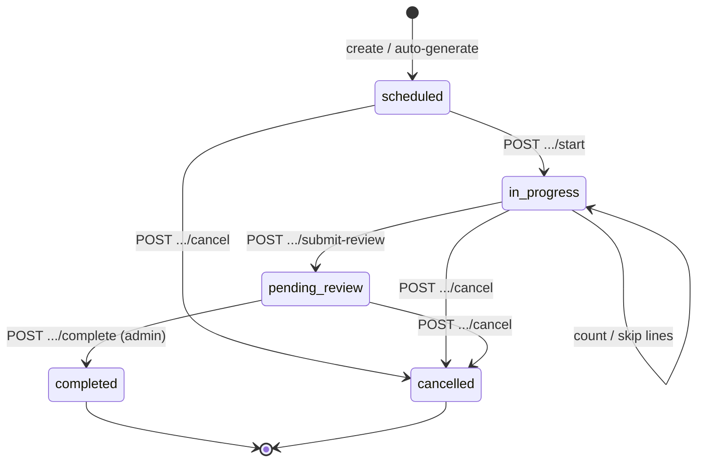

# Phase 7.1 — Cycle Count Backend Foundation

**Status:** Implemented  
**Date:** 2026-05-29  
**Scope:** Cycle count schema, scheduling, auto-generation, count lifecycle, assignment, and product history only. No inventory mutation on complete, no global task-engine redesign, no workflow changes.

---

## Summary

| Area | Implementation |
|------|----------------|
| Schema | `cycle_count_schedules`, `cycle_counts`, `cycle_count_lines`, `cycle_count_product_history` |
| Scheduling | Per company + warehouse interval (7 / 30 / 90 days), `next_run_at`, daily cron |
| Auto-generation | Due products from stock + history; snapshot lines from `current_stock` |
| Lifecycle | `scheduled` → `in_progress` → `pending_review` → `completed` / `cancelled` |
| Assignment | Session-level and line-level `assigned_worker_id` |
| History | `cycle_count_product_history` updated on admin complete |
| Inventory | Expected qty frozen at snapshot; **no ledger / stock writes on complete** |

---

## Schema Changes

**Migration:** `backend/prisma/migrations/20260701140000_cycle_count_foundation/migration.sql`

### Enums

| Enum | Values |
|------|--------|
| `cycle_count_status` | `scheduled`, `in_progress`, `pending_review`, `completed`, `cancelled` |
| `cycle_count_line_status` | `pending`, `counted`, `skipped` |
| `cycle_count_source` | `scheduled`, `manual` |

### Tables

#### `cycle_count_schedules`

Warehouse admin recurrence configuration (one row per company + warehouse).

| Column | Purpose |
|--------|---------|
| `interval_days` | 7, 30, or 90 (DB check constraint) |
| `enabled` | Toggle auto-generation |
| `include_zero_on_hand` | Include `current_stock` rows with qty 0 |
| `last_run_at` / `next_run_at` | Scheduler bookkeeping |

Unique: `(company_id, warehouse_id)`.

#### `cycle_counts`

Operational count session (header).

| Column | Purpose |
|--------|---------|
| `schedule_id` | Set when created by scheduler |
| `source` | `scheduled` or `manual` |
| `snapshot_at` | When expected quantities were frozen |
| `assigned_worker_id` | Default assignee for the session |
| `started_at` / `completed_at` | Lifecycle timestamps |
| `created_by` | User who created / system actor for scheduled runs |

#### `cycle_count_lines`

Per product × location × lot grain (package-level stock excluded).

| Column | Purpose |
|--------|---------|
| `expected_quantity` | On-hand at snapshot time |
| `actual_quantity` | Entered by counter |
| `discrepancy_quantity` | `actual − expected` when counted |
| `counted_by` / `counted_at` | Operator audit on line |
| `assigned_worker_id` | Optional line-level assignee |

Unique index: `(cycle_count_id, product_id, location_id, COALESCE(lot_id, zero-uuid))`.

#### `cycle_count_product_history`

Product-level recurrence tracking per warehouse.

| Column | Purpose |
|--------|---------|
| `last_counted_at` | Last successful completion touching this product |
| `next_due_at` | `last_counted_at + schedule.interval_days` (or 30 for manual) |
| `completion_count` | Number of completed counts including this product |
| `last_cycle_count_id` | Reference to closing count |

Unique: `(company_id, warehouse_id, product_id)`.

### Prisma models

Added to `backend/prisma/schema.prisma`: `CycleCountSchedule`, `CycleCount`, `CycleCountLine`, `CycleCountProductHistory` with relations on `Company`, `Warehouse`, `Product`, `Location`, `Lot`, `Worker`, `User`.

---

## Scheduling Logic

### Configuration API

| Method | Path | Guard | Action |
|--------|------|-------|--------|
| `POST` | `/api/cycle-count/schedules` | `InternalAdminGuard` | Upsert schedule for company + warehouse |
| `GET` | `/api/cycle-count/schedules` | JWT | List schedules (tenant-scoped) |

On upsert, `next_run_at` is set to **now + interval_days** so the first cron tick can generate work without a separate bootstrap job.

### Scheduler

**File:** `backend/src/modules/cycle-count/cycle-count-scheduler.service.ts`

- **Cron:** `0 3 * * *` (daily 03:00 server time)
- Selects enabled schedules where `next_run_at IS NULL OR next_run_at <= now()`
- Uses first active `super_admin` or `wh_manager` as technical `created_by` for scheduled counts
- Calls `CycleCountService.runDueSchedules()`

After each schedule run (whether or not a count was created), updates `last_run_at` and `next_run_at = now + interval_days`.

### Active count guard

At most **one** count per company + warehouse in `scheduled`, `in_progress`, or `pending_review`. A second manual or scheduled generation is skipped (scheduled path still advances `next_run_at`).

---

## Recurrence Behavior

### Due product selection

`CycleCountService.findDueProductIds()`:

1. Distinct `product_id` from `current_stock` in the warehouse (countable location types, `package_id IS NULL`, optionally `quantity_on_hand > 0`).
2. A product is **due** when:
   - No `cycle_count_product_history` row exists (never completed in this warehouse), or
   - `next_due_at <= now`, or
   - `last_counted_at + interval_days <= now` when `next_due_at` is null.

### Scheduled generation

When due products exist and no active count blocks:

1. Create `cycle_counts` row (`source = scheduled`, `status = scheduled`, `snapshot_at = now`).
2. Insert lines for all stock rows of **due products only** (respecting `include_zero_on_hand` on the schedule).
3. Advance schedule timestamps.

### Manual generation

`POST /api/cycle-count/counts` with optional `productIds`:

- If `productIds` omitted → all on-hand products in warehouse (non-zero qty, countable locations).
- Same snapshot + line insert pattern as scheduled.
- Does not require a schedule row.

### History update on complete

`POST /api/cycle-count/counts/:id/complete` (admin):

- Sets count `completed` / `completed_at`.
- Upserts `cycle_count_product_history` for each distinct product on the count lines.
- `next_due_at = completed_at + interval_days` from linked schedule, or **30 days** default for manual counts without a schedule.

---

## Lifecycle Flow



### Line rules

- **Count:** `POST .../lines/:lineId/count` with `actualQuantity` — sets `discrepancy_quantity`, `counted_at`, `counted_by`, status `counted`.
- **Skip:** `POST .../lines/:lineId/skip` — status `skipped` (no discrepancy).
- **Submit review:** All lines must be `counted` or `skipped` (no `pending`).

### Inventory snapshot

**File:** `backend/src/modules/cycle-count/cycle-count-snapshot.service.ts`

- Reads `current_stock` at line creation time (`package_id IS NULL`).
- Location types: `internal`, `fridge`, `quarantine`, `scrap` (aligned with adjustments).
- `snapshot_at` on the header records freeze time.
- Counting while `in_progress` compares operator entry against **frozen** expected qty (drift after snapshot appears as discrepancy — intentional for Phase 7.1).

---

## API Reference

Base path: `/api/cycle-count` (JWT required unless noted).

| Method | Path | Guard | Description |
|--------|------|-------|-------------|
| `POST` | `/schedules` | Internal admin | Upsert schedule |
| `GET` | `/schedules?companyId=` | — | List schedules |
| `GET` | `/product-history?warehouseId=&companyId=&productId=` | — | Product count history |
| `POST` | `/counts` | — | Manual count |
| `GET` | `/counts` | — | List counts |
| `GET` | `/counts/:id` | — | Detail + lines |
| `POST` | `/counts/:id/start` | — | Begin counting |
| `PATCH` | `/counts/:id/assign` | — | Session worker assign |
| `PATCH` | `/counts/:id/lines/:lineId/assign` | — | Line worker assign |
| `POST` | `/counts/:id/lines/:lineId/count` | — | Submit actual qty |
| `POST` | `/counts/:id/lines/:lineId/skip` | — | Skip line |
| `POST` | `/counts/:id/submit-review` | — | Move to review |
| `POST` | `/counts/:id/complete` | Internal admin | Close count, update history |
| `POST` | `/counts/:id/cancel` | — | Cancel open count |

Tenant isolation uses existing `CompanyAccessService` / `readCompanyIdFilterRequired` patterns (same family as adjustments).

---

## Module Layout

```
backend/src/modules/cycle-count/
  cycle-count.module.ts
  cycle-count.controller.ts
  cycle-count.service.ts
  cycle-count-snapshot.service.ts
  cycle-count-scheduler.service.ts
  cycle-count.constants.ts
  dto/
```

Registered in `backend/src/app.module.ts` as `CycleCountModule`.

---

## Operational Assumptions

1. **Counts are warehouse-scoped** — all lines belong to one `warehouse_id` on the header.
2. **Multi-location products** — one line per `(product, location, lot)` stock grain.
3. **No automatic inventory correction** — completing a count with discrepancies does not post adjustments or ledger rows (`LedgerRefType.cycle_count` reserved for a future phase).
4. **Discrepancy review** — `pending_review` + admin `complete` is the approval gate; reconciliation to `stock_adjustments` is out of scope here.
5. **Package-level stock** — excluded (`package_id IS NULL` only), consistent with adjustment grain.
6. **Single active count** — prevents overlapping operational sessions per warehouse.
7. **Scheduler actor** — scheduled counts attribute `created_by` to a system user (first `super_admin` or `wh_manager`), not a cron service account row.

---

## Future Extension Considerations

| Topic | Suggested direction |
|-------|---------------------|
| Inventory reconciliation | On admin approve, create draft `stock_adjustments` from lines with `discrepancy_quantity ≠ 0`; ledger `reference_type = cycle_count` |
| Blind count | API flag to omit `expected_quantity` in mobile responses until after count |
| `WarehouseTask` integration | `WarehouseTaskType.cycle_count` + assignments instead of direct worker FK |
| ABC / velocity classes | Extend schedule with product filters or priority tiers |
| Concurrent counters | Line-level locking or partition by zone |
| Snapshot refresh | Optional re-freeze on `start` for long-lived `scheduled` counts |
| Audit log | Emit structured audit events on complete / large discrepancies |
| Frontend | Count plan UI, handheld scan flow, discrepancy dashboard |
| Env toggle | `CYCLE_COUNT_SCHEDULER_ENABLED` for non-prod |

---

## Deploy Notes

1. Apply migration: `npx prisma migrate deploy` (migration `20260701140000_cycle_count_foundation`).
2. Regenerate client: `npx prisma generate` (restart `npm run start:dev` first if EPERM on Windows locks the query engine DLL).
3. Verify: `npx tsc --noEmit` in `backend/`.
4. Configure schedules via `POST /api/cycle-count/schedules` before relying on the 03:00 cron.

---

## Out of Scope (Phase 7.1)

- Stock / ledger mutation on count complete
- `WarehouseTask` / workflow engine hooks
- Mobile offline sync
- Client portal APIs
- Frontend screens
