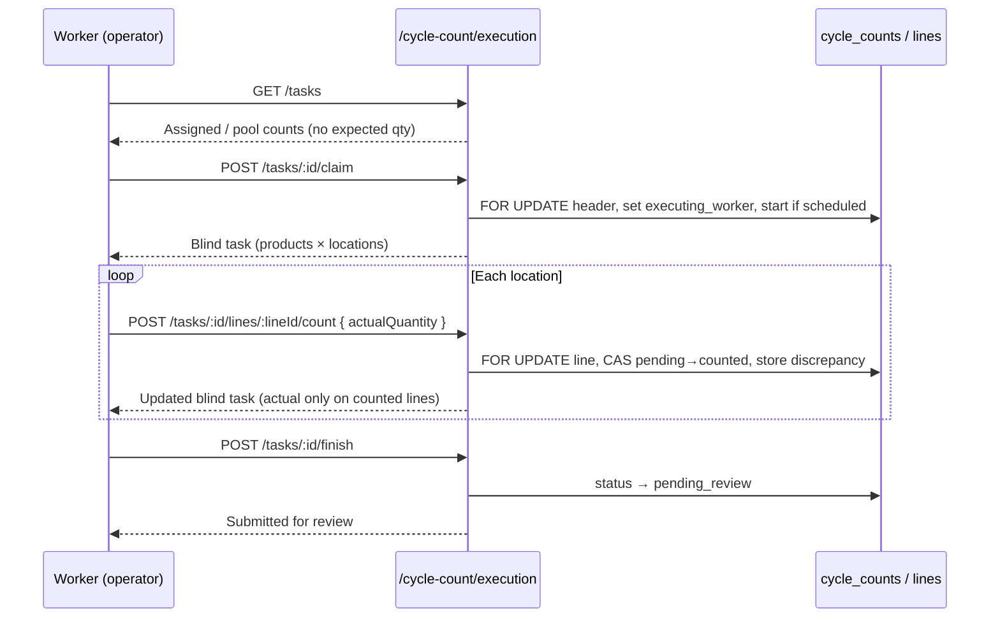

# Phase 7.2 — Cycle Count Task Execution Engine

**Status:** Implemented  
**Date:** 2026-05-29  
**Scope:** Worker-operational execution of cycle counts with blind count mode, validation, discrepancy engine, and concurrency guards. Builds on Phase 7.1 schema and lifecycle; does not integrate `WarehouseTask` or mutate inventory.

---

## Summary

| Area | Implementation |
|------|----------------|
| Worker API | `/api/cycle-count/execution/*` |
| Blind count | `blind_count` default `true`; execution responses omit `expectedQuantity` and `discrepancyQuantity` |
| Multi-location | Products grouped with per-location lines in blind task payload |
| Assignment | Session, line, and pool visibility; claim before counting pool lines |
| Completion | Worker `finish` → `pending_review` (admin `complete` unchanged from 7.1) |
| Discrepancy | `actual − expected` computed server-side on count submit |
| Concurrency | Row locks + `updateMany` CAS on line status `pending` |

---

## Worker Execution Flow



### Step-by-step

1. **List tasks** — `GET /api/cycle-count/execution/tasks`  
   Returns open counts (`scheduled` / `in_progress`) the worker may access: session assignee, line assignee, executing worker, or unassigned pool lines.

2. **Open task (blind)** — `GET /api/cycle-count/execution/tasks/:id`  
   Product-centric view: SKU, name, locations, lots. **No expected or discrepancy fields.**

3. **Claim** — `POST /api/cycle-count/execution/tasks/:id/claim`  
   - Locks count header (`FOR UPDATE`).  
   - Sets `executing_worker_id`.  
   - Transitions `scheduled` → `in_progress` with `started_at`.  
   - Rejects if another worker is already executing an in-progress count on this session.  
   - Rejects if this worker already has a different in-progress execution.

4. **Count location** — `POST .../lines/:lineId/count`  
   Worker submits **actual quantity only**. Server validates, computes discrepancy internally, stores both.

5. **Skip location** — `POST .../lines/:lineId/skip`  
   Optional when a bin is unreachable (still requires review).

6. **Finish** — `POST /api/cycle-count/execution/tasks/:id/finish`  
   All lines must be `counted` or `skipped` → `pending_review` for supervisor/admin approval (`POST /api/cycle-count/counts/:id/complete`).

---

## Blind Count Implementation

### Database

- `cycle_counts.blind_count BOOLEAN NOT NULL DEFAULT TRUE` (migration `20260702140000_cycle_count_execution`).

### API behavior

| Consumer | Expected qty visible? | Discrepancy visible? |
|----------|----------------------|----------------------|
| `GET /api/cycle-count/execution/tasks/:id` | No | No |
| `POST .../lines/:lineId/count` response | No | No |
| `GET /api/cycle-count/counts/:id` (admin) | Yes | Yes (after count) |

**Presenter:** `cycle-count-blind.presenter.ts` — `presentBlindCycleCountTask()` strips snapshot fields and groups by product.

Counted lines may echo **`actualQuantity`** (what the worker entered) but never `expectedQuantity` or `discrepancyQuantity` on execution routes.

---

## Discrepancy Behavior

**Module:** `cycle-count-discrepancy.util.ts`

```
discrepancy_quantity = actual_quantity − expected_quantity
```

- Computed in `CycleCountLineMutationService` at count time.
- Persisted on `cycle_count_lines` for supervisor review and future adjustment posting.
- **Not returned** to workers on execution endpoints.
- Zero discrepancy is valid (confirmed stock matches snapshot).

---

## Validation Rules

**Module:** `cycle-count-count-validation.util.ts`

| Rule | Enforcement |
|------|-------------|
| Non-negative quantity | `actualQuantity >= 0` |
| Finite numeric | Reject NaN / non-numeric strings |
| Max magnitude | `<= 999999999.9999` |
| Discrete UOM | Whole numbers for `piece`, `box`, `roll`, `pallet`, `carton` |
| Required state | Count only when header `in_progress` |
| Line state | Line must be `pending` (CAS) |
| Inventory reference | Line must belong to count; location `warehouse_id` must match count warehouse |
| Finish gate | No `pending` lines before `submit-review` |

Admin routes (`/api/cycle-count/counts/...`) reuse the same mutation service for consistent validation.

---

## Concurrency Protections

| Risk | Mitigation |
|------|------------|
| Double count same line | `updateMany` where `status = 'pending'`; `409 Conflict` if zero rows updated |
| Concurrent claim | `SELECT … FOR UPDATE` on `cycle_counts` before claim |
| Two workers on one count | `executing_worker_id` set on claim; other workers blocked while `in_progress` |
| Worker juggling multiple counts | Only one other `in_progress` count with same `executing_worker_id` allowed |
| Duplicate active warehouse count | Phase 7.1 guard: one `scheduled` / `in_progress` / `pending_review` per company + warehouse |
| Invalid completion | `finish` delegates to `submitForReview` (pending line check) |

**Line lock:** `FOR UPDATE` on `cycle_count_lines` row before count/skip in execution path.

---

## Worker Assignment Support

| Scope | Meaning | Access |
|-------|---------|--------|
| `session` | `assigned_worker_id` or `executing_worker_id` matches worker | Full session after claim |
| `line` | Specific lines assigned | Those lines only |
| `pool` | No session assignee; unassigned lines | Visible in list; **claim required** before counting pool lines |

Supervisors continue to use:

- `PATCH /api/cycle-count/counts/:id/assign`
- `PATCH /api/cycle-count/counts/:id/lines/:lineId/assign`

---

## API Reference (execution)

Base: `/api/cycle-count/execution`  
Auth: JWT + `@Roles(OPERATOR | ADMIN)` (`RolesGuard`)

| Method | Path | Description |
|--------|------|-------------|
| `GET` | `/tasks?warehouseId=` | Worker's open count tasks |
| `GET` | `/tasks/:id` | Blind detail (multi-location by product) |
| `POST` | `/tasks/:id/claim` | Claim + start |
| `POST` | `/tasks/:id/lines/:lineId/count` | Submit actual qty |
| `POST` | `/tasks/:id/lines/:lineId/skip` | Skip line |
| `POST` | `/tasks/:id/finish` | Submit for review |

Operators require a `workers` row linked via `users.id` → `workers.user_id`.

---

## Module Layout

```
backend/src/modules/cycle-count/
  cycle-count-execution.controller.ts
  cycle-count-execution.service.ts
  cycle-count-line-mutation.service.ts
  cycle-count-discrepancy.util.ts
  cycle-count-count-validation.util.ts
  cycle-count-blind.presenter.ts
```

---

## Operational Assumptions

1. **Blind by default** — new counts have `blind_count = true`; supervisors use admin GET for expected/discrepancy.
2. **Snapshot is authoritative for expected** — discrepancy measures drift vs freeze time, not live on-hand during count.
3. **Workers do not approve** — `finish` stops at `pending_review`; inventory still not adjusted until a future reconciliation phase.
4. **Multi-location is explicit** — each bin/lot is a separate line; UI should walk locations under each product.
5. **Skip is audited** — skipped lines record `counted_by` / `counted_at` without `actual_quantity`.
6. **Not a `WarehouseTask`** — execution is cycle-count-native to avoid workflow engine changes in this phase.

---

## Future Extension Considerations

| Topic | Direction |
|-------|-----------|
| `WarehouseTaskType.cycle_count` | Optional bridge for unified task inbox |
| Supervisor blind override | `?revealExpected=true` on admin only |
| Line lease TTL | Time-bound lock like pick tasks |
| Batch barcode scan | POST multiple line counts in one request |
| Offline sync | Idempotent line count keys per device |
| Auto-adjust on approve | Phase 7.3+ from stored `discrepancy_quantity` |

---

## Deploy Notes

1. Apply migration `20260702140000_cycle_count_execution`.
2. `npx prisma generate` (restart dev server if EPERM on Windows).
3. `npx tsc --noEmit` in `backend/`.
4. Link operator users to `workers` before mobile/RF testing.

---

## Related

- Phase 7.1: [`PHASE-7.1-CYCLE-COUNT-BACKEND-FOUNDATION.md`](./PHASE-7.1-CYCLE-COUNT-BACKEND-FOUNDATION.md)
