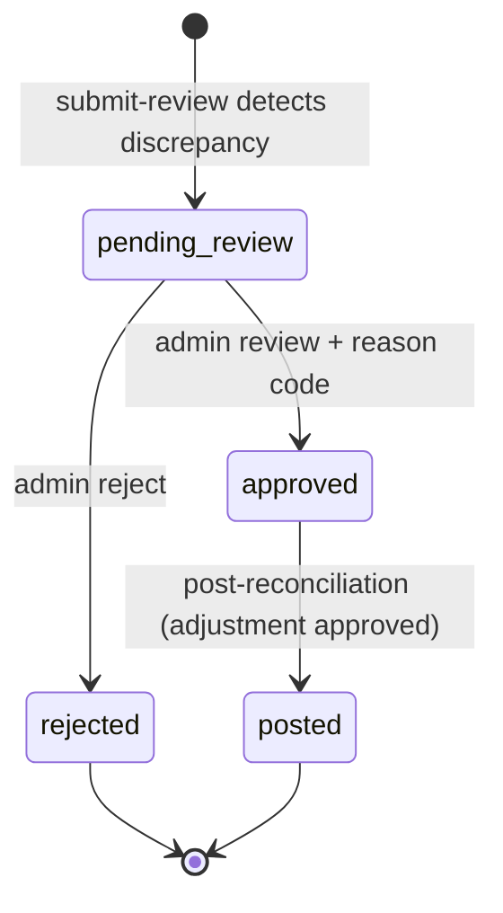
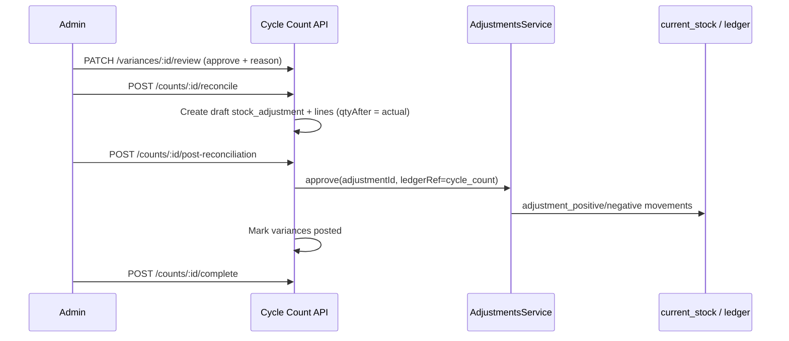

# Phase 7.3 — Inventory Variance & Adjustment Workflow

**Status:** Implemented  
**Date:** 2026-05-29  
**Scope:** Cycle count discrepancy handling, variance review, draft reconciliation adjustments, approved inventory posting with audit trail. Builds on Phases 7.1–7.2.

---

## Summary

| Area | Implementation |
|------|----------------|
| Variance records | `cycle_count_variances` — one per discrepant counted line |
| Detection | Auto on `submit-review` when `actual ≠ expected` |
| Lifecycle | `pending_review` → `approved` / `rejected` → `posted` (after adjustment approve) |
| Adjustments | Draft `stock_adjustments` linked via `cycle_count_id` |
| Reason codes | 7 enum values on approve/reject |
| Inventory posting | Existing `AdjustmentsService.approve` with `ledger reference_type = cycle_count` |
| Audit | Review, draft creation, link, and post events |
| Count complete gate | Blocked until variances resolved and no draft adjustment remains |

---

## Variance Lifecycle



### Detection (`CycleCountVarianceDetectionService`)

Triggered inside `submitForReview` transaction:

- Scans lines with `status = counted`, non-null `discrepancy_quantity ≠ 0`
- Skips lines that already have a variance row (idempotent)
- Creates `cycle_count_variances` copying snapshot expected/actual/discrepancy

**No inventory mutation at detection.**

### Terminal states

| Status | Meaning |
|--------|---------|
| `pending_review` | Awaiting supervisor decision |
| `approved` | Will adjust inventory after reconciliation |
| `rejected` | No adjustment (e.g. counting error, dismissed) |
| `posted` | Linked adjustment approved; ledger written |

---

## Adjustment Flow



### Step 1 — Review variances

`PATCH /api/cycle-count/variances/:id/review` (Internal admin)

```json
{ "action": "approve", "reasonCode": "damaged", "reviewNotes": "..." }
```

- `reasonCode` **required** on approve
- On reject, `reasonCode` optional (defaults to `unknown`)

### Step 2 — Build reconciliation draft

`POST /api/cycle-count/counts/:id/reconcile`

- All variances must be reviewed (none `pending_review`)
- At least one `approved` variance without adjustment link
- Creates one draft `stock_adjustments` row with `cycle_count_id`
- Each approved variance → `stock_adjustment_lines` with:
  - `quantity_before` = expected (snapshot)
  - `quantity_after` = actual (count target)
  - `cycle_count_variance_id` FK
  - `reason_note` from variance reason + notes

### Step 3 — Post reconciliation

`POST /api/cycle-count/counts/:id/post-reconciliation`

- Finds draft adjustment for this count
- Calls `AdjustmentsService.approve` with:
  - `ledgerReferenceType: cycle_count`
  - `ledgerReferenceId: cycleCountId`
- Re-reads live on-hand at approve time (existing adjustment semantics)
- Marks linked variances `posted` with `posted_at`

### Step 4 — Complete count

`POST /api/cycle-count/counts/:id/complete`

Blocked when:

- Any variance still `pending_review`
- Any variance `approved` but not `posted`
- A draft adjustment exists for this count

Allowed when all variances are `posted` or `rejected`, or no variances exist.

---

## Reason Codes

Enum `variance_reason_code`:

| Code | Typical use |
|------|-------------|
| `damaged` | Physical damage / write-off |
| `lost` | Stock missing, not found |
| `misplaced` | Found elsewhere (may pair with transfer later) |
| `theft_suspected` | Shrinkage under investigation |
| `counting_mistake` | Operator or prior count error |
| `operational_correction` | Process fix, not loss event |
| `unknown` | Default on reject; investigative |

`GET /api/cycle-count/variances/reason-codes` lists allowed values.

---

## Schema Changes

**Migration:** `20260703140000_cycle_count_variance_workflow`

### New table: `cycle_count_variances`

Links 1:1 to `cycle_count_lines` (unique `cycle_count_line_id`).

### Extended tables

| Table | Column | Purpose |
|-------|--------|---------|
| `stock_adjustments` | `cycle_count_id` | Trace adjustment to count session |
| `stock_adjustment_lines` | `cycle_count_variance_id` | Line-level variance provenance |

---

## API Reference

### Variances

| Method | Path | Guard | Description |
|--------|------|-------|-------------|
| `GET` | `/cycle-count/variances/reason-codes` | JWT | List reason codes |
| `GET` | `/cycle-count/variances` | JWT | List (filter by count, status) |
| `GET` | `/cycle-count/variances/:id` | JWT | Detail |
| `PATCH` | `/cycle-count/variances/:id/review` | Internal admin | Approve/reject |

### Count-scoped

| Method | Path | Guard | Description |
|--------|------|-------|-------------|
| `GET` | `/cycle-count/counts/:id/variances` | JWT | Variances for one count |
| `GET` | `/cycle-count/counts/:id/adjustments` | JWT | Adjustment history |
| `POST` | `/cycle-count/counts/:id/reconcile` | Internal admin | Build draft adjustment |
| `POST` | `/cycle-count/counts/:id/post-reconciliation` | Internal admin | Approve + post inventory |

---

## Audit Coverage

Events written to `audit_logs` via `AuditLogService`:

| Action | When |
|--------|------|
| `cycle_count.variance.approved` | Variance approved with reason |
| `cycle_count.variance.rejected` | Variance rejected |
| `cycle_count.variance.linked_to_adjustment` | Each variance linked to draft line |
| `cycle_count.reconciliation.draft_created` | Draft adjustment created |
| `cycle_count.reconciliation.posted` | Adjustment approved, inventory posted |

Each entry includes `company_id`, `resource_type`, `resource_id`, and redacted `previous_state` / `new_state` snapshots.

Inventory ledger rows use `reference_type = cycle_count` and `reference_id = cycle_count.id` for reconciliation movements (distinct from manual adjustments).

---

## Operational Assumptions

1. **No silent inventory change** — stock moves only when reconciliation adjustment is **approved**.
2. **Snapshot expected qty** — variance stores count-time expected; approve re-reads live on-hand before applying delta to reach actual target.
3. **One draft reconciliation per count** — second `reconcile` call returns `409`.
4. **Rejected variances** — no adjustment line; count may still complete.
5. **Skipped count lines** — no variance (nothing to reconcile).
6. **Zero discrepancy** — no variance row created.
7. **Supervisor gate** — review and post require `InternalAdminGuard` (super_admin / wh_manager).

---

## Remaining Risks

| Risk | Mitigation / follow-up |
|------|------------------------|
| Live stock drift between count and post | Approve re-reads on-hand; may fail with conflict if concurrent moves — operator must retry |
| Misplaced reason without transfer | Phase 8+ could auto-suggest internal transfer tasks |
| Partial reconciliation | All approved variances in one draft; split batches not supported |
| Skipped lines hiding shrinkage | Operational policy; no auto-variance on skip |
| No audit on manual `adjustments/approve` | Pre-existing gap; cycle count path is audited |
| `counting_mistake` approved still posts | Supervisor should reject or approve with care; future recount workflow |
| Concurrent review of same variance | Single-row update; last writer wins on status |
| Frontend not in scope | Admin UI must orchestrate review → reconcile → post → complete |

---

## Module Layout

```
backend/src/modules/cycle-count/
  cycle-count-variance.constants.ts
  cycle-count-variance-detection.service.ts
  cycle-count-variance.service.ts
  cycle-count-variance.controller.ts
  dto/variance.dto.ts
```

**Also modified:**

- `adjustments.service.ts` — `ApproveAdjustmentOptions` for ledger reference override
- `cycle-count.service.ts` — detection on submit, complete gate
- `cycle-count.controller.ts` — reconcile / post / history routes

---

## Related

- [Phase 7.1 — Foundation](./PHASE-7.1-CYCLE-COUNT-BACKEND-FOUNDATION.md)
- [Phase 7.2 — Task Execution](./PHASE-7.2-CYCLE-COUNT-TASK-EXECUTION.md)

---

## Deploy Notes

1. `npx prisma migrate deploy` — migration `20260703140000_cycle_count_variance_workflow`
2. `npx prisma generate` (restart dev server if EPERM on Windows)
3. `npx tsc --noEmit`
