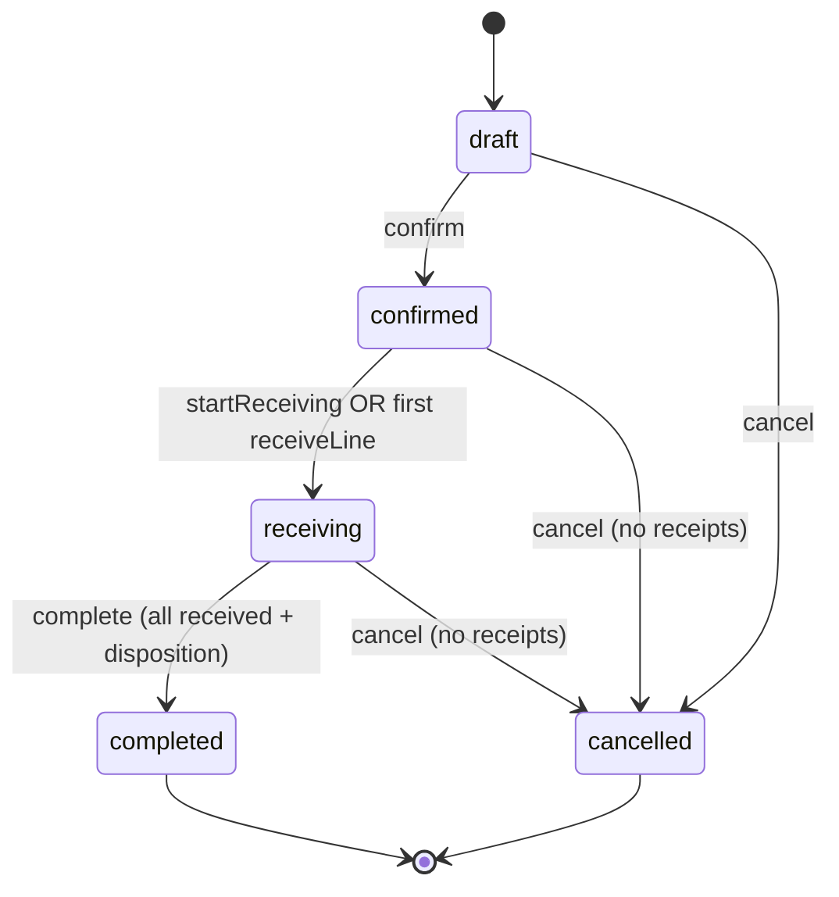

# Phase 8.1 — Returns Backend Foundation

**Date:** 2026-05-29  
**Scope:** Warehouse returns management — schema surfacing, validation, lifecycle, tenant safety.  
**Out of scope:** Inventory ledger posts (`return_receive`), workflow tasks, client portal UI, package status automation.

---

## Summary

Phase 8.1 implements the **returns backend foundation** for controlled inventory re-entry planning. Return orders and lines were already present in the baseline PostgreSQL schema (`0_init`); this phase adds Prisma models, optional linkage columns, a NestJS `returns` module, quantity safeguards against over-returning shipped stock, and a full status lifecycle without posting stock yet.

---

## Schema changes

### Existing tables (baseline `0_init`)

| Table | Purpose |
|-------|---------|
| `return_orders` | Header: company, RTN order number, optional `original_outbound_order_id`, status, notes |
| `return_order_lines` | Lines: product, optional lot, expected/received qty, condition, disposition |

**Enums (unchanged values):**

- `return_order_status`: `draft` → `confirmed` → `receiving` → `completed` | `cancelled`
- `return_item_condition`: `new`, `good`, `damaged`, `unusable`
- `return_item_disposition`: `restock`, `quarantine`, `scrap`

Order numbers: trigger `fn_return_order_number` → prefix **`RTN`**.

### Migration `20260801140000_returns_backend_foundation`

Additive columns for linkage and lifecycle auditing:

**`return_orders`**

| Column | Type | Notes |
|--------|------|--------|
| `client_reference` | TEXT | Customer / RMA reference |
| `package_id` | UUID → `packages` | Optional header-level package |
| `shipment_reference` | TEXT | Carrier/tracking text (no `shipments` table in WMS) |
| `confirmed_at` | TIMESTAMPTZ | Set on confirm |
| `receiving_started_at` | TIMESTAMPTZ | Set on start-receiving or first receive |
| `completed_at` | TIMESTAMPTZ | Set on complete |
| `cancelled_at` / `cancelled_by` | TIMESTAMPTZ / UUID | Set on cancel |

**`return_order_lines`**

| Column | Type | Notes |
|--------|------|--------|
| `outbound_order_line_id` | UUID → `outbound_order_lines` | Line-level outbound linkage |
| `package_id` | UUID → `packages` | Line-level package linkage |
| `line_number` | INT | Display/sort order (default 1) |

Indexes on outbound, package, and product for list/quota queries.

### Prisma models added

- `ReturnOrder`, `ReturnOrderLine`
- `Package` (surfaced from existing `packages` table)
- Enums: `ReturnOrderStatus`, `ReturnItemCondition`, `ReturnItemDisposition`, `PackageStatus`
- Relations on `Company`, `User`, `OutboundOrder`, `OutboundOrderLine`, `Product`, `Lot`, `Location`

**Ledger readiness (not written in 8.1):** `MovementType.return_receive`, `LedgerRefType.return_order` already exist in schema.

---

## API surface

Base path: **`/api/return-orders`** (JWT + tenant scope).

| Method | Path | Description |
|--------|------|-------------|
| `POST` | `/` | Create draft return with lines |
| `GET` | `/` | Paginated list (`companyId`, `status`, `originalOutboundOrderId`, search, dates) |
| `GET` | `/:id` | Detail with lines, outbound, package |
| `POST` | `/:id/confirm` | `draft` → `confirmed` |
| `POST` | `/:id/start-receiving` | `confirmed` → `receiving` |
| `POST` | `/:id/lines/:lineId/receive` | Increment `received_quantity` (auto-starts receiving if needed) |
| `POST` | `/:id/complete` | `receiving` → `completed` (all lines received + disposition set) |
| `POST` | `/:id/cancel` | Cancel if no received qty yet |

**Module layout:** `backend/src/modules/returns/`

- `returns.service.ts` — CRUD + lifecycle
- `return-quantity.validation.ts` — shipped-quantity caps
- `returns.constants.ts` — status groupings
- `returns.controller.ts` / `returns.module.ts`

Registered in `app.module.ts`.

---

## Validation protections

### Tenant / company

| Check | Where |
|-------|--------|
| `resolveWriteCompanyId` on create | All writes scoped to authorized tenant |
| `readCompanyIdFilterRequired` on list | Global admins must pass `companyId` or `X-Company-Id` |
| `validateResourceOwnership` on get/mutate | Cross-company IDs return 404 |
| Product `companyId` must match order | Create |
| Outbound `companyId` must match return | Create when linked |
| Package / lot lookups use `NotFound` on wrong company | Prevents existence leaks |

### Product & quantity basics

- Positive `expectedQuantity` (DTO + DB CHECK)
- Non-negative `receivedQuantity` (DB CHECK)
- Discrete UOM integer rules (`assertDiscreteUomPositiveIntegerQuantity`)
- Lot required when `product.trackingType === lot`
- Products must be orderable (`assertProductOrderableForOrders`)
- Receive increment cannot exceed line `expectedQuantity`

### Outbound linkage

When `originalOutboundOrderId` is set:

- Outbound must exist and match return `companyId`
- Outbound must be **`shipped`** before return quantities are accepted
- `outboundOrderLineId` requires header outbound id
- Line product must match referenced outbound line
- Optional lot must match outbound line lot when outbound line is lot-specific

### Shipped quantity cap (`ReturnQuantityValidation`)

Prevents **returning more than was shipped**:

- Per **outbound line** when `outboundOrderLineId` is set: cap = that line’s `picked_quantity`
- Per **product (+ optional lot)** otherwise: cap = sum of matching outbound lines’ `picked_quantity`
- **Cumulative** across return orders in `draft`, `confirmed`, `receiving`, and `completed` (cancelled excluded from quota)
- Re-validated on **confirm** to close race where two drafts are created before either confirms

### Duplicate / abuse mitigation

- No single hard “one return per outbound” rule (multiple partial returns allowed)
- **Aggregate expected quantities** across active returns cannot exceed shipped amounts
- Cancel blocked after any `received_quantity > 0`
- Completed returns still count toward historical quota (prevents re-returning same units)

### Optional references

| Reference | Level | Validation |
|-----------|--------|------------|
| Outbound order | Header | Company match; shipped status for qty cap |
| Outbound line | Line | Belongs to header outbound; product/lot consistency |
| Package | Header or line | Product company match; line package product = line product |
| Lot | Line | Belongs to product + company |
| Shipment | Header `shipment_reference` | Free-text only (no shipment entity) |

---

## Lifecycle behavior



| Transition | Preconditions |
|------------|----------------|
| **confirm** | Status `draft`; ≥1 line; products orderable; qty within shipped limits if outbound-linked |
| **startReceiving** | Status `confirmed` |
| **receiveLine** | Status `confirmed` or `receiving`; increment ≤ remaining expected |
| **complete** | Status `receiving`; every line `received_quantity >= expected_quantity`; every line has `disposition` |
| **cancel** | Not terminal; no line has `received_quantity > 0` |

**Note:** `receiveLine` can move `confirmed` → `receiving` implicitly so operators are not forced to call `start-receiving` first.

---

## Quantity safeguards (detail)

1. **Shipped baseline:** `outbound_order_lines.picked_quantity` on a **`shipped`** outbound order.
2. **Bucket key:** Either `line:{outboundOrderLineId}` or `product:{productId}:lot:{lotId|any}`.
3. **Request aggregation:** Multiple lines in one create payload are summed per bucket before comparing to cap.
4. **Historical sum:** `return_order_lines.expected_quantity` for same outbound + bucket across non-cancelled returns.
5. **Error message:** Includes shipped, already-returned, and requested amounts for supportability.

Customer returns **without** `originalOutboundOrderId` skip shipped caps (unlinked RMA) but still enforce company/product/lot/package rules.

---

## Remaining risks / follow-ups

| Risk | Mitigation (future phase) |
|------|---------------------------|
| **No inventory ledger write on complete/receive** | Phase 8.2+: `return_receive` + `restock`/`quarantine` location rules |
| **Race between two confirms** | Rare window; consider row lock on outbound or serializable transaction |
| **Unlinked returns without outbound** | No shipped cap — business policy may require outbound or max qty elsewhere |
| **`completed` counts toward return quota** | Intentional anti-abuse; adjust if business allows “re-return” after completion |
| **Package `status` not updated** | Wire `packages.status = returned` on receive/complete |
| **No workflow tasks** | Returns receiving not in `warehouse_tasks` yet |
| **No client portal** | Add `client-portal/returns` when UI phase starts |
| **Prisma generate EPERM on Windows** | Restart `npm run start:dev` if client types stale after schema pull |

---

## Verification

```bash
cd backend
npx prisma migrate deploy
npx prisma generate   # restart dev server if EPERM on Windows
npx tsc --noEmit
```

Example create (after login + `X-Company-Id`):

```http
POST /api/return-orders
{
  "originalOutboundOrderId": "<shipped-outbound-uuid>",
  "clientReference": "RMA-1001",
  "lines": [
    {
      "productId": "<product-uuid>",
      "outboundOrderLineId": "<outbound-line-uuid>",
      "expectedQuantity": 2
    }
  ]
}
```

---

## Files touched

| Path | Change |
|------|--------|
| `prisma/schema.prisma` | Return + Package models and enums |
| `prisma/migrations/20260801140000_returns_backend_foundation/` | Linkage + lifecycle columns |
| `src/modules/returns/**` | New module |
| `src/app.module.ts` | Import `ReturnsModule` |
