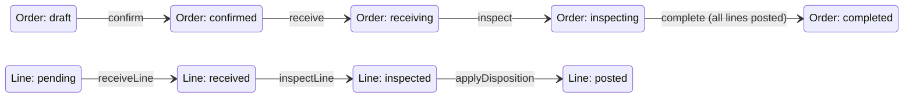

# Phase 8.2 — Returns Workflow & Inventory Logic

**Date:** 2026-05-29  
**Scope:** Operational returns processing — receive, inspect, disposition, transactional inventory posting, audit.  
**Builds on:** [PHASE-8.1-RETURNS-BACKEND-FOUNDATION.md](./PHASE-8.1-RETURNS-BACKEND-FOUNDATION.md)

---

## Summary

Phase 8.2 adds an **operational returns workflow** with per-line state tracking, inspection/disposition handling, **transactional inventory mutations** (ledger + `current_stock`), and **audit logging**. Damaged and quarantine stock is routed to isolation locations with `quarantined` stock status; restock targets sellable bins only; discard uses scrap locations and `scrap` movement type.

---

## Schema changes

### Migration `20260802140000_returns_workflow_inventory`

| Change | Details |
|--------|---------|
| `return_order_status` | New value: `inspecting` |
| `return_item_disposition` | New values: `damaged`, `discard`, `inspection_required` (`scrap` retained; app maps → `discard`) |
| `return_line_status` enum | `pending` → `received` → `inspected` → `posted` |
| `return_orders.warehouse_id` | Required for inventory posting |
| `return_orders.inspecting_started_at` | Timestamp |
| Line columns | `line_status`, `inspected_at`, `inspected_by`, `posted_at`, `posted_quantity`, `target_location_id`, `inspection_notes` |

### Prisma

- `ReturnLineStatus`, extended `ReturnItemDisposition`, `ReturnOrder.warehouseId`, line workflow fields
- Relations: `ReturnOrder` ↔ `Warehouse`, line ↔ `Location` (target), line ↔ `User` (inspector)

---

## Workflow lifecycle



### Order status

| Status | Meaning |
|--------|---------|
| `draft` | Created, editable |
| `confirmed` | Ready for physical receipt |
| `receiving` | At least one receive in progress |
| `inspecting` | Inspection/disposition in progress |
| `completed` | All received lines posted to inventory |
| `cancelled` | Aborted (no receipts) |

### Line status

| Status | Meaning |
|--------|---------|
| `pending` | Not yet received |
| `received` | `received_quantity > 0` |
| `inspected` | Condition/disposition recorded |
| `posted` | Inventory + ledger applied |

### API flow (recommended)

1. `POST /return-orders` — include `warehouseId`
2. `POST /:id/confirm`
3. `POST /:id/lines/:lineId/receive` — physical qty only (optional condition)
4. `POST /:id/lines/:lineId/inspect` — condition + disposition (+ optional target location)
5. `POST /:id/lines/:lineId/apply-disposition` — posts inventory (or `POST /:id/post-inventory` batch)
6. `POST /:id/complete` — all lines fully received and posted

---

## Disposition behavior

| Disposition | Inventory post? | Target locations | Stock status | Ledger movement |
|-------------|-----------------|------------------|--------------|-----------------|
| `inspection_required` | No | — | — | — |
| `restock` | Yes | `internal`, `fridge` only | `available` | `return_receive` |
| `quarantine` | Yes | `quarantine`, `scrap` bins | `quarantined` | `qc_quarantine` |
| `damaged` | Yes | `quarantine`, `scrap` bins (not sellable) | `quarantined` | `qc_quarantine` |
| `discard` | Yes | `scrap` only | `quarantined` | `scrap` |
| `scrap` (legacy) | Yes | Treated as `discard` | Same as discard | `scrap` |

**Rules enforced in** `return-disposition.policy.ts`:

- Damaged stock **cannot** be posted to `internal` / `fridge` (sellable).
- Quarantine/damaged share isolation location types.
- `inspection_required` blocks `apply-disposition` until a final disposition is set.

---

## Inventory handling

### Service: `ReturnInventoryService`

All stock/ledger writes run inside the **caller's Prisma transaction**:

1. Validate disposition + `targetLocationId` + warehouse match
2. `StockHelpers.upsertPositiveWithMeta` for `received_quantity - posted_quantity`
3. Set `current_stock.status` (`available` vs `quarantined`)
4. `LedgerIdempotencyService.appendIfAbsent` with key `return:{orderId}:line:{lineId}:post`
5. Update line: `posted_quantity`, `posted_at`, `line_status = posted`
6. Optional: set linked `packages.status = returned`

### Reference type

- `reference_type = return_order`
- `reference_id = return order id`

### Idempotency

Duplicate `apply-disposition` on the same line is safe: idempotency key prevents double ledger rows; line status `posted` rejects repeats.

---

## Integrity protections

| Protection | Implementation |
|------------|----------------|
| Transactional mutations | Single `$transaction` per inspect/apply/receive batch |
| No silent sellable damaged stock | Location type guard + `quarantined` status |
| Quarantine isolation | Only quarantine/scrap location types for quarantine/damaged |
| Tenant scope | Unchanged from 8.1 (`CompanyAccessService`) |
| Shipped quantity cap | Unchanged from 8.1 (`ReturnQuantityValidation`) |
| Receive cap | `received_quantity ≤ expected_quantity` |
| Post cap | `posted_quantity` synced to received on post |
| Complete gate | All lines `posted` before order `completed` |
| Cancel gate | No cancel after any receipt |

---

## Audit integration

`AuditLogService` events (via `AuditModule`):

| Action | When |
|--------|------|
| `return.created` | Create |
| `return.confirmed` | Confirm |
| `return.line.received` | Receive line |
| `return.line.inspected` | Inspect line |
| `return.line.inventory_posted` | Apply disposition / inventory |
| `return.completed` | Complete order |
| `return.cancelled` | Cancel |

Transactional writes use `audit.logTx` inside the same DB transaction as inventory.

---

## Module layout

```
backend/src/modules/returns/
  returns.service.ts           # CRUD + receive + lifecycle
  return-workflow.service.ts   # inspect, apply, batch post
  return-inventory.service.ts  # ledger + stock
  return-disposition.policy.ts # disposition rules
  return-quantity.validation.ts
  returns.constants.ts
  returns.controller.ts
  returns.module.ts            # imports InventoryModule, AuditModule
```

### New endpoints

| Method | Path |
|--------|------|
| `POST` | `/return-orders/:id/lines/:lineId/inspect` |
| `POST` | `/return-orders/:id/lines/:lineId/apply-disposition` |
| `POST` | `/return-orders/:id/post-inventory` |

---

## Remaining operational risks

| Risk | Notes |
|------|--------|
| **Partial posts** | Only full `received_quantity` posted per apply; partial post per line not supported |
| **No automatic QC tasks** | Inspection is API-driven, not warehouse task workflow |
| **Legacy `scrap` disposition** | DB enum value kept; app normalizes to `discard` |
| **`warehouseId` optional at create** | Must be set before inventory post |
| **Race on concurrent apply** | Idempotency key mitigates duplicate posts; two different dispositions racing need ops discipline |
| **Realtime / notifications** | No socket events on return completion yet |
| **Client portal** | Internal API only |
| **Returns without outbound link** | No shipped-quantity cap; policy risk for unlinked RMAs |

---

## Verification

```bash
cd backend
npx prisma migrate deploy
npx prisma generate
npx tsc --noEmit
```

Example inspect + post:

```http
POST /api/return-orders/{id}/lines/{lineId}/inspect
{ "condition": "damaged", "disposition": "quarantine", "targetLocationId": "<quarantine-loc-uuid>" }

POST /api/return-orders/{id}/lines/{lineId}/apply-disposition
{ "disposition": "quarantine", "targetLocationId": "<quarantine-loc-uuid>" }

POST /api/return-orders/{id}/complete
```
