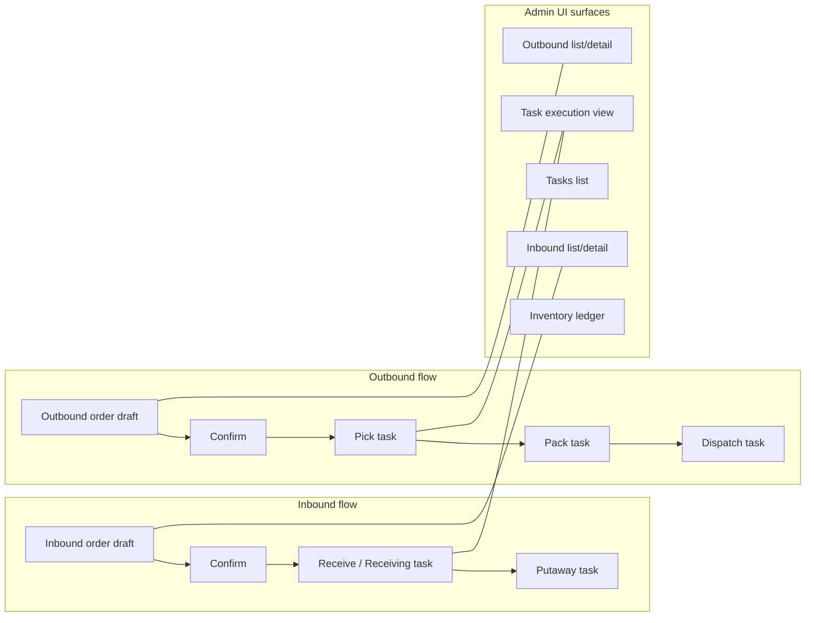

# Overview — Dual Frontend Architecture

## System context

```mermaid
flowchart TB
  subgraph clients [Browser clients]
    Admin[Admin Dashboard<br/>frontend :5173]
    Portal[Client Portal<br/>client-frontend :5174]
  end

  subgraph api [Backend NestJS]
    REST[/api/*]
    ClientREST[/api/client/*]
    WS[/realtime Socket.IO]
  end

  Admin --> REST
  Admin --> WS
  Portal --> ClientREST
  Portal --> WS

  REST --> DB[(PostgreSQL)]
  ClientREST --> DB
  WS --> DB
```

## Technology stack (both apps)

| Layer | Admin | Client |
|-------|-------|--------|
| Build | Vite | Vite |
| UI | React | React |
| Routing | `createBrowserRouter` | `BrowserRouter` + `Routes` |
| Server state | TanStack Query v5 | TanStack Query v5 |
| HTTP | Axios + envelope unwrap | Axios + envelope unwrap |
| Realtime | `socket.io-client` | `socket.io-client` |
| CSS | Tailwind 3 + shared `globals.css` | Same |
| Forms | Mostly controlled React state | Same |
| i18n | Ad-hoc EN/AR maps + RTL (`localStorage`) | EN UI + AR RTL toggle only |

Neither app uses Redux, Zustand, or a formal i18n library.

## Data flow pattern (common)

1. **Boot:** Auth provider reads JWT from `sessionStorage` → `GET .../auth/me`.
2. **Page mount:** `useQuery` with stable query keys → service/API module → Axios.
3. **Mutation:** `useMutation` → POST/PATCH → `onSuccess` invalidates query keys (and/or optimistic cache updates on some pages).
4. **Realtime:** Socket event → `queryClient.invalidateQueries(...)` → affected lists refetch.
5. **Errors:** API client maps Nest errors to `Error` with message; pages show inline banners or toasts (admin) / banners (client).

## Authentication comparison

| Aspect | Admin | Client |
|--------|-------|--------|
| Token storage | `sessionStorage` key `wms.access_token` | `client_portal_access_token` |
| Login endpoint | `POST /api/auth/login` | `POST /api/client/auth/login` |
| Roles | `authGroup`: `ADMIN` \| `OPERATOR` | `client_admin` \| `client_staff` |
| Route guard | `RequireAuth` → `Layout` | `RequireAuth` → `PortalLayout` |
| 401 handling | Clear token + redirect `/login` | Clear token + `onSessionInvalid` → `/login` |
| Tenant header | `X-Company-Id` from `VITE_MOCK_COMPANY_ID` (dev) | Scoped by JWT `companyId` on server |

## Realtime comparison

| Event | Admin invalidates | Client invalidates |
|-------|-------------------|-------------------|
| `order.inbound.*` | Orders, tasks, inventory, ledger, workflows, dashboard | **Stock only** |
| `order.outbound.*` | Same | **Stock only** |
| `task.updated` | Tasks, workflows, dashboard | **Stock only** |
| `inventory.changed` | Stock, ledger | **Stock only** |

Admin socket **requires** `VITE_MOCK_COMPANY_ID` to connect. Client socket requires logged-in user + token + `user.companyId`.

## Warehouse workflow mapping (conceptual)



Client portal exposes **read-only** views of inbound/outbound orders and stock — no task execution or order mutations.

## Environment variables

### Admin (`frontend/.env.example`)

| Variable | Purpose |
|----------|---------|
| `VITE_API_URL` | REST base, default `http://localhost:3000/api` |
| `VITE_MOCK_COMPANY_ID` | `X-Company-Id` + Socket.IO `companyId` |
| `VITE_DEFAULT_WAREHOUSE_ID` | Single-warehouse UI default |
| `VITE_TASK_ONLY_FLOWS` | UI mirror of backend task-only confirm/receive |
| `VITE_MOCK_WORKER_ID` | Dev task worker impersonation |

### Client (`client-frontend/.env.example`)

| Variable | Purpose |
|----------|---------|
| `VITE_API_URL` | REST base, default `http://localhost:3000/api/client` |

## Entry points

| App | Bootstrap file | Router |
|-----|----------------|--------|
| Admin | `frontend/src/main.tsx` | `frontend/src/router.tsx` |
| Client | `client-frontend/src/main.tsx` | `client-frontend/src/App.tsx` |

Admin has **no `App.tsx`** — composition is `main.tsx` → providers → `RouterProvider(router)`.
