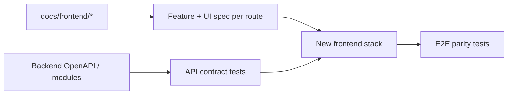

# UX Analysis & Rebuild Readiness

**Scope:** Document problems only — no redesign proposals as implementation.

---

## 1. Cross-application inconsistencies

| Area | Admin (`frontend`) | Client (`client-frontend`) | Issue |
|------|-------------------|---------------------------|-------|
| Component library | 18 shared components | 1 layout component | Duplicate patterns (tables, pagers, errors) |
| Table UX | `DataTable` with rows-per-page | Hand-rolled `data-table` + pager | Different pagination UX (20 vs 25 default) |
| Primary color | Emerald buttons + green sidebar | Green buttons only | Two brand greens on admin |
| Order status | `StatusBadge` component | Raw text or `badge` classes | Visual mismatch |
| Realtime coverage | Broad invalidation | Stock only | Client lists stale after order updates |
| i18n | Partial AR translations | RTL without copy translation | Incomplete localization |
| Routing | Data router + blockers | Simple browser router | Feature parity gap for exit guards |
| API folder name | `api/` | `services/` | Same pattern, different naming |

---

## 2. Admin UX problems

### Navigation & information architecture

- **No breadcrumbs** — only inline back links; deep ledger drill-down may disorient users.
- **WarehousesPage orphan** — CRUD exists but no nav/route (dead feature).
- **Users route** — Nav hidden for non-ADMIN but route not blocked at router level.
- **Legacy URL redirects** — Good for bookmarks, but increases mental model complexity.

### Warehouse & tenant model

- **Single-warehouse default** via env — multi-warehouse sites lack global warehouse switcher.
- **Realtime requires `VITE_MOCK_COMPANY_ID`** — production must use same hack or socket never connects.
- **`X-Company-Id` header** — Dev tenant injection; real multi-tenant UX not visible in UI.

### Task execution

- **TaskExecutionView size** (~2500 lines) — high cognitive load; hard to test and onboard.
- **Task-only vs legacy receive** — Behavior split across env flag confuses operators.
- **Exit blocker** — Good safety; may surprise users without clear "unsaved changes" banner before navigation.

### Lists & filters

- **Client-side pagination in DataTable** — Large datasets load all rows into memory first (server pagination not used on many pages).
- **Apply vs draft filters** — Consistent pattern but extra click vs live filter.

### Visual design

- **Three primary accents** (green sidebar, emerald buttons, blue tailwind primary) — inconsistent hierarchy.
- **No dark mode** despite design tokens suggesting extensibility.
- **Mixed styling systems** — Tailwind utility classes + shared CSS classes + inline styles on some pages.

### Accessibility (observed gaps)

- Not all interactive table rows have consistent keyboard patterns (client portal adds `role="link"`; admin uses `onRowClick` on `<tr>`).
- Modal focus trap not documented in component code review.
- Language toggle does not change `lang` attribute meaningfully (admin sets `lang` while AR uses RTL).

---

## 3. Client portal UX problems

### Feature gaps (intentional read-only vs user expectations)

- **No order creation** — Clients cannot draft inbound/outbound from portal (may be by design).
- **No exports** — PDF/CSV not present on lists.
- **No dashboard charts** — Welcome page is profile-only, not operational KPIs.

### Stale data

- **Realtime only refreshes stock** — Order list/detail won't update when warehouse confirms orders unless user refreshes.

### Visual parity

- **Status as plain text on lists** — Detail pages use badges; lists don't — inconsistent scanability.
- **Inline styles on detail pages** — Harder to maintain consistent spacing with list pages.

### Mobile

- Sidebar overlay exists but tables may require heavy horizontal scroll on small screens.

### Security UX

- Password-only auth — Same as admin; no MFA UI.

---

## 4. Responsiveness issues

| Surface | Issue |
|---------|-------|
| Admin DataTable | Horizontal scroll; many columns on inbound/outbound |
| Admin sidebar | Two-column nav collapses to drawer — OK |
| Client tables | `table-wrap` scroll only |
| Task execution | Dense forms may overflow on mobile |
| Dashboard charts | Grid may stack awkwardly on narrow viewports |

---

## 5. Scalability issues (frontend architecture)

| Issue | Impact |
|-------|--------|
| Monolithic TaskExecutionView | Hard to split by task type for teams |
| No shared package between admin/client | Duplicate date formatting, badge mapping, API types |
| Ad-hoc i18n maps per file | Translation drift, missing keys |
| Client-side table pagination | Performance ceiling on large catalogs |
| Vendored SDK in admin only | Client can't share task types if portal grows |

---

## 6. Rebuild readiness checklist

Use this when rebuilding or refactoring either frontend.

### Must preserve for backend compatibility

- [ ] REST paths and envelopes `{ success, data }`
- [ ] JWT bearer in `Authorization` header
- [ ] Admin: optional `X-Company-Id` for dev/single-tenant
- [ ] Client: company scoping server-side (no client-sent company id)
- [ ] Socket.IO path `/realtime` with `auth: { token, companyId }`
- [ ] Event names: `order.inbound.*`, `order.outbound.*`, `task.updated`, `inventory.changed`
- [ ] Task execution API contracts (`/tasks/:id/progress`, `/complete`, lease endpoints)
- [ ] Workflow timeline API `GET /workflows/references/:type/:id`
- [ ] Ledger drill-down routes (reference type/id + entry id + createdAt)
- [ ] Inbound confirm body shape when task-only (`warehouseId`, `stagingByLineId`)
- [ ] Decimal quantities as strings in JSON

### Admin route parity (23 routes)

See `admin/02-page-inventory.md` — include legacy redirects or document breaking changes.

### Client route parity (8 routes)

See `client/02-pages-and-ui.md`.

### Component parity minimum

| Capability | Admin component | Client equivalent needed |
|------------|-----------------|---------------------------|
| Auth guard | RequireAuth | Same |
| Layout shell | Layout | PortalLayout |
| Paginated table | DataTable | Table + pager pattern |
| Toast feedback | ToastProvider | Banner or toast |
| Status display | StatusBadge | Unified badge |
| Modal CRUD | Modal | If client gains write APIs |

### Documentation artifacts (this repo)

| File | Use |
|------|-----|
| `docs/frontend/README.md` | Index |
| `docs/frontend/00-overview.md` | Dual-app context |
| `docs/frontend/admin/*` | Admin blueprint |
| `docs/frontend/client/*` | Client blueprint |
| This file | UX debt register |

### Suggested verification after rebuild

1. Login flows both apps against same backend version.
2. Create inbound → confirm → complete task chain updates stock in both apps.
3. Socket events refresh all affected screens (fix client invalidation scope).
4. AR RTL layout on representative pages.
5. ADMIN-only users page blocked for OPERATOR at router level.
6. Playwright e2e for critical paths (placeholder exists under `frontend/e2e/`).

---

## 7. Diagram: documentation → rebuild flow

---

## 8. Known folder naming for handoff

| Requested name | Actual path |
|----------------|-------------|
| Employee/Admin Dashboard | `frontend/` |
| Client Portal | `client-frontend/` |
| `client-dash-front-end` | **Does not exist** |

*End of UX analysis — treat items above as documented debt, not implementation tasks in this documentation pass.*
