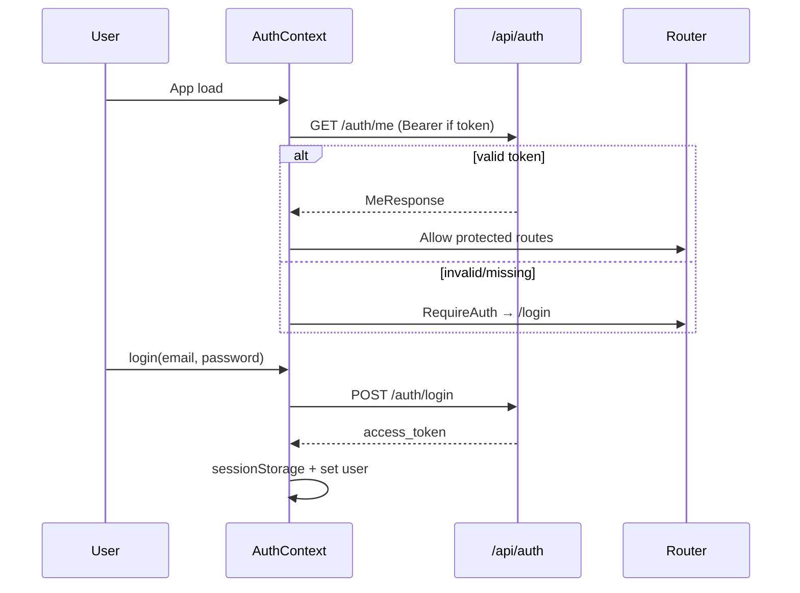

# Admin Dashboard (`frontend/`) — Architecture

## 1. Project structure

```
frontend/
├── index.html
├── package.json
├── vite.config.ts          # port 5173, alias @emdad/wms-task-execution
├── tailwind.config.js      # preset: ../shared/design-system/tailwind.preset.cjs
├── postcss.config.js
├── .env / .env.example
├── e2e/                    # Playwright placeholder
└── src/
    ├── main.tsx            # Provider tree + RouterProvider
    ├── router.tsx          # createBrowserRouter — all routes
    ├── styles.css          # @import shared/design-system/globals.css
    ├── api/                # 15 Axios API modules + client.ts
    ├── auth/               # AuthContext, RequireAuth, authStorage
    ├── components/         # 18 reusable UI components
    ├── constants/query-keys.ts
    ├── hooks/              # 5 hooks
    ├── lib/                # queryClient, domain helpers, invalidation
    ├── pages/              # 24 page modules (23 routed + WarehousesPage orphan)
    ├── realtime/           # Socket.IO provider + constants
    ├── workflow/           # WorkflowUxContext, task-ui-matrix
    └── vendor/wms-task-execution/  # Task execution SDK (vendored)
```

### Why this structure

- **`api/`** — One module per backend domain; keeps pages thin.
- **`pages/`** — Route-level screens; large flows (`TaskExecutionView`) stay colocated.
- **`components/`** — Cross-page UI primitives (tables, modals, layout).
- **`workflow/`** — Task-type UI matrix and workflow UX settings separate from generic components.
- **`vendor/wms-task-execution`** — Shared task completion logic with backend contracts.

## 2. Provider tree

```
QueryClientProvider
  └── ToastProvider
        └── AuthProvider
              └── RealtimeProvider
                    └── RouterProvider(router)
```

Inside authenticated routes, `Layout` wraps:

```
WorkflowUxProvider
  └── <Outlet />  (page content)
```

## 3. Routing structure

**File:** `src/router.tsx` — uses `createBrowserRouter` (required for `useBlocker` on task exit).

### Public

| Path | Component |
|------|-----------|
| `/login` | `LoginPage` |

### Protected (`RequireAuth` → `Layout`)

| Path | Component | Notes |
|------|-----------|-------|
| `/` | redirect → `/dashboard/overview` | |
| `/dashboard/overview` | `DashboardOverviewPage` | |
| `/products` | `ProductsPage` | |
| `/products/:sku` | `ProductDetailPage` | |
| `/locations` | `LocationsPage` | |
| `/inventory/stock` | `InventoryPage` | |
| `/inventory/adjustments` | `AdjustmentsPage` | |
| `/inventory/ledger` | `InventoryLedgerPage` | |
| `/inventory/ledger/:referenceType/:referenceId` | `InventoryLedgerReferencePage` | |
| `/inventory/ledger/line/:ledgerId/:createdAt` | `InventoryLedgerEntryPage` | |
| `/inventory/product/:productId` | `InventoryProductDetailPage` | |
| `/orders/inbound` | `InboundListPage` | |
| `/orders/inbound/:id` | `InboundDetailPage` | |
| `/orders/outbound` | `OutboundListPage` | |
| `/orders/outbound/:id` | `OutboundDetailPage` | |
| `/tasks` | `TasksListPage` | `?taskType=` filter |
| `/tasks/:id` | `TaskDetailPage` | → `TaskExecutionView` |
| `/tasks/:id/execute` | `TaskExecutePage` | redirect → `/tasks/:id` |
| `/internal` | `InternalTransferPage` | |
| `/clients` | `ClientsPage` | Companies / 3PL customers |
| `/users` | `UsersPage` | ADMIN nav only |
| `*` | redirect → `/dashboard/overview` | |

**Legacy redirects:** `/inbound`, `/outbound`, `/adjustments`, `/dashboard`, `/inventory` → canonical paths.

**Orphan:** `WarehousesPage.tsx` — full CRUD UI but **not registered** in `router.tsx`.

## 4. Layout & navigation (`Layout.tsx`)

### Shell structure

- **Desktop:** Fixed left sidebar (~narrow icon rail + expandable section panel) + main content area.
- **Mobile:** Hamburger opens overlay drawer; same nav tree.
- **Top of main:** Page content only (no global topbar in Layout — branding in sidebar footer).

### Sidebar sections

| Section key | Label | Children |
|-------------|-------|----------|
| `dashboard` | Dashboard | Overview |
| `orders` | Orders | Inbound, Outbound |
| `catalog` | Catalog | Products, Locations |
| `inventory` | Inventory | Stock, Adjustments, Ledger |
| `tasks` | Tasks | All tasks, Internal transfer, Receive/Putaway/Pick/Pack/Delivery shortcuts (`?taskType=`) |
| `management` | Manage | Customers (clients), Users (ADMIN only) |

### Sidebar behavior

- One section expanded at a time (`openSection` state); defaults to `orders`.
- Active link: green background `#1a7a44`, white text.
- Task shortcuts use query param `taskType` matching backend task types.
- **Language toggle:** EN / AR stored in `localStorage` `wms-ui-language`; sets `document.documentElement.dir` to `rtl` for AR.
- **Logout:** calls `logout()` from auth context.

### Access control in nav

- **Users** link rendered only when `user.authGroup === 'ADMIN'`.
- No route-level role guard for `/users` in router — rely on API 403 if mis-navigated.

## 5. State management

### TanStack Query defaults (`lib/queryClient.ts`)

- Queries: `staleTime` 3 min, `gcTime` 20 min, no refetch on focus/mount, refetch on reconnect, `retry: 1`
- Mutations: `retry: 0`

### Central query keys (`constants/query-keys.ts`)

See `admin/03-components-and-api.md` for full `QK` table.

### Context state

| Context | State | Consumers |
|---------|-------|-----------|
| `AuthContext` | `user`, `booting`, login/logout | All protected pages |
| `ToastContext` | Toast stack | Mutations |
| `WorkflowUxContext` | `showAdvancedJson`, `confirmUnsavedDraft`, settings from API | Task execution, workflow UI |
| Realtime | Socket ref (no consumer context) | Side-effect invalidation only |

### Filter pattern (`hooks/useFilters.ts`)

Many list pages use **draft vs applied** filters:

- User edits draft fields → **Apply** copies to applied → triggers query key change.
- **Reset** clears both.

## 6. Authentication flow



| File | Role |
|------|------|
| `auth/authStorage.ts` | `wms.access_token` in sessionStorage |
| `auth/AuthContext.tsx` | Boot, login, logout, caches `fullName` in localStorage |
| `auth/RequireAuth.tsx` | Redirect to `/login` with `state.from` |
| `api/auth.ts` | login, logout, me |
| `api/client.ts` | Bearer header, 401 → clear + `window.location.assign('/login')` |

**Dev tenant:** `VITE_MOCK_COMPANY_ID` → `X-Company-Id` on requests (except `/dashboard/*` and `/companies`).

## 7. Realtime / WebSocket

| File | Purpose |
|------|---------|
| `realtime/socketBaseUrl.ts` | Strip `/api` from `VITE_API_URL` → Socket origin |
| `realtime/constants.ts` | Event name constants |
| `realtime/RealtimeProvider.tsx` | Connect + invalidate queries |

**Connection:** `io(origin + '/realtime', { auth: { token, companyId } })`

**Precondition:** `user` + token + **`VITE_MOCK_COMPANY_ID`** — without company id, socket does not connect.

**Events → invalidation:** See `admin/04-styling-and-realtime.md`.

## 8. API communication layer

**Base:** `src/api/client.ts`

- Axios instance, `VITE_API_URL`
- Unwraps `{ success: true, data: T }` envelope
- Maps API errors to `Error` with `.code`
- `PageResult<T>` for paginated lists

**Modules:** `auth`, `companies`, `users`, `warehouses`, `products`, `locations`, `inventory`, `inbound`, `outbound`, `tasks`, `workflows`, `workers`, `adjustments`, `dashboard`

Full endpoint list: `admin/03-components-and-api.md`.

## 9. Task execution subsystem

- **`TaskDetailPage`** — Thin wrapper passing `taskId` to **`TaskExecutionView`** (~2500 lines).
- **`workflow/task-ui-matrix.ts`** — Maps `taskType` → UI sections (receive lines, putaway destinations, pick reservations, etc.).
- **`@emdad/wms-task-execution`** (vendored) — Progress/complete/compensation requests aligned with backend.
- **`useExecutionExitBlocker`** — `useBlocker` + confirm when leaving with unsaved draft progress.

Task types in nav: `receiving`, `putaway`, `pick`, `pack`, `dispatch`.

## 10. Internationalization

- **Not** react-i18next — inline `Record<string, string>` maps per page/Layout.
- **RTL:** `document.documentElement.dir = 'rtl'` when language is AR.
- **DataTable** reads `dir` for column header alignment.

## 11. Key architectural constraints

1. **Single-warehouse bias:** `useDefaultWarehouseId()` — most inventory/order flows use env default or first active warehouse.
2. **Task-only mode:** `VITE_TASK_ONLY_FLOWS` + workflow context — inbound confirm requires warehouse + receiving dock; line-level receive hidden.
3. **Realtime dev-gated:** Requires mock company id even when authenticated.
4. **Data router:** Required for navigation blocking during task execution.
