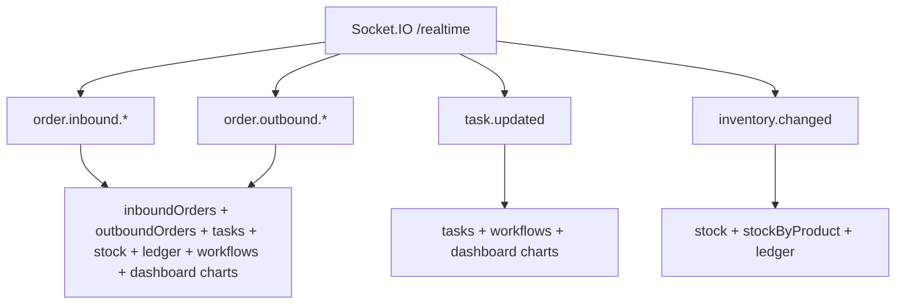

# Admin Dashboard — Styling & Realtime

## CSS architecture

```
frontend/src/styles.css
  └── @import '../../shared/design-system/globals.css'

frontend/tailwind.config.js
  └── preset: ../shared/design-system/tailwind.preset.cjs
  └── content: index.html, src/**/*, shared globals
```

## Design tokens (`shared/design-system/globals.css`)

| Token | Value (light) | Usage |
|-------|---------------|-------|
| `--app-page-bg` | `#f1f5f9` | Page background (slate-50 override) |
| `--app-text` | `#0f172a` | Body text |
| `--app-primary` | `#2563eb` | Theoretical primary (Tailwind `primary`) |
| `--app-border` | `#cbd5e1` | Borders |
| `--app-muted` | `#64748b` | Secondary text |

## Tailwind preset (`tailwind.preset.cjs`)

- **`primary`** color scale 50–900 (blue)
- **`fontFamily.sans`** — system UI stack
- **`borderRadius.card`** — card corners

## Dual brand colors (consistency note)

| Context | Color | Hex |
|---------|-------|-----|
| Sidebar active / some buttons | Brand green | `#1a7a44` |
| `Button` primary variant | Emerald | `emerald-600` |
| Tailwind `primary` | Blue | `#2563eb` |

**Problem:** Three “primary” accents coexist — document for redesign.

## Status badges (`@layer components`)

| Class | Visual |
|-------|--------|
| `.badge-draft` | Slate gray |
| `.badge-confirmed` | Blue |
| `.badge-progress` | Amber |
| `.badge-complete` / `.badge-shipped` | Emerald |
| `.badge-cancelled` | Rose |

Used via `StatusBadge` component mapping status strings.

## Typography

- **Body:** system sans, antialiased, slate-900
- **Page titles:** `PageHeader` — `text-xl font-semibold`
- **Table headers:** `text-xs font-semibold uppercase tracking-wide text-slate-500`
- **Monospace:** SKUs, lots, quantities — `font-mono` in tables

## Spacing & layout

- **Main content:** `p-4` to `p-6` typical in pages
- **Cards:** `rounded-md border border-slate-200 bg-white p-4 shadow-sm`
- **Grids:** `grid-cols-2 md:grid-cols-4` for metadata on detail pages
- **Sidebar:** icon rail + nested panel; green active states

## Component styling details

### Button (`Button.tsx`)

```
rounded-md font-medium shadow-sm
primary: bg-emerald-600 hover:bg-emerald-700
secondary: white border slate-300
danger: rose-600
ghost: transparent slate-600
focus: ring-2 ring-offset-1
loading: spinning border on button
```

### DataTable

- Container: `rounded-md border border-slate-200 bg-white shadow-sm`
- Header row: `bg-slate-50`
- Rows: `divide-y divide-slate-100`, hover `bg-slate-50` when clickable
- Footer: rows-per-page select + prev/next + "X–Y of Z results"

### Modal

- Backdrop + centered panel, slate borders, footer action row

### PageHeader

- Flex row: title left, actions right

## Forms

- Labels: `text-sm font-medium text-slate-700`
- Inputs: border slate-300, rounded-md, focus ring emerald
- Combobox: custom dropdown with search filter

## Responsive behavior

- **Layout:** mobile drawer overlay for nav; desktop fixed sidebar
- **Tables:** `overflow-x-auto` wrapper on DataTable
- **Metadata grids:** stack 2 cols → 4 cols at `md`

## Dark mode

**Not implemented** — `prefers-color-scheme` only in unused `client-frontend/src/style.css` template, not in shared globals for admin.

## Animation & transitions

- Button: `transition` on colors
- Sidebar links: `transition` background
- Toast: appear/disappear (ToastProvider)
- Loading spinners on buttons and table rows

## Realtime — detailed invalidation map



### Connection requirements

1. User logged in
2. `sessionStorage` bearer token
3. `VITE_MOCK_COMPANY_ID` set (non-empty trim)

Without (3), **no realtime** — lists only refresh on user action or staleTime expiry.

### Transports

`['websocket', 'polling']` with infinite reconnection attempts.

## i18n / RTL styling

- `document.documentElement.dir = 'rtl'` when AR selected
- DataTable header alignment flips (`text-right` vs `text-left`)
- Inline translation maps — no mirrored icons systematic review
