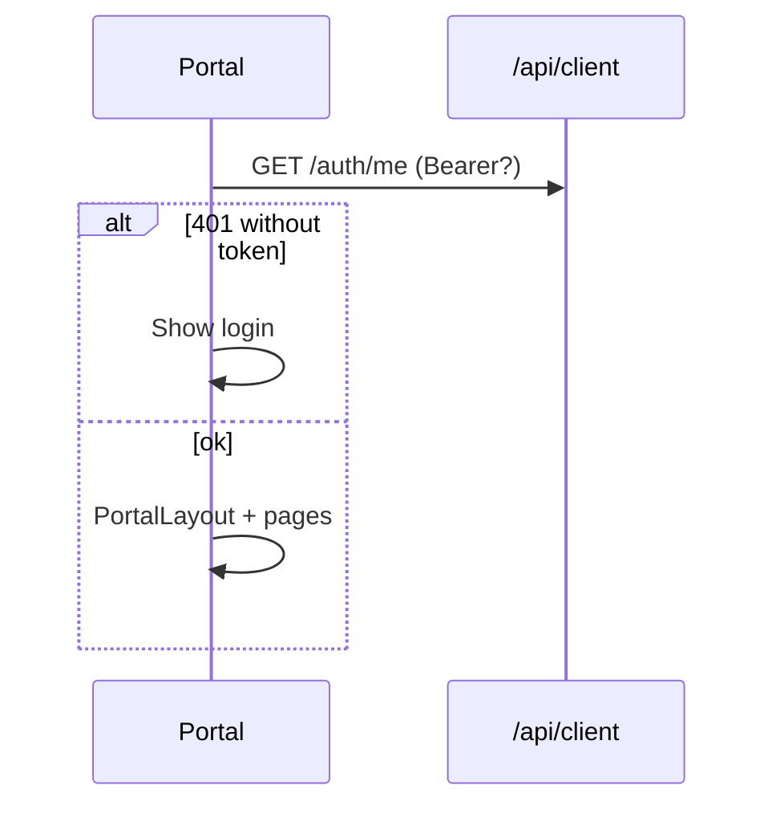

# Client Portal (`client-frontend/`) — Architecture

> Folder name in repo: **`client-frontend/`** (not `client-dash-front-end`).

## 1. Project structure

```
client-frontend/
├── index.html
├── package.json
├── vite.config.ts          # port 5174
├── tailwind.config.js
├── postcss.config.js
├── .env.example
└── src/
    ├── App.tsx             # Routes + provider nesting
    ├── main.tsx
    ├── index.css           # @import shared/design-system/globals.css
    ├── auth/
    │   ├── AuthContext.tsx
    │   └── RequireAuth.tsx
    ├── components/
    │   └── PortalLayout.tsx    # Only shared layout component
    ├── pages/                    # 8 pages
    ├── realtime/
    ├── services/                 # API layer (not "api/")
    ├── types/
    └── utils/
```

## 2. Stack

| Layer | Choice |
|-------|--------|
| React | 19 |
| Vite | 8 |
| Router | React Router 7 (`BrowserRouter`) |
| Server state | TanStack Query 5 |
| HTTP | Axios |
| Realtime | socket.io-client |
| CSS | Tailwind 3 + shared `globals.css` semantic classes |

## 3. Provider tree (`App.tsx`)

```
BrowserRouter
  └── QueryClientProvider  (retry: false, refetchOnWindowFocus: true)
        └── AuthProvider  (onSessionInvalid → navigate /login)
              └── RealtimeProvider
                    └── Routes
```

## 4. Routing

| Path | Component | Auth |
|------|-----------|------|
| `/login` | `LoginPage` | Public |
| `/` | `WelcomePage` | Protected |
| `/products` | `ProductsPage` | Protected |
| `/inbound-orders` | `InboundOrdersPage` | Protected |
| `/inbound-orders/:id` | `InboundOrderDetailPage` | Protected |
| `/outbound-orders` | `OutboundOrdersPage` | Protected |
| `/outbound-orders/:id` | `OutboundOrderDetailPage` | Protected |
| `/stock` | `StockPage` | Protected |
| `*` | `<Navigate to="/" />` | |

**Layout:** All protected routes render inside `PortalLayout` (`<Outlet />`).

## 5. Layout (`PortalLayout.tsx`)

### Structure

- **Topbar:** "Client portal" brand, language EN/AR select, Sign out
- **App shell:** sidebar (220px) + scrollable main
- **Mobile:** overlay drawer for nav (not separate component file)

### Navigation links

| Label | Path |
|-------|------|
| Home | `/` |
| Products | `/products` |
| Inbound | `/inbound-orders` |
| Outbound | `/outbound-orders` |
| Stock | `/stock` |

**Active state:** `.sidebar__link--active` — green `#1a7a44` background.

### Language toggle

- `localStorage` key `client-ui-language`: `EN` | `AR`
- AR sets `document.documentElement.dir = 'rtl'`
- **Does not translate strings** — English copy only

## 6. Authentication

| Item | Detail |
|------|--------|
| Token key | `sessionStorage` → `client_portal_access_token` |
| Login | `POST /api/client/auth/login` |
| Me | `GET /api/client/auth/me` |
| Logout | `POST /api/client/auth/logout` |
| Roles | `client_admin`, `client_staff` |



**401/403 handler:** Clears token, calls `onSessionInvalid` → `/login` (except login attempt and anonymous me probe).

## 7. API layer (`services/`)

| File | Role |
|------|------|
| `apiClient.ts` | Axios, envelope unwrap, interceptors |
| `authStorage.ts` | Bearer token |
| `authService.ts` | login, me, logout |
| `stockService.ts` | Stock pages |
| `clientProductsService.ts` | Products |
| `clientInboundOrdersService.ts` | Inbound list + detail |
| `clientOutboundOrdersService.ts` | Outbound list + detail |
| `apiError.ts` | Nest error message extraction |

**Base URL:** `VITE_API_URL` default `http://localhost:3000/api/client`

## 8. React Query keys

| Prefix | Pages |
|--------|-------|
| `['client', 'products', ...]` | Products |
| `['client', 'stock', ...]` | Stock |
| `['client', 'inbound-orders', ...]` | Inbound list/detail |
| `['client', 'outbound-orders', ...]` | Outbound list/detail |

## 9. Realtime

**Connection:** `io(origin/realtime, { auth: { token, companyId: user.companyId } })`

**Events listened:** Same constants as admin (`order.inbound.*`, `order.outbound.*`, `task.updated`, `inventory.changed`)

**Current behavior:** **All handlers only invalidate `['client', 'stock']`** — products and orders do **not** auto-refresh on realtime events.

## 10. Access model

- **Server-side:** All client API routes scoped to JWT `companyId`
- **Frontend:** No role-based UI hiding between `client_admin` and `client_staff` today
- **Read-only:** No create/confirm/cancel order actions in UI

## 11. Environment

| Variable | Default |
|----------|---------|
| `VITE_API_URL` | `http://localhost:3000/api/client` |

Socket origin derived by parsing host from `VITE_API_URL`.
